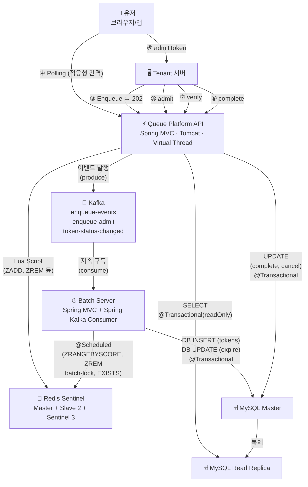
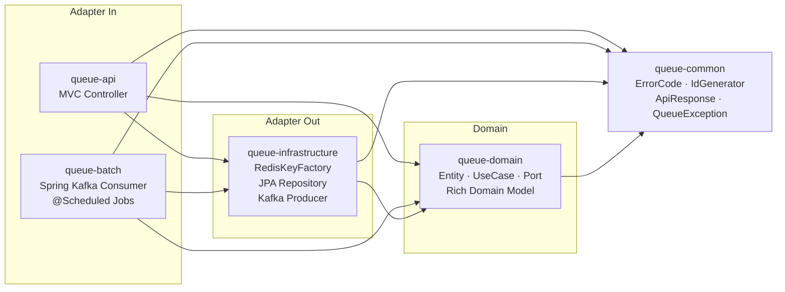
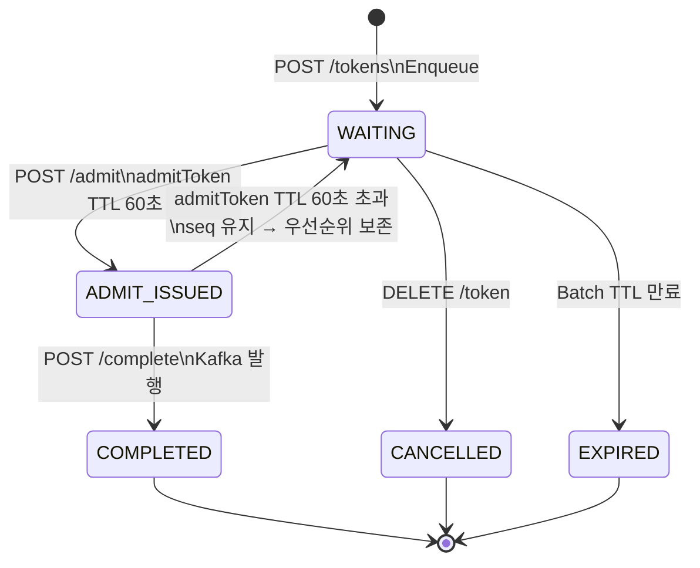
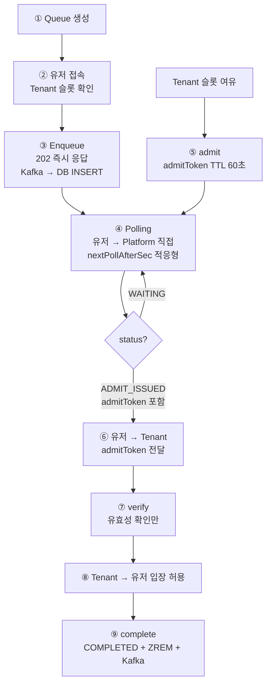

# 🚀 Queue Platform

> 대규모 트래픽 상황에서 서버 부하를 제어하기 위해  
> 대기열을 외부 플랫폼으로 분리한 Queue-as-a-Service

[](https://openjdk.org/projects/jdk/21/)
[](https://spring.io/projects/spring-boot)
[](https://redis.io/)
[](https://kafka.apache.org/)
[](https://www.mysql.com/)

---

## 🔥 TL;DR

- 대기열을 서비스 서버에서 분리 → **트래픽 제어를 플랫폼화**
- **Platform(순서 관리)** vs **Tenant(슬롯·입장 제어)** 책임 분리
- **유저가 Platform에 직접 Polling** — nextPollAfterSec 적응형 간격
- **Backpressure Pull** — Tenant가 소화 가능한 인원만 admit 요청
- **admitToken TTL 60초** → verify(유효성 확인) → complete(COMPLETED+ZREM)
- **admitToken 만료 시 WAITING 복귀** — seq 유지로 우선순위 보존
- **Kafka 버퍼** — Enqueue 202 즉시 응답 + DB INSERT 비동기
- **Virtual Thread** — Spring MVC + JPA blocking I/O를 OS Thread 고갈 없이 처리
- **REST API + OpenAPI 명세** — Tenant 서버는 언어 무관 HTTP 직접 호출
- **JS SDK** — 브라우저 Polling 자동 관리 (탭 비활성화 처리, nextPollAfterSec 적응)

---

## 📌 문제 정의

트래픽이 몰릴 때 서버가 대기열을 직접 관리하면:
- 동시 접속 폭증 → 서버 자원 고갈
- 대기열 로직과 비즈니스 로직 강결합 → 복잡도 증가
- 순서 꼬임, Race Condition

---

## 💡 핵심 설계 원칙

### 1. Platform은 순서만 관리한다
```
Tenant가 슬롯 여유 감지 → POST /admit 호출
Platform은 순번 관리만. 세션 관리는 Tenant 책임
```

### 2. 유저가 Platform에 직접 Polling (적응형 간격)
```
nextPollAfterSec:
  globalRank > 500 → 30s (서버 부하 절약)
  globalRank > 100 → 10s
  globalRank > 10  → 5s
  globalRank ≤ 10  → 2s (곧 입장)

JS SDK: setTimeout(poll, nextPollAfterSec * 1000) 자동 적용
탭 비활성화 → Polling 자동 중단
```

### 3. Backpressure Pull
```
Tenant가 소화 가능한 만큼만 admit { count: N }
Platform과 커플링 없음
```

### 4. admitToken TTL 만료 → WAITING 복귀 (우선순위 보존)
```
TTL 60초 초과 → WAITING 복귀
seq DB 저장 → Redis ZADD score 복원
→ 다음 admit 호출 시 앞순서이면 재발급

이유: 네트워크 지연 등 유저 귀책 아닐 수 있음
     EXPIRED 처리 시 유저가 맨 뒤로 → 불공평
```

### 5. Virtual Thread + Spring MVC
```
spring.threads.virtual.enabled=true 한 줄로 적용
Tomcat의 모든 요청이 Virtual Thread에서 처리
JPA blocking → OS Thread 점유 없이 대기
@Transactional + ThreadLocal → Virtual Thread 정상 동작
→ Polling 2,000 rps + JPA 동시에 가능
```

### 6. Kafka Enqueue 버퍼
```
Redis Lua 처리 → 202 즉시 응답
Kafka enqueue-events → DB INSERT (At-Least-Once)
→ Enqueue p99 50ms 이하 달성
→ redis_sync_needed: Redis 다운 중 INSERT 토큰 추적
```

### 7. 언어 중립 REST API (Java SDK 미제공)
```
Tenant 서버 언어 다양성 → JS만 브라우저용 SDK로 제공
Tenant 서버는 OpenAPI 명세 기반 REST 직접 호출
→ 어떤 언어든 HTTP 클라이언트로 동일하게 통합
→ SDK 유지보수 비용 제거 (CVE 대응, 버전 관리)
```

---

## 🏗 아키텍처



---

## 📦 모듈 구조



```
의존성 원칙:
  queue-common  ← 모든 모듈이 직접 의존 (명시적 선언)
  queue-domain  ← queue-api, queue-batch, queue-infrastructure
  queue-domain은 Spring 의존 없음 (순수 Java)
  queue-infrastructure는 queue-api/batch를 절대 모름
```

---

## 🧠 Token 상태 머신



---

## 🔄 전체 흐름 (9단계)



---

## 🗂 Redis Key 구조 (RedisKeyFactory)

```
static 메서드 방식 (Enum X): 동적 인수 타입 안전성
Cluster 전환 시 이 파일만 수정 (Hash Tag 추가)
위치: queue-infrastructure/redis/RedisKeyFactory.java
```

| Key | TTL | 역할 |
|-----|-----|------|
| `queue:{t}:{q}:{slice}` | 없음 | 대기열 Sorted Set |
| `global-seq:{t}:{q}` | 없음 | 순번 채번 |
| `queue-meta:{t}:{q}` | 없음 | 큐 설정 |
| `queue-stats:{t}:{q}` | 없음 | avgWaitingTime |
| `queue-user:{t}:{q}:{userId}` | waitingTtl | 중복 Enqueue 방지 |
| `token-last-active:{tokenId}` | 300s | 비활동 감지 |
| `token-info:{tokenId}` | nextPollAfterSec+2s | Polling 캐시 |
| `admit-token-by-token:{tokenId}` | 60s | Polling 응답용 |
| `admit-token-by-admit:{admitToken}` | 60s | verify/complete용 |
| `admit-idem:{requestId}` | 300s | admit 멱등성 |
| `verified-token:{tokenId}` | 60s | 중복 입장 방지 |
| `batch-lock:{t}:{q}` | 15s | Batch 서버 분산 |
| `apikey-cache:{sha256}` | 60s | API Key 캐시 |

---

## 🗄 MySQL R/W 분리 + 파티셔닝

```
Write → Master / Read → Replica
@Transactional(readOnly) → Replica 자동 라우팅

tokens 테이블:
  Range 파티션 (issued_at 월별)
  월말 배치: queue_daily_stats 집계 → DROP PARTITION
  → 파티션 DROP 후에도 과금 근거 영구 보존

status: TINYINT (0~4) — VARCHAR 대비 저장공간·비교 성능 최적화
redis_sync_needed: Redis 다운 중 미반영 토큰 추적
admit_token: DB 저장 → Redis 미스 시 Fallback
```

---

## 🔴 Redis Sentinel

```
Master 1 + Slave 2 + Sentinel 3
쿼럼 = 2 | min-replicas-to-write 1 (Split Brain 방지)
모든 연산 → Master (Lua 원자성)
Slave: Failover + 백업
Failover: 5~10초 | Circuit Breaker → 503
```

---

## 📨 Kafka

| 토픽 | 생산 | 소비 |
|------|------|------|
| `enqueue-events` | Enqueue API | TokenEnqueueConsumer (DB INSERT) |
| `enqueue-admit` | admit API | AdmitConsumer (Dequeue + admitToken) |
| `token-status-changed` | complete/expire/cancel | BillingConsumer, StatsConsumer |

---

## 🔧 Tenant 통합 — REST API + JS SDK

Queue Platform은 **Tenant 서버용 언어별 SDK를 제공하지 않습니다**. 대신 **OpenAPI 명세 기반 REST API를 직접 호출**합니다. 브라우저 Polling만 **JS SDK**로 제공해 탭 비활성화·네트워크 복구 등 클라이언트 특화 문제를 해결합니다.

### 왜 Java SDK를 제공하지 않는가

```
Tenant 서버는 언어 다양성이 전제
→ 특정 언어 SDK만 제공하면 다른 언어 사용자는 차별적 지원
→ 언어별 SDK 전체 제공은 유지보수 비용(CVE 대응, 버전 관리)이 큼
→ OpenAPI 명세 + REST 직접 호출이 보편적 통합 방식
```

### REST API + OpenAPI (Tenant 서버용)

Tenant 서버는 OpenAPI 3.0 명세 기반으로 REST API를 직접 호출합니다. 엔드포인트/스키마와 규칙은 Swagger UI에서 확인할 수 있습니다.

```
제공 자료:
  - /v3/api-docs (OpenAPI 3.0 JSON)
  - /swagger-ui.html (인터랙티브 테스트)
  - Postman Collection
  - Workflow 문서 (verify 순서, complete 재시도 등)
```

### Tenant 구현 가이드라인

Tenant가 REST 직접 호출 시 준수해야 할 규칙:

```
1. verify 호출 순서
   ① admit 응답의 admitToken 획득
   ② Tenant 내부 처리(세션 생성 등) 전에 먼저 verify 호출
   ③ valid=true 확인 후 내부 처리
   ④ 내부 처리 완료 후 complete 호출
   → 내부 처리 후 verify 호출 시 TTL 60초 초과 위험

2. complete 재시도
   admitToken TTL 60초 내에 complete 호출 보장
   네트워크 오류 시 3회 재시도 권장 (100ms → 500ms → 1500ms backoff)
   404/409는 재시도 금지 (이미 처리됨 or 상태 불일치)

3. 동시 verify 수 가이드
   admit count 1,000 기준 → 동시 verify 100개 권장
   계산식: concurrency = admit_count × verify_time_ms / (ttl_ms × 0.5)
   Platform per-key 100 rps 초과 시 429 → backoff 필요

4. API Key 보안
   X-API-Key 헤더 전송 (HTTPS 필수)
   환경변수 저장 (코드 하드코딩 금지)
   발급 시 1회만 표시 → 재발급은 Revoke 후 신규 발급
```

> 상세 명세는 [OpenAPI 문서](https://api.queue-platform.com/swagger-ui.html) 참조 (Sprint 5 이후 제공 예정)

### JS SDK (브라우저용)

브라우저 Polling은 **탭 비활성화 / 네트워크 offline / nextPollAfterSec 자동 적용** 등 클라이언트 특화 이슈가 많아 SDK로 제공합니다.

```javascript
const queue = QueueSDK.init({
    baseUrl: 'https://api.queue-platform.com',
    queueId: queueId,  // Tenant 서버에서 받은 값
    token: token       // Tenant 서버에서 받은 값
});

queue.startPolling({
    onWaiting: ({ globalRank, estimatedWaitSeconds }) => {
        updateUI(globalRank, estimatedWaitSeconds);
        // nextPollAfterSec 타이밍 SDK가 자동 처리
    },
    onReady: ({ admitToken }) => {
        sendToTenantServer(admitToken);
    },
    onExpired: () => showExpiredMessage()
});
// 탭 비활성화 → 자동 중단 / 복귀 → 즉시 재개
// 네트워크 offline/online 자동 처리
```

| 기능 | 역할 |
|------|------|
| `PollingManager` | nextPollAfterSec 타이밍 자동 적용. setTimeout 관리 |
| `StateManager` | IDLE → WAITING → READY → COMPLETED → EXPIRED 전환 |
| `VisibilityHandler` | visibilitychange 이벤트 자동 감지. 탭 비활성화 시 중단 |
| `NetworkHandler` | offline/online 이벤트 자동 처리 |

### 클라이언트 전체 흐름

```
유저 → Tenant 서버         : 서비스 접속
Tenant 서버 (REST 호출)    : POST /tokens → 대기토큰 발급
Tenant → 유저              : token, queueId 전달
유저 (JS SDK)              : startPolling() → Platform 직접 Polling
JS SDK → onReady           : admitToken 수신
유저 → Tenant 서버         : admitToken 전달
Tenant 서버 (REST 호출)    : verify → 내부처리 → complete (3회 재시도)
```

---

## ⚡ 성능

| API | p99 | TPS |
|-----|-----|-----|
| Enqueue | < 50ms | 200 rps (급증 → Kafka) |
| Polling | < 50ms | 2,000 rps |
| admit/complete | < 100ms | - |

---

## ⚖️ 트레이드오프

| 선택 | 장점 | 단점 | 근거 |
|------|------|------|------|
| Spring MVC + Virtual Thread | 친숙한 생태계, 코드 단순 | blocking → VT 필요 | spring.threads.virtual.enabled=true 한 줄 적용 |
| JPA + Virtual Thread | @Transactional 자연스러움 | blocking I/O | VT가 OS Thread 고갈 없이 처리 |
| admitToken 만료 → WAITING 복귀 | 우선순위 보존. 유저 불이익 없음 | 슬롯 일시 점유 | seq DB 저장으로 score 복원 |
| Kafka Enqueue 버퍼 | 202 즉시 응답. 급증 흡수 | Eventually Consistent | At-Least-Once 보장 |
| Kafka admit 처리 | admit 요청 영속성 | Consumer 처리 지연 | DB PENDING → 멱등성 보장 |
| status TINYINT | 저장공간·비교 성능 | 가독성 (상수로 보완) | 대량 tokens 테이블 최적화 |
| redis_sync_needed | Redis 다운 중 INSERT 복구 | 컬럼 추가 | 데이터 정합성 보장 |
| admit_token 컬럼 | Redis 미스 시 DB Fallback | 컬럼 추가 | verify 안정성 향상 |
| queue_daily_stats | 파티션 DROP 후 과금 근거 보존 | 배치 필요 | 감사/청구 불변 기록 |
| billing_snapshots 직접 집계 | tokens 원본 → 중복 방지 불필요 | 집계 쿼리 필요 | billing_events 테이블 제거 |
| avgWaitingTime 직접 갱신 | StatsConsumer 불필요 → 단순화 | Kafka 재처리 중복 허용 | ETA는 보조 정보 → 허용 범위 |
| 파티션 1달 유예 DROP | 월말 걸친 토큰 과금 누락 방지 | 스토리지 2배 | B2B 과금 정확도 우선 |
| ZCARD Pipeline | queue-count 관리 불필요 | N번 ZCARD | 카운터 불일치 위험 제거 |
| nextPollAfterSec | 서버 부하 절약 | SDK 구현 필요 | 순위 높을수록 Polling 드물게 |
| Redis R/W 분리 미적용 | 설계 단순 | - | Lua 원자성. In-Memory 충분 |
| MySQL R/W 분리 | SELECT 2,000 rps 분산 | Replica lag | token-info 캐시로 lag 최소화 |
| tokens 파티셔닝 | 월별 DROP 빠른 정리 | PK에 파티션 키 | Partition Pruning 효과 |
| RedisKeyFactory | 컴파일 타임 검사 | - | Enum: 가변인수 타입 안전성 없음 |
| **Java SDK 미제공** | **언어 중립. 유지보수 비용 제거** | **Tenant가 HTTP 직접 구현** | **Tenant 서버 언어 다양성 전제** |
| **JS SDK 유지** | **브라우저 특화 문제 해결** | **한 언어 SDK 유지 부담** | **탭 비활성화/네트워크 복구는 공통** |

---

## 🛠 기술 스택

| 영역 | 기술 | 근거 |
|------|------|------|
| Language | Java 21 | Virtual Thread, Record, LTS |
| API Server | Spring MVC + Tomcat | Virtual Thread로 2,000 rps 달성 |
| ORM | JPA (Hibernate) | @Transactional 자연스러움, 풍부한 생태계 |
| DB 연결 | JDBC + Virtual Thread | blocking → spring.threads.virtual.enabled=true |
| Messaging | Spring Kafka | Enqueue 버퍼 + 상태 이벤트 |
| Batch | Spring MVC + Tomcat | @Scheduled + Spring Kafka Consumer |
| Cache | Redis Sentinel | FIFO Sorted Set + Lua 원자 |
| DB | MySQL 8.0 | Range 파티셔닝 + Replica |
| Architecture | Hexagonal + DDD | 도메인 단위 테스트 |
| Build | Gradle 멀티모듈 5개 | 의존성 명확 분리 |
| API Spec | OpenAPI 3.0 (Springdoc) | 언어 중립 Tenant 통합 |
| Client SDK | JS SDK (npm + CDN) | 브라우저 Polling 특화 |

---

## 🏃 빌드 및 실행

### 요구 사항

- JDK 21
- Gradle 8.5+ (Wrapper 포함)
- Docker Desktop (Sprint 2+ 인프라 구동용)

### 빌드

```bash
./gradlew build
```

### 실행

```bash
# API 서버 (포트 8080)
./gradlew :queue-api:bootRun

# Batch 서버 (포트 8081)
./gradlew :queue-batch:bootRun
```

### Health Check

```bash
curl http://localhost:8080/actuator/health
# {"status":"UP"}
```

### Sprint 진행 단계

| Sprint | 범위 | 상태 |
|--------|------|------|
| 1 | 멀티모듈 스켈레톤 + MVC+Virtual Thread + Actuator | ✅ 완료 |
| 2 | JPA + MySQL R/W 분리 + DataSourceConfig | 🔜 |
| 3 | 도메인 모델 + 포트 정의 (Rich Domain) | 🔜 |
| 4 | Redis 어댑터 + Lua Script + Sentinel | 🔜 |
| 5 | API 레이어 + Enqueue/Polling + OpenAPI | 🔜 |
| 6 | Admit → Verify → Complete 토큰 흐름 | 🔜 |
| 7 | Kafka (Enqueue 버퍼 + 상태 이벤트) | 🔜 |
| 8 | Batch 모듈 (TokenExpiryJob, RedisSyncJob) | 🔜 |

**Sprint 1 → Sprint N 활성화 전략:**
`application.yml`의 `spring.autoconfigure.exclude`에서 해당 AutoConfiguration을 제거하는 방식으로 단계적으로 활성화합니다. 상세는 [DECISIONS.md §45](docs/DECISIONS.md) 참조.

---

## 📎 문서

| 문서 | 설명 |
|------|------|
| [FRS v1.9](docs/FRS_final.md) | API · Redis · Kafka · SDK · Batch |
| [STATE](docs/STATE.md) | Token · Queue · ApiKey 상태 머신 |
| [FLOW](docs/FLOW.md) | Enqueue · Polling · Admit · Complete · Batch |
| [DECISIONS](docs/DECISIONS.md) | 설계 결정 + 근거 + 면접 포인트 |

---

<p align="center">
  <sub>Queue Platform · Java 21 · Spring Boot 3.3.4 · Redis Sentinel · Kafka · MySQL 8.0</sub>
</p>
