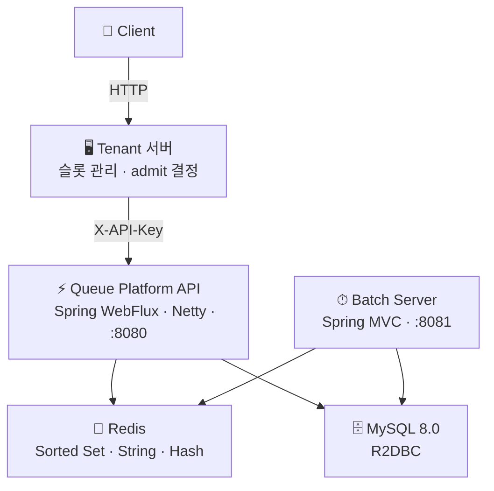
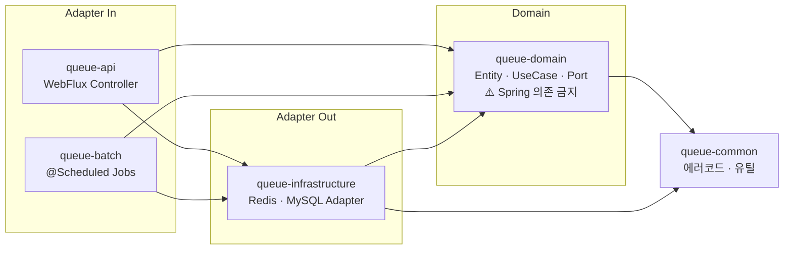

# 🚀 Queue Platform

> 대규모 트래픽 상황에서 서버 부하를 제어하기 위해  
> 대기열을 외부 플랫폼으로 분리한 Queue-as-a-Service

[](https://openjdk.org/projects/jdk/21/)
[](https://spring.io/projects/spring-boot)
[](https://redis.io/)

---

## 🔥 TL;DR

- 대기열을 서비스 서버에서 분리 → **트래픽 제어를 플랫폼화**
- **Platform(순서 관리)** vs **Tenant(입장 결정)** 책임 분리
- Redis Sorted Set 기반 **FIFO 보장 + 고동시성**
- Token은 **DB에 저장하지 않음** — Redis Sorted Set이 유일한 저장소

---

## 📌 문제 정의

트래픽이 몰릴 때 서버가 대기열을 직접 관리하면 이런 문제가 생긴다.

- 동시 접속 폭증 → 서버 자원 고갈
- 대기열 로직과 비즈니스 로직 강결합 → 복잡도 증가
- 순서 꼬임, Race Condition

**핵심 문제:** 트래픽 제어와 서비스 로직이 같은 서버에 있으면, 둘 중 하나만 바꿔도 전체를 수정해야 한다.

---

## 💡 핵심 설계 원칙

### Platform은 Tenant 슬롯을 알지 못한다

```
❌ 잘못된 설계: Platform이 슬롯 여유를 감지 → 자동 입장
   → Platform이 Tenant 내부에 의존 → 커플링

✅ 채택한 설계: Tenant 서버가 슬롯 여유 감지 → POST /admit 직접 호출
   → Platform은 상태 전환(WAITING → ADMITTED)만 처리
```

### 순서는 자료구조에 위임한다

```
score = currentTimeMillis()   FIFO 자동 보장
ZADD NX                       중복 등록 원자적 방지
ZRANK                         O(log N) 순위 조회
```

---

## 🏗 아키텍처



---

## 📦 Hexagonal 멀티모듈 구조



---

## 🗂 Redis Key 구조

| Key | 자료구조 | TTL | 역할 |
|-----|----------|-----|------|
| `queue:{t}:{q}` | Sorted Set | 없음 | **대기열 핵심** — score=등록시각(ms) |
| `queue-user:{t}:{q}:{userId}` | String | waitingTtl | userId→tokenId 역인덱스 (멱등 O(1)) |
| `apikey-cache:{sha256}` | String | 60s | API Key 캐시 — DB QPS ≈ 0 |
| `token-last-active:{tokenId}` | String | inactiveTtl | 비활동 TTL 감지 |
| `queue-stats:{t}:{q}` | Hash | 없음 | ETA 계산 통계 |
| `billing-count:{t}:{yyyyMM}` | String | 월말+7일 | 과금 카운터 |

---

## ⚡ 성능 목표

| API | p99 목표 | 목표 TPS | 근거 |
|-----|----------|----------|------|
| Polling | < 50ms | 2,000 rps | 10,000명 ÷ 5초 간격 |
| Enqueue | < 100ms | 200 rps | 10,000명 5분 집중 |
| Heartbeat | < 50ms | 500 rps | ADMITTED 1,000명 × 2초 |

```
단일 대기열 최대 100,000명  (Redis Sorted Set ≈ 6.4MB)
Tenant당 최대 Queue 100개
```

---

## 🔒 동시성 제어

```lua
-- Enqueue: 용량 체크 + 등록 원자 실행 (Lua Script)
local size = redis.call('ZCARD', KEYS[1])
if tonumber(size) >= tonumber(ARGV[1]) then return 0 end
return redis.call('ZADD', KEYS[1], 'NX', ARGV[2], ARGV[3])
```

| 문제 | 해결 |
|------|------|
| 중복 Enqueue | `ZADD NX` — 동일 member 존재 시 0 반환 |
| 용량 초과 경쟁 | Lua Script — ZCARD + ZADD 원자 실행 |
| Polling 2,000rps | Redis 캐시 60s — DB QPS ≈ 0 |

---

## ⚖️ 트레이드오프

| 선택 | 장점 | 단점 | 근거 |
|------|------|------|------|
| Token을 DB에 저장 안 함 | Polling DB QPS ≈ 0 | Redis 장애 시 복구 필요 | AOF + DB 스크립트로 보완 |
| Tenant Admit 방식 | 완전한 책임 분리 | Tenant 구현 필요 | 핵심 설계 원칙 |
| Polling 방식 | 구현 단순 | 연결 수 증가 | MVP 집중 |
| Admit 결과적 일관성 | DB 락 불필요 | 최대 30초 불일치 | Batch 자동 복구 |

---

## 🛠 기술 스택

| 영역 | 기술 | 선택 근거 |
|------|------|------|
| Language | Java 21 | Record, LTS |
| API Server | Spring WebFlux + Netty | 수만 동시 연결 → Non-blocking 필수 |
| Batch Server | Spring MVC + Tomcat | 주기적 단일 작업, `@Scheduled` |
| Queue Storage | Redis Sorted Set | FIFO O(log N) + 원자 연산 |
| DB | MySQL 8.0 + R2DBC | Reactive 파이프라인 일관성 |
| Architecture | Hexagonal + DDD | 인프라 없이 도메인 테스트 가능 |
| Build | Gradle 멀티모듈 | 5모듈 의존성 명확 분리 |

---

<p align="center">
  <sub>Queue Platform · Java 21 · Spring Boot 3.3.4 · Redis · MySQL</sub>
</p>
