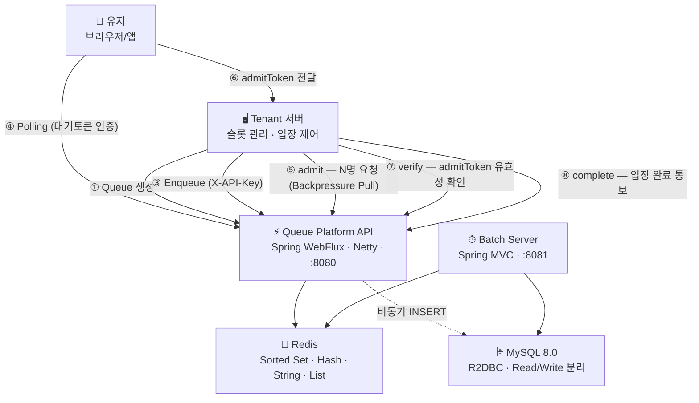
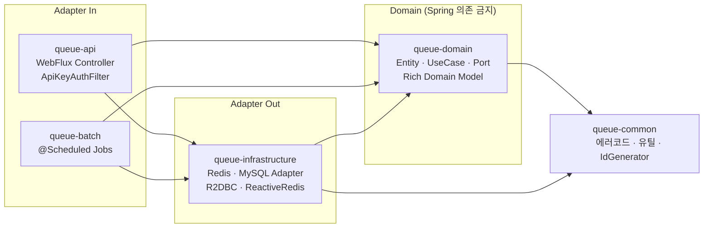
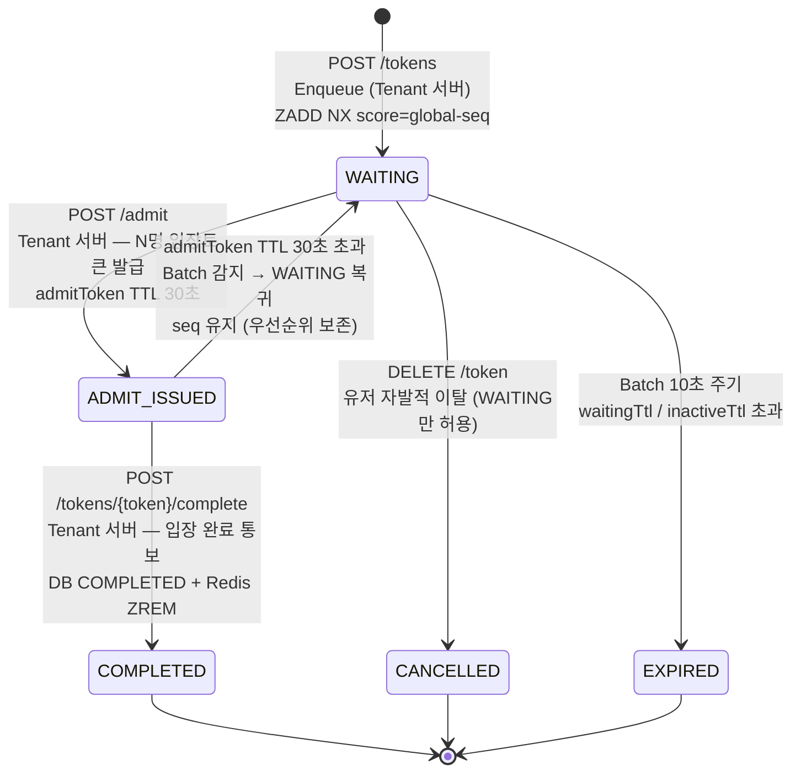
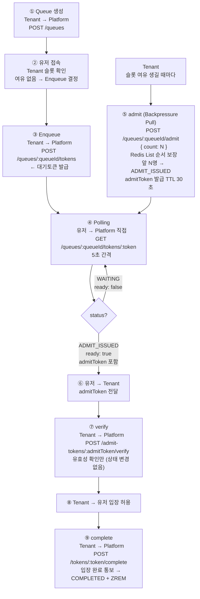

🚀 Queue Platform

> 대규모 트래픽 상황에서 서버 부하를 제어하기 위해  
> 대기열을 외부 플랫폼으로 분리한 Queue-as-a-Service

[](https://openjdk.org/projects/jdk/21/)
[](https://spring.io/projects/spring-boot)
[](https://redis.io/)

---

## 🔥 TL;DR

- 대기열을 서비스 서버에서 분리 → **트래픽 제어를 플랫폼화**
- **Platform(순서 관리)** vs **Tenant(슬롯·입장 제어)** 책임 분리
- **유저가 Platform에 직접 Polling** — Tenant 서버 부하 최소화
- **Backpressure Pull** — Tenant가 소화 가능한 인원만 admit 요청
- **admitToken(TTL 30초)** → verify(유효성 확인) → complete(입장 완료 통보 후 ZREM)
- Redis Sorted Set + Global Seq — **슬라이스 간 FIFO 보장**
- Bulk Lua (INCRBY + ZADD multi) — **대량 Enqueue 최적화**

---

## 📌 문제 정의

트래픽이 몰릴 때 서버가 대기열을 직접 관리하면 이런 문제가 생긴다.

- 동시 접속 폭증 → 서버 자원 고갈
- 대기열 로직과 비즈니스 로직 강결합 → 복잡도 증가
- 순서 꼬임, Race Condition

**핵심 문제:** 트래픽 제어와 서비스 로직이 같은 서버에 있으면, 둘 중 하나만 바꿔도 전체를 수정해야 한다.

---

## 💡 핵심 설계 원칙

### 1. Platform은 순서만 관리한다

```
❌ 잘못된 설계: Platform이 슬롯 여유 감지 → 자동 입장
   → Platform이 Tenant 내부에 의존 → 커플링

✅ 채택한 설계: Tenant 서버가 슬롯 여유 감지 → POST /admit 직접 호출
   → Platform은 순번 관리만
   → 세션 관리는 Tenant 책임. Platform 관여 없음
```

### 2. 유저가 Platform에 직접 Polling

```
❌ 기존 방식: 유저 → Tenant → Platform (Polling)
   → Tenant 서버가 Polling 트래픽까지 처리 → 부하 높음

✅ 채택한 설계: 유저 → Platform (Polling 직접)
   → Tenant 서버는 슬롯 관리에만 집중
   → 인증: 대기토큰으로 (API Key 불필요)
   → Polling 응답에 admitToken 포함 (ADMIT_ISSUED 시)
```

### 3. Backpressure Pull — Tenant가 속도를 제어한다

```
❌ Push 방식: Platform이 자동으로 입장 처리
   → Tenant 처리 속도 무시 → 과부하 가능

✅ Pull 방식: Tenant가 슬롯 여유 생길 때만 admit { count: N } 호출
   Publisher  = 대기열
   Subscriber = Tenant (request(N) = admit { count: N })
   → Tenant가 소화 가능한 만큼만 Pull → 과부하 없음
```

### 4. 순서는 자료구조에 위임한다

```
score = global-seq (전체 순번)            → 슬라이스 간 FIFO 보장
INCRBY N → seq 블록 채번                 → 대량 Enqueue 최적화
ZADD NX multi-member                     → 슬라이스별 한번에 삽입
sliceCount = ceil(maxCapacity ÷ 100,000) → Platform 자동 계산
```

---

## 🏗 아키텍처



---

## 📦 Hexagonal 멀티모듈 구조



---

## 🧠 Token 상태 머신



> verify: 유효성 확인만. 상태 변경 없음 (ADMIT_ISSUED 유지)
> ADMIT_ISSUED에서 이탈 시도 → 409

---

## 🔄 전체 흐름



---

## 🗂 Redis Key 구조

| Key | 자료구조 | TTL | 역할 |
|-----|----------|-----|------|
| `queue:{t}:{q}:{slice}` | Sorted Set | 없음 | 슬라이스별 대기열. score=global-seq |
| `global-seq:{t}:{q}` | String | 없음 | 전체 순번 채번. INCRBY 원자 |
| `queue-count:{tenantId}:{queueId}` | String | 없음 | 큐의 현재 인원 즉시 조회 |
| `queue-meta:{t}:{q}` | Hash | 없음 | sliceCount, totalCapacity |
| `queue-stats:{t}:{q}` | Hash | 없음 | avgWaitingTime, waitingTimeSum, waitingTimeCount |
| `queue-user:{t}:{q}:{userId}` | String | waitingTtl | userId→tokenId 역인덱스. 멱등 O(1) |
| `token-last-active:{tokenId}` | String | inactiveTtl(300s) | 비활동 TTL 감지 |
| `token-info:{tokenId}` | String | 5s | Polling 캐시. 상태 변경 시 즉시 갱신 |
| `admit-token:{tokenId}` | String | 30s | 입장토큰. verify/complete 시 조회 |
| `admit-request-queue:{t}:{q}` | List | 없음 | admit 요청 순서 보장. RPUSH/BLPOP |
| `admit-idem:{requestId}` | String | 300s | admit 중복 요청 멱등성 |
| `apikey-cache:{sha256}` | String | 60s | API Key 캐시. DB QPS ≈ 0 |
| `billing-count:{t}:{yyyyMM}` | String | 월말+7일 | 과금 카운터 |

---

## ⚡ 성능 목표

| API | p99 목표 | 목표 TPS | 산정 근거 |
|-----|----------|----------|----------|
| Enqueue | < 100ms | 200 rps | 10,000명 5분 집중 유입 |
| Polling | < 50ms | 2,000 rps | 10,000명 ÷ 5초 간격 |
| admit | < 100ms | 10 rps | throughput 기준 |

```
1만건 동시 Enqueue → 500건 Bulk Lua → ≈ 40ms → p99 < 100ms ✅
단일 큐 최대 100,000명 (Sorted Set ≈ 6.4MB)
sliceCount = ceil(maxCapacity ÷ 100,000) — Platform 자동 계산
```

---

## 🔒 동시성 제어

```lua
-- Enqueue Bulk: INCRBY N + 슬라이스별 ZADD multi-member
local count = #ARGV - 1
local endSeq = redis.call('INCRBY', KEYS[1], count)
local startSeq = endSeq - count + 1
local sliceBatch = {}
for i = 0, tonumber(ARGV[1])-1 do sliceBatch[i] = {} end
for i = 2, #ARGV do
    local seq = startSeq + (i-2)
    local slice = (seq-1) % tonumber(ARGV[1])
    table.insert(sliceBatch[slice], seq)
    table.insert(sliceBatch[slice], ARGV[i])
end
for slice = 0, tonumber(ARGV[1])-1 do
    if #sliceBatch[slice] > 0 then
        redis.call('ZADD', KEYS[2]..':'..slice, 'NX', unpack(sliceBatch[slice]))
    end
end

-- Polling: 전체 순위 계산 (슬라이스 합산)
local total = 0
local mySeq = tonumber(ARGV[1])
for i = 0, tonumber(ARGV[2])-1 do
    total = total + redis.call('ZCOUNT', KEYS[1]..':'..i, 0, mySeq-1)
end
return total + 1
```

| 문제 | 해결 |
|------|------|
| 중복 Enqueue | queue-user 역인덱스 + ZADD NX |
| 대량 Enqueue 병목 | INCRBY + ZADD multi-member (500건 Adaptive) |
| admit 순서 보장 | Redis List RPUSH/BLPOP (Queue 단위 워커 풀 10개) |
| admit 중복 요청 | Redis idempotency key (admit-idem:{requestId}) |
| Dequeue WAITING 불일치 | DB 상태 확인 후 필터링 + 최대 3회 추가 추출 |
| complete 동시성 | DB UPDATE WHERE status='ADMIT_ISSUED' (1번만 성공) |
| ZREM 실패 | DB COMPLETED 먼저 → Batch 10초 내 재실행 (멱등) |

---

## ⚖️ 트레이드오프

| 선택 | 장점 | 단점 | 결정 근거 |
|------|------|------|----------|
| Token을 Redis 전담 | Polling DB QPS ≈ 0 | Redis 장애 시 복구 필요 | DB DATETIME(3) 밀리초 기준 FIFO 근사 복구 |
| 유저 직접 Polling | Tenant 서버 부하 감소 | 클라이언트 구현 필요 | Tenant 서버 책임 분리 |
| Backpressure Pull (admit) | Tenant 과부하 방지 | Tenant 구현 복잡도 증가 | Publisher=대기열 / Subscriber=Tenant |
| ADMIT_ISSUED 상태 | 입장토큰 분리 | 상태 복잡도 증가 | verify와 complete 분리 가능 |
| verify/complete 분리 | Tenant가 입장 완료 명시적 통보 | API 2개로 분리 | ZREM 타이밍 제어 가능 |
| admitToken 만료 시 WAITING 복귀 | 우선순위 유지 (유저 귀책 아님) | EXPIRED보다 복잡 | seq DB 저장으로 score 복원 |
| 슬라이스 구조 | 용량 확장 유연 | 순위 계산 복잡도 증가 | global-seq로 FIFO 보장 |
| Bulk Lua + INCRBY + ZADD multi | Redis 연산 최소화 | Lua 블로킹 증가 | Adaptive 500건 묶음으로 균형 |
| DB INSERT 비동기 | 응답 속도 최적화 | 서버 다운 시 유실 가능 | 3회 재시도 + insert-retry-queue |
| DB 먼저, ZREM 나중 | 잔류가 유실보다 안전 | 최대 10초 불일치 | Batch 10초 자동 복구 |
| token-info Redis 캐시 | Polling SELECT DB QPS ≈ 0 | 상태 변경 시 즉시 갱신 필요 | TTL 5초 + 변경 시 즉시 갱신 |
| API Key SHA-256 저장 | DB 털려도 원본 역산 불가 | 분실 시 재발급만 가능 | HTTPS + per-key Rate limit으로 보완 |

---

## 🛠 기술 스택

| 영역 | 기술 | 선택 근거 |
|------|------|----------|
| Language | Java 21 | Virtual Thread, Record, LTS |
| API Server | Spring WebFlux + Netty | 수만 동시 연결 → Non-blocking 필수 |
| Batch Server | Spring MVC + Tomcat | 주기적 단일 작업. `@Scheduled` |
| Queue Storage | Redis Sorted Set | FIFO O(log N) + 원자 연산 |
| DB | MySQL 8.0 + R2DBC | Reactive 파이프라인 일관성 |
| Architecture | Hexagonal + DDD | 인프라 없이 도메인 테스트 가능 |
| Build | Gradle 멀티모듈 | 5모듈 의존성 명확 분리 |


---

<p align="center">
  <sub>Queue Platform · Java 21 · Spring Boot 3.3.4 · Redis · MySQL</sub>
</p>
