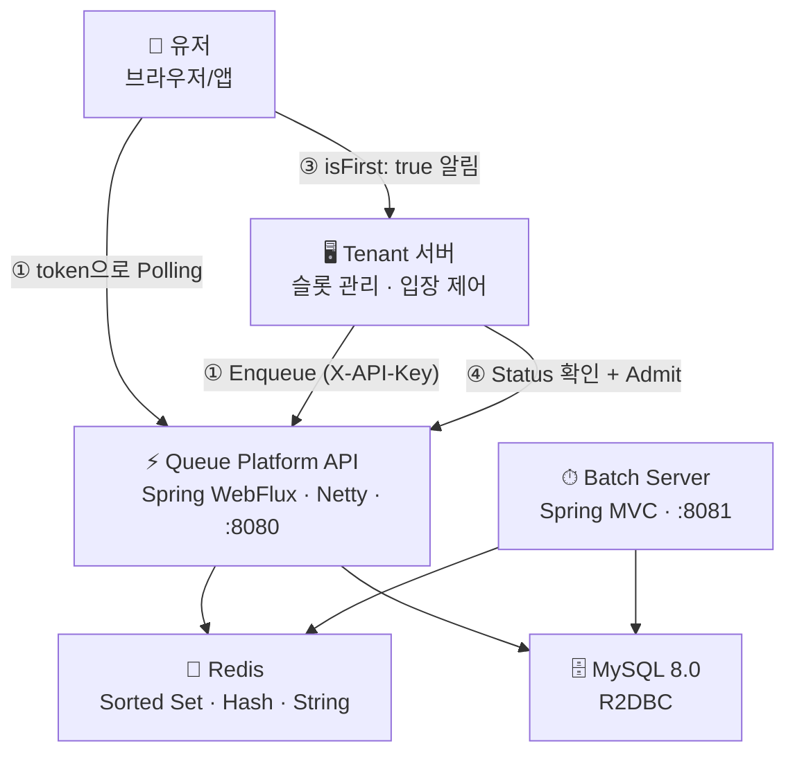
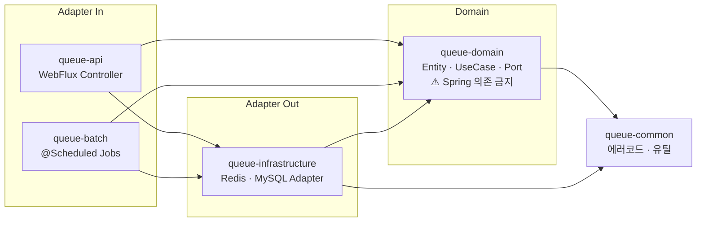
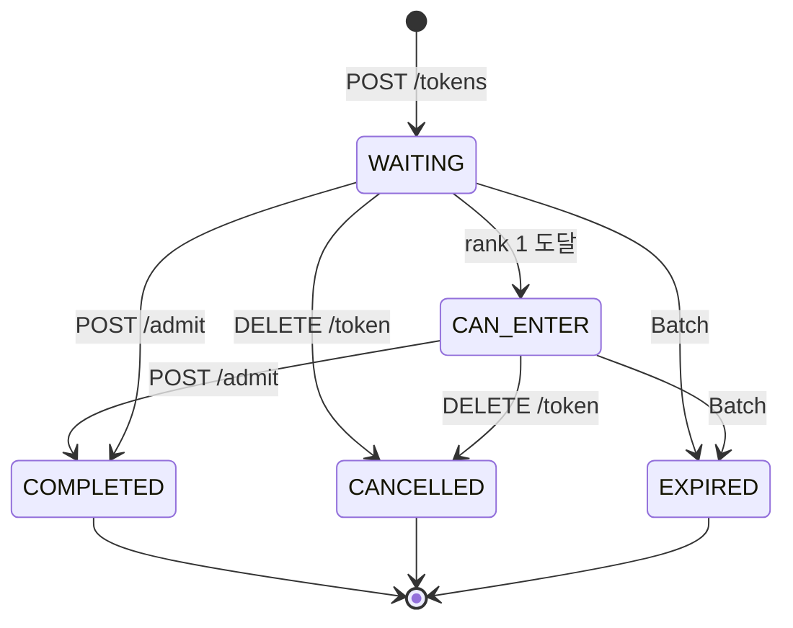
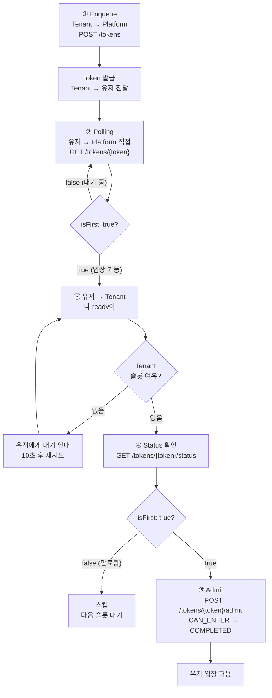

# 🚀 Queue Platform

> 대규모 트래픽 상황에서 서버 부하를 제어하기 위해  
> 대기열을 외부 플랫폼으로 분리한 Queue-as-a-Service

[](https://openjdk.org/projects/jdk/21/)
[](https://spring.io/projects/spring-boot)
[](https://redis.io/)

---

## 🔥 TL;DR

- 대기열을 서비스 서버에서 분리 → **트래픽 제어를 플랫폼화**
- **Platform(순서 관리)** vs **Tenant(슬롯·입장 제어)** 책임 분리
- **유저가 Platform에 직접 Polling** — Tenant 서버 부하 최소화
- Admit = COMPLETED — **Platform은 세션을 모른다**
- Redis Sorted Set + Global Seq — **슬라이스 간 FIFO 보장**
- `CAN_ENTER` 내부 상태 — **rank 1 도달 시 isFirst 플래그로 클라이언트 전달**

---

## 📌 문제 정의

트래픽이 몰릴 때 서버가 대기열을 직접 관리하면 이런 문제가 생긴다.

- 동시 접속 폭증 → 서버 자원 고갈
- 대기열 로직과 비즈니스 로직 강결합 → 복잡도 증가
- 순서 꼬임, Race Condition

**핵심 문제:** 트래픽 제어와 서비스 로직이 같은 서버에 있으면, 둘 중 하나만 바꿔도 전체를 수정해야 한다.

---

## 💡 핵심 설계 원칙

### 1. Platform은 순서만 관리한다

```
❌ 잘못된 설계: Platform이 슬롯 여유 감지 → 자동 입장
   → Platform이 Tenant 내부에 의존 → 커플링

✅ 채택한 설계: rank 1 도달 → isFirst: true 반환 → Tenant 서버가 Admit 결정
   → Platform은 순번 관리만
   → 세션 관리는 Tenant 책임. Platform 관여 없음
```

### 2. 유저가 Platform에 직접 Polling

```
❌ 기존 방식: 유저 → Tenant → Platform (Polling)
   → Tenant 서버가 Polling 트래픽까지 처리

✅ 채택한 설계: 유저 → Platform (Polling 직접)
   → Tenant 서버는 슬롯 관리에만 집중
   → 인증: token으로 (API Key 불필요)
```

### 3. 순서는 자료구조에 위임한다

```
score = global-seq (전체 순번)   → 슬라이스 간 FIFO 보장
ZADD NX                          → 중복 등록 원자적 방지
ZCOUNT 합산                      → 전체 순위 O(log N × sliceCount)
sliceCount = ceil(maxCapacity ÷ 100,000)
```

### 4. CAN_ENTER는 내부 상태다

```
rank 1 도달 → token-status:{tokenId} = CAN_ENTER (Redis)
           → 클라이언트에게는 isFirst: true 로만 노출
           → 상태값 직접 노출 시 내부 설계 변경이 클라이언트에 영향
           → PollingResponseDto에서 CAN_ENTER → isFirst: true 변환
```

---

## 🏗 아키텍처



---

## 📦 Hexagonal 멀티모듈 구조



---

## 🧠 Token 상태 머신



> `CAN_ENTER`는 내부 상태. 클라이언트에게는 `isFirst: true`로만 노출.

---

## 🔄 전체 흐름



---

## 🗂 Redis Key 구조

| Key | 자료구조 | TTL | 역할 |
|-----|----------|-----|------|
| `queue:{t}:{q}:{slice}` | Sorted Set | 없음 | 슬라이스별 대기열. score=global-seq |
| `global-seq:{t}:{q}` | String | 없음 | 전체 순번 채번. INCR 원자 |
| `queue-meta:{t}:{q}` | Hash | 없음 | sliceCount, totalCapacity |
| `queue-stats:{t}:{q}` | Hash | 없음 | avgWaitingTime, waitingTimeSum, waitingTimeCount |
| `queue-user:{t}:{q}:{userId}` | String | waitingTtl | userId→tokenId 역인덱스. 멱등 O(1) |
| `token-last-active:{tokenId}` | String | inactiveTtl | 비활동 TTL 감지 |
| `token-status:{tokenId}` | String | 상태별 상이 | 토큰 상태 캐시. CAN_ENTER 전이 포함 |
| `apikey-cache:{sha256}` | String | 60s | API Key 캐시. DB QPS ≈ 0 |
| `billing-count:{t}:{yyyyMM}` | String | 월말+7일 | 과금 카운터 |

---

## ⚡ 성능 목표

| API | p99 목표 | 목표 TPS | 산정 근거 |
|-----|----------|----------|----------|
| Polling | < 50ms | 2,000 rps | 10,000명 ÷ 5초 간격 |
| Enqueue | < 100ms | 200 rps | 10,000명 5분 집중 |
| Admit | < 100ms | 10 rps | throughput 기준 |

---

## 🔒 동시성 제어

```lua
-- Enqueue: 순번 채번 + ZADD + token-status 초기화 원자 실행
local seq = redis.call('INCR', KEYS[1])
local slice = tonumber(seq) % tonumber(ARGV[1])
redis.call('ZADD', KEYS[2]..':'..slice, 'NX', seq, ARGV[2])
redis.call('SET', 'token-status:'..ARGV[2], 'WAITING', 'EX', ARGV[3])
return seq

-- CAN_ENTER 전이: ZREM + 다음 1등 CAN_ENTER 원자 실행
redis.call('ZREM', KEYS[1], ARGV[1])
redis.call('SET', 'token-status:'..ARGV[1], ARGV[2], 'EX', 300)
local next = redis.call('ZRANGE', KEYS[1], 0, 0)
if #next > 0 then
    redis.call('SET', 'token-status:'..next[1], 'CAN_ENTER', 'EX', 300)
end
return next
```

| 문제 | 해결 |
|------|------|
| 중복 Enqueue | queue-user 역인덱스 + ZADD NX |
| 용량 초과 경쟁 | Lua Script 원자 실행 |
| CAN_ENTER 누락 | Lua Script 내 ZREM + ZRANGE 원자 처리 |
| 동시 Admit | DB 먼저 + ZREM 나중. Batch 싱크 자동 복구 |

---

## ⚖️ 트레이드오프

| 선택 | 장점 | 단점 | 결정 근거 |
|------|------|------|----------|
| token-status 별도 key | 단일 GET으로 상태 조회, TTL 독립 관리 | key 수 증가 | Polling 응답 단순화, CAN_ENTER 전이 원자성 보장 |
| CAN_ENTER 내부 상태 | 클라이언트 인터페이스 안정, 내부 설계 변경 자유 | 변환 로직 필요 | isFirst 플래그로 의미 명확, breaking change 방지 |
| 다국어 messages.properties | 언어 추가 시 파일만 추가 | 런타임 Locale 감지 필요 | Accept-Language 헤더 기반 자동 처리 |
| Batch 2개 분리 | 만료/복구 책임 명확 분리 | 스케줄러 관리 복잡도 증가 | 30초 만료 vs 5분 싱크 주기 차이, 단일 책임 원칙 |
| DB 먼저, ZREM 나중 | 잔류가 유실보다 안전 | 최대 5분 불일치 | Batch 싱크 자동 복구 |
| API Key SHA-256 저장 | DB 털려도 원본 역산 불가 | 분실 시 재발급만 가능 | HTTPS 전송 + per-key Rate limit으로 보완 |

---

## 🛠 기술 스택

| 영역 | 기술 | 선택 근거 |
|------|------|----------|
| Language | Java 21 | Virtual Thread, Record, LTS |
| API Server | Spring WebFlux + Netty | 수만 동시 연결 → Non-blocking 필수 |
| Batch Server | Spring MVC + Tomcat | 주기적 단일 작업. `@Scheduled` |
| Queue Storage | Redis Sorted Set | FIFO O(log N) + 원자 연산 |
| DB | MySQL 8.0 + R2DBC | Reactive 파이프라인 일관성 |
| Architecture | Hexagonal + DDD | 인프라 없이 도메인 테스트 가능 |
| Build | Gradle 멀티모듈 | 5모듈 의존성 명확 분리 |
| 다국어 | Spring MessageSource | messages.properties 기반 한/영/일 |

---

## 📎 문서

| 문서 | 설명 |
|------|------|
| [기능 정의서 v1.5](docs/FRS_final.md) | API 명세 · Redis 구조 · 동시성 · Batch |
| [상태 흐름도](docs/STATE.md) | Token · Queue · API Key 상태 전환 |
| [상세 흐름도](docs/FLOW.md) | Enqueue · Polling · CAN_ENTER · Admit · TTL 만료 |
| [설계 결정 문서](docs/DECISIONS.md) | Entity 설계 · 보안 · 복구 전략 · 트레이드오프 근거 |

---

<p align="center">
  <sub>Queue Platform · Java 21 · Spring Boot 3.3.4 · Redis · MySQL</sub>
</p>
