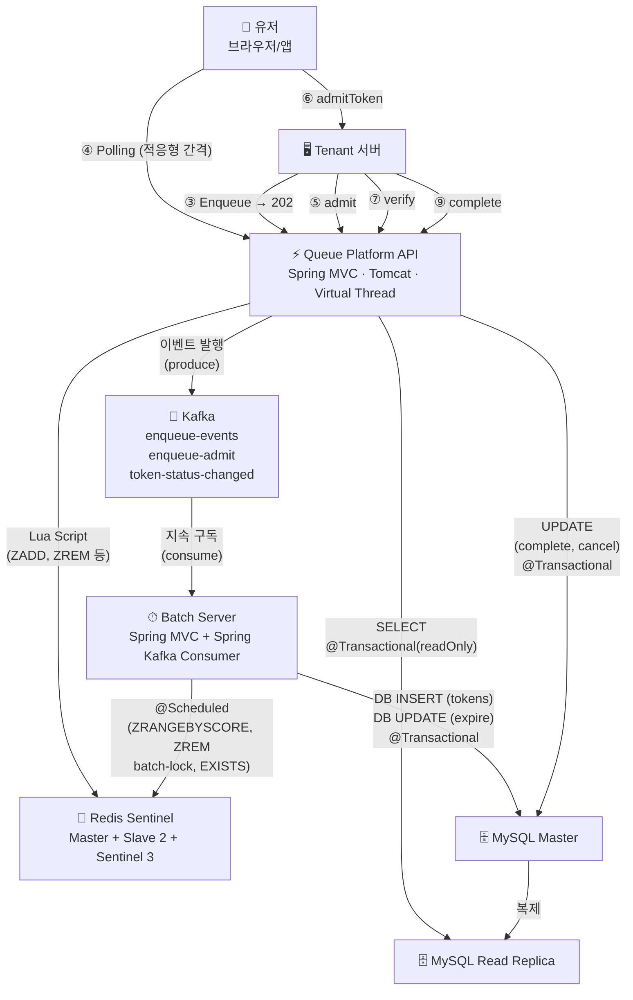
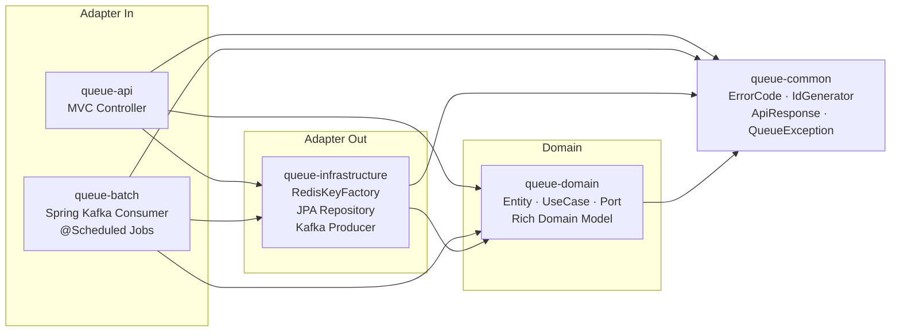
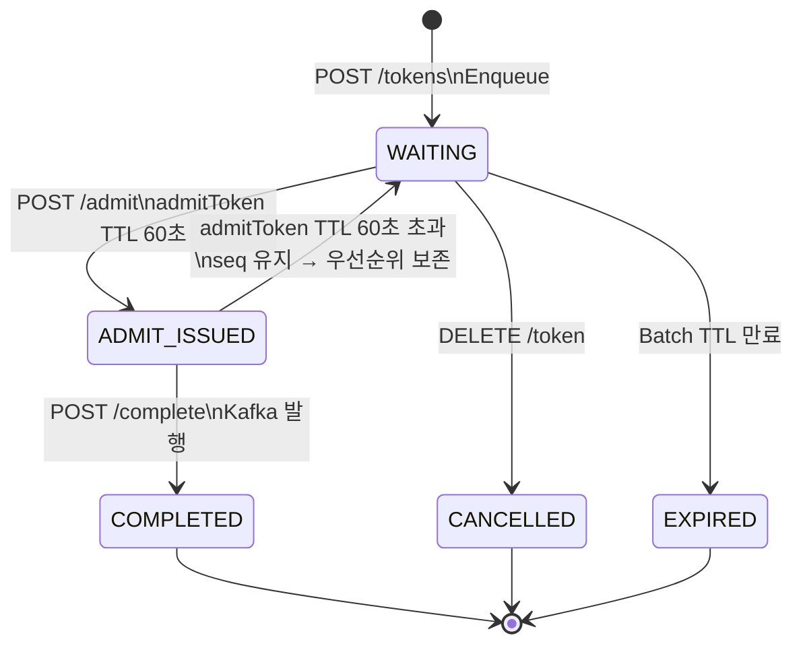
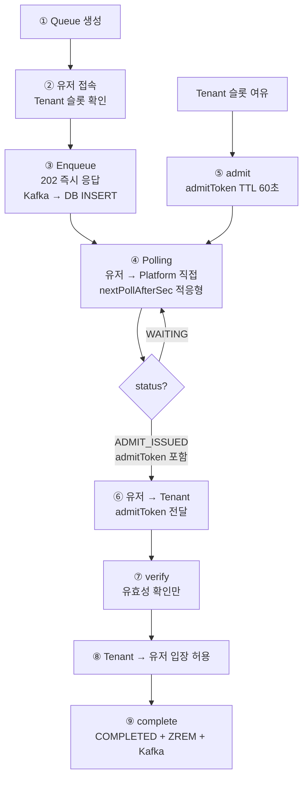

# 🚀 Queue Platform

> 대규모 트래픽 상황에서 서버 부하를 제어하기 위해  
> 대기열을 외부 플랫폼으로 분리한 Queue-as-a-Service

[](https://openjdk.org/projects/jdk/21/)
[](https://spring.io/projects/spring-boot)
[](https://redis.io/)
[](https://kafka.apache.org/)
[](https://www.mysql.com/)

---

## 🔥 TL;DR

- 대기열을 서비스 서버에서 분리 → **트래픽 제어를 플랫폼화**
- **Platform(순서 관리)** vs **Tenant(슬롯·입장 제어)** 책임 분리
- **유저가 Platform에 직접 Polling** — nextPollAfterSec 적응형 간격
- **Backpressure Pull** — Tenant가 소화 가능한 인원만 admit 요청
- **admitToken TTL 60초** → verify(유효성 확인) → complete(COMPLETED+ZREM)
- **admitToken 만료 시 WAITING 복귀** — seq 유지로 우선순위 보존
- **Kafka 버퍼** — Enqueue 202 즉시 응답 + DB INSERT 비동기
- **Virtual Thread** — Spring MVC + JPA blocking I/O를 OS Thread 고갈 없이 처리
- **SDK 제공** — JS SDK (nextPollAfterSec 적용) + REST API 명세

---

## 📌 문제 정의

트래픽이 몰릴 때 서버가 대기열을 직접 관리하면:
- 동시 접속 폭증 → 서버 자원 고갈
- 대기열 로직과 비즈니스 로직 강결합 → 복잡도 증가
- 순서 꼬임, Race Condition

---

## 💡 핵심 설계 원칙

### 1. Platform은 순서만 관리한다
```
Tenant가 슬롯 여유 감지 → POST /admit 호출
Platform은 순번 관리만. 세션 관리는 Tenant 책임
```

### 2. 유저가 Platform에 직접 Polling (적응형 간격)
```
nextPollAfterSec:
  globalRank > 500 → 30s (서버 부하 절약)
  globalRank > 100 → 10s
  globalRank > 10  → 5s
  globalRank ≤ 10  → 2s (곧 입장)

JS SDK: setTimeout(poll, nextPollAfterSec * 1000) 자동 적용
탭 비활성화 → Polling 자동 중단
```

### 3. Backpressure Pull
```
Tenant가 소화 가능한 만큼만 admit { count: N }
Platform과 커플링 없음
```

### 4. admitToken TTL 만료 → WAITING 복귀 (우선순위 보존)
```
TTL 60초 초과 → WAITING 복귀
seq DB 저장 → Redis ZADD score 복원
→ 다음 admit 호출 시 앞순서이면 재발급

이유: 네트워크 지연 등 유저 귀책 아닐 수 있음
     EXPIRED 처리 시 유저가 맨 뒤로 → 불공평
```

### 5. Virtual Thread + Spring MVC
```
spring.threads.virtual.enabled=true 한 줄로 적용
Tomcat의 모든 요청이 Virtual Thread에서 처리
JPA blocking → OS Thread 점유 없이 대기
@Transactional + ThreadLocal → Virtual Thread 정상 동작
→ Polling 2,000 rps + JPA 동시에 가능
```

### 6. Kafka Enqueue 버퍼
```
Redis Lua 처리 → 202 즉시 응답
Kafka enqueue-events → DB INSERT (At-Least-Once)
→ Enqueue p99 50ms 이하 달성
→ redis_sync_needed: Redis 다운 중 INSERT 토큰 추적
```

---

## 🏗 아키텍처


```mermaid
flowchart TD
    User["👤 유저\n브라우저/앱"]
    Tenant["🖥 Tenant 서버"]
    API["⚡ Queue Platform API\nSpring MVC · Tomcat · Virtual Thread"]
    Batch["⏱ Batch Server\nSpring MVC + Spring Kafka Consumer"]
    Kafka["📨 Kafka\nenqueue-events\nenqueue-admit\ntoken-status-changed"]
    Redis["🔴 Redis Sentinel\nMaster + Slave 2 + Sentinel 3"]
    DB_M["🗄 MySQL Master"]
    DB_R["🗄 MySQL Read Replica"]

    User -->|"④ Polling (적응형 간격)"| API
    User -->|"⑥ admitToken"| Tenant
    Tenant -->|"③ Enqueue → 202"| API
    Tenant -->|"⑤ admit"| API
    Tenant -->|"⑦ verify"| API
    Tenant -->|"⑨ complete"| API
    API -->|"Lua Script\n(ZADD, ZREM 등)"| Redis
    API -->|"이벤트 발행\n(produce)"| Kafka
    Kafka -->|"지속 구독\n(consume)"| Batch
    Batch -->|"@Scheduled\n(ZRANGEBYSCORE, ZREM\nbatch-lock, EXISTS)"| Redis
    Batch -->|"DB INSERT (tokens)\nDB UPDATE (expire)\n@Transactional"| DB_M
    API -->|"SELECT\n@Transactional(readOnly)"| DB_R
    API -->|"UPDATE\n(complete, cancel)\n@Transactional"| DB_M
    DB_M -->|"복제"| DB_R
```

---

## 📦 모듈 구조


```mermaid
flowchart LR
    subgraph IN["Adapter In"]
        api["queue-api\nMVC Controller"]
        batch["queue-batch\nSpring Kafka Consumer\n@Scheduled Jobs"]
    end

    subgraph DOMAIN["Domain"]
        domain["queue-domain\nEntity · UseCase · Port\nRich Domain Model"]
    end

    subgraph OUT["Adapter Out"]
        infra["queue-infrastructure\nRedisKeyFactory\nJPA Repository\nKafka Producer"]
    end

    common["queue-common\nErrorCode · IdGenerator\nApiResponse · QueueException"]

    api --> domain & infra & common
    batch --> domain & infra & common
    infra --> domain & common
    domain --> common
```

```
의존성 원칙:
  queue-common  ← 모든 모듈이 직접 의존 (명시적 선언)
  queue-domain  ← queue-api, queue-batch, queue-infrastructure
  queue-domain은 Spring 의존 없음 (순수 Java)
  queue-infrastructure는 queue-api/batch를 절대 모름
```

---

## 🧠 Token 상태 머신


```mermaid
stateDiagram-v2
    [*] --> WAITING : POST /tokens\nEnqueue
    WAITING --> ADMIT_ISSUED : POST /admit\nadmitToken TTL 60초
    ADMIT_ISSUED --> COMPLETED : POST /complete\nKafka 발행
    ADMIT_ISSUED --> WAITING : admitToken TTL 60초 초과\nseq 유지 → 우선순위 보존
    WAITING --> CANCELLED : DELETE /token
    WAITING --> EXPIRED : Batch TTL 만료
    COMPLETED --> [*]
    CANCELLED --> [*]
    EXPIRED --> [*]
```

---

## 🔄 전체 흐름 (9단계)


```mermaid
flowchart TD
    A["① Queue 생성"]
    --> B["② 유저 접속\nTenant 슬롯 확인"]
    --> C["③ Enqueue\n202 즉시 응답\nKafka → DB INSERT"]
    --> D["④ Polling\n유저 → Platform 직접\nnextPollAfterSec 적응형"]

    D --> E{"status?"}
    E -- "WAITING" --> D
    E -- "ADMIT_ISSUED\nadmitToken 포함" --> F

    F["⑥ 유저 → Tenant\nadmitToken 전달"]
    --> G["⑦ verify\n유효성 확인만"]
    --> H["⑧ Tenant → 유저 입장 허용"]
    --> I["⑨ complete\nCOMPLETED + ZREM + Kafka"]

    J["Tenant 슬롯 여유"]
    --> K["⑤ admit\nadmitToken TTL 60초"]
    --> D
```

---

## 🗂 Redis Key 구조 (RedisKeyFactory)

```
static 메서드 방식 (Enum X): 동적 인수 타입 안전성
Cluster 전환 시 이 파일만 수정 (Hash Tag 추가)
위치: queue-infrastructure/redis/RedisKeyFactory.java
```

| Key | TTL | 역할 |
|-----|-----|------|
| `queue:{t}:{q}:{slice}` | 없음 | 대기열 Sorted Set |
| `global-seq:{t}:{q}` | 없음 | 순번 채번 |
| `queue-meta:{t}:{q}` | 없음 | 큐 설정 |
| `queue-stats:{t}:{q}` | 없음 | avgWaitingTime |
| `queue-user:{t}:{q}:{userId}` | waitingTtl | 중복 Enqueue 방지 |
| `token-last-active:{tokenId}` | 300s | 비활동 감지 |
| `token-info:{tokenId}` | nextPollAfterSec+2s | Polling 캐시 |
| `admit-token-by-token:{tokenId}` | 60s | Polling 응답용 |
| `admit-token-by-admit:{admitToken}` | 60s | verify/complete용 |
| `admit-idem:{requestId}` | 300s | admit 멱등성 |
| `verified-token:{tokenId}` | 60s | 중복 입장 방지 |
| `batch-lock:{t}:{q}` | 15s | Batch 서버 분산 |
| `apikey-cache:{sha256}` | 60s | API Key 캐시 |

---

## 🗄 MySQL R/W 분리 + 파티셔닝

```
Write → Master / Read → Replica
@Transactional(readOnly) → Replica 자동 라우팅

tokens 테이블:
  Range 파티션 (issued_at 월별)
  월말 배치: queue_daily_stats 집계 → DROP PARTITION
  → 파티션 DROP 후에도 과금 근거 영구 보존

status: TINYINT (0~4) — VARCHAR 대비 저장공간·비교 성능 최적화
redis_sync_needed: Redis 다운 중 미반영 토큰 추적
admit_token: DB 저장 → Redis 미스 시 Fallback
```

---

## 🔴 Redis Sentinel

```
Master 1 + Slave 2 + Sentinel 3
쿼럼 = 2 | min-replicas-to-write 1 (Split Brain 방지)
모든 연산 → Master (Lua 원자성)
Slave: Failover + 백업
Failover: 5~10초 | Circuit Breaker → 503
```

---

## 📨 Kafka

| 토픽 | 생산 | 소비 |
|------|------|------|
| `enqueue-events` | Enqueue API | TokenEnqueueConsumer (DB INSERT) |
| `enqueue-admit` | admit API | AdmitConsumer (Dequeue + admitToken) |
| `token-status-changed` | complete/expire/cancel | BillingConsumer, StatsConsumer |

---

## 🔧 SDK + API

### REST API (Tenant 서버용)

> Java SDK 제거 — Tenant 서버 언어가 다양해 SDK 커스터마이징이 비현실적.
> REST API 명세 (OpenAPI 3.0) 제공으로 대체.

```
관리 API (JWT 인증):
  POST   /api/v1/tenants/signup          → 회원가입
  POST   /api/v1/tenants/login           → 로그인 (JWT 발급)
  POST   /api/v1/tenants/refresh         → 토큰 갱신
  POST   /api/v1/tenants/me/api-keys     → API Key 발급
  DELETE /api/v1/tenants/me/api-keys/:id → API Key 폐기
  POST   /api/v1/queues                  → 대기열 생성
  GET    /api/v1/queues/:queueId         → 대기열 조회
  PATCH  /api/v1/queues/:queueId         → 대기열 이름 변경
  POST   /api/v1/queues/:queueId/pause   → 대기열 정지
  POST   /api/v1/queues/:queueId/resume  → 대기열 재개
  DELETE /api/v1/queues/:queueId         → 대기열 삭제

Queue Engine API (API Key 인증, Sprint 6~7):
  POST   /api/v1/queues/:queueId/tokens  → Enqueue (202)
  GET    /api/v1/tokens/:tokenId         → Polling
  POST   /api/v1/queues/:queueId/admit   → Admit
  POST   /api/v1/tokens/:tokenId/verify  → Verify
  POST   /api/v1/tokens/:tokenId/complete → Complete
```

### JS SDK (브라우저용)

```javascript
const queue = QueueSDK.init({
    baseUrl: 'https://api.queue-platform.com',
    queueId: queueId,  // Tenant 서버에서 받은 값
    token: token       // Tenant 서버에서 받은 값
});

queue.startPolling({
    onWaiting: ({ globalRank, estimatedWaitSeconds }) => {
        updateUI(globalRank, estimatedWaitSeconds);
        // nextPollAfterSec 타이밍 SDK가 자동 처리
    },
    onReady: ({ admitToken }) => {
        sendToTenantServer(admitToken);
    },
    onExpired: () => showExpiredMessage()
});
// 탭 비활성화 → 자동 중단 / 복귀 → 즉시 재개
// 네트워크 offline/online 자동 처리
```

### 클라이언트 전체 흐름

```
유저 → Tenant 서버      : 서비스 접속
Tenant (REST API)       : POST /tokens → 대기토큰 발급
Tenant → 유저           : token, queueId 전달
유저 (JS SDK)           : startPolling() → Platform 직접 Polling
JS SDK → onReady        : admitToken 수신
유저 → Tenant 서버      : admitToken 전달
Tenant (REST API)       : POST /verify → POST /complete
```

---

## ⚡ 성능

| API | p99 | TPS |
|-----|-----|-----|
| Enqueue | < 50ms | 200 rps (급증 → Kafka) |
| Polling | < 50ms | 2,000 rps |
| admit/complete | < 100ms | - |

---

## ⚖️ 트레이드오프

| 선택 | 장점 | 단점 | 근거 |
|------|------|------|------|
| Spring MVC + Virtual Thread | 친숙한 생태계, 코드 단순 | blocking → VT 필요 | spring.threads.virtual.enabled=true 한 줄 적용 |
| JPA + Virtual Thread | @Transactional 자연스러움 | blocking I/O | VT가 OS Thread 고갈 없이 처리 |
| admitToken 만료 → WAITING 복귀 | 우선순위 보존. 유저 불이익 없음 | 슬롯 일시 점유 | seq DB 저장으로 score 복원 |
| Kafka Enqueue 버퍼 | 202 즉시 응답. 급증 흡수 | Eventually Consistent | At-Least-Once 보장 |
| Kafka admit 처리 | admit 요청 영속성 | Consumer 처리 지연 | DB PENDING → 멱등성 보장 |
| status TINYINT | 저장공간·비교 성능 | 가독성 (상수로 보완) | 대량 tokens 테이블 최적화 |
| redis_sync_needed | Redis 다운 중 INSERT 복구 | 컬럼 추가 | 데이터 정합성 보장 |
| admit_token 컬럼 | Redis 미스 시 DB Fallback | 컬럼 추가 | verify 안정성 향상 |
| queue_daily_stats | 파티션 DROP 후 과금 근거 보존 | 배치 필요 | 감사/청구 불변 기록 |
| billing_snapshots 직접 집계 | tokens 원본 → 중복 방지 불필요 | 집계 쿼리 필요 | billing_events 테이블 제거 |
| avgWaitingTime 직접 갱신 | StatsConsumer 불필요 → 단순화 | Kafka 재처리 중복 허용 | ETA는 보조 정보 → 허용 범위 |
| 파티션 1달 유예 DROP | 월말 걸친 토큰 과금 누락 방지 | 스토리지 2배 | B2B 과금 정확도 우선 |
| ZCARD Pipeline | queue-count 관리 불필요 | N번 ZCARD | 카운터 불일치 위험 제거 |
| nextPollAfterSec | 서버 부하 절약 | SDK 구현 필요 | 순위 높을수록 Polling 드물게 |
| Redis R/W 분리 미적용 | 설계 단순 | - | Lua 원자성. In-Memory 충분 |
| MySQL R/W 분리 | SELECT 2,000 rps 분산 | Replica lag | token-info 캐시로 lag 최소화 |
| tokens 파티셔닝 | 월별 DROP 빠른 정리 | PK에 파티션 키 | Partition Pruning 효과 |
| RedisKeyFactory | 컴파일 타임 검사 | - | Enum: 가변인수 타입 안전성 없음 |

---

## 🛠 기술 스택

| 영역 | 기술 | 근거 |
|------|------|------|
| Language | Java 21 | Virtual Thread, Record, LTS |
| API Server | Spring MVC + Tomcat | Virtual Thread로 2,000 rps 달성 |
| ORM | JPA (Hibernate) | @Transactional 자연스러움, 풍부한 생태계 |
| DB 연결 | JDBC + Virtual Thread | blocking → spring.threads.virtual.enabled=true |
| Messaging | Spring Kafka | Enqueue 버퍼 + 상태 이벤트 |
| Batch | Spring MVC + Tomcat | @Scheduled + Spring Kafka Consumer |
| Cache | Redis Sentinel | FIFO Sorted Set + Lua 원자 |
| DB | MySQL 8.0 | Range 파티셔닝 + Replica |
| Architecture | Hexagonal + DDD | 도메인 단위 테스트 |
| Build | Gradle 멀티모듈 5개 | 의존성 명확 분리 |

---

## 📎 문서

| 문서 | 설명 |
|------|------|
| [FRS v1.10](docs/FRS_final.md) | API · Redis · Kafka · SDK · Batch |
| [STATE](docs/STATE.md) | Token · Queue · ApiKey 상태 머신 |
| [FLOW](docs/FLOW.md) | Enqueue · Polling · Admit · Complete · Batch |
| [DECISIONS](docs/DECISIONS.md) | 56개 설계 결정 + 근거 + 면접 포인트 |
| [ROADMAP](docs/ROADMAP.md) | 11개 Sprint DoD + 진행 현황 |

---

## 📊 프로젝트 진행 현황

```
✅ Sprint 1:  멀티모듈 스켈레톤 + Virtual Thread
✅ Sprint 2:  JPA + MySQL Master/Replica R/W 분리
✅ Sprint 3:  관리 도메인 (Tenant + ApiKey + Queue) 헥사고날 구현
✅ Sprint 4:  JWT 인증 + 관리 API 12개 + Service/Controller 테스트
⬜ Sprint 5:  Redis + Lua Script + Sentinel + Rate Limit
⬜ Sprint 6:  Token 도메인 + Queue Engine API
⬜ Sprint 7:  Admit → Verify → Complete
⬜ Sprint 8:  Kafka KRaft 연동
⬜ Sprint 9:  Batch 모듈
⬜ Sprint 10: 통합 테스트 + k6 + Grafana + JS SDK + OpenAPI
⬜ Sprint 11: Docker + AWS 배포 + 대용량 실측
```

---

<p align="center">
  <sub>Queue Platform · Java 21 · Spring Boot 3.3.4 · Redis Sentinel · Kafka · MySQL 8.0</sub>
</p>
