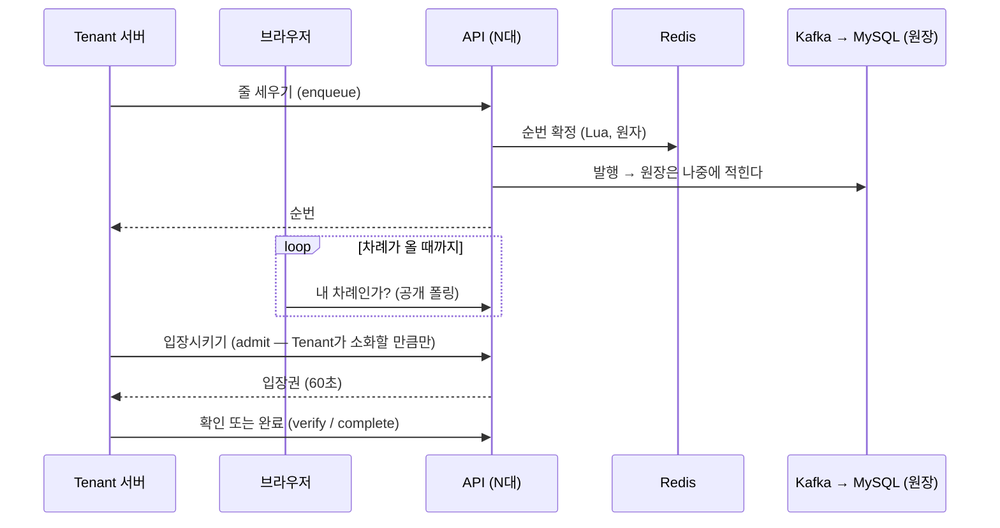
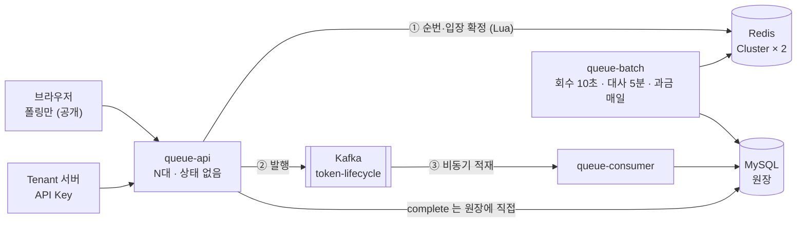

# Queue Platform

> B2B Queue-as-a-Service. **난이도는 처리량이 아니라, 동시성과 장애 속에서 원장을 안 틀리는 것이다.**

[](https://openjdk.org/projects/jdk/21/)
[](https://spring.io/projects/spring-boot)
[](https://redis.io/)
[](https://kafka.apache.org/)
[](https://www.mysql.com/)
[](#-테스트-전략)

> 개인 사이드 프로젝트입니다. **운영 중이 아닙니다.**
> 이 문서의 수치는 전부 실측이며, 측정 환경(로컬 / AWS)과 판(차수)을 같이 적었습니다.
> 원본 파일이 보관되지 않은 수치는 ⚠️로 표시했습니다.

---

## 30초 요약

- **500만 명을 전 구간 통과시켰고, 그 판에서 우리 쪽 계약 위반 30.8만 건을 찾았다**(AWS 14차).
  유입·입장권·완료 세 숫자는 원장과 한 건도 안 틀렸고 5xx는 0이었다. 그런데 입장권을 받고도
  완료되지 않은 49.6만 건이 남았고, 원인 셋으로 정확히 갈라 보니 **30.8만 건은 적재가 밀린 동안
  정상 입장자가 거절된 것**이었다 — 모든 응답이 정상 코드인 판에서 숫자 대조만으로 찾았다
- **원장을 조용히 깨뜨리던 결함 2건을 실측으로 잡았다.** 서버 시계 398초 차이로 완료가 한 건도
  반영되지 않던 것, 이벤트 도착 순서가 뒤집혀 완료의 1.43%가 사라지던 것. 둘 다 전 테스트가 초록일 때였다
- **DB 시간의 80%를 쓰던 쿼리 하나를 찾아** 인덱스 하나로 DB CPU 96% → 69%. 찾을 수 있었던 건
  튜닝이 아니라 **관측을 분리**했기 때문이다
- **"천장"이라 믿은 수치가 세 번 다 측정 장비의 한계였다.** 서버가 아니라 재는 쪽을 먼저 의심하는
  습관이 여기서 생겼다

---

## 한눈에 보는 흐름


```mermaid
sequenceDiagram
    participant T as Tenant 서버
    participant B as 브라우저
    participant A as API (N대)
    participant R as Redis
    participant M as Kafka → MySQL (원장)

    T->>A: 줄 세우기 (enqueue)
    A->>R: 순번 확정 (Lua, 원자)
    A->>M: 발행 → 원장은 나중에 적힌다
    A-->>T: 순번
    loop 차례가 올 때까지
        B->>A: 내 차례인가? (공개 폴링)
    end
    T->>A: 입장시키기 (admit — Tenant가 소화할 만큼만)
    A-->>T: 입장권 (60초)
    T->>A: 확인 또는 완료 (verify / complete)
```

단계별 상세는 [`doc/FLOW.md`](doc/FLOW.md), 토큰 상태 전이는 [`doc/STATE.md`](doc/STATE.md)에 그림과 표로 있다.

---

## 📌 문제 정의 — 난이도는 어디에 있나

대기열은 "줄 세우기"처럼 보이지만, 돈이 걸리면 어려운 지점이 셋이다.

**① 중복은 곧 중복 청구다.** 과금 단위가 **토큰 1장 = 청구 1건**이라, 새로고침 한 번이 청구 2건이
되면 안 된다. 그래서 중복 게이트는 `tokens` Hash의 **`HSETNX`**다 — `waiting` ZSet이 아니다.
입장하면 ZSet에서 빠지므로, ZSet을 게이트로 쓰면 **재-enqueue가 신규로 판정되어 두 번 청구된다.**

**② 자리는 줄 선 순간 확정되고, 그 뒤로 바뀌지 않는다.** `seq`(발급 번호)는 `INCR`(단조증가·유일)
하나로만 만들고, 화면의 대기 순위는 `seq − 마지막 입장 seq`로 계산한다. 바뀌는 건 순위지 자리가 아니다.

**③ 즉시 응답과 비동기 적재 사이에 창(window)이 있다.** 사용자는 자리를 즉시 받아야 하고,
원장은 MySQL에 있다. 그 사이를 Kafka가 잇는다. **이 창에서 시계가 갈리거나 순서가 뒤집히면
원장이 조용히 틀린다.** 실제로 둘 다 일어났다(아래).

---

## 🔀 누가 무엇을 책임지나

**Platform은 순서만 관리하고, 입장 속도는 Tenant가 정한다.**

| 누가 | 무엇을 |
|---|---|
| 브라우저 | **폴링만** — *"내 차례인가?"*를 Platform에 직접 묻는다. 열쇠(API Key)를 줄 수 없으니 읽기만 한다 |
| Tenant 서버 | `enqueue`(줄 세우기) · `admit`(**소화할 수 있는 만큼만** 당겨가기 — Backpressure Pull) · `verify`/`complete`(입장 확정) |

입장권 TTL은 **60초**이고, **만료되면 복귀하지 않는다** — 재접속하면 맨 뒤다.
붙잡아두면 그 자리가 비어 있는 동안 뒤가 못 들어오기 때문이다.

---

## 🧾 원장 정합성 — 틀린 것 2건, 막아둔 것 1건

**원장 = MySQL `tokens` 테이블이고, 행 하나가 곧 청구 1건이다.** 순서는 Redis가 정하고, Kafka를 건너,
컨슈머가 MySQL에 적는다. **응답은 이미 나갔는데 원장은 뒤에 쓰인다.** 그 구간에서 틀어지는 방식이 둘이었다.

### ① 시간을 재는 시계를 하나로

**문제** — 방금 입장한 사람의 완료 처리가 **한 건도 반영되지 않았다.** 토큰은 "만료됨"인데 완료 시각은
비어 있는 채 굳었고, **그런데도 사용자에게는 정상이라고 답했다.** 아무도 오류를 볼 수 없었다.

**원인** — 플랫폼은 *"입장한 지 60초 안인가?"*, *"5분 안인가?"*로 판정한다. 그런데 **"지금"은
데이터베이스 시계로 읽고, "입장 시각"은 앱 서버 시계로 찍고** 있었다. 출발은 손목시계로, 도착은
경기장 벽시계로 잰 셈이다. 실제로 한 서버의 시계가 **398초(약 6.6분)** 뒤처져 있었고, 5분 창이
통째로 어긋나 데이터베이스가 보기에 그 사람은 아직 입장하지 않은 상태였다.

**해결** — 입장 시각도 **데이터베이스가 직접 찍게** 했다. 판정의 두 값이 같은 시계에서 나오므로
서버 시계가 얼마나 어긋나든 판정은 틀리지 않는다.
> 🔑 **줄 선 시각은 옮기지 않았다.** 그 값은 "몇 초 전인가"가 아니라 **같은 토큰인지 판별하는 데** 쓰인다.
> 재처리해도 똑같이 재현돼야 하므로 일이 일어난 시점에 확정돼야 한다. **"지금"과 비교되는 시각만 DB가 찍는다.**

### ② 소식이 거꾸로 도착해도 견디게

**문제** — Redis 폴백으로 들어온 완료의 **1.43%**가 원장에서 사라지고 있었다.

**원인** — 완료 소식은 *"상태가 1(입장권 받음)일 때만"* 반영하게 했다. 그런데 입장권은 만들어지는 즉시
사용자에게 보이고, 그 사실을 원장에 알리는 소식은 **뒤에 따로** 간다(당시 실측 67~128ms). 사용자가
그 사이에 완료까지 끝내면 **"완료"가 "입장"보다 먼저 도착**하고, 상태가 아직 0이라 조건에 걸려 버려졌다.

**해결** — **아직 끝나지 않은 상태(0 또는 1)면 완료로 받는다.** 이미 완료(2)이거나 만료로 확정(4)된
토큰은 건드리지 않는다 — 거기까지 넓히면 끝난 것을 뒤늦게 완료로 뒤집는 새 결함이 된다.
> 🔑 메시지 큐는 보낸 순서를 지켜준다. 하지만 **보낸 순서 자체가 틀렸다면, 틀린 순서를 그대로 지켜준다.**

### ③ 재처리로 안 깨지게

적재는 At-Least-Once다. 중복 소비를 `UNIQUE(token_id, issued_at)` + 상태 전이 가드 UPSERT로 흡수한다.
전이는 **한 방향으로만** 진행하므로 같은 이벤트를 몇 번 먹어도 결과가 같다.
근거와 번복 이력은 [`doc/DECISIONS.md`](doc/DECISIONS.md) §90 · §91.

---

## 📐 규모 — 어디까지 확인했나

### AWS 실측 (판마다 서버 6~8대)

| | 결과 |
|---|---|
| **500만 명 투입** (14차 · 2026-09-25) | 유입 **4,999,998** = DB · 입장권 **4,910,506** = DB · 완료 **3,690,813** = DB · 테넌트 40곳 · 168분 · **5xx 0** (요청 약 975만) |
| 줄 세우기 — 초당 3,000명 (14차) | p95 **29.2ms** · p99 **33.1ms** (최악 구간 102ms) |
| 입장 확인 · 완료 · 전광판 (14차) | verify p95 **10.1ms** · complete p95 **21.7ms** · status p95 **0.97ms** |
| **입장시키기 — 300명씩** (12차 → 13차) | p99 **2.14초 ⚠️ → 27.9ms** (아래) |
| **입구 막기 — 부하 중 PAUSE** (15차) | 200만 명 시도 · 16.7만은 PAUSE로 막힘 · PAUSE **29/29** · RESUME **26/26** 전부 성공 · 막힌 뒤 최대 대기 **문턱의 1.007배** · 원장 세 숫자 일치 |
| **묻기 — 대기자 50만 명분** (11차) | **초당 25,432번** · 응답 **5.62ms** · 실패 0 · 서버 CPU 최대 47.5% ⚠️ |

> 📏 **p95** = 100번 중 95번은 이 시간 안에 답했다는 뜻이다. 평균은 느린 소수를 가려서 쓰지 않는다.
> 값은 부하 중 15초 구간별 백분위의 **중앙값**이다(서버 히스토그램, 원본 CSV 보관).
> 지연은 **최대 규모 판(14차)** 기준이고, 개선 전후 비교만 그 판 번호로 적었다.
> ⚠️ 2.14초는 그 판 CSV에서 입장시키기 열만 따로 떼어낼 수 없고, 25,432는 k6 요약을 보관하지 않았다 —
> 서버 지표와 스크립트만 남아 있다.

🔴 **"맞다"와 "제때 맞다"는 다르다.** 500만 판에서 유입이 몰린 45분 무렵 적재가 **190만 건 밀렸고**,
그 동안 원장은 "지금 몇 명이 들어왔나"에 답할 수 없었다. 발행에서 원장 반영까지 p95가 평상시 **0.47초**,
최악 **1,725초(29분)**였다. 판이 끝나기 1시간 25분 전에 0으로 돌아왔다(같은 규모의 이전 코드 판은
판이 끝날 때 695만이 남아 있었다). 그리고 **그 밀린 1시간 동안 사용자가 실제로 피해를 봤다** — 바로 아래다.

### 입장권을 받고도 완료되지 않은 49.6만 건

입장권 4,910,506장에서 완료 367.8만(부하 도구 집계)과 떠난 사람 73.6만(의도적으로 15%)을 빼면
**49.6만 건이 남는다.** 응답은 전부 정상 코드였다. 남은 건 "숫자가 안 맞는다"뿐이었다.

| 원인 | 건수 | 판정 |
|---|---|---|
| 테넌트가 한 번에 300명을 받고 **60초 안에 자리를 못 줌** | 174,915 | 🟢 예상한 몫 — 계산 예측 180,239, **97% 일치** |
| **적재가 밀린 동안 완료 처리가 거절됨** | **308,502** | 🔴 **우리 계약 위반** |
| 부하 도구의 집계 오류 | 12,658 | 🟡 실제로는 완료됐다 — 도구를 고치자 완료가 원장과 **한 건도 안 틀렸다** |

**둘째 줄**은 좌석 계산으로 3,661건밖에 설명되지 않았다. 시간대로 나누자 원인이 보였다 — 거절은
**적재가 밀린 1시간 동안에만 10분당 약 5만 건** 났고, 따라잡자 **10분당 250건**으로 무너졌다.

완료 처리는 원장을 먼저 보고, 원장이 모르면 Redis의 입장권 사본으로 확인한다. 사본의 수명은 **60초**이고
원장 쪽 창은 **입장 기록이 적힌 시각부터** 5분이다(위 ①). 적재가 L초 밀리면 확인할 수 있는 구간이 갈린다.

```
Redis 사본   입장 후 [0, 60]초
원장         입장 후 [L, L+300]초
빈 구간      (60, L)  ← L이 60초를 넘으면 생긴다. 이 구간의 완료 요청은 404
```

연동 계약은 *"자리 배정이 60초를 넘길 수 있으면 완료 처리 하나만 써라, 창은 5분이다"*라고 약속한다.
**그 지침을 그대로 따른 요청이 404를 받은 것이다.** 적재를 일부러 멈추고 재현했더니 입장 82초에 404,
적재 재개 뒤 **101초에 같은 요청이 200** — 영구가 아니라 일시적이었다. 그래서 연동 계약에 **"입장 후
5분 안의 404는 재시도하라"**를 넣었다. 코드로 빈 구간을 없애는 안은 새로 생기는 모서리가 있어 보류했다.

> 🔑 **"큰 창이 작은 창을 품는다"는 두 창의 출발점이 같을 때만 참이다.** 출발점이 다른 시계면
> 품는 게 아니라 사이가 벌어진다. ①에서 시계를 하나로 모은 결정이, 적재가 밀리면 창을 통째로 뒤로 미는
> 효과도 함께 가져왔다.

### 입장시키기가 2.14초 → 27.9ms (12차 → 13차)

300명을 들여보내는 한 요청 안에서 **한 사람씩 확인 응답을 기다리고** 있었다 — 사람 수에 정비례하는
구조였다(로컬 A/B 기울기 한 명당 6.5ms · AWS 2.14초 ÷ 300 = 7.1ms). 전원을 한꺼번에 보내고 마지막에
한 번만 기다리게 바꾸자 한 명당 0.009ms가 됐다. 목표 "0.1초 안" 기준으로 **21배 초과에서 3.6배 여유**로 들어왔다.
> 🔑 **계산이 먼저였다.** 한 명당 6.5ms가 "묶어 보내려 기다리는 시간(5ms) + 왕복(1.4ms)"과 맞아떨어졌고,
> 로컬에서 300명까지 계단식으로 재어 **27.8ms를 예측**한 뒤 AWS에서 **27.9ms**를 얻었다.

**그리고 한 번에 300명은 안전한 값이 아니었다.** 받은 300장을 한 명씩 앉히면 마지막 사람은
`300 ÷ 초당 처리량`초 뒤에 앉는다. 그 값이 60을 넘는 만큼은 앉기 전에 만료된다(13차: 발급의 7~10%).
그래서 안전값은 서버 상한이 아니라 테넌트의 처리 속도가 정한다: **`받을 인원 ≤ 초당 처리량 × 60초`**.
14차에서 이 식의 예측이 실측과 97% 맞았다(위 표 첫 줄).

### 폴링 — 부하의 대부분은 "내 차례인가?"다

줄을 서는 건 한 번이지만 기다리는 동안은 계속 묻는다. 순위가 멀수록 간격을 벌려도(앞 2초 ~ 뒤 20초)
대기자 50만 명이면 **초당 약 25,000번**이고, 그중 **96%를 뒤쪽 사람들이 만든다.** 간격을 벌려도
총량은 사람 수가 정한다.

- **부하가 터졌을 때 첫 손잡이는 증설이 아니라 "묻는 간격"이다.** 간격표는 큐마다 Redis 키 하나로
  덮어쓴다 — 배포가 필요 없다. 🪤 다만 뒤쪽 간격을 늘리면 자는 사이 차례가 지나갈 수 있다(입장권 60초)
- **서버를 늘리면 그만큼 늘어난다**(5차) — 8코어 한 대로 초당 1만 번, **8코어 + 4코어 두 대(합 12코어)**로
  1만 8천 번. 🪤 크기가 다른 두 대에 반씩 보내면 작은 쪽이 먼저 포화돼(96% vs 50%) 20%밖에 안 늘었다.
  용량 비율대로 보내자 같은 하드웨어에서 응답이 **506ms → 1.12ms**가 됐다
- **"천장"이라 믿은 수치가 세 번 다 측정 장비였다** — ① 로컬 "폴링 1만 5천"은 부하 도구가 서버와 CPU를 나눠 썼고
  ② AWS "줄 세우기 4,000"은 부하 도구 언어의 구조적 한계(GIL)였고 ③ "폴링 1만 4천"은 부하 생성기가 8코어였다. 16코어로 키우자 같은 스크립트가
  **초당 25,432번**을 냈다 — 그때 서버 CPU는 최대 47.5%였으니 이것도 한계가 아니라 *"이 규모를 감당한다"*다

---

## ⚡ 성능 개선 3건 — 원인을 틀렸다가 고친 기록

### ① enqueue 드레인 주기 1,000ms → 20ms
줄 세우기를 모았다가 **주기마다 한 번씩** 보냈더니 응답이 1초 가까이 걸렸다. 보내는 일은 몇 ms면 끝나고
나머지는 **다음 차례를 기다리는 시간**이었다(응답 ≈ 주기 × 0.99). 주기를 20ms로 줄여 목표 부하(초당 200명)에서
**p99 32.32ms**로 목표(50ms) 안에 들어왔다.
🔴 처음엔 30ms로 정했다가 뒤집혔다 — 버스트를 20ms 설정 위에서 재놓고 30ms 수치라고 보고했다.
🔴 **"몇 rps에서 몇 ms"는 큐 수 없이는 의미가 없다** — 같은 2,000rps에서 큐 10개 64.42ms, 43개 130.50ms(p99).

### ② 컨슈머 적재 132 → 1,400~1,800건/s ⚠️
500건씩 모아 쓰게 만들었는데 **초당 132건**밖에 못 넣었다. 한 번에 쓰인 건수를 재니 **평균 1.82건** —
일의 종류(줄 섬·입장·완료)가 바뀔 때마다 저장을 끊고 있었다. *"순서대로 적용"*을 *"종류마다 따로 저장"*으로
구현한 것인데, **순서는 쓰는 순서만 지키면 되지 저장을 끊을 이유가 없었다.** 경계를 합쳐 10배 이상이 됐다.
🔴 **첫 수정이 원장을 깼다.** 합친 경계 안에 곧바로 쓰는 코드와 **마지막에 몰아 쓰는** 코드가 섞여 순서가
뒤바뀌었다. 양쪽을 같은 방식(raw JDBC)으로 통일하고서야 맞았다. (⚠️ 132·1,800의 원본 로그는 보관하지 않았다)

### ③ 쿼리 하나가 DB 시간의 80%였다
AWS 9차에서 DB CPU가 **96%**로 붙었는데 어디가 느린지 보이지 않았다. **먼저 한 것은 튜닝이 아니라 분리였다** —
관측 도구를 별도 서버로 떼자 **DB 96% vs 관측 1.5%**로 갈렸다. 쿼리별 누적 시간을 보니 입장권 확인 조회
하나가 **DB 시간의 80%**, 한 번에 **319만 행**을 훑으며 **회당 198ms**였다. 인덱스 하나(`queue_id`, `admit_token`)로
**1행 · 0.63ms**, DB CPU **96% → 69%**, 밀린 적재 **최대 806만 건 → 판 끝에 0**.
> 🔑 같은 계열의 대사 배치 쿼리는 인덱스를 바꿔 넣어도 **옵티마이저가 안 골랐다** — `FORCE INDEX`로 43 → 24ms.
> 그 뒤에도 큐의 전체 이력을 훑는 구조라, 경계에서 1,000행만 읽게 바꿨다(로컬 35ms → 1.32ms).
> **"만들었다"와 "쓰인다"는 따로 확인해야 한다.**

---

## 🏗 아키텍처


```mermaid
flowchart LR
    B["브라우저<br/>폴링만 (공개)"] --> A
    T["Tenant 서버<br/>API Key"] --> A
    A["queue-api<br/>N대 · 상태 없음"] -- "① 순번·입장 확정 (Lua)" --> R[("Redis<br/>Cluster × 2")]
    A -- "② 발행" --> K[["Kafka<br/>token-lifecycle"]]
    K -- "③ 비동기 적재" --> C["queue-consumer"] --> M[("MySQL<br/>원장")]
    A -- "complete 는 원장에 직접" --> M
    J["queue-batch<br/>회수 10초 · 대사 5분 · 과금 매일"] --> R
    J --> M
```

- **쓰는 요청은 ①→②→③을 지난다.** 응답은 ②까지만 확인하고 나간다 — 그래서 빠르고, 그래서 ②와 ③ 사이가 "창"이다
- ②가 실패하면: **줄 세우기만 503**이다. 입장·확인은 ①에서 이미 확정돼 200을 주고 실패를 지표·로그로 남긴다
- 🔑 **완료(complete)는 이 길을 타지 않는다** — 원장에 직접 쓰고 Redis만 정리한다. 발행은 원장이 아직 모르는
  완료(Redis 폴백)에서만 한다. 입장권(60초)이 사라진 뒤에도 원장의 5분 창으로 완료를 받아주기 위해서다

| 모듈 | 책임 |
|---|---|
| `queue-common` | ErrorCode · 예외 · ID 생성 · AOP 어노테이션 |
| `queue-domain` | Rich Domain Model + Port. **Spring 의존성 0** |
| `queue-infrastructure` | JPA · Redis · Kafka 어댑터 |
| `queue-api` | REST + Security(JWT / API Key) |
| `queue-batch` | 회수 · 대사 · 과금 스냅샷 |
| `queue-consumer` | Kafka 소비 전담 (확장 방향이 batch와 반대라 분리) |

---

## 🧪 테스트 전략

**538건**(전체, 벤치마크 4건 skip). 가르는 기준은 모듈이 아니라 **`@Tag`**다 — 실 MySQL·Redis Cluster·Kafka를
쓰는 테스트에만 태그를 붙이고, CI 단위 레인은 그것만 제외한다.

- 🔴 **모듈 단위로 가르다가 384건 중 104건만 돌고 있던 적이 있다.** 그래서 태그다
- 🔴 **CI 배지를 달지 않았다.** 0건이 실행돼도 초록이라 "다 돌았다"로 오독된다. 대신 건수를 본다
- 🔴 **테스트가 결함을 잡는지 따로 확인한다(결함 주입).** 큐 상한 작업에서 주입 6종 중 셋이 안 잡혔다 —
  어댑터가 항상 0을 반환해(= 상한 무동작) 전 스위트가 초록이었다
- 통합 테스트는 **api 3대 고정**이다. 1대로는 "한 대에서만 맞는" 결함을 못 잡는다
- 동시성 테스트는 Virtual Thread로 돈다(고정 풀은 출발 신호에서 교착한다)

---

## 🤖 AI 협업 방식

Claude Code와 **역할별 에이전트 15종**으로 만들었다. 자산은 생산 속도가 아니라 **AI 출력을 불신하는 절차**다.

- **어떤 에이전트도 단독으로 결론을 확정하지 않는다.** 교차 검토 뒤 최종 판정은 사람이 한다.
  총괄은 보고서를 믿지 않고 `git diff`로 직접 대조한다
- **보고 형식을 강제한다** — 목적 → 대안 → 선택 이유 → 검증 결과. 안 돌린 명령은 "미검증"이라고 쓴다
- **늘리는 제안은 "안 만들면 무엇이 깨지는가"를 같이 낸다.** 안 깨지면 만들지 않는다

| 절차가 잡아낸 것 | |
|---|---|
| 합의가 실측에 졌다 | 에이전트 3인이 동의한 불변식이 10분 만에 반증됐다(오탐 15,144건) |
| 메커니즘 추론이 틀렸다 | 둘이 독립적으로 "이 쿼리는 replica로 간다"고 추론했고 **둘 다 틀렸다**. 라우팅 로그로 확인했다 |
| 절차 자체의 결함 | 수정 에이전트와 읽기 전용 검토자를 병렬로 돌렸더니 **diff에 없는 코드를 근거로** 결함을 보고했다 |

원문은 [`doc/reviews/`](doc/reviews/)에 있다. (에이전트 정의 파일은 `.gitignore` 대상이라 레포에 없다.)

---

## ⚠️ 한계와 다음

**먼저 밝힌다. 이 프로젝트는 운영 경험을 증명하지 못한다.**

| 항목 | 지금 | 남은 것 |
|---|---|---|
| 알람 | 규칙 24개 → Alertmanager → **Slack 도달 확인** | 로컬은 `nohup`이라 재부팅하면 사라진다 |
| 지표 노출 | prod에서 켰다. api는 **관리 포트 분리**(공개 포트에선 404) | 관리 포트엔 인증이 없다 — 네트워크(SG)가 유일한 문이다 |
| 롤백 | 커밋 SHA로 태그 → `rollback` 한 줄. 로컬 5초 · AWS 29.6초 ⚠️ | 무중단이 아니다 — 로드밸런서가 없어 노드를 내렸다 올린다 |
| 파티션 | 월 파티션 DROP은 과금 대사가 맞을 때만 자동 | **ADD는 자동화하지 않았다** — 스키마에 2027-12까지 있다 |

> 근거(이 배선을 만든 계기): AWS 부하 중 컨테이너 메모리 한도를 넘겨 **커널 OOM Kill**이 났는데 **앱 로그는
> 0건**이었다. 발견 경로는 부하 클라이언트의 `connection refused` 17,085건뿐이었다. **알림이 없으면 못 본다.**

**남은 것**
- **적재가 밀리면 완료 처리가 일시적으로 404다** — 계약(재시도)으로 막았고 코드로는 아직이다. 안내를 따르지 않는
  연동사의 입장자는 여전히 잃는다. 적재 지연을 60초 안에 묶는 쪽은 보장이 아니라 확률이다
- **이탈 회수가 늦다** — 브라우저 SDK는 차례가 거의 왔을 때부터 생존 신호를 보낸다. 그 전에 이탈한 사람은
  5분이 아니라 **대기 한도(기본 2시간)**가 지나야 자리가 풀린다
- **연동사가 만료 사유를 볼 수 없다** — 입장권을 60초 안에 안 쓰면 만료되고 과금은 된다. 연동사에 가는 신호는
  `TK002`(404) 하나뿐이라 "내가 늦었다"와 "없는 토큰이다"가 구분되지 않는다
- **500만 규모에서의 PAUSE는 재지 않았다**(검증은 200만, 15차)

---

## 📎 문서

| | |
|---|---|
| [`doc/FLOW.md`](doc/FLOW.md) | 흐름도 — 전체 시퀀스 · enqueue · 폴링 · 입장 · 배치 |
| [`doc/STATE.md`](doc/STATE.md) | 토큰·큐 상태 전이 — 그림 + 전이별 가드·코드 위치 |
| [`doc/DECISIONS.md`](doc/DECISIONS.md) | 설계 결정 95건 — 근거와 **번복 이력** 포함 |
| [`doc/API.md`](doc/API.md) | 엔드포인트 18개 필드 단위 명세 |
| [`doc/TENANT_INTEGRATION.md`](doc/TENANT_INTEGRATION.md) | 연동사가 읽는 계약 8건 |
| [`doc/CONCURRENCY.md`](doc/CONCURRENCY.md) | 동시성 제어 우선순위와 분산 전제 |
| [`doc/perf/`](doc/perf/) | 튜닝 기록 · 한 사람이 드는 비용(Redis·MySQL·Kafka) |
| [`doc/monitoring/`](doc/monitoring/) | 운영 런북 + PromQL + 알람 규칙 |
| [`doc/reviews/`](doc/reviews/) | 교차 검토가 결론을 뒤집은 기록 |
