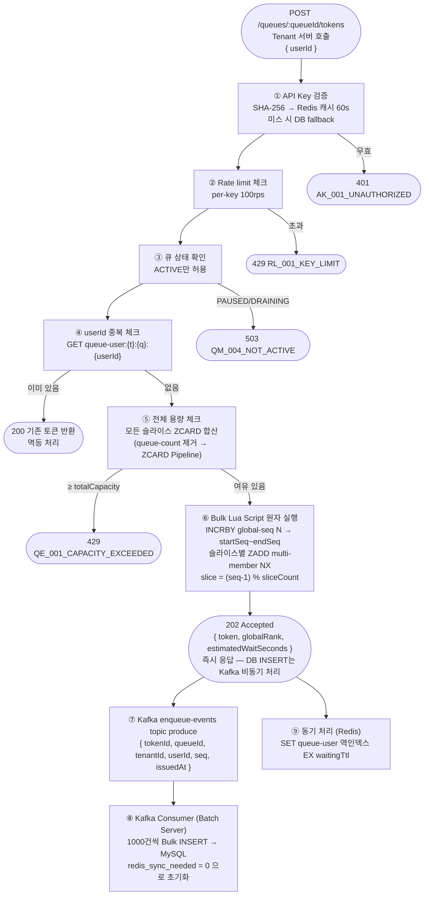
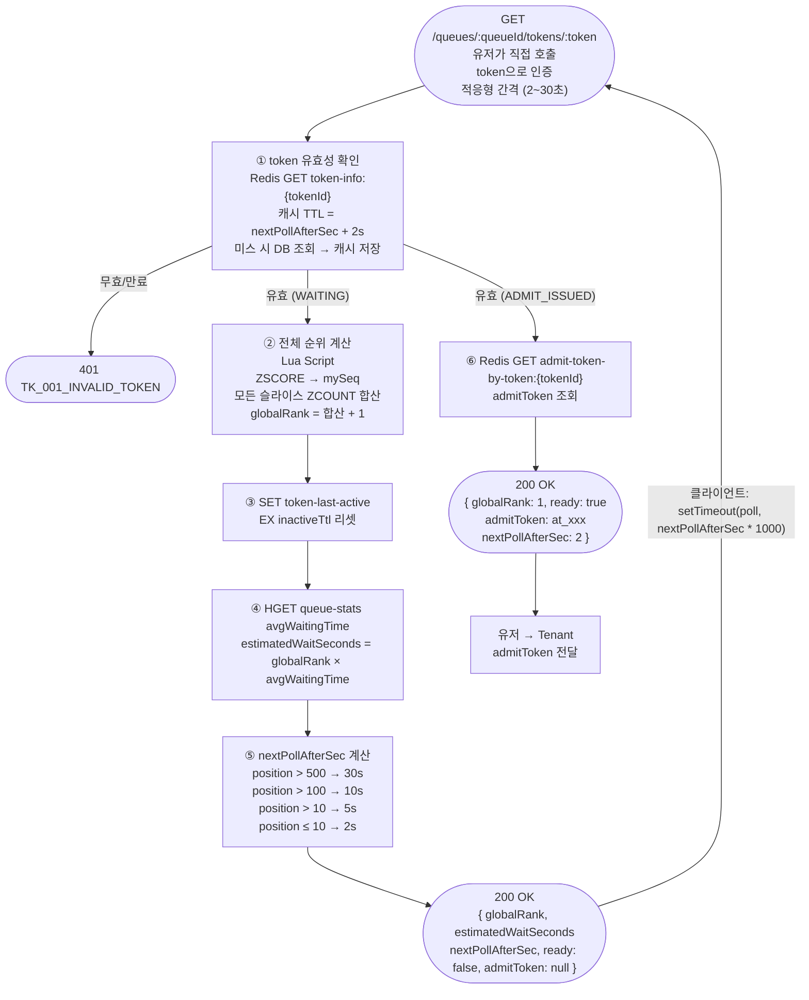
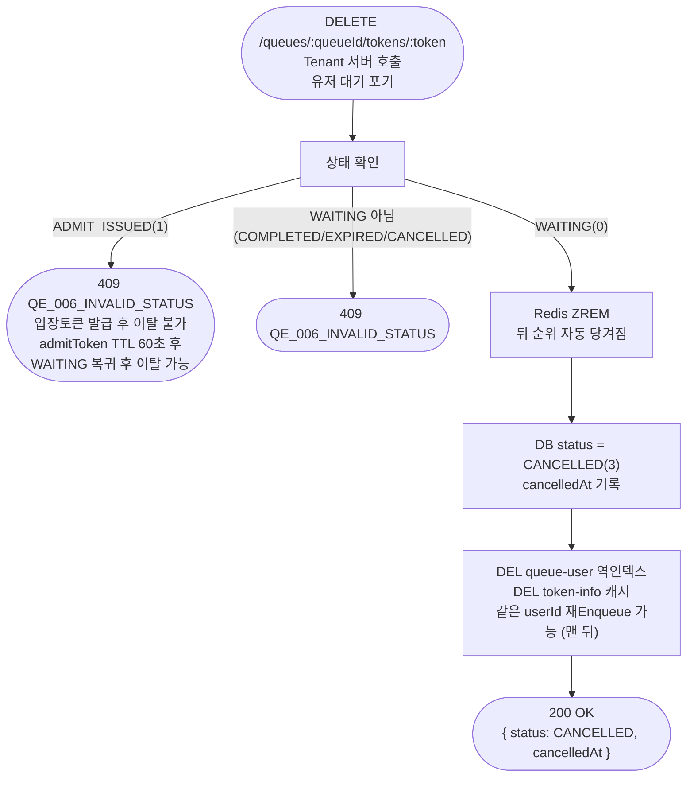
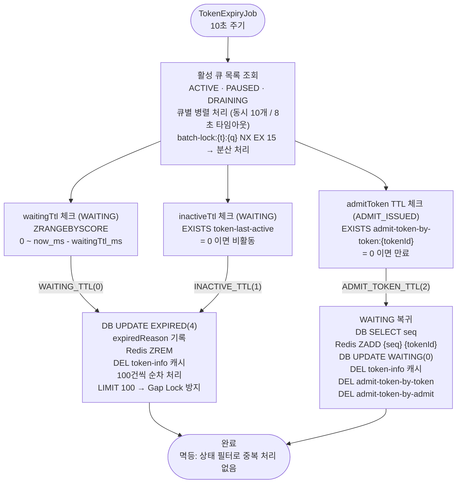
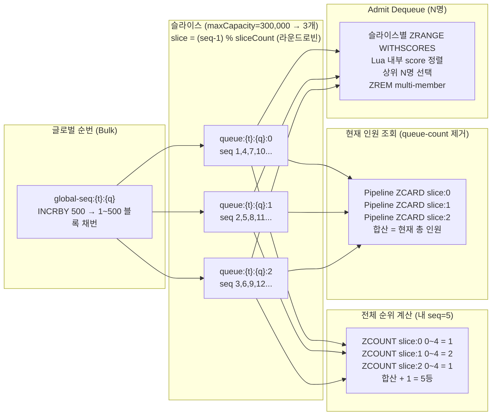
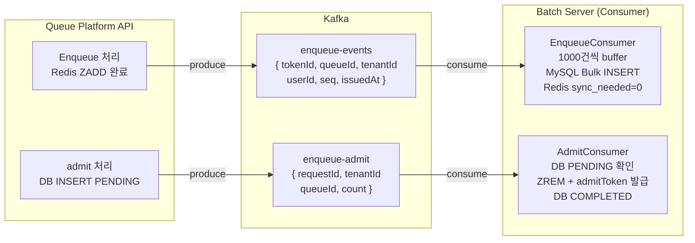
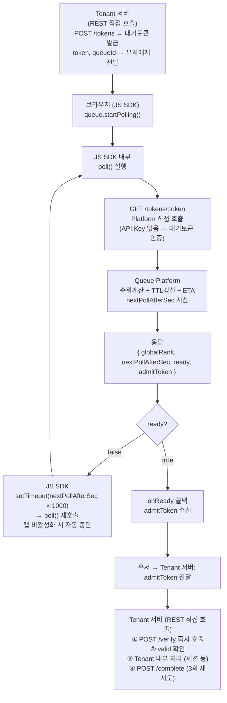
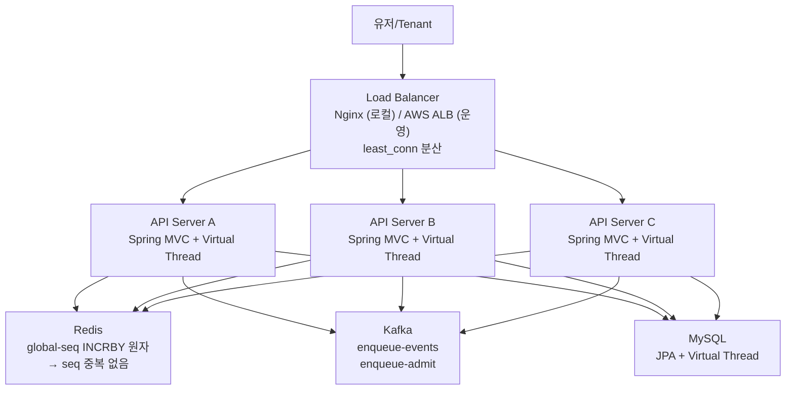

# 🔄 Queue Platform — 상세 흐름도

> FRS v1.10 기준

---

## Enqueue

> **Redis 다운 중 Enqueue 발생 시**
> Redis ZADD 실패 → `redis_sync_needed = 1`로 DB INSERT
> Kafka Consumer가 DB 저장 후 RedisHealthChecker가 복구 감지
> 복구 배치: `redis_sync_needed = 1` 토큰 → Sorted Set 재삽입

---

## Polling (유저 → Platform 직접)

---

## Admit → Verify → Complete

```mermaid
flowchart TD
    SLOT(["Tenant\n슬롯 여유 생김"])
    --> ADMIT["POST /queues/:queueId/admit\n{ count: N, requestId }\nTenant → Platform"]

    ADMIT --> IDEM{"admit-idem:{requestId}\n존재?"}
    IDEM -->|"있음 (중복)"| CACHED(["200 OK\n기존 결과 반환"])
    IDEM -->|"없음"| DBINS["DB admit_requests INSERT\nstatus=PENDING\n← 영속성 기준점"]

    DBINS --> KAFKA["Kafka enqueue-admit topic produce\n{ requestId, tenantId, queueId, count }"]

    KAFKA --> CONSUMER["Kafka Consumer (Admit Worker)\nDB PENDING 확인 → 멱등 체크\nstatus=PROCESSING 업데이트"]

    CONSUMER --> LUA["Lua Script\n슬라이스별 ZRANGE WITHSCORES\nLua 내부 score 정렬\n상위 N명 선택\nZREM multi-member"]
    --> FILTER["DB WAITING 상태 확인\n불일치 즉시 ZREM\n부족 시 최대 3회 추가 추출\n추가 추출 시 전체 재정렬 → FIFO 보장"]
    --> TOKEN["admitToken 발급\nSET admit-token-by-token:{tokenId} EX 60\nSET admit-token-by-admit:{admitToken} EX 60\nDB UPDATE ADMIT_ISSUED (100건씩)\nSET token-info 캐시 갱신\nDB admit_requests status=COMPLETED"]
    --> ARESP(["200 OK\n{ admitTokens: [{userId, admitToken}...] }"])

    ARESP --> POLL["유저 다음 Polling 시\nadmitToken 수신"]
    --> USER["유저 → Tenant\nadmitToken 전달"]
    --> VERIFY["POST /admit-tokens/:admitToken/verify\nTenant → Platform\n유효성 확인만 (상태 변경 없음)"]

    VERIFY --> VK{"admit-token-by-admit:{admitToken}\n유효?"}
    VK -->|"만료 or 무효"| VDB["DB Fallback 시도\nSELECT WHERE admit_token=:admitToken\nAND status=ADMIT_ISSUED\nAND issued_at > NOW()-60s"]
    VDB -->|"없음"| E404(["404 TK_002_INVALID_ADMIT_TOKEN"])
    VDB -->|"있음"| VFLAG["SET verified-token:{tokenId} EX 60\n중복 입장 방지 플래그"]
    VK -->|"유효"| VFLAG
    --> VRESP(["200 OK\n{ valid: true, userId }"])

    VRESP --> ALLOW["Tenant → 유저 입장 허용"]
    --> COMPLETE["POST /tokens/:token/complete\n{ admitToken }\nTenant → Platform\n입장 완료 통보"]

    COMPLETE --> CK{"ADMIT_ISSUED(1)\n상태?"}
    CK -->|"아님"| E409(["409 QE_006_INVALID_STATUS"])
    CK -->|"확인"| DB["DB status = COMPLETED(2)\n← 먼저 (원자성 전략)\nDB UPDATE WHERE status=1 → 1번만 성공"]
    --> ZREM["Redis ZREM\nDEL admit-token-by-token\nDEL admit-token-by-admit\nDEL token-info 캐시\nDEL verified-token\n← 나중"]
    --> AVG["avgWaitingTime 직접 갱신\nwaitingSeconds = completedAt - issuedAt\n이상치 필터: > waitingTtl × 0.8 제외\nHINCRBYFLOAT queue-stats waitingTimeSum\nHINCRBY queue-stats waitingTimeCount"]
    --> COK(["200 OK\n{ status: COMPLETED, completedAt }"])

    DB -->|"ZREM 실패 시"| FIX["Batch 10초 내\nZREM 재실행 (멱등)"]

    TOKEN -->|"admitToken TTL 60초 초과\nBatch 10초 주기 감지"| BACK["WAITING 복귀\nDB SELECT seq\nRedis ZADD {seq} {tokenId}\nDB UPDATE WAITING(0)\nDEL token-info 캐시\nDEL admit-token-by-token\nDEL admit-token-by-admit"]
```

> **Kafka Consumer 장애 시**
> Consumer Offset 미커밋 → 재시작 시 미처리 메시지부터 재처리
> DB admit_requests PENDING 확인으로 멱등성 보장

---

## 이탈 → CANCELLED

---

## TTL 만료 Batch (10초 주기)

---

## 슬라이스 구조 — 전체 순위 보장

---

## Kafka Topic 흐름

---

## 클라이언트 Polling 구조 (JS SDK + REST 직접 호출)

> **역할 분리**
> nextPollAfterSec 계산: Platform 책임
> setTimeout / 탭 비활성화 처리: JS SDK 책임
> UI 업데이트: 클라이언트(Tenant) 책임
> verify 순서 강제 / complete 재시도: Tenant 서버 구현 책임 (OpenAPI 가이드)

---

## Tenant 서버 통신 vs Platform 직접 통신

| 통신 대상 | 시점 | 빈도 | 내용 |
|----------|------|------|------|
| Tenant 서버 | 진입 시 | 1회 | 슬롯 여유 확인, 대기토큰 수신 |
| Tenant 서버 | 입장 시 | 1회 | admitToken 전달, 세션 생성 |
| Tenant 서버 | 이탈 시 | 1회 | 취소 요청 |
| Platform (JS SDK) | 대기 중 | 2~30초마다 반복 | Polling (가장 빈번) |

> Polling이 가장 빈번한 통신인데 JS SDK가 Platform과 직접 처리.
> Tenant 서버는 진입/입장/이탈 3번만 관여 (REST 직접 호출).
> 이것이 "유저가 Platform에 직접 Polling" 원칙의 실제 구현.

---

## 수평 확장 구조

> **순서 보장**: global-seq INCRBY = Redis 싱글스레드 원자 연산
> 서버 여러 대가 동시 호출해도 seq 절대 중복 없음
> Tenant는 Load Balancer 주소만 알면 됨 (내부 서버 수 몰라도 됨)
