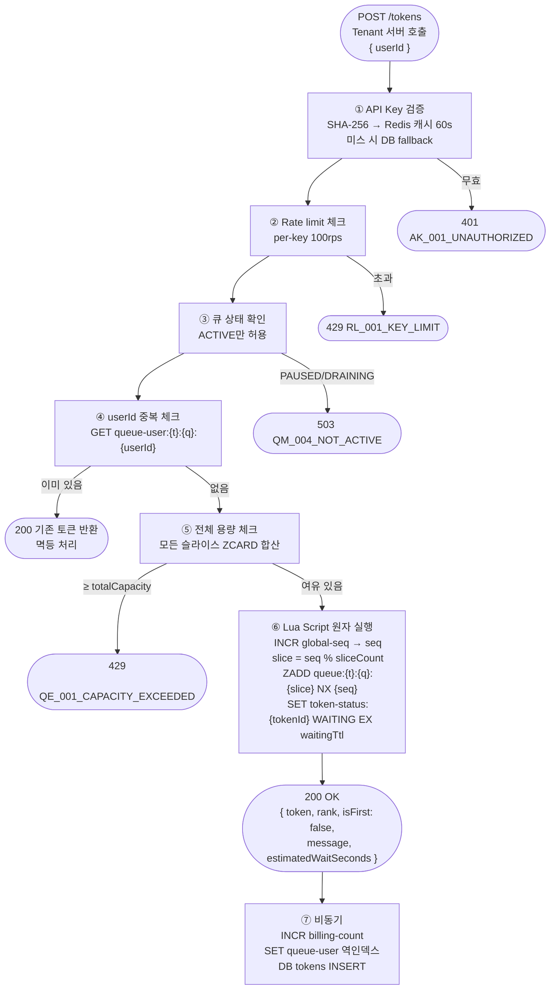
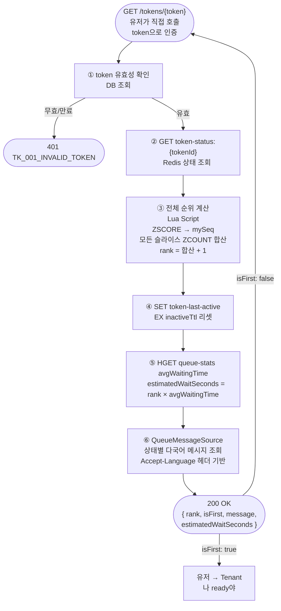
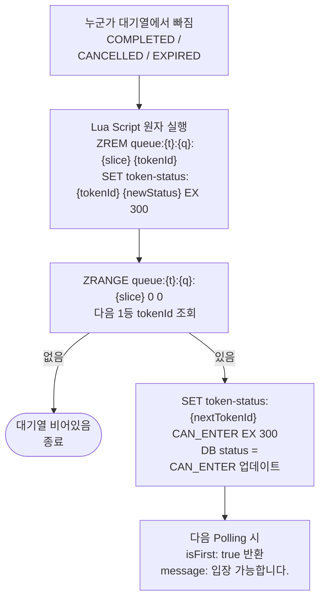
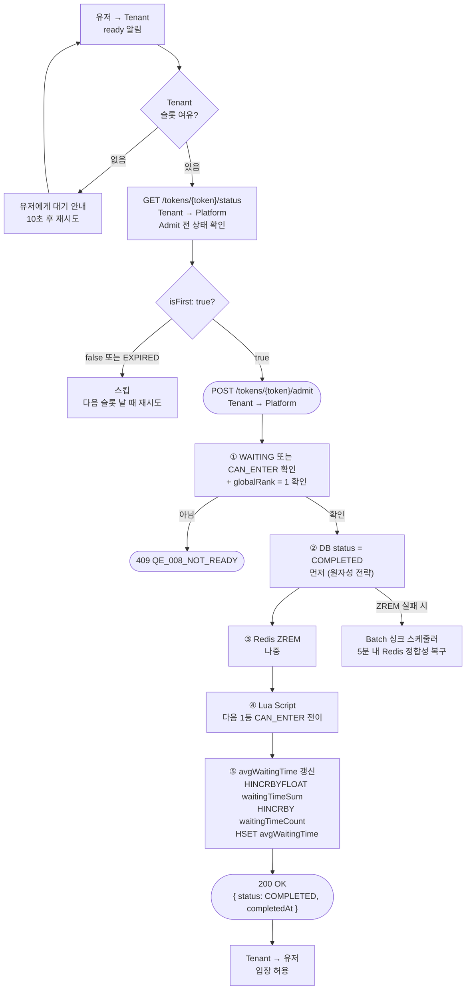
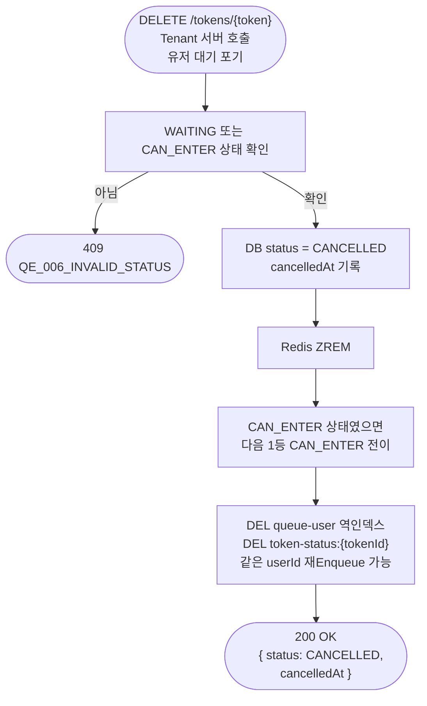
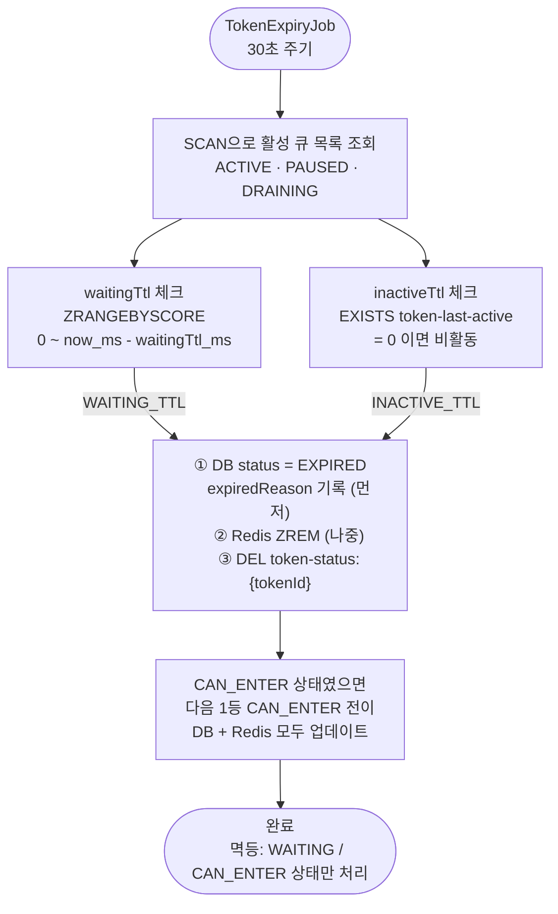
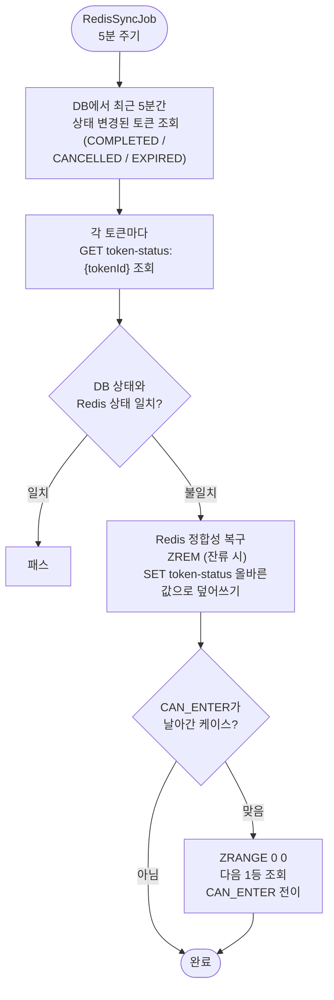
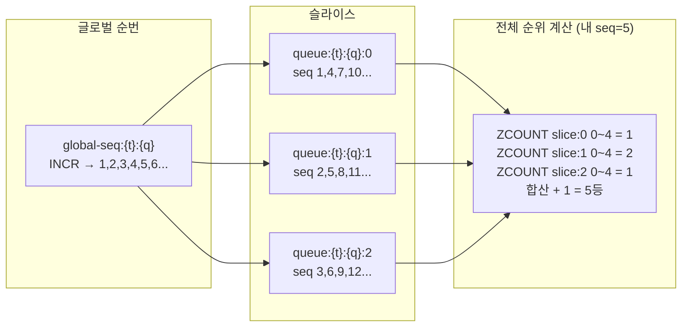

# 🔄 Queue Platform — 상세 흐름도

> FRS v1.5 기준

---

## Enqueue

---

## Polling (유저 → Platform 직접)

> `token-status:{tokenId}` 가 `CAN_ENTER`이면 `isFirst: true` 반환.
> 클라이언트에게 상태값(CAN_ENTER)은 직접 노출하지 않음.

---

## CAN_ENTER 전이 흐름

---

## Status 확인 → Admit

---

## 이탈 → CANCELLED

---

## TTL 만료 Batch

### 스케줄러 1: 만료 처리 (30초 주기)

### 스케줄러 2: Redis 싱크 (5분 주기)

> DB가 Source of Truth. Redis 오류 발생 시 DB 기준으로 복구.
> 처리 순서: DB 먼저 → Redis 나중. Redis 실패 시 싱크 스케줄러가 5분 내 복구.

---

## 슬라이스 구조 — 전체 순위 보장

