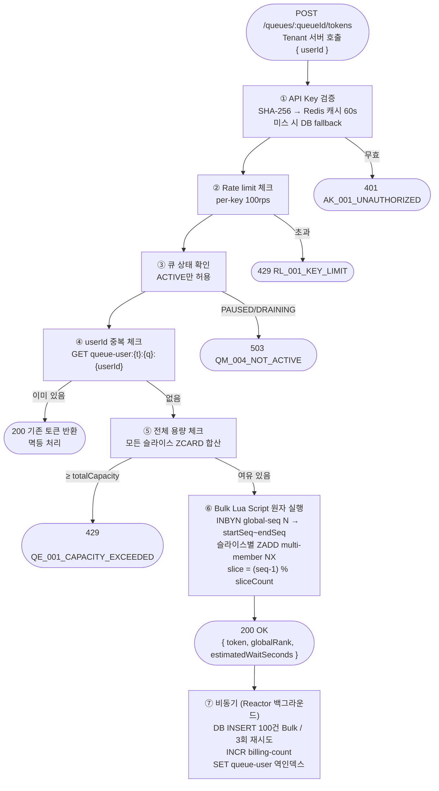
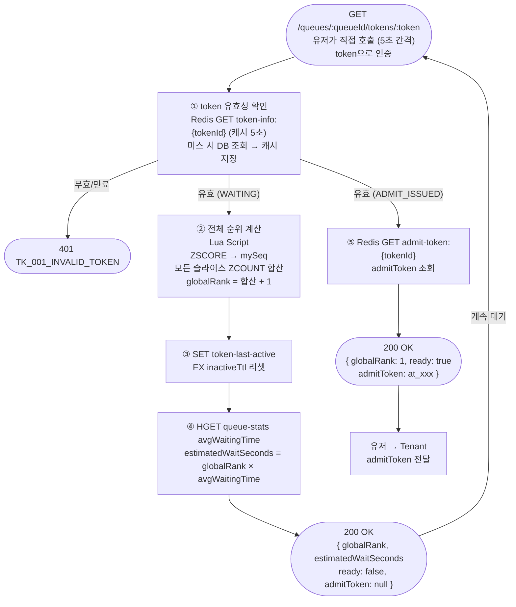
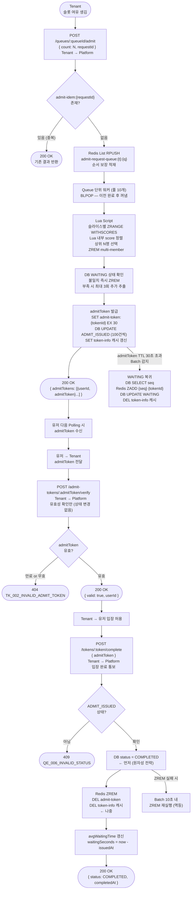
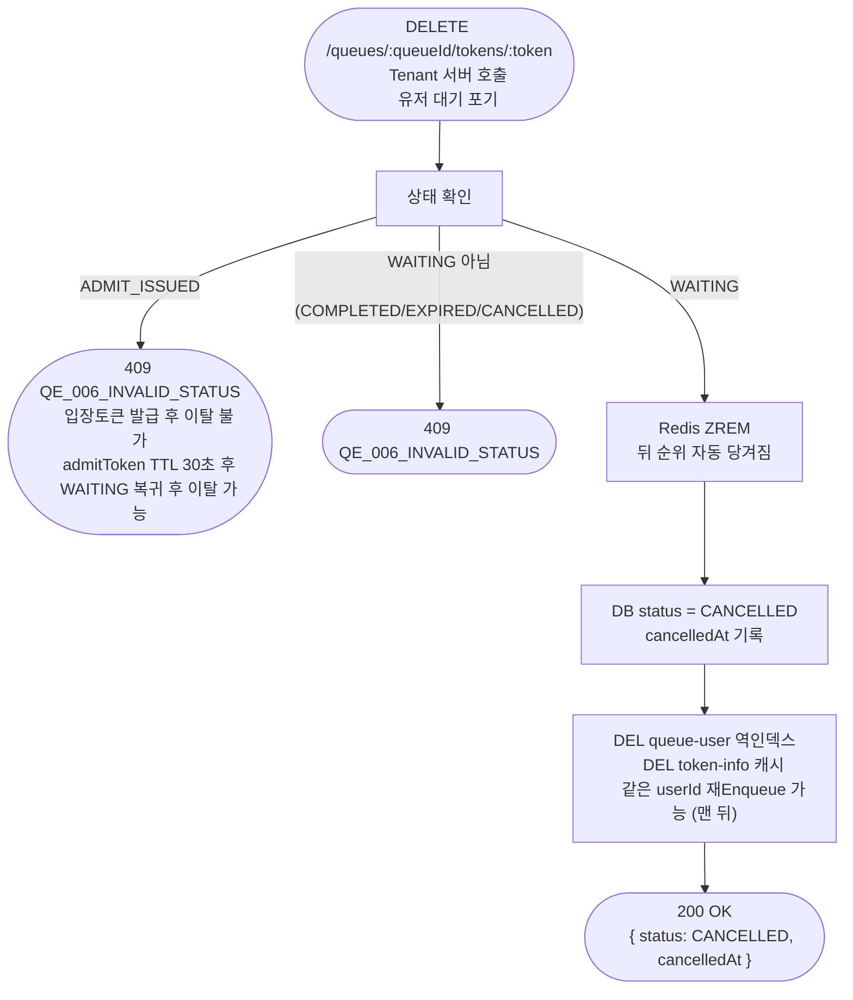
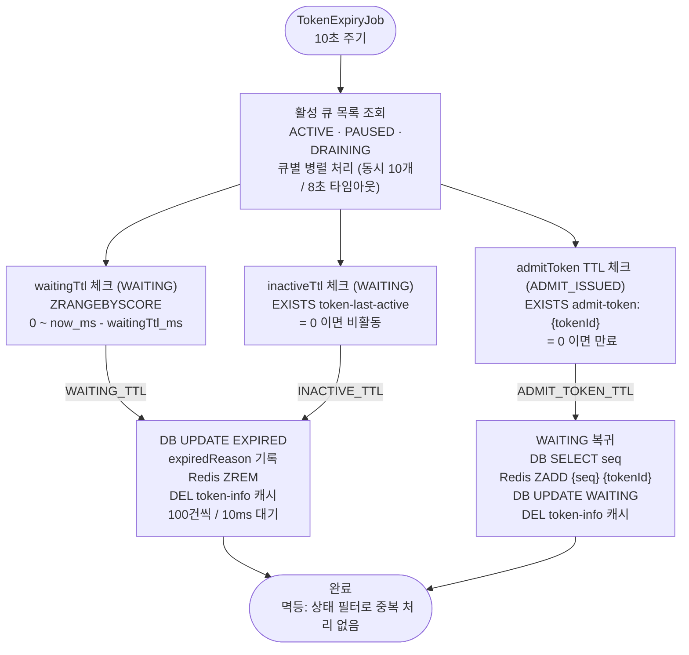
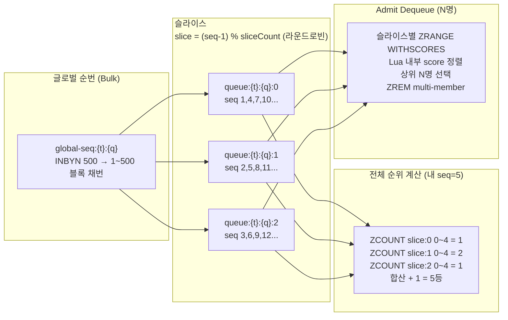

# 🔄 Queue Platform — 상세 흐름도

> FRS v1.6 기준

---

## Enqueue

---

## Polling (유저 → Platform 직접)

---

## Admit → Verify → Complete

---

## 이탈 → CANCELLED

---

## TTL 만료 Batch (10초 주기)

---

## 슬라이스 구조 — 전체 순위 보장

