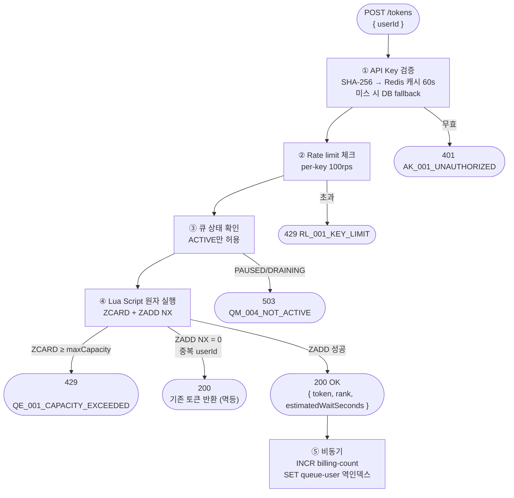
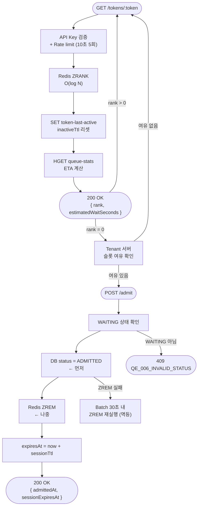
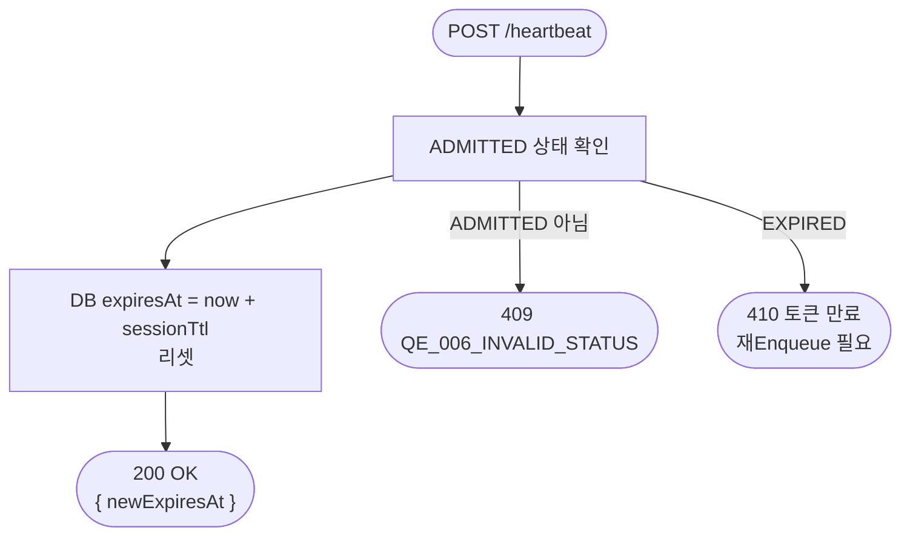
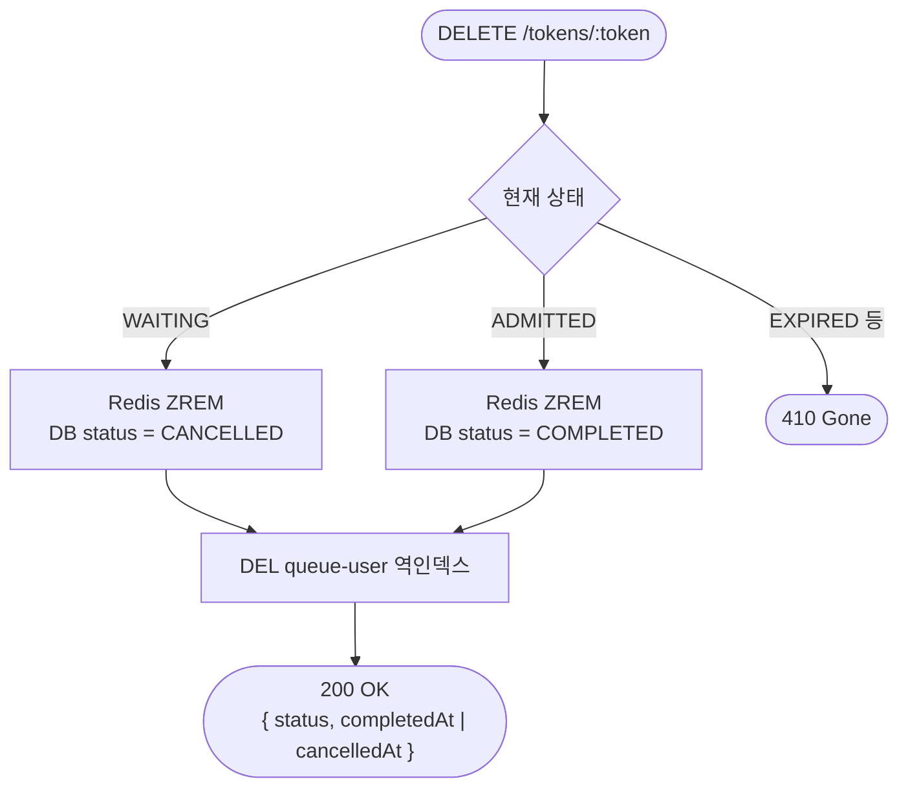
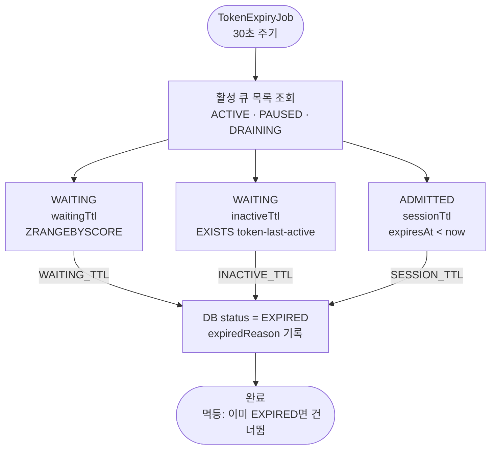

# 🔄 Queue Platform — 상세 흐름도

---

## Enqueue

```mermaid
flowchart TD
    START(["POST /tokens
    { userId }"])
    --> AK["① API Key 검증
    SHA-256 → Redis 캐시 60s
    미스 시 DB fallback"]
    --> RL["② Rate limit 체크
    per-key 100rps"]
    --> QS["③ 큐 상태 확인
    ACTIVE만 허용"]
    --> LUA["④ Lua Script 원자 실행
    ZCARD + ZADD NX"]

    LUA -->|"ZCARD ≥ maxCapacity"| E429(["429
    QE_001_CAPACITY_EXCEEDED"])
    LUA -->|"ZADD NX = 0
    중복 userId"| IDEM(["200
    기존 토큰 반환 (멱등)"])
    LUA -->|"ZADD 성공"| OK(["200 OK
    { token, rank, estimatedWaitSeconds }"])
    OK --> ASYNC["⑤ 비동기
    INCR billing-count
    SET queue-user 역인덱스"]

    AK -->|"무효"| E401(["401 AK_001_UNAUTHORIZED"])
    RL -->|"초과"| E429B(["429 RL_001_KEY_LIMIT"])
    QS -->|"PAUSED/DRAINING"| E503(["503 QM_004_NOT_ACTIVE"])
```

---

## Polling → Admit

```mermaid
flowchart TD
    POLL(["GET /tokens/:token"])
    --> AK2["API Key 검증
    + Rate limit (10초 5회)"]
    --> ZRANK["Redis ZRANK
    O(log N)"]
    --> LA["SET token-last-active
    inactiveTtl 리셋"]
    --> ETA["HGET queue-stats
    ETA 계산"]
    --> RESP(["200 OK
    { rank, estimatedWaitSeconds }"])

    RESP -->|"rank > 0"| POLL
    RESP -->|"rank = 0"| TS["Tenant 서버
    슬롯 여유 확인"]
    TS -->|"여유 없음"| POLL
    TS -->|"여유 있음"| ADM

    ADM(["POST /admit"])
    --> CHK["WAITING 상태 확인"]
    --> DBU["DB status = ADMITTED
    ← 먼저"]
    --> ZRM["Redis ZREM
    ← 나중"]
    --> SES["expiresAt = now + sessionTtl"]
    --> AOK(["200 OK
    { admittedAt, sessionExpiresAt }"])

    CHK -->|"WAITING 아님"| E409(["409 QE_006_INVALID_STATUS"])
    DBU -->|"ZREM 실패"| FIX["Batch 30초 내
    ZREM 재실행 (멱등)"]
```

---

## Heartbeat

```mermaid
flowchart TD
    HB(["POST /heartbeat"])
    --> CHK["ADMITTED 상태 확인"]
    --> UPD["DB expiresAt = now + sessionTtl
    리셋"]
    --> OK(["200 OK
    { newExpiresAt }"])

    CHK -->|"ADMITTED 아님"| E409(["409 QE_006_INVALID_STATUS"])
    CHK -->|"EXPIRED"| E410(["410 토큰 만료
    재Enqueue 필요"])
```

---

## Dequeue

```mermaid
flowchart TD
    DQ(["DELETE /tokens/:token"])
    --> CHK{"현재 상태"}

    CHK -->|"WAITING"| W["Redis ZREM
    DB status = CANCELLED"]
    CHK -->|"ADMITTED"| A["Redis ZREM
    DB status = COMPLETED"]
    CHK -->|"EXPIRED 등"| E410(["410 Gone"])

    W --> DEL["DEL queue-user 역인덱스"]
    A --> DEL
    DEL --> OK(["200 OK
    { status, completedAt | cancelledAt }"])
```

---

## TTL 만료 Batch (30초 주기)

```mermaid
flowchart TD
    JOB(["TokenExpiryJob
    30초 주기"])
    --> ALIST["활성 큐 목록 조회
    ACTIVE · PAUSED · DRAINING"]

    ALIST --> W1 & W2 & W3

    W1["WAITING
    waitingTtl
    ZRANGEBYSCORE"]
    W2["WAITING
    inactiveTtl
    EXISTS token-last-active"]
    W3["ADMITTED
    sessionTtl
    expiresAt < now"]

    W1 -->|"WAITING_TTL"| EXP
    W2 -->|"INACTIVE_TTL"| EXP
    W3 -->|"SESSION_TTL"| EXP

    EXP["DB status = EXPIRED
    expiredReason 기록"]
    --> DONE(["완료
    멱등: 이미 EXPIRED면 건너뜀"])
```
