# 🔄 Queue Platform — 상세 흐름도

> **최종 업데이트**: 2026-07-08 (Sprint 5-D 완료, Sprint 5-E 진입, Cluster 학습 완료 반영)
> **관련 문서**: DECISIONS.md §66-69, queue-domain/docs/ARCHITECTURE_ROADMAP.md, FRS v1.10

---

## Enqueue (Sprint 5-E 하이브리드)

Sprint 5-E에서 확정된 하이브리드 전략을 반영한 최신 흐름.

**핵심**:
- 평상시: 일반 Lua Script (즉시 처리, 1-3ms)
- 피크 시: Bulk Lua Script (배치 처리, 10-30ms)
- 임계값 1000 req/s로 자동 전환 (SlidingWindowCounter)

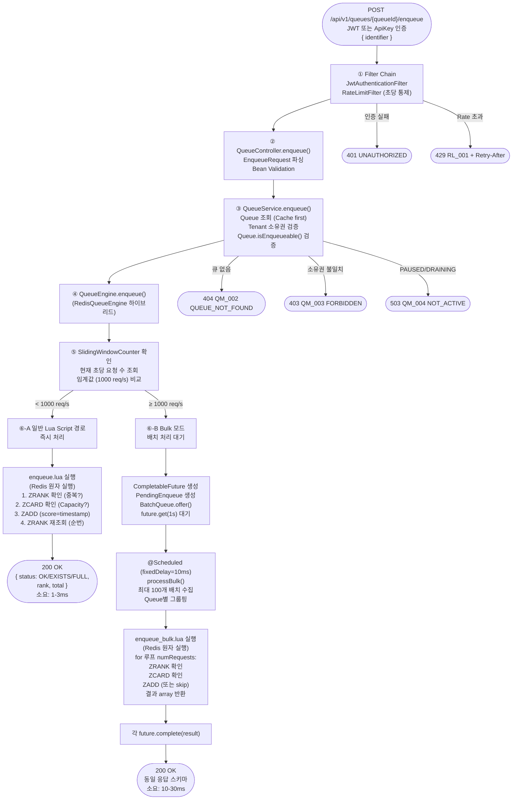
```mermaid
flowchart TD
    START(["POST /api/v1/queues/{queueId}/enqueue\nJWT 또는 ApiKey 인증\n{ identifier }"])
    --> FILTER["① Filter Chain\nJwtAuthenticationFilter\nRateLimitFilter (초당 통제)"]
    --> CTRL["② QueueController.enqueue()\nEnqueueRequest 파싱\nBean Validation"]
    --> SERV["③ QueueService.enqueue()\nQueue 조회 (Cache first)\nTenant 소유권 검증\nQueue.isEnqueueable() 검증"]
    --> ENG["④ QueueEngine.enqueue()\n(RedisQueueEngine 하이브리드)"]
    --> COUNT["⑤ SlidingWindowCounter 확인\n현재 초당 요청 수 조회\n임계값 (1000 req/s) 비교"]

    COUNT -->|"< 1000 req/s"| NORMAL["⑥-A 일반 Lua Script 경로\n즉시 처리"]
    COUNT -->|"≥ 1000 req/s"| BULK["⑥-B Bulk 모드\n배치 처리 대기"]

    NORMAL --> LUA["enqueue.lua 실행\n(Redis 원자 실행)\n1. ZRANK 확인 (중복?)\n2. ZCARD 확인 (Capacity?)\n3. ZADD (score=timestamp)\n4. ZRANK 재조회 (순번)"]
    LUA --> OK1(["200 OK\n{ status: OK/EXISTS/FULL,\n  rank, total }\n소요: 1-3ms"])

    BULK --> FUTURE["CompletableFuture 생성\nPendingEnqueue 생성\nBatchQueue.offer()\nfuture.get(1s) 대기"]
    FUTURE --> SCHED["@Scheduled (fixedDelay=10ms)\nprocessBulk()\n최대 100개 배치 수집\nQueue별 그룹핑"]
    SCHED --> BULKLUA["enqueue_bulk.lua 실행\n(Redis 원자 실행)\nfor 루프 numRequests:\n  ZRANK 확인\n  ZCARD 확인\n  ZADD (또는 skip)\n결과 array 반환"]
    BULKLUA --> COMPLETE["각 future.complete(result)"]
    COMPLETE --> OK2(["200 OK\n동일 응답 스키마\n소요: 10-30ms"])

    FILTER -->|"인증 실패"| E401(["401 UNAUTHORIZED"])
    FILTER -->|"Rate 초과"| E429(["429 RL_001 + Retry-After"])
    SERV -->|"큐 없음"| E404(["404 QM_002 QUEUE_NOT_FOUND"])
    SERV -->|"소유권 불일치"| E403(["403 QM_003 FORBIDDEN"])
    SERV -->|"PAUSED/DRAINING"| E503(["503 QM_004 NOT_ACTIVE"])
```

### Enqueue 하이브리드 결정 근거

**8가지 확정 결정** (DECISIONS §66-69, ARCHITECTURE_ROADMAP 부록 A):
- D1: 자유 identifier (Tenant 제공, UUID/이메일/고객번호 등)
- D2: ZSet 하나 (`queue:{queueId}:waiting`)
- D3: ZRANK + ZCARD (별도 counter 없음)
- D4: Java (부하 측정) + Lua (원자 처리) 분리
- D5: Lua ZRANK 중복 방지
- D6: Lua ZCARD Capacity 검증
- D7: enqueue.lua + enqueue_bulk.lua 2개
- D8: 임계값 1000 req/s, 배치 100, 간격 10ms, 타임아웃 1s

### Cluster 환경에서 (Sprint 10+ 반영)

Sprint 10 이후 Redis Cluster 도입 시:
- Lettuce가 `queue:{queueId}:waiting` key의 CRC16으로 자동 slot 계산
- 해당 slot 담당 Master로 자동 라우팅
- Lua Script 단일 key만 사용 → CROSSSLOT 이슈 없음
- 이중 라우팅 (Sprint 12+): `queue:{shard_X}:{queueId}:waiting` 형식

### Kafka 도입 후 (Sprint 11+ 계획)

Sprint 11-12에서 Kafka 도입 시 흐름 변경:
- Enqueue 완료 후 Kafka `enqueue-events` 토픽 발행
- Consumer가 DB INSERT (Bulk, 1000건씩)
- Redis 다운 시 `redis_sync_needed=1` DB INSERT
- 복구 시 배치가 Sorted Set 재삽입

---

## Polling (유저 → Platform 직접, Jitter 적용)

Sprint 5-E 이후 Polling 부하 최적화:
- **Jitter 적용** (JS SDK): 요청 시점 무작위 분산 (4-6초 랜덤)
- **Caffeine 캐싱** (Sprint 9+): 서버 측 rank 조회 캐시 (TTL 1-2초)
- **SSE 미도입** (본인 확정): Polling 방식 유지, 인프라 무변경

### 부하 감소 효과

일반 Polling vs Jitter Polling:
- 100만명 × 5초 = 초당 200,000 요청 (평균 동일)
- 일반 Polling: 스파이크 t=0, 5000, 10000ms (초당 500,000 피크)
- Jitter Polling: 4000-6000ms 균등 분산 (초당 200,000 안정)
- **피크 부하 40-50% 감소**

Caffeine 캐싱 조합 시:
- Rank 조회 80% 캐시 HIT (rank 변화 낮음)
- Redis 실제 요청 20%로 감소
- 초당 40,000 요청만 Redis 도달

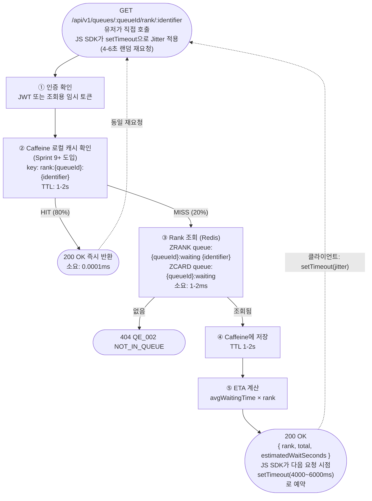
```mermaid
flowchart TD
    POLL(["GET /api/v1/queues/:queueId/rank/:identifier\n유저가 직접 호출\nJS SDK가 setTimeout으로 Jitter 적용\n(4-6초 랜덤 재요청)"])
    --> AUTH["① 인증 확인\nJWT 또는 조회용 임시 토큰"]
    --> CACHE["② Caffeine 로컬 캐시 확인\n(Sprint 9+ 도입)\nkey: rank:{queueId}:{identifier}\nTTL: 1-2s"]

    CACHE -->|"HIT (80%)"| RESPCACHE(["200 OK 즉시 반환\n소요: 0.0001ms"])
    CACHE -->|"MISS (20%)"| RANK["③ Rank 조회 (Redis)\nZRANK queue:{queueId}:waiting {identifier}\nZCARD queue:{queueId}:waiting\n소요: 1-2ms"]

    RANK -->|"없음"| E404(["404 QE_002 NOT_IN_QUEUE"])
    RANK -->|"조회됨"| CACHESET["④ Caffeine에 저장\nTTL 1-2s"]
    CACHESET --> ETA["⑤ ETA 계산\navgWaitingTime × rank"]
    --> RESP(["200 OK\n{ rank, total, estimatedWaitSeconds }\nJS SDK가 다음 요청 시점\nsetTimeout(4000~6000ms)로 예약"])

    RESP -.->|"클라이언트: setTimeout(jitter)"| POLL
    RESPCACHE -.->|"동일 재요청"| POLL
```

### 미래 확장 - Rank Query 전용 서비스 (Sprint 9+)

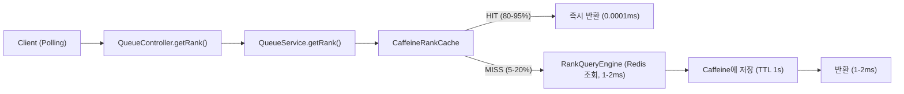
```mermaid
flowchart LR
    Client["Client (Polling)"]
    --> Ctrl["QueueController.getRank()"]
    --> Svc["QueueService.getRank()"]
    --> Cache["CaffeineRankCache"]
    Cache -->|"HIT (80-95%)"| Return1["즉시 반환 (0.0001ms)"]
    Cache -->|"MISS (5-20%)"| Engine["RankQueryEngine (Redis 조회, 1-2ms)"]
    Engine --> Cache2["Caffeine에 저장 (TTL 1s)"]
    Cache2 --> Return2["반환 (1-2ms)"]
```

---

## Admit → Verify → Complete


```mermaid
flowchart TD
    SLOT(["Tenant\n슬롯 여유 생김"])
    --> ADMIT["POST /queues/:queueId/admit\n{ count: N, requestId }\nTenant → Platform"]

    ADMIT --> IDEM{"admit-idem:{requestId}\n존재?"}
    IDEM -->|"있음 (중복)"| CACHED(["200 OK\n기존 결과 반환"])
    IDEM -->|"없음"| DBINS["DB admit_requests INSERT\nstatus=PENDING\n← 영속성 기준점"]

    DBINS --> KAFKA["Kafka enqueue-admit topic produce\n{ requestId, tenantId, queueId, count }"]

    KAFKA --> CONSUMER["Kafka Consumer (Admit Worker)\nDB PENDING 확인 → 멱등 체크\nstatus=PROCESSING 업데이트"]

    CONSUMER --> LUA["Lua Script\n슬라이스별 ZRANGE WITHSCORES\nLua 내부 score 정렬\n상위 N명 선택\nZREM multi-member"]
    --> FILTER["DB WAITING 상태 확인\n불일치 즉시 ZREM\n부족 시 최대 3회 추가 추출\n추가 추출 시 전체 재정렬 → FIFO 보장"]
    --> TOKEN["admitToken 발급\nSET admit-token-by-token:{tokenId} EX 60\nSET admit-token-by-admit:{admitToken} EX 60\nDB UPDATE ADMIT_ISSUED (100건씩)\nSET token-info 캐시 갱신\nDB admit_requests status=COMPLETED"]
    --> ARESP(["200 OK\n{ admitTokens: [{userId, admitToken}...] }"])

    ARESP --> POLL["유저 다음 Polling 시\nadmitToken 수신"]
    --> USER["유저 → Tenant\nadmitToken 전달"]
    --> VERIFY["POST /admit-tokens/:admitToken/verify\nTenant → Platform\n유효성 확인만 (상태 변경 없음)"]

    VERIFY --> VK{"admit-token-by-admit:{admitToken}\n유효?"}
    VK -->|"만료 or 무효"| VDB["DB Fallback 시도\nSELECT WHERE admit_token=:admitToken\nAND status=ADMIT_ISSUED\nAND issued_at > NOW()-60s"]
    VDB -->|"없음"| E404(["404 TK_002_INVALID_ADMIT_TOKEN"])
    VDB -->|"있음"| VFLAG["SET verified-token:{tokenId} EX 60\n중복 입장 방지 플래그"]
    VK -->|"유효"| VFLAG
    --> VRESP(["200 OK\n{ valid: true, userId }"])

    VRESP --> ALLOW["Tenant → 유저 입장 허용"]
    --> COMPLETE["POST /tokens/:token/complete\n{ admitToken }\nTenant → Platform\n입장 완료 통보"]

    COMPLETE --> CK{"ADMIT_ISSUED(1)\n상태?"}
    CK -->|"아님"| E409(["409 QE_006_INVALID_STATUS"])
    CK -->|"확인"| DB["DB status = COMPLETED(2)\n← 먼저 (원자성 전략)\nDB UPDATE WHERE status=1 → 1번만 성공"]
    --> ZREM["Redis ZREM\nDEL admit-token-by-token\nDEL admit-token-by-admit\nDEL token-info 캐시\nDEL verified-token\n← 나중"]
    --> AVG["avgWaitingTime 직접 갱신\nwaitingSeconds = completedAt - issuedAt\n이상치 필터: > waitingTtl × 0.8 제외\nHINCRBYFLOAT queue-stats waitingTimeSum\nHINCRBY queue-stats waitingTimeCount"]
    --> COK(["200 OK\n{ status: COMPLETED, completedAt }"])

    DB -->|"ZREM 실패 시"| FIX["Batch 10초 내\nZREM 재실행 (멱등)"]

    TOKEN -->|"admitToken TTL 60초 초과\nBatch 10초 주기 감지"| BACK["WAITING 복귀\nDB SELECT seq\nRedis ZADD {seq} {tokenId}\nDB UPDATE WAITING(0)\nDEL token-info 캐시\nDEL admit-token-by-token\nDEL admit-token-by-admit"]
```

> **Kafka Consumer 장애 시**
> Consumer Offset 미커밋 → 재시작 시 미처리 메시지부터 재처리
> DB admit_requests PENDING 확인으로 멱등성 보장

---

## 이탈 → CANCELLED

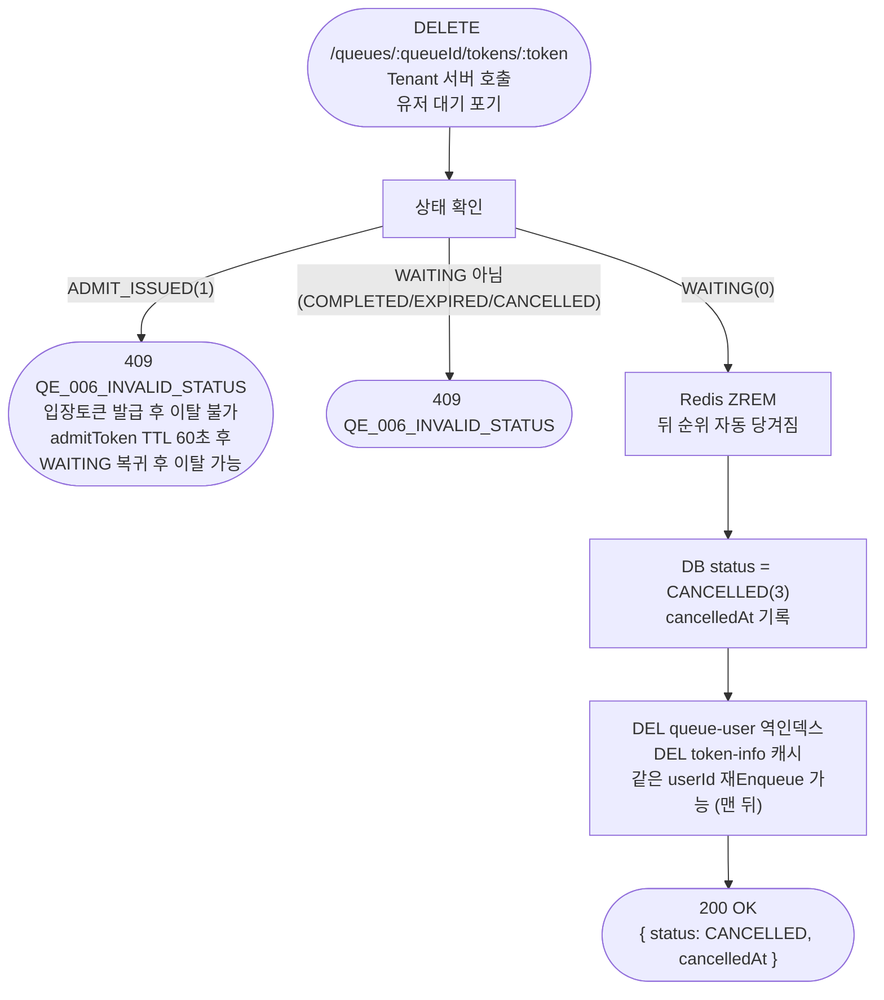
```mermaid
flowchart TD
    DQ(["DELETE /queues/:queueId/tokens/:token\nTenant 서버 호출\n유저 대기 포기"])
    --> CHK["상태 확인"]

    CHK -->|"ADMIT_ISSUED(1)"| E409A(["409 QE_006_INVALID_STATUS\n입장토큰 발급 후 이탈 불가\nadmitToken TTL 60초 후\nWAITING 복귀 후 이탈 가능"])
    CHK -->|"WAITING 아님\n(COMPLETED/EXPIRED/CANCELLED)"| E409B(["409 QE_006_INVALID_STATUS"])
    CHK -->|"WAITING(0)"| ZREM["Redis ZREM\n뒤 순위 자동 당겨짐"]
    --> DB["DB status = CANCELLED(3)\ncancelledAt 기록"]
    --> DEL["DEL queue-user 역인덱스\nDEL token-info 캐시\n같은 userId 재Enqueue 가능 (맨 뒤)"]
    --> OK(["200 OK\n{ status: CANCELLED, cancelledAt }"])
```

---

## TTL 만료 Batch (10초 주기)

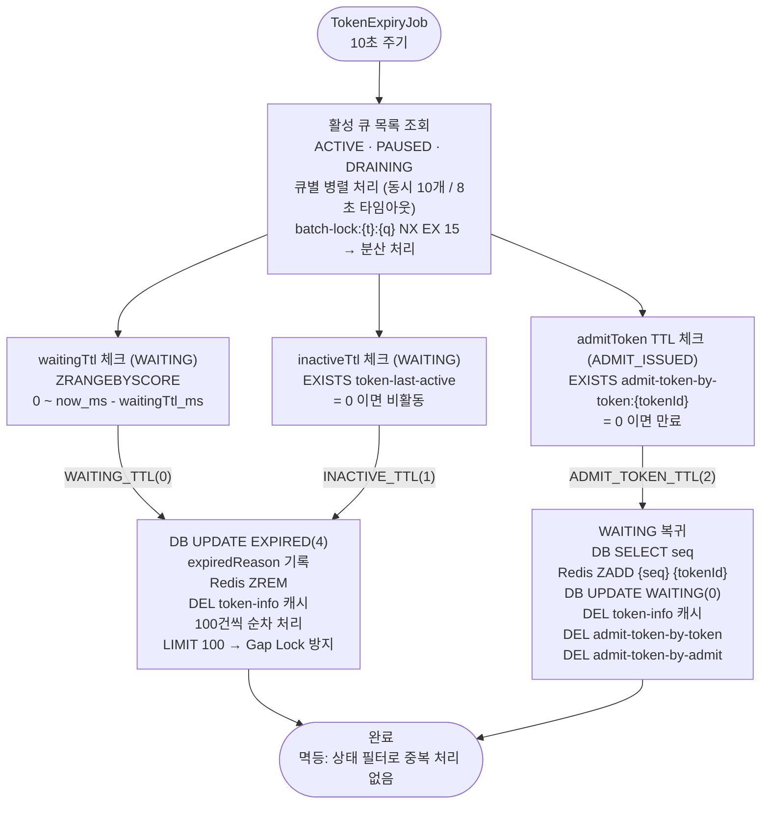
```mermaid
flowchart TD
    JOB(["TokenExpiryJob\n10초 주기"])
    --> ALIST["활성 큐 목록 조회\nACTIVE · PAUSED · DRAINING\n큐별 병렬 처리 (동시 10개 / 8초 타임아웃)\nbatch-lock:{t}:{q} NX EX 15 → 분산 처리"]

    ALIST --> W1 & W2 & W3

    W1["waitingTtl 체크 (WAITING)\nZRANGEBYSCORE\n0 ~ now_ms - waitingTtl_ms"]
    W2["inactiveTtl 체크 (WAITING)\nEXISTS token-last-active\n= 0 이면 비활동"]
    W3["admitToken TTL 체크 (ADMIT_ISSUED)\nEXISTS admit-token-by-token:{tokenId}\n= 0 이면 만료"]

    W1 -->|"WAITING_TTL(0)"| EXP["DB UPDATE EXPIRED(4)\nexpiredReason 기록\nRedis ZREM\nDEL token-info 캐시\n100건씩 순차 처리\nLIMIT 100 → Gap Lock 방지"]
    W2 -->|"INACTIVE_TTL(1)"| EXP

    W3 -->|"ADMIT_TOKEN_TTL(2)"| BACK["WAITING 복귀\nDB SELECT seq\nRedis ZADD {seq} {tokenId}\nDB UPDATE WAITING(0)\nDEL token-info 캐시\nDEL admit-token-by-token\nDEL admit-token-by-admit"]

    EXP --> DONE(["완료\n멱등: 상태 필터로 중복 처리 없음"])
    BACK --> DONE
```

---

## 슬라이스 구조 — 전체 순위 보장

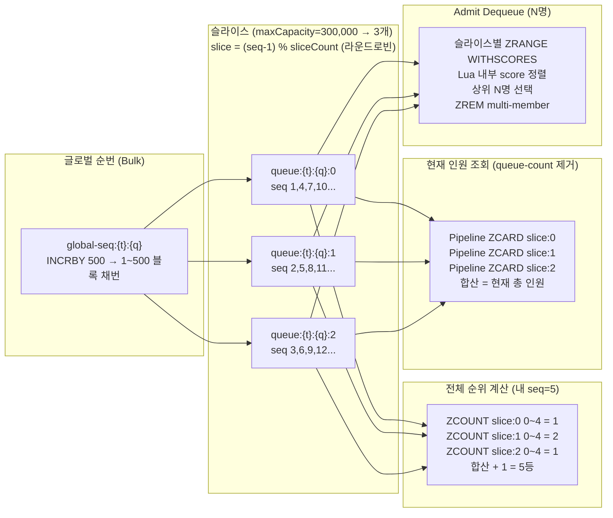
```mermaid
flowchart LR
    subgraph GLOBAL["글로벌 순번 (Bulk)"]
        SEQ["global-seq:{t}:{q}\nINCRBY 500 → 1~500 블록 채번"]
    end

    subgraph SLICES["슬라이스 (maxCapacity=300,000 → 3개)\nslice = (seq-1) % sliceCount (라운드로빈)"]
        S0["queue:{t}:{q}:0\nseq 1,4,7,10..."]
        S1["queue:{t}:{q}:1\nseq 2,5,8,11..."]
        S2["queue:{t}:{q}:2\nseq 3,6,9,12..."]
    end

    subgraph RANK["전체 순위 계산 (내 seq=5)"]
        R["ZCOUNT slice:0 0~4 = 1\nZCOUNT slice:1 0~4 = 2\nZCOUNT slice:2 0~4 = 1\n합산 + 1 = 5등"]
    end

    subgraph COUNT["현재 인원 조회 (queue-count 제거)"]
        C["Pipeline ZCARD slice:0\nPipeline ZCARD slice:1\nPipeline ZCARD slice:2\n합산 = 현재 총 인원"]
    end

    subgraph DEQUEUE["Admit Dequeue (N명)"]
        D["슬라이스별 ZRANGE WITHSCORES\nLua 내부 score 정렬\n상위 N명 선택\nZREM multi-member"]
    end

    SEQ --> S0
    SEQ --> S1
    SEQ --> S2
    S0 --> R
    S1 --> R
    S2 --> R
    S0 --> C
    S1 --> C
    S2 --> C
    S0 --> D
    S1 --> D
    S2 --> D
```

---

## Kafka Topic 흐름

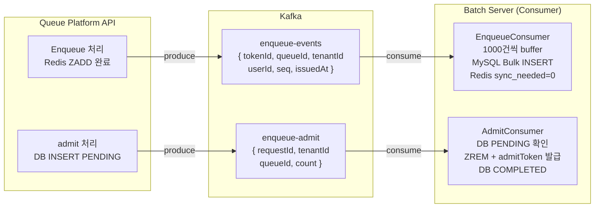
```mermaid
flowchart LR
    subgraph API["Queue Platform API"]
        E1["Enqueue 처리\nRedis ZADD 완료"]
        E2["admit 처리\nDB INSERT PENDING"]
    end

    subgraph TOPICS["Kafka"]
        T1["enqueue-events\n{ tokenId, queueId, tenantId\nuserId, seq, issuedAt }"]
        T2["enqueue-admit\n{ requestId, tenantId\nqueueId, count }"]
    end

    subgraph BATCH["Batch Server (Consumer)"]
        C1["EnqueueConsumer\n1000건씩 buffer\nMySQL Bulk INSERT\nRedis sync_needed=0"]
        C2["AdmitConsumer\nDB PENDING 확인\nZREM + admitToken 발급\nDB COMPLETED"]
    end

    E1 -->|"produce"| T1
    E2 -->|"produce"| T2
    T1 -->|"consume"| C1
    T2 -->|"consume"| C2
```

---

## 클라이언트 Polling 구조 (JS SDK)

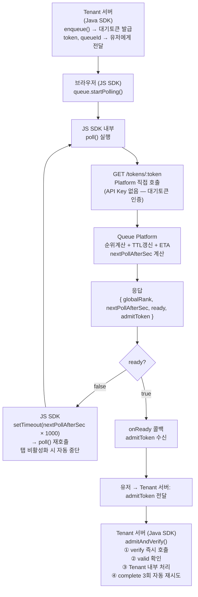
```mermaid
flowchart TD
    TENANT["Tenant 서버\n(Java SDK)\nenqueue() → 대기토큰 발급\ntoken, queueId → 유저에게 전달"]
    --> CLIENT["브라우저 (JS SDK)\nqueue.startPolling()"]

    CLIENT --> POLL["JS SDK 내부\npoll() 실행"]
    --> REQ["GET /tokens/:token\nPlatform 직접 호출\n(API Key 없음 — 대기토큰 인증)"]
    --> PLATFORM["Queue Platform\n순위계산 + TTL갱신 + ETA\nnextPollAfterSec 계산"]
    --> RESP["응답\n{ globalRank, nextPollAfterSec, ready, admitToken }"]

    RESP --> READY{"ready?"}
    READY -->|"false"| TIMER["JS SDK\nsetTimeout(nextPollAfterSec × 1000)\n→ poll() 재호출\n탭 비활성화 시 자동 중단"]
    TIMER --> POLL

    READY -->|"true"| CB["onReady 콜백\nadmitToken 수신"]
    --> SEND["유저 → Tenant 서버: admitToken 전달"]
    --> JAVA["Tenant 서버 (Java SDK)\nadmitAndVerify()\n① verify 즉시 호출\n② valid 확인\n③ Tenant 내부 처리\n④ complete 3회 자동 재시도"]
```

> **역할 분리**
> nextPollAfterSec 계산: Platform 책임
> setTimeout / 탭 비활성화 처리: JS SDK 책임
> UI 업데이트: 클라이언트(Tenant) 책임
> verify 순서 강제 / complete 재시도: Java SDK 책임

---

## Tenant 서버 통신 vs Platform 직접 통신

| 통신 대상 | 시점 | 빈도 | 내용 |
|----------|------|------|------|
| Tenant 서버 | 진입 시 | 1회 | 슬롯 여유 확인, 대기토큰 수신 |
| Tenant 서버 | 입장 시 | 1회 | admitToken 전달, 세션 생성 |
| Tenant 서버 | 이탈 시 | 1회 | 취소 요청 |
| Platform (JS SDK) | 대기 중 | 2~30초마다 반복 | Polling (가장 빈번) |

> Polling이 가장 빈번한 통신인데 JS SDK가 Platform과 직접 처리.
> Tenant 서버는 진입/입장/이탈 3번만 관여.
> 이것이 "유저가 Platform에 직접 Polling" 원칙의 실제 구현.

---

## 수평 확장 구조

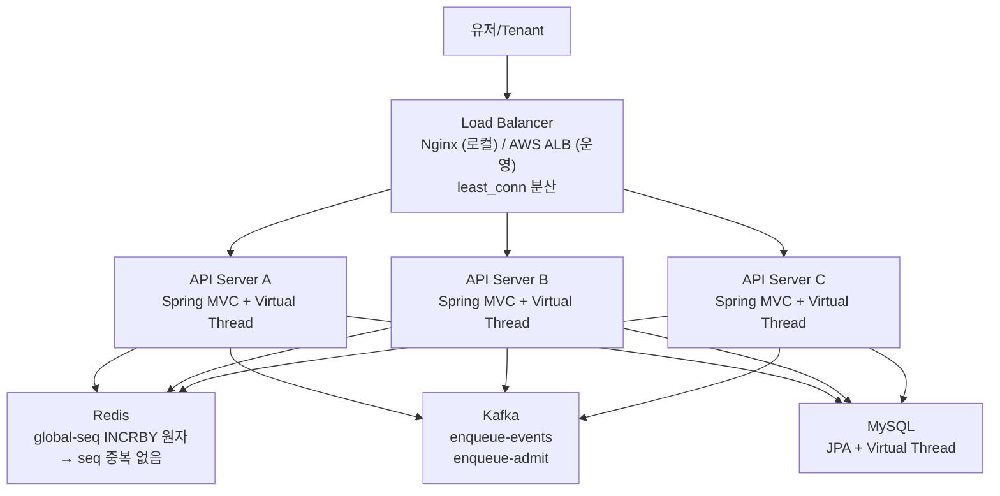
```mermaid
flowchart TD
    USER["유저/Tenant"]
    --> LB["Load Balancer\nNginx (로컬) / AWS ALB (운영)\nleast_conn 분산"]

    LB --> A["API Server A\nSpring MVC + Virtual Thread"]
    LB --> B["API Server B\nSpring MVC + Virtual Thread"]
    LB --> C["API Server C\nSpring MVC + Virtual Thread"]

    A & B & C --> REDIS["Redis\nglobal-seq INCRBY 원자\n→ seq 중복 없음"]
    A & B & C --> KAFKA["Kafka\nenqueue-events\nenqueue-admit"]
    A & B & C --> MYSQL["MySQL\nJPA + Virtual Thread"]
```

> **순서 보장**: global-seq INCRBY = Redis 싱글스레드 원자 연산
> 서버 여러 대가 동시 호출해도 seq 절대 중복 없음
> Tenant는 Load Balancer 주소만 알면 됨 (내부 서버 수 몰라도 됨)

---

## Cluster 라우팅 흐름 (Sprint 10+ 반영)

Sprint 10 이후 Redis Cluster 도입 시의 Enqueue 라우팅 상세.

### Sprint 10 - 단일 Cluster (자동 slot 분배)

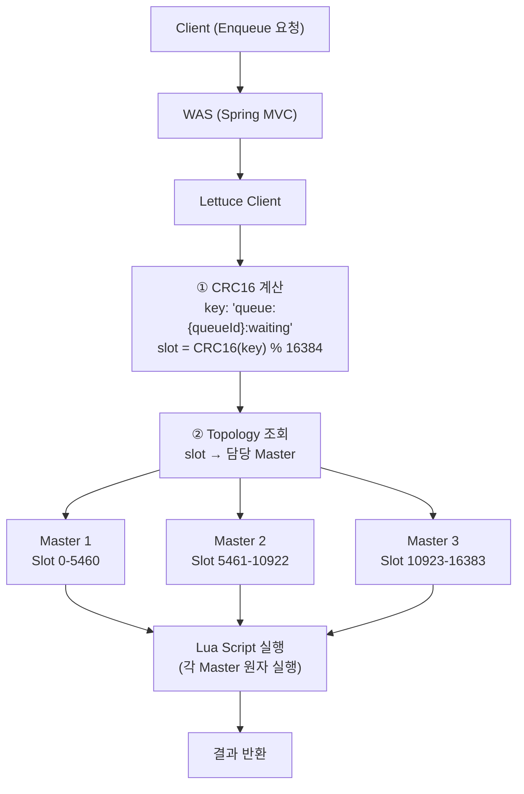
```mermaid
flowchart TD
    Client["Client (Enqueue 요청)"]
    --> WAS["WAS (Spring MVC)"]
    --> Lettuce["Lettuce Client"]

    Lettuce --> CRC["① CRC16 계산\nkey: 'queue:{queueId}:waiting'\nslot = CRC16(key) % 16384"]

    CRC --> Route["② Topology 조회\nslot → 담당 Master"]

    Route --> M1["Master 1\nSlot 0-5460"]
    Route --> M2["Master 2\nSlot 5461-10922"]
    Route --> M3["Master 3\nSlot 10923-16383"]

    M1 & M2 & M3 --> Lua["Lua Script 실행\n(각 Master 원자 실행)"]
    Lua --> Return["결과 반환"]
```

**특징**:
- Lettuce 자동 라우팅 (개발자 개입 X)
- Queue별 다른 Master 자동 배치
- 완전 격리 (다른 Master 영향 X)

### Sprint 12+ - 이중 라우팅 (Cluster + Hash Tag)

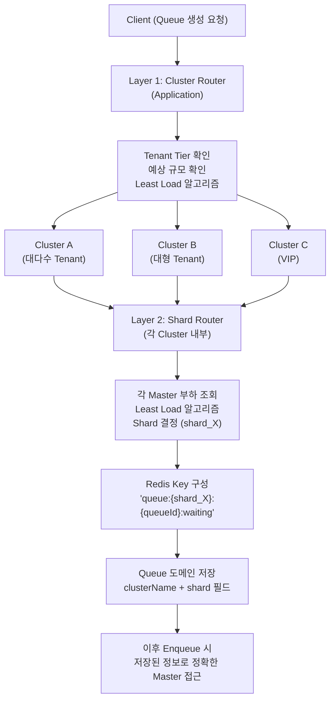
```mermaid
flowchart TD
    Client["Client (Queue 생성 요청)"]
    --> Router1["Layer 1: Cluster Router\n(Application)"]

    Router1 --> Analyze1["Tenant Tier 확인\n예상 규모 확인\nLeast Load 알고리즘"]

    Analyze1 --> ClusterA["Cluster A\n(대다수 Tenant)"]
    Analyze1 --> ClusterB["Cluster B\n(대형 Tenant)"]
    Analyze1 --> ClusterC["Cluster C\n(VIP)"]

    ClusterA & ClusterB & ClusterC --> Router2["Layer 2: Shard Router\n(각 Cluster 내부)"]

    Router2 --> Analyze2["각 Master 부하 조회\nLeast Load 알고리즘\nShard 결정 (shard_X)"]

    Analyze2 --> KeyGen["Redis Key 구성\n'queue:{shard_X}:{queueId}:waiting'"]

    KeyGen --> Store["Queue 도메인 저장\nclusterName + shard 필드"]
    Store --> Enqueue["이후 Enqueue 시\n저장된 정보로 정확한 Master 접근"]
```

**Layer 1 (Cluster) 결정 기준**:
- Tenant Tier (VIP/Premium/일반)
- 예상 규모 (500만+ 대기 → Cluster B)
- 지역 (Multi-region)

**Layer 2 (Master) 결정 기준**:
- 부하 기반 (Least Load)
- Hash Tag 문법 `{shard_X}`
- Cluster 내 4-16 Master 중 선택

---

## Enqueue 순서 보장 제약 (Sprint 5-E 확정)

**본인 확정 사항**: WAS에 enqueue되는 순서는 완전히 보장하지 않음

### 이유

여러 WAS에서 동시 요청 시:
```
Client A → WAS 1 → Redis (도착 t=100ms)
Client B → WAS 2 → Redis (도착 t=90ms)

Redis 저장 순서: B, A (도착 순)
실제 요청 순서: A, B (사용자 관점)

결과: Redis 도착 순서 = Enqueue 순서
      사용자 요청 순서와 다를 수 있음
```

### 이 제약의 이점

**분산 처리 가능**:
- WAS 확장 자유 (Sticky Session 불필요)
- 각 WAS 독립 처리
- 병렬화 가능

**부하 분산**:
- 로드 밸런서 자유
- 확장성 확보

**성능 최적화**:
- 각 WAS 로컬 처리
- 대기 없음
- 처리량 극대화

**Kafka 도입 가능 (Sprint 11)**:
- 완전 비동기 가능
- 순서 보장 안 함 (대기열 UX 관점 무관)
- 처리량 폭증

### 실무 관행

Ticketmaster, 인터파크 등:
- 밀리초 단위 정확한 순서 X
- 대략적 순서 제공 (사용자 인식 무관)
- 대량 처리 우선

**결론**: Redis 도착 순서 = Enqueue 순서만 보장, 사용자 요청 순서 ≠ Enqueue 순서 (제약 사항으로 명시)

---

## 부하 감소 요약 (오늘 세션 반영)

| 단계 | Before | After | 감소 |
|------|--------|-------|------|
| Enqueue (평상시) | 개별 처리 3ms | 일반 Lua 1-3ms | 유지 |
| Enqueue (피크) | 순차 실패/재시도 | Bulk Lua 10-30ms | 안정화 |
| Polling (일반) | 스파이크 500k/s | Jitter 200k/s | -40~50% |
| Polling (캐싱 후) | Redis 200k/s | Caffeine 80% + Redis 40k/s | -80% |

**Sprint별 최적화 도입**:
- Sprint 5-E: Enqueue 하이브리드 (완료)
- Sprint 9: Rank Query + Caffeine 캐싱
- Sprint 10: Cluster 도입 (부하 격리)
- Sprint 11-12: Kafka (비동기 처리량 증가)
- Sprint 12+: 이중 라우팅 (부하 균등)
