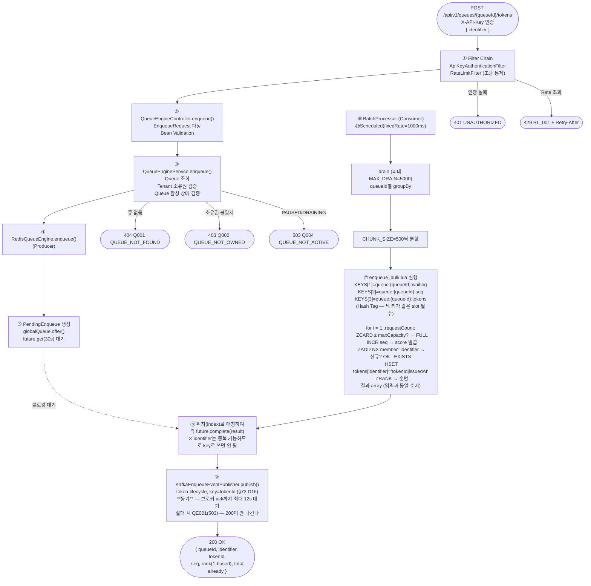
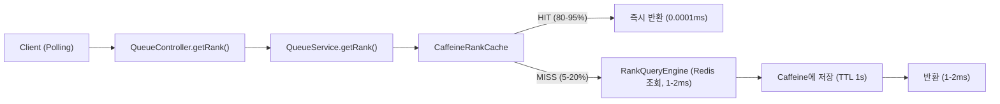
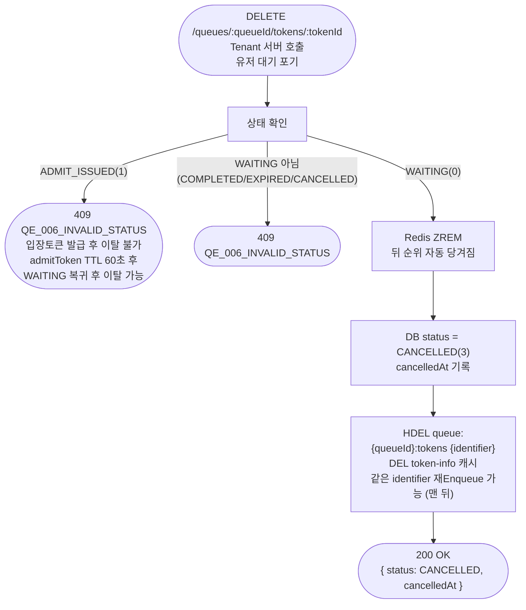
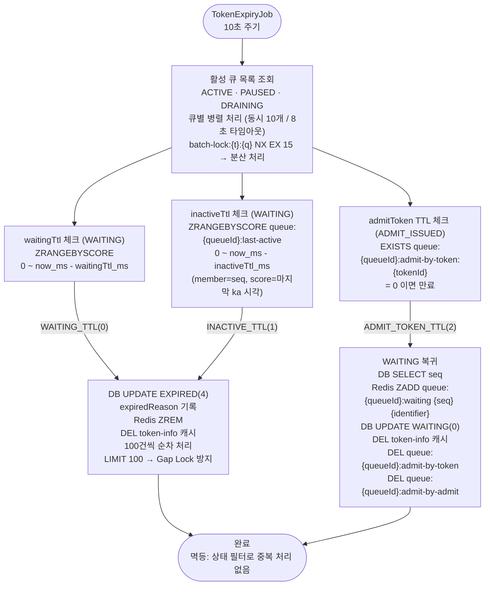
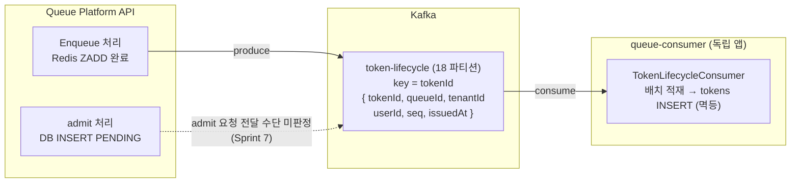
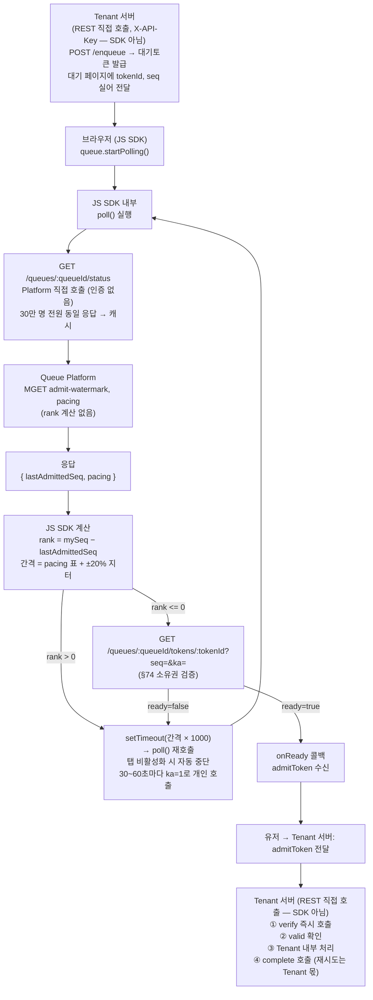
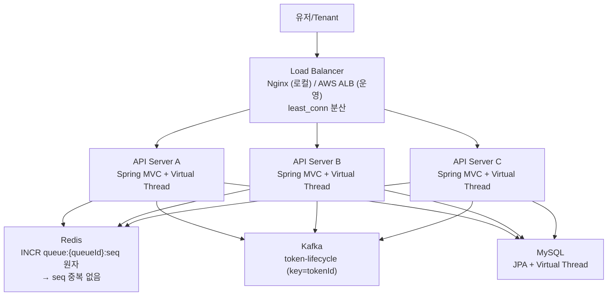
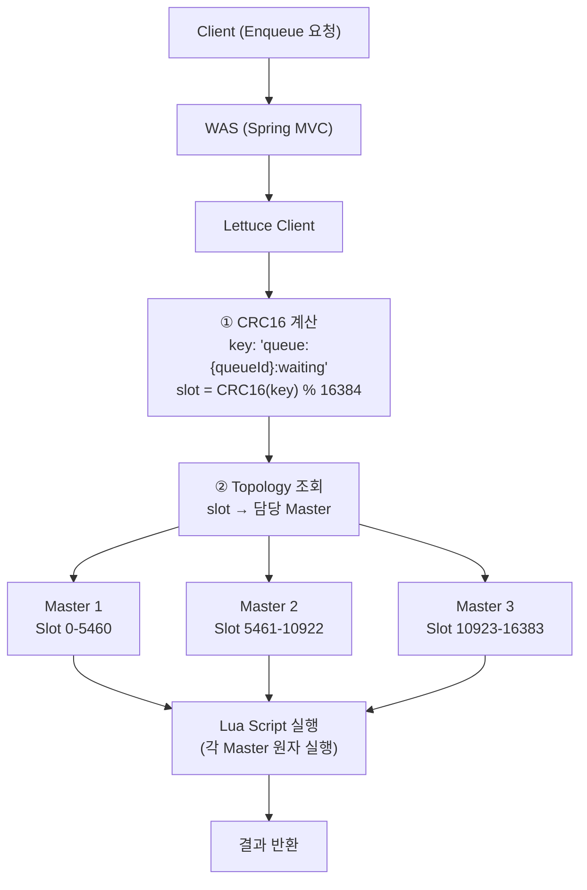
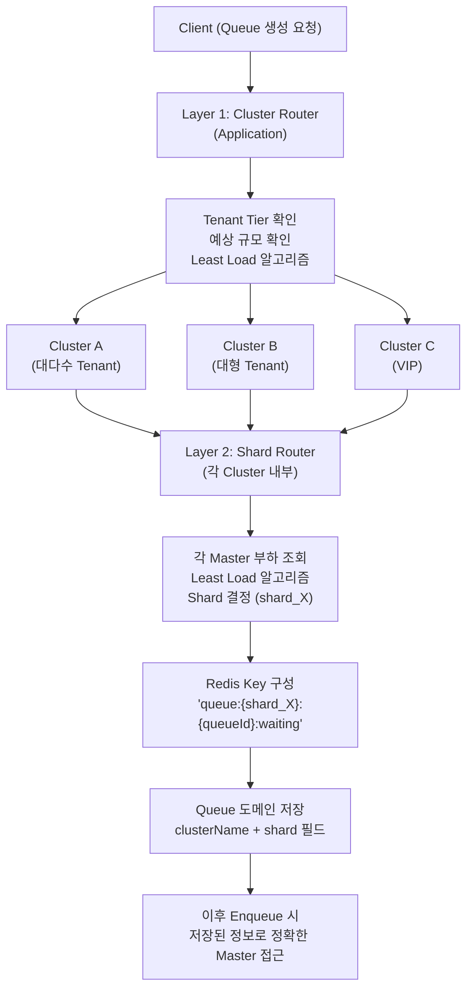

# 🔄 Queue Platform — 상세 흐름도

> **최종 업데이트**: 2026-08-17 (구현 대조 — Kafka 단일 토픽 §73, 슬라이스 절 폐기 §66 D2, 3-key Lua)
> **관련 문서**: DECISIONS.md §66-70·§73-§79, doc/ARCHITECTURE_ROADMAP.md, FRS v1.12

---

## Enqueue (Sprint 5-E — Bulk 단독)

> ⚠️ **2026-07-15 개정 (§70).** 개정 전 이 문서는 "임계값 1000 req/s로 일반 Lua ↔ Bulk Lua 자동 전환"
> 하이브리드 흐름이었다. 구현 과정에서 **하이브리드를 폐기**하고 모든 요청을 Bulk로 처리하도록 선회했다.
> `enqueue.lua`와 `SlidingWindowCounter`는 존재하지 않는다.

**핵심**:
- **모든 요청**이 Global Queue에 적재 → `BatchProcessor`가 주기적으로 drain → Bulk Lua 1회
- 경로가 하나뿐이라 순번 유일성 증명이 한 번으로 끝남 (하이브리드는 두 경로의 순번 일관성을 따로 증명해야 함)
- 대가: 저부하 요청도 배치 주기를 부담 (`fixedRate=1000ms` → 평균 500ms) — 재조정 후속 과제


```mermaid
flowchart TD
    START(["POST /api/v1/queues/{queueId}/tokens\nX-API-Key 인증\n{ identifier }"])
    --> FILTER["① Filter Chain\nApiKeyAuthenticationFilter\nRateLimitFilter (초당 통제)"]
    --> CTRL["② QueueEngineController.enqueue()\nEnqueueRequest 파싱\nBean Validation"]
    --> SERV["③ QueueEngineService.enqueue()\nQueue 조회\nTenant 소유권 검증\nQueue 활성 상태 검증"]
    --> ENG["④ RedisQueueEngine.enqueue()\n(Producer)"]

    ENG --> OFFER["⑤ PendingEnqueue 생성\nglobalQueue.offer()\nfuture.get(30s) 대기"]

    OFFER -.->|"블로킹 대기"| COMPLETE

    SCHED["⑥ BatchProcessor (Consumer)\n@Scheduled(fixedRate=1000ms)"]
    --> DRAIN["drain (최대 MAX_DRAIN=5000)\nqueueId별 groupBy"]
    --> CHUNK["CHUNK_SIZE=500씩 분할"]
    --> BULKLUA["⑦ enqueue_bulk.lua 실행\nKEYS[1]=queue:{queueId}:waiting\nKEYS[2]=queue:{queueId}:seq\nKEYS[3]=queue:{queueId}:tokens\n(Hash Tag — 세 키가 같은 slot 필수)\n\nfor i = 1..requestCount:\n  ZCARD ≥ maxCapacity? → FULL\n  INCR seq → score 발급\n  ZADD NX member=identifier → 신규? OK : EXISTS\n  HSET tokens[identifier]='tokenId|issuedAt'\n  ZRANK → 순번\n결과 array (입력과 동일 순서)"]
    --> COMPLETE["⑧ 위치(index)로 매칭하여\n각 future.complete(result)\n※ identifier는 중복 가능하므로 key로 쓰면 안 됨"]

    COMPLETE --> PUB["⑨ KafkaEnqueueEventPublisher.publish()\ntoken-lifecycle, key=tokenId (§73 D16)\n**동기** — 브로커 ack까지 최대 12s 대기\n실패 시 QE001(503) — 200이 안 나간다"]
    --> OK(["200 OK\n{ queueId, identifier, tokenId,\n  seq, rank(1-based), total, already }"])

    FILTER -->|"인증 실패"| E401(["401 UNAUTHORIZED"])
    FILTER -->|"Rate 초과"| E429(["429 RL_001 + Retry-After"])
    SERV -->|"큐 없음"| E404(["404 Q001 QUEUE_NOT_FOUND"])
    SERV -->|"소유권 불일치"| E403(["403 Q002 QUEUE_NOT_OWNED"])
    SERV -->|"PAUSED/DRAINING"| E503(["503 Q004 QUEUE_NOT_ACTIVE"])
```

**처리량 상한**: 인스턴스당 `MAX_DRAIN / fixedRate` = **5,000 req/s**. 유입이 이를 넘으면
globalQueue가 적체되어 30s 타임아웃으로 실패한다. WAS N대면 5,000×N.

### Enqueue 결정 근거

**확정 결정** (DECISIONS §66-70, ARCHITECTURE_ROADMAP 부록 A):
- D1: identifier는 Tenant가 제공 — 단 **형식은 UUIDv7로 좁혀졌다(§78)**. 이메일·순번 ID처럼
  추측 가능한 값은 금지(enqueue가 EXISTS 시 기존 `tokenId`·`seq`를 돌려주므로 자격 증명이 샌다).
  같은 사용자·같은 큐엔 **항상 같은 UUID를 재사용**해야 `ZADD NX` 중복 방지가 성립한다
- D2: ZSet 하나 (`queue:{queueId}:waiting`)
- D3: ZRANK + ZCARD (별도 counter 없음)
- D4: Java (부하 측정) + Lua (원자 처리) 분리
- D5: Lua ZRANK 중복 방지
- D6: Lua ZCARD Capacity 검증
- ~~D7: enqueue.lua + enqueue_bulk.lua 2개~~ → **`enqueue_bulk.lua` 단독** (§70)
- ~~D8: 임계값 1000 req/s, 배치 100, 간격 10ms, 타임아웃 1s~~ → **하이브리드 폐기.** 배치 상수만 유지 (§70)
  - 현재: `MAX_DRAIN=5000`, `CHUNK_SIZE=500`, `fixedRate=1000ms`, 타임아웃 30s
  - ⚠️ 원안(10ms/1s) 대비 100배/30배 이탈 → 재조정 후속 과제
- **D9: score = `INCR queue:{queueId}:seq`** (신설, §70) — 단조증가·유일 보장
- **D10: Hash Tag 필수** (신설, §70) — `queue/QueueKeys.java`

### Cluster 환경에서 (Sprint 8+ 반영)

> ⚠️ 2026-07-15 개정 (§70). 개정 전엔 "Lua Script 단일 key만 사용 → CROSSSLOT 이슈 없음"이었으나,
> D9(seq 키) 도입으로 **2-key가 되어 전제가 깨졌다.**

- Lettuce가 key의 CRC16으로 자동 slot 계산 → 해당 slot 담당 Master로 자동 라우팅
- `enqueue_bulk.lua`는 **키 3개**(waiting + seq + tokens)를 사용 → **해시태그로 동일 slot 강제** (D10)
  - 해시태그 없으면: slot 7911 vs 11273 → 다른 Master → `CROSSSLOT` 에러
  - 해시태그 있으면: 셋 다 같은 slot → 같은 Master → 정상
  - `poll_verify.lua`도 3키다 (waiting + tokens + last-active, §74)
- Sentinel에선 무해하므로 **선제 적용 완료** (로컬 Cluster A에서 실제 스크립트 실행 검증)
- 이중 라우팅 (Sprint 12+): 태그가 shard로 이동 → `queue:{shard_X}:{queueId}:waiting`

### Kafka 적재 (구현 완료 — DECISIONS §73)

- Enqueue 완료 후 Kafka `token-lifecycle` 발행 (**key = `tokenId`**, 18 파티션)
- `queue-consumer` 모듈의 `TokenLifecycleConsumer`가 배치로 DB INSERT (멱등)
- Redis 다운 시 `redis_sync_needed=1` DB INSERT
- 복구 시 배치가 Sorted Set 재삽입

---

## Polling (유저 → Platform 직접, Jitter 적용)

> ⚠️ **이 절은 §79(2026-08-14) 이전의 검토안이다.** 현행 계약은 아래
> "클라이언트 Polling 구조 (JS SDK)" 절과 `FRS_final.md §6.3`을 보라.
> §79에서 바뀐 것: 엔드포인트 2분할 / 서버는 rank를 계산하지 않는다 /
> `QueueSnapshotCache`(Caffeine)는 **제거 대상**이다.
> 아래 `/rank/:identifier`·`{rank, total, estimatedWaitSeconds}` 표기는 **채택되지 않았다.**

Sprint 5-E 이후 Polling 부하 최적화:
- **Jitter 적용** (JS SDK): 요청 시점 무작위 분산 (4-6초 랜덤)
- **Caffeine 캐싱** (Sprint 9+): 서버 측 rank 조회 캐시 (TTL 1-2초)
- **SSE 미도입** (본인 확정): Polling 방식 유지, 인프라 무변경

### 부하 감소 효과

일반 Polling vs Jitter Polling:
- 100만명 × 5초 = 초당 200,000 요청 (평균 동일)
- 일반 Polling: 스파이크 t=0, 5000, 10000ms (초당 500,000 피크)
- Jitter Polling: 4000-6000ms 균등 분산 (초당 200,000 안정)
- **피크 부하 40-50% 감소**

Caffeine 캐싱 조합 시:
- Rank 조회 80% 캐시 HIT (rank 변화 낮음)
- Redis 실제 요청 20%로 감소
- 초당 40,000 요청만 Redis 도달


```mermaid
flowchart TD
    POLL(["GET /api/v1/queues/:queueId/rank/:identifier\n유저가 직접 호출\nJS SDK가 setTimeout으로 Jitter 적용\n(4-6초 랜덤 재요청)"])
    --> AUTH["① 인증 확인\nJWT 또는 조회용 임시 토큰"]
    --> CACHE["② Caffeine 로컬 캐시 확인\n(Sprint 9+ 도입)\nkey: rank:{queueId}:{identifier}\nTTL: 1-2s"]

    CACHE -->|"HIT (80%)"| RESPCACHE(["200 OK 즉시 반환\n소요: 0.0001ms"])
    CACHE -->|"MISS (20%)"| RANK["③ Rank 조회 (Redis)\nZRANK queue:{queueId}:waiting {identifier}\nZCARD queue:{queueId}:waiting\n소요: 1-2ms"]

    RANK -->|"없음"| E404(["404 TK001 TOKEN_NOT_FOUND"])
    RANK -->|"조회됨"| CACHESET["④ Caffeine에 저장\nTTL 1-2s"]
    CACHESET --> ETA["⑤ ETA 계산\navgWaitingTime × rank"]
    --> RESP(["200 OK\n{ rank, total, estimatedWaitSeconds }\nJS SDK가 다음 요청 시점\nsetTimeout(4000~6000ms)로 예약"])

    RESP -.->|"클라이언트: setTimeout(jitter)"| POLL
    RESPCACHE -.->|"동일 재요청"| POLL
```

### 미래 확장 - Rank Query 전용 서비스 (Sprint 9+)


```mermaid
flowchart LR
    Client["Client (Polling)"]
    --> Ctrl["QueueController.getRank()"]
    --> Svc["QueueService.getRank()"]
    --> Cache["CaffeineRankCache"]
    Cache -->|"HIT (80-95%)"| Return1["즉시 반환 (0.0001ms)"]
    Cache -->|"MISS (5-20%)"| Engine["RankQueryEngine (Redis 조회, 1-2ms)"]
    Engine --> Cache2["Caffeine에 저장 (TTL 1s)"]
    Cache2 --> Return2["반환 (1-2ms)"]
```

---

## Admit → Verify → Complete


```mermaid
flowchart TD
    SLOT(["Tenant\n슬롯 여유 생김"])
    --> ADMIT["POST /queues/:queueId/admit\n{ count: N, requestId }\nTenant → Platform"]

    ADMIT --> IDEM{"queue:{queueId}:admit-idem:{requestId}\n존재?"}
    IDEM -->|"있음 (중복)"| CACHED(["200 OK\n기존 결과 반환"])
    IDEM -->|"없음"| DBINS["DB admit_requests INSERT\nstatus=PENDING\n← 영속성 기준점"]

    DBINS --> KAFKA["admit 요청 전달\n{ requestId, tenantId, queueId, count }\n⚠️ 전달 수단 미판정 (FRS §7 — Sprint 7에서 결정)"]

    KAFKA --> CONSUMER["Admit Worker\nDB PENDING 확인 → 멱등 체크\nstatus=PROCESSING 업데이트"]

    CONSUMER --> LUA["① Lua Script (Redis 전용)\n슬라이스별 ZRANGE WITHSCORES\nLua 내부 score 정렬\n상위 N명 선택\nZREM multi-member"]
    --> FILTER["② DB WAITING 상태 확인 ← Lua 밖 (Lua는 MySQL을 못 만진다)\n불일치 즉시 ZREM\n부족 시 최대 3회 추가 추출\n추가 추출 시 전체 재정렬 → FIFO 보장"]
    --> TOKEN["③ admitToken 발급 ← ①과 별개 호출\nSET queue:{queueId}:admit-by-token:{tokenId} EX 60\nSET queue:{queueId}:admit-by-admit:{admitToken} EX 60\nSET queue:{queueId}:admit-watermark = max(현재값, 뽑은 최대 seq)\nDB UPDATE ADMIT_ISSUED (100건씩)\nSET token-info 캐시 갱신\nDB admit_requests status=COMPLETED\n⚠️ ①과 ③ 사이에 'pop 성공 + SET 실패' 창이 있다 (DECISIONS §79 — 미해결)"]
    --> ARESP(["200 OK\n{ admitTokens: [{userId, admitToken}...] }"])

    ARESP --> POLL["유저 다음 Polling 시\nadmitToken 수신"]
    --> USER["유저 → Tenant\nadmitToken 전달"]
    --> VERIFY["POST /queues/:queueId/admit-tokens/:admitToken/verify\nTenant → Platform\n유효성 확인만 (상태 변경 없음)"]

    VERIFY --> VK{"queue:{queueId}:admit-by-admit:{admitToken}\n유효?"}
    VK -->|"만료 or 무효"| VDB["DB Fallback 시도\nSELECT WHERE admit_token=:admitToken\nAND status=ADMIT_ISSUED\nAND issued_at > UTC_TIMESTAMP(3) - INTERVAL 60 SECOND\n(NOW() 금지 — 시각은 전부 UTC. DECISIONS §77)"]
    VDB -->|"없음"| E404(["404 TK_002_INVALID_ADMIT_TOKEN"])
    VDB -->|"있음"| VFLAG["SET verified-token:{tokenId} EX 60\n중복 입장 방지 플래그"]
    VK -->|"유효"| VFLAG
    --> VRESP(["200 OK\n{ valid: true, identifier }"])

    VRESP --> ALLOW["Tenant → 유저 입장 허용"]
    --> COMPLETE["POST /queues/:queueId/tokens/:tokenId/complete\n{ admitToken }\nTenant → Platform\n입장 완료 통보"]

    COMPLETE --> CK{"ADMIT_ISSUED(1)\n상태?"}
    CK -->|"아님"| E409(["409 QE_006_INVALID_STATUS"])
    CK -->|"확인"| DB["DB status = COMPLETED(2)\n← 먼저 (원자성 전략)\nDB UPDATE WHERE status=1 → 1번만 성공"]
    --> ZREM["Redis ZREM\nDEL queue:{queueId}:admit-by-token\nDEL queue:{queueId}:admit-by-admit\nDEL token-info 캐시\nDEL verified-token\n← 나중"]
    --> AVG["avgWaitingTime 직접 갱신\nwaitingSeconds = completedAt - issuedAt\n이상치 필터: > waitingTtl × 0.8 제외\nHINCRBYFLOAT queue-stats waitingTimeSum\nHINCRBY queue-stats waitingTimeCount"]
    --> COK(["200 OK\n{ status: COMPLETED, completedAt }"])

    DB -->|"ZREM 실패 시"| FIX["Batch 10초 내\nZREM 재실행 (멱등)"]

    TOKEN -->|"admitToken TTL 60초 초과\nBatch 10초 주기 감지"| BACK["WAITING 복귀\nDB SELECT seq\nRedis ZADD queue:{queueId}:waiting {seq} {identifier}\nDB UPDATE WAITING(0)\nDEL token-info 캐시\nDEL queue:{queueId}:admit-by-token\nDEL queue:{queueId}:admit-by-admit"]
```

> **Kafka Consumer 장애 시**
> Consumer Offset 미커밋 → 재시작 시 미처리 메시지부터 재처리
> DB admit_requests PENDING 확인으로 멱등성 보장

---

## 이탈 → CANCELLED


```mermaid
flowchart TD
    DQ(["DELETE /queues/:queueId/tokens/:tokenId\nTenant 서버 호출\n유저 대기 포기"])
    --> CHK["상태 확인"]

    CHK -->|"ADMIT_ISSUED(1)"| E409A(["409 QE_006_INVALID_STATUS\n입장토큰 발급 후 이탈 불가\nadmitToken TTL 60초 후\nWAITING 복귀 후 이탈 가능"])
    CHK -->|"WAITING 아님\n(COMPLETED/EXPIRED/CANCELLED)"| E409B(["409 QE_006_INVALID_STATUS"])
    CHK -->|"WAITING(0)"| ZREM["Redis ZREM\n뒤 순위 자동 당겨짐"]
    --> DB["DB status = CANCELLED(3)\ncancelledAt 기록"]
    --> DEL["HDEL queue:{queueId}:tokens {identifier}\nDEL token-info 캐시\n같은 identifier 재Enqueue 가능 (맨 뒤)"]
    --> OK(["200 OK\n{ status: CANCELLED, cancelledAt }"])
```

---

## TTL 만료 Batch (10초 주기)


```mermaid
flowchart TD
    JOB(["TokenExpiryJob\n10초 주기"])
    --> ALIST["활성 큐 목록 조회\nACTIVE · PAUSED · DRAINING\n큐별 병렬 처리 (동시 10개 / 8초 타임아웃)\nbatch-lock:{t}:{q} NX EX 15 → 분산 처리"]

    ALIST --> W1 & W2 & W3

    W1["waitingTtl 체크 (WAITING)\nZRANGEBYSCORE\n0 ~ now_ms - waitingTtl_ms"]
    W2["inactiveTtl 체크 (WAITING)\nZRANGEBYSCORE queue:{queueId}:last-active\n0 ~ now_ms - inactiveTtl_ms\n(member=seq, score=마지막 ka 시각)"]
    W3["admitToken TTL 체크 (ADMIT_ISSUED)\nEXISTS queue:{queueId}:admit-by-token:{tokenId}\n= 0 이면 만료"]

    W1 -->|"WAITING_TTL(0)"| EXP["DB UPDATE EXPIRED(4)\nexpiredReason 기록\nRedis ZREM\nDEL token-info 캐시\n100건씩 순차 처리\nLIMIT 100 → Gap Lock 방지"]
    W2 -->|"INACTIVE_TTL(1)"| EXP

    W3 -->|"ADMIT_TOKEN_TTL(2)"| BACK["WAITING 복귀\nDB SELECT seq\nRedis ZADD queue:{queueId}:waiting {seq} {identifier}\nDB UPDATE WAITING(0)\nDEL token-info 캐시\nDEL queue:{queueId}:admit-by-token\nDEL queue:{queueId}:admit-by-admit"]

    EXP --> DONE(["완료\n멱등: 상태 필터로 중복 처리 없음"])
    BACK --> DONE
```

---

## ~~슬라이스 구조~~ — 폐기 (§66 D2)

> 대기열을 `queue:{t}:{q}:{0..N}`으로 쪼개고 `ZCOUNT`를 합산해 순위를 내던 설계는 **폐기됐다.**
> 현행은 **ZSet 하나**(`queue:{queueId}:waiting`) + `INCR queue:{queueId}:seq`로 score를 발급한다
> (§66 D2 · §70 D9). 쪼개지 않으니 합산도, 슬라이스 간 정렬도 없다.
> 순위는 `ZRANK`(enqueue 응답) 또는 `rank = mySeq − lastAdmittedSeq`(폴링, §79)로 구한다.

---

## Kafka Topic 흐름


```mermaid
flowchart LR
    subgraph API["Queue Platform API"]
        E1["Enqueue 처리\nRedis ZADD 완료"]
        E2["admit 처리\nDB INSERT PENDING"]
    end

    subgraph TOPICS["Kafka"]
        T1["token-lifecycle (18 파티션)\nkey = tokenId\n{ tokenId, queueId, tenantId\nuserId, seq, issuedAt }"]
    end

    subgraph CONSUMER["queue-consumer (독립 앱)"]
        C1["TokenLifecycleConsumer\n배치 적재 → tokens INSERT (멱등)"]
    end

    E1 -->|"produce"| T1
    E2 -.->|"admit 요청 전달 수단 미판정\n(Sprint 7)"| T1
    T1 -->|"consume"| C1
```

> **키가 `tokenId`인 이유**: `queueId`로 잡으면 한 큐 30만 명이 통째로 한 파티션에 몰린다 (DECISIONS §73 D16).
> **토픽을 안 나누는 이유**: 순서 보장은 같은 토픽의 같은 파티션 안에서만 성립한다 (§73 D18).

---

## 클라이언트 Polling 구조 (JS SDK)


```mermaid
flowchart TD
    TENANT["Tenant 서버\n(REST 직접 호출, X-API-Key — SDK 아님)\nPOST /enqueue → 대기토큰 발급\n대기 페이지에 tokenId, seq 실어 전달"]
    --> CLIENT["브라우저 (JS SDK)\nqueue.startPolling()"]

    CLIENT --> POLL["JS SDK 내부\npoll() 실행"]
    --> REQ["GET /queues/:queueId/status\nPlatform 직접 호출 (인증 없음)\n30만 명 전원 동일 응답 → 캐시"]
    --> PLATFORM["Queue Platform\nMGET admit-watermark, pacing\n(rank 계산 없음)"]
    --> RESP["응답\n{ lastAdmittedSeq, pacing }"]

    RESP --> CALC["JS SDK 계산\nrank = mySeq − lastAdmittedSeq\n간격 = pacing 표 + ±20% 지터"]
    CALC -->|"rank > 0"| TIMER["setTimeout(간격 × 1000)\n→ poll() 재호출\n탭 비활성화 시 자동 중단\n30~60초마다 ka=1로 개인 호출"]
    TIMER --> POLL

    CALC -->|"rank <= 0"| ME["GET /queues/:queueId/tokens/:tokenId?seq=&ka=\n(§74 소유권 검증)"]
    ME -->|"ready=false"| TIMER
    ME -->|"ready=true"| CB["onReady 콜백\nadmitToken 수신"]
    --> SEND["유저 → Tenant 서버: admitToken 전달"]
    --> TENANT2["Tenant 서버 (REST 직접 호출 — SDK 아님)\n① verify 즉시 호출\n② valid 확인\n③ Tenant 내부 처리\n④ complete 호출 (재시도는 Tenant 몫)"]
```

> **역할 분리**
> `pacing` 구간표·`lastAdmittedSeq` 제공: Platform 책임 (부하 제어 레버는 서버가 쥔다, §79)
> rank 계산 / setTimeout / 탭 비활성화 처리: JS SDK 책임
> UI 업데이트: 클라이언트(Tenant) 책임
> verify 순서 / complete 재시도: **Tenant 서버 책임** — 강제할 SDK가 없으므로 명세로 규정하고
> 서버가 위반을 방어한다 (DECISIONS §35)

---

## Tenant 서버 통신 vs Platform 직접 통신

| 통신 대상 | 시점 | 빈도 | 내용 |
|----------|------|------|------|
| Tenant 서버 | 진입 시 | 1회 | 슬롯 여유 확인, 대기토큰 수신 |
| Tenant 서버 | 입장 시 | 1회 | admitToken 전달, 세션 생성 |
| Tenant 서버 | 이탈 시 | 1회 | 취소 요청 |
| Platform (JS SDK) | 대기 중 | 2~30초마다 반복 | Polling (가장 빈번) |

> Polling이 가장 빈번한 통신인데 JS SDK가 Platform과 직접 처리.
> Tenant 서버는 진입/입장/이탈 3번만 관여.
> 이것이 "유저가 Platform에 직접 Polling" 원칙의 실제 구현.

---

## 수평 확장 구조


```mermaid
flowchart TD
    USER["유저/Tenant"]
    --> LB["Load Balancer\nNginx (로컬) / AWS ALB (운영)\nleast_conn 분산"]

    LB --> A["API Server A\nSpring MVC + Virtual Thread"]
    LB --> B["API Server B\nSpring MVC + Virtual Thread"]
    LB --> C["API Server C\nSpring MVC + Virtual Thread"]

    A & B & C --> REDIS["Redis\nINCR queue:{queueId}:seq 원자\n→ seq 중복 없음"]
    A & B & C --> KAFKA["Kafka\ntoken-lifecycle (key=tokenId)"]
    A & B & C --> MYSQL["MySQL\nJPA + Virtual Thread"]
```

> **순서 보장**: `INCR queue:{queueId}:seq` = Redis 싱글스레드 원자 연산
> 서버 여러 대가 동시 호출해도 seq 절대 중복 없음
> Tenant는 Load Balancer 주소만 알면 됨 (내부 서버 수 몰라도 됨)

---

## Cluster 라우팅 흐름 (Sprint 10+ 반영)

Sprint 10 이후 Redis Cluster 도입 시의 Enqueue 라우팅 상세.

### Sprint 10 - 단일 Cluster (자동 slot 분배)


```mermaid
flowchart TD
    Client["Client (Enqueue 요청)"]
    --> WAS["WAS (Spring MVC)"]
    --> Lettuce["Lettuce Client"]

    Lettuce --> CRC["① CRC16 계산\nkey: 'queue:{queueId}:waiting'\nslot = CRC16(key) % 16384"]

    CRC --> Route["② Topology 조회\nslot → 담당 Master"]

    Route --> M1["Master 1\nSlot 0-5460"]
    Route --> M2["Master 2\nSlot 5461-10922"]
    Route --> M3["Master 3\nSlot 10923-16383"]

    M1 & M2 & M3 --> Lua["Lua Script 실행\n(각 Master 원자 실행)"]
    Lua --> Return["결과 반환"]
```

**특징**:
- Lettuce 자동 라우팅 (개발자 개입 X)
- Queue별 다른 Master 자동 배치
- 완전 격리 (다른 Master 영향 X)

### Sprint 12+ - 이중 라우팅 (Cluster + Hash Tag)


```mermaid
flowchart TD
    Client["Client (Queue 생성 요청)"]
    --> Router1["Layer 1: Cluster Router\n(Application)"]

    Router1 --> Analyze1["Tenant Tier 확인\n예상 규모 확인\nLeast Load 알고리즘"]

    Analyze1 --> ClusterA["Cluster A\n(대다수 Tenant)"]
    Analyze1 --> ClusterB["Cluster B\n(대형 Tenant)"]
    Analyze1 --> ClusterC["Cluster C\n(VIP)"]

    ClusterA & ClusterB & ClusterC --> Router2["Layer 2: Shard Router\n(각 Cluster 내부)"]

    Router2 --> Analyze2["각 Master 부하 조회\nLeast Load 알고리즘\nShard 결정 (shard_X)"]

    Analyze2 --> KeyGen["Redis Key 구성\n'queue:{shard_X}:{queueId}:waiting'"]

    KeyGen --> Store["Queue 도메인 저장\nclusterName + shard 필드"]
    Store --> Enqueue["이후 Enqueue 시\n저장된 정보로 정확한 Master 접근"]
```

**Layer 1 (Cluster) 결정 기준**:
- Tenant Tier (VIP/Premium/일반)
- 예상 규모 (500만+ 대기 → Cluster B)
- 지역 (Multi-region)

**Layer 2 (Master) 결정 기준**:
- 부하 기반 (Least Load)
- Hash Tag 문법 `{shard_X}`
- Cluster 내 4-16 Master 중 선택

---

## Enqueue 순서 보장 제약 (Sprint 5-E 확정)

**본인 확정 사항**: WAS에 enqueue되는 순서는 완전히 보장하지 않음

### 이유

여러 WAS에서 동시 요청 시:
```
Client A → WAS 1 → Redis (도착 t=100ms)
Client B → WAS 2 → Redis (도착 t=90ms)

Redis 저장 순서: B, A (도착 순)
실제 요청 순서: A, B (사용자 관점)

결과: Redis 도착 순서 = Enqueue 순서
      사용자 요청 순서와 다를 수 있음
```

### 이 제약의 이점

**분산 처리 가능**:
- WAS 확장 자유 (Sticky Session 불필요)
- 각 WAS 독립 처리
- 병렬화 가능

**부하 분산**:
- 로드 밸런서 자유
- 확장성 확보

**성능 최적화**:
- 각 WAS 로컬 처리
- 대기 없음
- 처리량 극대화

**Kafka 도입 가능 (Sprint 11)**:
- 완전 비동기 가능
- 순서 보장 안 함 (대기열 UX 관점 무관)
- 처리량 폭증

### 실무 관행

Ticketmaster, 인터파크 등:
- 밀리초 단위 정확한 순서 X
- 대략적 순서 제공 (사용자 인식 무관)
- 대량 처리 우선

**결론**: Redis 도착 순서 = Enqueue 순서만 보장, 사용자 요청 순서 ≠ Enqueue 순서 (제약 사항으로 명시)

---

## 부하 감소 요약 (오늘 세션 반영)

| 단계 | Before | After | 감소 |
|------|--------|-------|------|
| Enqueue (평상시) | 개별 처리 3ms | 일반 Lua 1-3ms | 유지 |
| Enqueue (피크) | 순차 실패/재시도 | Bulk Lua 10-30ms | 안정화 |
| Polling (일반) | 스파이크 500k/s | Jitter 200k/s | -40~50% |
| Polling (캐싱 후) | Redis 200k/s | Caffeine 80% + Redis 40k/s | -80% |

**Sprint별 최적화 도입**:
- Sprint 5-E: Enqueue Bulk 단독 + Hash Tag (완료, §70 — 하이브리드는 폐기)
- Sprint 9: Rank Query + Caffeine 캐싱
- Sprint 10: Cluster 도입 (부하 격리)
- Sprint 11-12: Kafka (비동기 처리량 증가)
- Sprint 12+: 이중 라우팅 (부하 균등)
