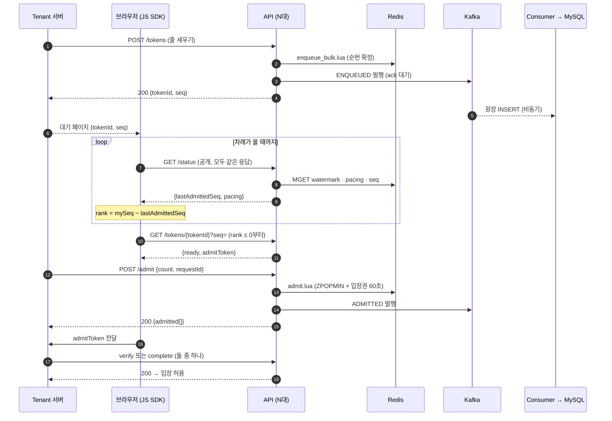
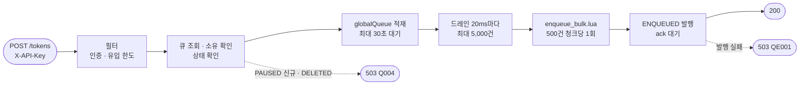
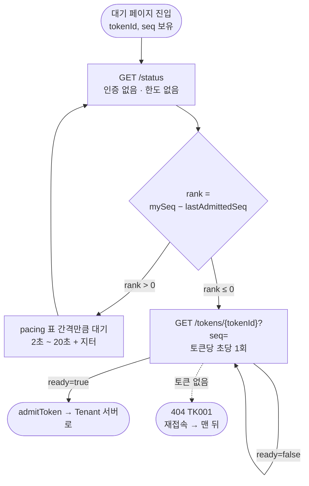
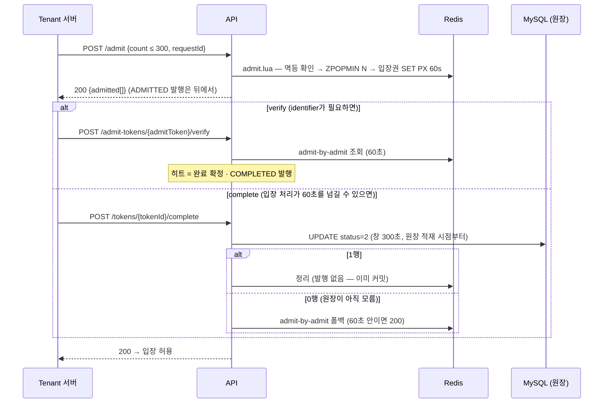
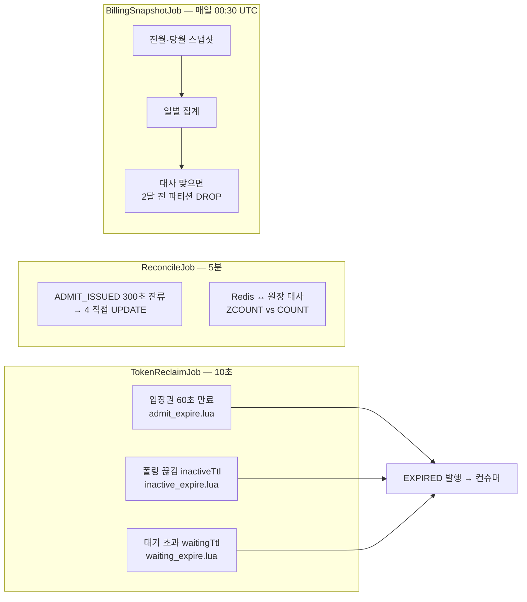
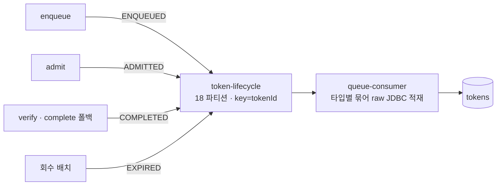

# 🔄 Queue Platform — 흐름도

> 코드 대조 2026-09-25 (dev `890b536`) · 상태 전이는 [`STATE.md`](STATE.md) · 필드 명세는 [`API.md`](API.md)
> 그림은 **한눈에 보는 용도**라 짧게 적었다. 가드·예외의 정확한 조건은 각 절의 표와 코드가 정본이다.

---

## 1. 전체 그림 — 한 사람이 줄 서서 입장하기까지

```mermaid
sequenceDiagram
    autonumber
    participant T as Tenant 서버
    participant B as 브라우저 (JS SDK)
    participant A as API (N대)
    participant R as Redis
    participant K as Kafka
    participant C as Consumer → MySQL

    T->>A: POST /tokens (줄 세우기)
    A->>R: enqueue_bulk.lua (순번 확정)
    A->>K: ENQUEUED 발행 (ack 대기)
    A-->>T: 200 {tokenId, seq}
    K-->>C: 원장 INSERT (비동기)
    T-->>B: 대기 페이지 (tokenId, seq)

    loop 차례가 올 때까지
        B->>A: GET /status (공개, 모두 같은 응답)
        A->>R: MGET watermark · pacing · seq
        A-->>B: {lastAdmittedSeq, pacing}
        Note over B: rank = mySeq − lastAdmittedSeq
    end
    B->>A: GET /tokens/{tokenId}?seq= (rank ≤ 0부터)
    A-->>B: {ready, admitToken}

    T->>A: POST /admit {count, requestId}
    A->>R: admit.lua (ZPOPMIN + 입장권 60초)
    A->>K: ADMITTED 발행
    A-->>T: 200 {admitted[]}
    B->>T: admitToken 전달
    T->>A: verify 또는 complete (둘 중 하나)
    A-->>T: 200 → 입장 허용
```

**핵심 셋**
- **순번은 Redis가 정한다.** MySQL 원장은 Kafka를 건너 나중에 적힌다 — 응답이 먼저 나가고 원장이 뒤따르는 **창**이 있다
- **폴링은 브라우저가 Platform에 직접 한다.** 대부분은 모두 같은 답을 받는 `/status`이고, 개인 조회는 차례가 거의 왔을 때부터다
- **입장 속도는 Tenant가 정한다**(`admit`의 `count`). Platform은 순서만 관리한다

---

## 2. Enqueue — 줄 세우기

```mermaid
flowchart LR
    REQ(["POST /tokens<br/>X-API-Key"]) --> F["필터<br/>인증 · 유입 한도"]
    F --> S["큐 조회 · 소유 확인<br/>상태 확인"]
    S --> G["globalQueue 적재<br/>최대 30초 대기"]
    G --> D["드레인 20ms마다<br/>최대 5,000건"]
    D --> L["enqueue_bulk.lua<br/>500건 청크당 1회"]
    L --> P["ENQUEUED 발행<br/>ack 대기"]
    P --> OK(["200"])
    S -. "PAUSED 신규 · DELETED" .-> E503(["503 Q004"])
    P -. "발행 실패" .-> QE(["503 QE001"])
```

| 단계 | 하는 일 | 근거 |
|---|---|---|
| 상태 확인 | `ACTIVE`는 통과. `PAUSED`는 **이미 줄 선 사람의 재-enqueue만** 통과(`tokens` Hash 확인) | `QueueEngineService.enqueue` |
| Lua | 정원 확인 → `INCR seq` → `HSETNX tokens[identifier]`(중복 게이트) → 신규면 `ZADD waiting` | `enqueue_bulk.lua` |
| 발행 | **응답 전에 동기로** 기다린다. 실패하면 200이 나가지 않는다 | `KafkaEnqueueEventPublisher` |

- 🔑 **중복 게이트는 `tokens` Hash다, `waiting` ZSet이 아니다.** 입장하면 ZSet에서 빠지므로 그걸 게이트로 쓰면 재-enqueue가 신규로 판정돼 두 번 청구된다
- 키 셋(`waiting`·`seq`·`tokens`)은 해시태그 `{queueId}`로 같은 slot에 둔다 — 없으면 Cluster에서 `CROSSSLOT`(`QueueKeys`)
- 지연의 대부분은 **틱 대기**다(20ms 주기 → 평균 10ms). 실측은 [`perf/ENQUEUE_TUNING.md`](perf/ENQUEUE_TUNING.md)

---

## 3. Polling — 차례 기다리기

```mermaid
flowchart TD
    START(["대기 페이지 진입<br/>tokenId, seq 보유"]) --> ST["GET /status<br/>인증 없음 · 한도 없음"]
    ST --> CALC{"rank =<br/>mySeq − lastAdmittedSeq"}
    CALC -- "rank > 0" --> WAIT["pacing 표 간격만큼 대기<br/>2초 ~ 20초 + 지터"]
    WAIT --> ST
    CALC -- "rank ≤ 0" --> ME["GET /tokens/{tokenId}?seq=<br/>토큰당 초당 1회"]
    ME -- "ready=false" --> ME
    ME -- "ready=true" --> DONE(["admitToken → Tenant 서버로"])
    ME -. "토큰 없음" .-> TK1(["404 TK001<br/>재접속 → 맨 뒤"])
```

- `/status`는 **30만 명 전원이 같은 답**을 받는다 — 개인화가 없어야 부하가 사람 수에 비례해 폭증하지 않는다(§79)
- 개인 조회(`poll_verify.lua`)가 **생존 신호**다 — 부를 때마다 `last-active`가 갱신된다(§82 F안)
- 🪤 SDK는 `rank ≤ 0` 전에는 개인 조회를 부르지 않는다. 그래서 **그 전에 이탈한 사람은 `inactiveTtl`(5분)이 아니라 `waitingTtl`(기본 2시간)로 회수된다**
- 여러 탭을 열어도 폴링은 한 탭만 한다(Web Locks 리더 탭) — 개인 조회 한도가 tokenId 단위라서다([`../sdk/js/README.md`](../sdk/js/README.md))

---

## 4. Admit → Verify / Complete — 입장시키기

```mermaid
sequenceDiagram
    participant T as Tenant 서버
    participant A as API
    participant R as Redis
    participant M as MySQL (원장)

    T->>A: POST /admit {count ≤ 300, requestId}
    A->>R: admit.lua — 멱등 확인 → ZPOPMIN N → 입장권 SET PX 60s
    A-->>T: 200 {admitted[]} (ADMITTED 발행은 뒤에서)

    alt verify (identifier가 필요하면)
        T->>A: POST /admit-tokens/{admitToken}/verify
        A->>R: admit-by-admit 조회 (60초)
        Note over A: 히트 = 완료 확정 · COMPLETED 발행
    else complete (입장 처리가 60초를 넘길 수 있으면)
        T->>A: POST /tokens/{tokenId}/complete
        A->>M: UPDATE status=2 (창 300초, 원장 적재 시점부터)
        alt 1행
            A->>R: 정리 (발행 없음 — 이미 커밋)
        else 0행 (원장이 아직 모름)
            A->>R: admit-by-admit 폴백 (60초 안이면 200)
        end
    end
    A-->>T: 200 → 입장 허용
```

| | verify | complete |
|---|---|---|
| 창 | **60초** (Redis 입장권) | **300초** (원장의 `admitted_at`부터) |
| 권위 | Redis — 원장을 안 읽는다 | **MySQL 먼저**, 모르면 Redis 폴백 |
| 완료 기록 | COMPLETED 이벤트 → 컨슈머 | DB 경로는 직접 `UPDATE`, 폴백만 이벤트 |
| 둘 다 부르면 | 답은 맞지만 DB 일이 두 배 — **하나만 불러라**(계약 ①) | |

🔴 **적재가 밀리면 빈 구간이 생긴다.** 적재 지연을 L초라 하면 Redis는 입장 후 `[0, 60]`초, 원장은
`[L, L+300]`초를 안다. **L > 60이면 `(60, L)` 사이의 complete는 `TK002` 404**다 — 적재가 끝나면 같은
요청이 200이다(로컬 재현 82초 404 → 101초 200, AWS 14차 30.8만 건). 연동 계약은 "입장 후 300초 안의
404는 재시도"다. 코드로 구간을 없애는 안은 보류 중이다.

- **멱등**: `admit-idem:{requestId}`가 결과를 5분 들고 있어 재시도는 같은 결과를 돌려준다. 이 키가 유실되면 중복 admit을 막을 수단이 없다(§80이 수용한 대가)
- **ADMITTED 발행은 실패해도 200**이다 — 입장권은 이미 Redis에 있다. 흔적은 `queue_admit_requests_total{result="error"}`뿐이다
- **왜 원장에서 대기 여부를 확인하지 않나**: 순번은 Redis에 먼저 쓰이고 원장은 나중이다. 원장 기준으로 "없으니 유령"이라 판단하면 정상 대기자를 지운다 — 대기 여부의 권위는 Redis다(§80)

---

## 5. 배치 — 회수 · 대사 · 과금

```mermaid
flowchart LR
    subgraph RJ["TokenReclaimJob — 10초"]
        A1["입장권 60초 만료<br/>admit_expire.lua"]
        A2["폴링 끊김 inactiveTtl<br/>inactive_expire.lua"]
        A3["대기 초과 waitingTtl<br/>waiting_expire.lua"]
    end
    subgraph CJ["ReconcileJob — 5분"]
        B1["ADMIT_ISSUED 300초 잔류<br/>→ 4 직접 UPDATE"]
        B2["Redis ↔ 원장 대사<br/>ZCOUNT vs COUNT"]
    end
    subgraph BJ["BillingSnapshotJob — 매일 00:30 UTC"]
        C1["전월·당월 스냅샷"] --> C2["일별 집계"] --> C3["대사 맞으면<br/>2달 전 파티션 DROP"]
    end
    A1 & A2 & A3 --> EV["EXPIRED 발행 → 컨슈머"]
```

| 잡 | 무엇을 | 원장에 어떻게 | 근거 |
|---|---|---|---|
| 회수 | 셋 다 Redis에서 **먼저 `HGET`으로 원본을 읽고** 지운다 → 중복 게이트(`HDEL`)가 풀린다 | EXPIRED 이벤트 → 가드 `IF(status=0, 4, …)` | `TokenReclaimJob` |
| 입장권 만료 | **복귀하지 않는다**(§36) — 재접속하면 맨 뒤 | DB는 1에 머문다(늦은 complete를 살리려는 의도) | `admit_expire.lua` |
| 대사 | 정착 5분이 지난 구간만 센다. 양수=유령(발행 유실), 음수=종료 유실. **탐지만** 한다 | `queue_reconcile_ghosts` · `_stale` | `ReconcileJob` |
| 과금 | 토큰 1장 = 청구 1건. 상태는 보지 않는다(만료도 청구) | `billing_snapshots` · `queue_daily_stats` | `BillingSnapshotJob` |

- 🔑 **락이 없다** — 큐마다 Lua EVAL 한 번이 곧 claim이다. batch가 N대여도 같은 토큰을 두 번 회수하지 않는다(§80)
- 큐당 한 주기 상한(회수 500 · 대사 정리 100)으로 끊는다 — 한 큐의 적체가 다른 큐를 굶기지 않게

---

## 6. Kafka — 토픽 하나, 키는 tokenId

```mermaid
flowchart LR
    E["enqueue"] -- "ENQUEUED" --> T["token-lifecycle<br/>18 파티션 · key=tokenId"]
    AD["admit"] -- "ADMITTED" --> T
    V["verify · complete 폴백"] -- "COMPLETED" --> T
    J["회수 배치"] -- "EXPIRED" --> T
    T --> C["queue-consumer<br/>타입별 묶어 raw JDBC 적재"] --> M[("tokens")]
```

- **키가 `tokenId`인 이유**: `queueId`로 잡으면 한 큐 30만 명이 한 파티션에 몰린다(§73 D16)
- **토픽을 안 나누는 이유**: 순서는 같은 토픽·같은 파티션 안에서만 성립한다(§73 D18)
- 🔑 **그래도 순서에 기대지 않는다** — 프로듀서가 N대라 같은 키도 도착이 뒤집힌다. 가드가 순서와 무관하게 같은 결과를 내도록 짜여 있다([`STATE.md`](STATE.md) T3~T5)

---

## 7. 여러 대로 돌릴 때

- API·batch·consumer 모두 **N대가 전제**다. 순번은 `INCR queue:{queueId}:seq`(Redis 싱글스레드 원자)라 몇 대가 동시에 불러도 중복이 없다
- Redis는 **독립 2 Cluster**이고 큐를 만들 때 큐 단위로 하나를 고른다(Cluster A 최악 마스터 사용률 50% 이상이면 B, `RedisClusterAssigner`)
- 🪤 **로드밸런서는 구축하지 않았다.** AWS 실측은 부하 도구가 엔드포인트를 나눠 불렀다 — 노드 크기가 다르면 용량 비율로 나눠야 한다(균등 분배는 작은 노드가 먼저 포화, 5차 실측)
- **보장하는 순서는 "Redis 도착 순서"다.** WAS 두 대에 동시에 들어온 요청은 먼저 Redis에 닿은 쪽이 앞선다 — 사용자가 누른 순서와 밀리초 단위로 같지는 않다(대가로 WAS를 자유롭게 늘린다)
