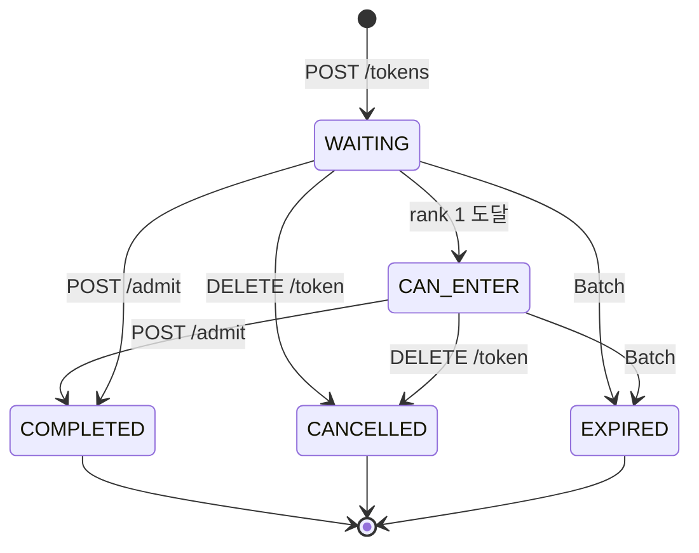

# 📄 Queue Platform — 기능 정의서 (FRS)

> 버전: v1.5 | 상태: 확정 | 대상: 실제 구현 범위

---

## 1. 개요

### 목적

대규모 트래픽 상황에서 서버 부하를 제어하기 위해 대기열을 외부 플랫폼으로 분리한다.

### 핵심 원칙

```
Platform  → 순서(순번)만 관리
Tenant    → 슬롯 관리 + 입장 제어
유저      → Platform에 직접 Polling
세션 관리 → Tenant 책임 (Platform 관여 안 함)
```

### 핵심 개념

| 용어 | 설명 |
|------|------|
| Tenant | 플랫폼을 사용하는 B2B 고객사 |
| Queue | Tenant가 생성하는 대기열 단위 |
| Token | 대기열 참여 단위. 순번은 Redis Sorted Set 전담. 메타데이터는 DB 저장 |
| Enqueue | Tenant 서버가 유저 대신 Platform에 대기열 등록 요청 |
| Polling | 유저가 Platform에 직접 순위 확인 요청 |
| isFirst | rank = 1 도달 여부. 클라이언트가 입장 가능 여부를 판단하는 플래그 |
| CAN_ENTER | 내부 Token 상태값. rank 1 도달 시 전이. 클라이언트에 직접 노출 안 함 |
| Admit | Tenant 서버가 슬롯 여유 확인 후 Platform에 입장 허용 요청 |
| maxCapacity | 대기열 최대 인원 (Tenant 슬롯 수와 무관) |
| waitingTtl | 대기 중 절대 만료 시간 (기본 7200s) |
| inactiveTtl | 마지막 Polling 이후 비활동 만료 시간 (기본 1800s) |
| sliceCount | Platform 자동 계산. ceil(maxCapacity ÷ 100,000) |
| global-seq | 슬라이스 간 FIFO 보장을 위한 전체 순번 |
| avgWaitingTime | 평균 대기 시간 (issuedAt ~ completedAt). ETA 계산에 사용 |

### Token 저장 구조

```
DB tokens 테이블:
  tokenId, userId, queueId, status, issuedAt, completedAt ...
  → 메타데이터 원본. Redis 장애 시 복구 기준

Redis Sorted Set:
  Key: queue:{tenantId}:{queueId}:{sliceNumber}
  member: tokenId, score: global-seq
  → 순번 관리 전담. FIFO 보장

Redis String:
  Key: token-status:{tokenId}
  Value: WAITING / CAN_ENTER / COMPLETED / CANCELLED / EXPIRED
  → 폴링 응답 상태 캐시. rank 1 도달 시 CAN_ENTER로 전이
```

---

## 2. 전체 흐름

```
① Tenant → Platform: Enqueue
   POST /queues/:queueId/tokens { userId }
   ← { token, rank, isFirst: false, message, estimatedWaitSeconds }
   Tenant → 유저: token 전달

② 유저 → Platform: Polling (직접, 5초 간격)
   GET /queues/:queueId/tokens/:token
   ← { rank, isFirst: false, message: "대기 중입니다. 현재 N번째입니다." }

③ rank = 1 도달 → CAN_ENTER 전이
   GET /queues/:queueId/tokens/:token
   ← { rank: 1, isFirst: true, message: "입장 가능합니다." }
   유저 → Tenant: "나 ready야"

④ Tenant: 슬롯 여유 확인
   여유 없음 → 유저에게 "대기" (10초 후 재시도)
   여유 있음 → GET /tokens/:token/status 먼저 확인
     ← { rank: 1, isFirst: true }  → Admit 호출
     ← { rank: 2, isFirst: false } → 이미 만료됨. 스킵
     → POST /tokens/:token/admit
     ← { status: "COMPLETED", completedAt }
   Tenant → 유저: 입장 허용

(종료 별도 없음. Admit = COMPLETED)
```

---

## 3. 기능 목록

| 영역 | 기능 | 구현 범위 |
|------|------|-----------|
| Tenant 관리 | 회원가입 / 로그인 / JWT 인증 / 비밀번호 재설정 | ✅ |
| API Key 관리 | 발급 / 검증 / Revoke / Rate limit | ✅ |
| Queue 관리 | 생성 / 수정 / 조회 / 정지 / 재개 / 삭제 | ✅ |
| Token Lifecycle | Enqueue / Polling / Status / Admit / Dequeue | ✅ |
| TTL / Batch | 만료 처리 / Redis 싱크 / 과금 스냅샷 | ✅ |
| 다국어 메시지 | messages.properties 기반 한/영/일 지원 | ✅ |

---

## 4. API 명세

### 4.1 Queue Engine API

| Method | Path | 인증 | 호출 주체 | 설명 |
|--------|------|------|----------|------|
| `POST` | `/api/v1/queues/:queueId/tokens` | X-API-Key | Tenant 서버 | Enqueue |
| `GET` | `/api/v1/queues/:queueId/tokens/:token` | token | 유저 직접 | Polling |
| `GET` | `/api/v1/tokens/:token/status` | X-API-Key | Tenant 서버 | 토큰 상태 확인 |
| `POST` | `/api/v1/tokens/:token/admit` | X-API-Key | Tenant 서버 | Admit → COMPLETED |
| `DELETE` | `/api/v1/queues/:queueId/tokens/:token` | X-API-Key | Tenant 서버 | 이탈 → CANCELLED |

### 4.2 관리 API

| Method | Path | 인증 | 설명 |
|--------|------|------|------|
| `POST` | `/api/v1/tenants/signup` | - | 회원가입 |
| `POST` | `/api/v1/tenants/login` | - | 로그인 |
| `POST` | `/api/v1/tenants/refresh` | Refresh Token | 토큰 재발급 |
| `POST` | `/api/v1/queues` | JWT | 대기열 생성 |
| `PATCH` | `/api/v1/queues/:queueId` | JWT | 대기열 수정 |
| `GET` | `/api/v1/queues/:queueId` | JWT | 대기열 조회 |
| `POST` | `/api/v1/queues/:queueId/pause` | JWT | 대기열 정지 |
| `POST` | `/api/v1/queues/:queueId/resume` | JWT | 대기열 재개 |
| `DELETE` | `/api/v1/queues/:queueId` | JWT | 대기열 삭제 |
| `POST` | `/api/v1/tenants/me/api-keys` | JWT | API Key 발급 |
| `GET` | `/api/v1/tenants/me/api-keys` | JWT | API Key 목록 |
| `DELETE` | `/api/v1/tenants/me/api-keys/:id` | JWT | API Key Revoke |

---

## 5. Queue 설정

### 생성 파라미터

| 파라미터 | 타입 | 필수 | 기본값 | 설명 |
|----------|------|------|--------|------|
| name | String | ✅ | - | 큐 이름 (Tenant 내 유일) |
| maxCapacity | Int | ✅ | - | 대기열 최대 인원 |
| waitingTtl | Int(초) | ❌ | 7200 | 대기 중 절대 만료 시간 |
| inactiveTtl | Int(초) | ❌ | 1800 | 비활동 만료 시간 |

> `sliceCount = ceil(maxCapacity ÷ 100,000)` Platform 자동 계산

### Queue 상태

| 상태 | 설명 |
|------|------|
| ACTIVE | 정상 운영. Enqueue 허용 |
| PAUSED | 일시 정지. 신규 Enqueue 차단. 기존 대기자 유지 |
| DRAINING | 삭제 진행 중. 잔여 토큰 순차 만료 |
| DELETED | 삭제 완료 |

---

## 6. Token Lifecycle

### 6.1 상태 머신



| 상태 | 내부 의미 | 클라이언트 응답 |
|------|----------|----------------|
| `WAITING` | 대기 중 | `isFirst: false` |
| `CAN_ENTER` | rank 1 도달. 입장 가능 | `isFirst: true` |
| `COMPLETED` | 입장 완료 | `isFirst: false` |
| `CANCELLED` | 유저 자발적 이탈 | `isFirst: false` |
| `EXPIRED` | TTL 초과 만료 | `isFirst: false` |

> ADMITTED 상태 없음. Admit 즉시 COMPLETED 처리.
> CAN_ENTER는 내부 상태값. 클라이언트에게 직접 노출 안 함.

### 6.2 Enqueue

```
POST /api/v1/queues/:queueId/tokens
호출 주체: Tenant 서버 (X-API-Key 인증)
Body: { userId: string }

처리 흐름:
1. API Key 검증 (Redis 캐시 60s → DB fallback)
2. Rate limit 체크 (per-key 100rps)
3. 큐 상태 확인 (ACTIVE만 허용)
4. userId 중복 체크
   GET queue-user:{t}:{q}:{userId} → 있으면 기존 토큰 반환 (멱등)
5. 전체 용량 체크
   모든 슬라이스 ZCARD 합산 ≥ totalCapacity → 429
6. Lua Script 원자 실행
   ① INCR global-seq:{t}:{q} → seq
   ② sliceNumber = seq % sliceCount
   ③ ZADD queue:{t}:{q}:{slice} NX {seq} {tokenId}
   ④ SET token-status:{tokenId} WAITING EX waitingTtl
7. 비동기: INCR billing-count, SET queue-user 역인덱스, DB INSERT

Response 200:
{
  "token": "tok_Kx9mZ3",
  "rank": 42,
  "isFirst": false,
  "message": "대기 중입니다. 현재 42번째입니다.",
  "estimatedWaitSeconds": 300,
  "issuedAt": "2026-03-19T10:00:00Z"
}
```

### 6.3 Polling

```
GET /api/v1/queues/:queueId/tokens/:token
호출 주체: 유저 직접 (token으로 인증. API Key 불필요)

처리 흐름:
1. token 유효성 확인 (DB 조회)
2. GET token-status:{tokenId} → 현재 상태 조회
3. 전체 순위 계산 (Lua Script)
   ZSCORE → mySeq
   모든 슬라이스 ZCOUNT 0~(mySeq-1) 합산
   rank = 합산 + 1
4. SET token-last-active:{tokenId} EX inactiveTtl
5. HGET queue-stats:{t}:{q} avgWaitingTime → ETA 계산
6. Accept-Language 헤더 기반 다국어 메시지 조회

Response 200:
{
  "token": "tok_Kx9mZ3",
  "rank": 1,
  "isFirst": true,
  "message": "입장 가능합니다.",
  "estimatedWaitSeconds": 0
}

isFirst = true (내부 상태 CAN_ENTER):
  유저 → Tenant: "나 ready야" 알림

isFirst 변환 규칙:
  CAN_ENTER → isFirst: true  (내부 상태값 클라이언트 노출 안 함)
  그 외      → isFirst: false
```

### 6.4 Status 조회

```
GET /api/v1/tokens/:token/status
호출 주체: Tenant 서버 (X-API-Key 인증)
용도: Admit 전 상태 사전 확인

Response 200:
{
  "token": "tok_Kx9mZ3",
  "rank": 1,
  "isFirst": true,
  "message": "입장 가능합니다."
}

isFirst: true  → Admit 호출 가능
isFirst: false → 아직 맨 앞 아님 또는 이미 만료
```

### 6.5 Admit → COMPLETED

```
POST /api/v1/tokens/:token/admit
호출 주체: Tenant 서버 (X-API-Key 인증)

처리 흐름:
1. 토큰 상태 확인 (WAITING 또는 CAN_ENTER + globalRank = 1만 허용)
   조건 미충족 → 409 QE_008_NOT_READY
2. DB status = COMPLETED ← 먼저 (원자성 전략)
3. Redis ZREM             ← 나중
4. Lua Script: 다음 1등 조회 → CAN_ENTER 전이
5. completedAt = now 기록
6. avgWaitingTime 갱신
   HINCRBYFLOAT waitingTimeSum, HINCRBY waitingTimeCount, HSET avgWaitingTime

원자성:
  DB 성공 + ZREM 실패 → Batch 싱크 스케줄러 5분 내 복구

Response 200:
{
  "token": "tok_Kx9mZ3",
  "status": "COMPLETED",
  "completedAt": "2026-03-19T10:05:00Z"
}
```

### 6.6 이탈 → CANCELLED

```
DELETE /api/v1/queues/:queueId/tokens/:token
호출 주체: Tenant 서버 (X-API-Key 인증)

조건: WAITING 또는 CAN_ENTER 상태만 허용
처리:
  DB status = CANCELLED + cancelledAt 기록 (먼저)
  Redis ZREM (나중)
  CAN_ENTER 상태였으면 → 다음 1등 CAN_ENTER 전이
  DEL token-status:{tokenId}
  DEL queue-user:{t}:{q}:{userId} 역인덱스

Response 200:
{
  "status": "CANCELLED",
  "cancelledAt": "2026-03-19T10:05:00Z"
}
```

---

## 7. TTL 정책

### Dual TTL (WAITING / CAN_ENTER 토큰)

| TTL | 기본값 | 기준 | Batch 감지 방법 |
|-----|--------|------|-----------------| 
| waitingTtl | 7200s | 등록 시각 | `ZRANGEBYSCORE 0 ~ (now_ms - waitingTtl_ms)` |
| inactiveTtl | 1800s | 마지막 Polling | `EXISTS token-last-active:{tokenId}` = 0 |

둘 중 먼저 도달하는 것으로 EXPIRED 처리.

> `CAN_ENTER` 상태도 동일한 TTL 정책 적용.
> CAN_ENTER 만료 시 Batch가 다음 1등 토큰에 CAN_ENTER 전이.

### expiredReason

| 값 | 원인 |
|----|------|
| `WAITING_TTL` | waitingTtl 초과 |
| `INACTIVE_TTL` | Polling 없어 비활동 |

---

## 8. Redis 데이터 구조

| Key 패턴 | 자료구조 | TTL | 역할 |
|----------|----------|-----|------|
| `queue:{t}:{q}:{slice}` | Sorted Set | 없음 | 슬라이스별 대기열. score=global-seq |
| `global-seq:{t}:{q}` | String | 없음 | 글로벌 순번 채번. INCR 원자 실행 |
| `queue-meta:{t}:{q}` | Hash | 없음 | sliceCount, totalCapacity 등 |
| `queue-stats:{t}:{q}` | Hash | 없음 | avgWaitingTime, waitingTimeSum, waitingTimeCount |
| `queue-user:{t}:{q}:{userId}` | String | waitingTtl | userId → tokenId 역인덱스. 멱등 O(1) |
| `token-last-active:{tokenId}` | String | inactiveTtl | 비활동 TTL 감지. Polling 호출마다 갱신 |
| `token-status:{tokenId}` | String | WAITING: waitingTtl / 종료 후 5분 | 토큰 상태 캐시. CAN_ENTER 전이 포함 |
| `apikey-cache:{sha256}` | String | 60s | API Key 인증 캐시. DB QPS ≈ 0 |
| `billing-count:{t}:{yyyyMM}` | String | 월말+7일 | Enqueue 과금 카운터 |

### token-status TTL 전략

| 상태 | TTL |
|------|-----|
| `WAITING` | waitingTtl (대기 만료 시간과 동일) |
| `CAN_ENTER` | inactiveTtl (비활동 감지 기준과 동일) |
| `COMPLETED` / `CANCELLED` / `EXPIRED` | 300s (클라이언트 마지막 폴링 대응) |

### queue-stats Hash 필드

```
avgWaitingTime   → issuedAt ~ completedAt 평균 대기 시간 (초)
waitingTimeSum   → 누적 대기 시간 합계. HINCRBYFLOAT
waitingTimeCount → 누적 Admit 건수. HINCRBY

갱신 시점: Admit(COMPLETED) 시
```

### 다국어 메시지 (messages.properties)

```properties
# messages.properties (기본 한국어)
queue.status.waiting=대기 중입니다. 현재 {0}번째입니다.
queue.status.can_enter=입장 가능합니다.
queue.status.completed=입장이 완료됐습니다.
queue.status.cancelled=대기열이 취소됐습니다.
queue.status.expired=대기 시간이 초과됐습니다.

# messages_en.properties
queue.status.waiting=You are currently in position {0}.
queue.status.can_enter=You can now enter.
queue.status.completed=Entry completed.
queue.status.cancelled=Queue cancelled.
queue.status.expired=Queue time has expired.

# messages_ja.properties
queue.status.waiting=現在{0}番目です。
queue.status.can_enter=入場可能です。
queue.status.completed=入場が完了しました。
queue.status.cancelled=キューがキャンセルされました。
queue.status.expired=待機時間が超過しました。
```

---

## 9. 동시성 제어

### Enqueue Lua Script

```lua
local seq = redis.call('INCR', KEYS[1])
local slice = tonumber(seq) % tonumber(ARGV[1])
local key = KEYS[2] .. ':' .. slice
redis.call('ZADD', key, 'NX', seq, ARGV[2])
redis.call('SET', 'token-status:' .. ARGV[2], 'WAITING', 'EX', ARGV[3])
return seq
```

### 전체 순위 계산 Lua Script

```lua
local total = 0
local mySeq = tonumber(ARGV[1])
for i = 0, tonumber(ARGV[2]) - 1 do
    local key = KEYS[1] .. ':' .. i
    total = total + redis.call('ZCOUNT', key, 0, mySeq - 1)
end
return total + 1
```

### CAN_ENTER 전이 Lua Script

```lua
-- 누군가 빠질 때 원자적으로 다음 1등 CAN_ENTER 전이
redis.call('ZREM', KEYS[1], ARGV[1])
redis.call('SET', 'token-status:' .. ARGV[1], ARGV[2], 'EX', 300)
local next = redis.call('ZRANGE', KEYS[1], 0, 0)
if #next > 0 then
    redis.call('SET', 'token-status:' .. next[1], 'CAN_ENTER', 'EX', 300)
end
return next
```

### 동시성 문제별 해결

| 문제 | 해결 |
|------|------|
| 중복 Enqueue | queue-user 역인덱스 + ZADD NX |
| 용량 초과 경쟁 | Lua Script 원자 실행 |
| 동시 Admit | DB 먼저 + ZREM 나중. Batch 싱크 자동 복구 |
| CAN_ENTER 누락 | Lua Script 내 ZREM + ZRANGE 원자 처리 |
| 동시 Dequeue | ZREM 단일 명령 원자적. 0 반환 시 스킵 |

---

## 10. ETA 계산

```
estimatedWaitSeconds = rank × avgWaitingTime

avgWaitingTime = waitingTimeSum ÷ waitingTimeCount
               = 누적(issuedAt ~ completedAt) ÷ 누적 건수

갱신: Admit(COMPLETED) 시 Redis에서 실시간 계산
초기값 없음: estimatedWaitSeconds = null
```

---

## 11. 에러 코드

| 코드 | HTTP | 상황 |
|------|------|------|
| `AK_001_UNAUTHORIZED` | 401 | API Key 무효 또는 REVOKED |
| `TK_001_INVALID_TOKEN` | 401 | token 무효 (Polling 인증 실패) |
| `RL_001_KEY_LIMIT` | 429 | per-key 100rps 초과 |
| `QM_001_NOT_FOUND` | 404 | 큐 없음 |
| `QM_004_NOT_ACTIVE` | 503 | 큐 PAUSED / DRAINING |
| `QE_001_CAPACITY_EXCEEDED` | 429 | maxCapacity 초과 |
| `QE_006_INVALID_STATUS` | 409 | 상태 전환 불가 |
| `QE_008_NOT_READY` | 409 | Admit 시 globalRank ≠ 1 |
| `CM_001_INVALID_PARAM` | 400 | 파라미터 오류 |
| `CM_003_INTERNAL_ERROR` | 500 | 서버 내부 오류 |
| `CM_004_SERVICE_UNAVAILABLE` | 503 | Redis 장애 |

---

## 12. Batch 처리

| Job | 주기 | 기준 | 처리 |
|-----|------|------|------|
| `TokenExpiryJob` | 30초 | Redis | WAITING/CAN_ENTER 토큰 TTL 만료 → EXPIRED |
| `RedisSyncJob` | 5분 | DB | Redis 불일치 토큰 정합성 복구 |
| `BillingSnapshotJob` | 1시간 | Redis | billing-count → DB 저장 |

### TokenExpiryJob (30초)

```
Redis 기준으로 만료 토큰 처리

1. SCAN으로 모든 활성 큐 조회
2. ZRANGEBYSCORE로 waitingTtl 초과 토큰 조회 → WAITING_TTL
3. EXISTS token-last-active 없는 토큰 조회   → INACTIVE_TTL
4. 각 토큰마다:
   ① DB EXPIRED 업데이트 (먼저)
   ② Redis ZREM + DEL token-status (나중)
   ③ CAN_ENTER 상태였으면 → 다음 1등 CAN_ENTER 전이

멱등 설계:
  WHERE status IN ('WAITING', 'CAN_ENTER') 필터
  → 이미 종료 상태면 조회 안 됨
```

### RedisSyncJob (5분)

```
DB 기준으로 Redis 불일치 복구

1. DB에서 최근 5분간 상태 변경된 토큰 조회
   (COMPLETED / CANCELLED / EXPIRED)
2. 각 토큰마다:
   GET token-status:{tokenId} 와 DB 상태 비교
   → 일치: 패스
   → 불일치:
       ZREM (Sorted Set 잔류 시)
       SET token-status 올바른 값으로 덮어쓰기
3. CAN_ENTER가 날아간 케이스:
   ZRANGE 0 0으로 다음 1등 조회
   CAN_ENTER 전이 + DB 업데이트
```

---

## 13. 비기능 요구사항

### 성능 목표

| API | p99 목표 | 목표 TPS | 산정 근거 |
|-----|----------|----------|----------|
| Enqueue | < 100ms | 200 rps | 10,000명 5분 집중 유입 |
| Polling | < 50ms | 2,000 rps | 10,000명 ÷ 5초 간격 |
| Admit | < 100ms | 10 rps | throughput 기준 |

### 안정성

| 장애 | 영향 | 대응 |
|------|------|------|
| Redis 전체 다운 | Enqueue/Polling 중단 | Circuit Breaker → 503 |
| Batch 중단 | TTL 만료 지연, Redis 싱크 지연 | 재기동 후 멱등 재실행 |
| MySQL 다운 | Enqueue/Admit 중단 | Circuit Breaker → 503 |

### Blocking 방지

```
ReactiveRedisTemplate → Redis Non-Blocking
R2DBC               → DB Non-Blocking
BCrypt              → Schedulers.boundedElastic() 격리
```

---

## 🔥 핵심 원칙

> Platform은 **순서만 관리**한다.
> 입장 여부는 **Tenant 서버가 결정**한다.
> 유저는 **Platform에 직접 Polling**한다.
> Admit = COMPLETED. **Platform은 세션을 모른다.**
> DB 먼저, ZREM 나중 — **잔류가 유실보다 안전**하다.
> CAN_ENTER는 **내부 상태**. 클라이언트에게는 **isFirst 플래그**로만 노출.
