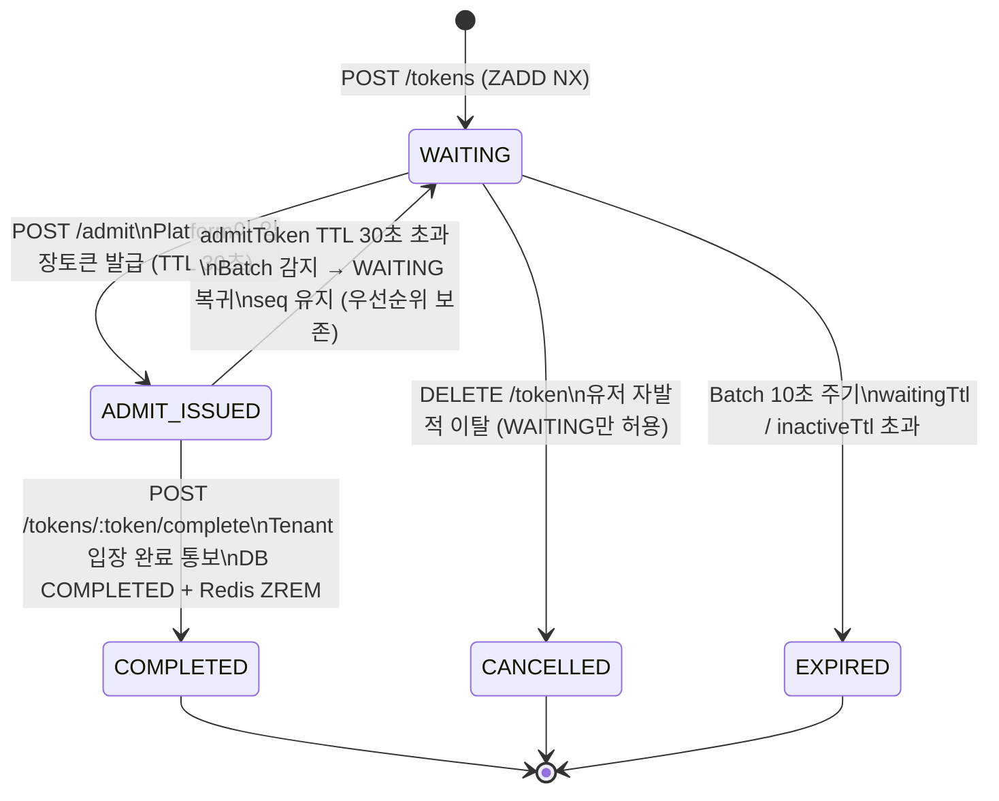

# 📄 Queue Platform — 기능 정의서 (FRS)

> 버전: v1.6 | 상태: 확정 | 대상: 실제 구현 범위

---

## 1. 개요

### 목적

대규모 트래픽 상황에서 서버 부하를 제어하기 위해 대기열을 외부 플랫폼으로 분리한다.

### 핵심 원칙

```
Platform  → 순서(순번)만 관리
Tenant    → 슬롯 관리 + 입장 제어
유저      → Platform에 직접 Polling
세션 관리 → Tenant 책임 (Platform 관여 안 함)
```

### 핵심 개념

| 용어 | 설명 |
|------|------|
| Tenant | 플랫폼을 사용하는 B2B 고객사 |
| Queue | Tenant가 생성하는 대기열 단위 |
| Token | 대기열 참여 단위. 순번은 Redis Sorted Set 전담. 메타데이터는 DB 저장 |
| 대기토큰 | Enqueue 시 발급. 유저가 Polling에 사용 |
| 입장토큰 (admitToken) | admit 시 발급. TTL 30초. 유저가 Tenant에 전달 |
| Enqueue | Tenant 서버가 유저 대신 Platform에 대기열 등록 요청 |
| Polling | 유저가 Platform에 직접 순위 확인 요청 |
| admit | Tenant 서버가 슬롯 여유 생길 때 Platform에 N명 입장 토큰 요청 (Backpressure Pull) |
| verify | Tenant가 유저로부터 받은 admitToken 유효성 확인 (상태 변경 없음) |
| complete | Tenant가 유저 입장 완료 후 Platform에 통보 → COMPLETED + ZREM |
| maxCapacity | 대기열 최대 인원 (Tenant 슬롯 수와 무관) |
| waitingTtl | 대기 중 절대 만료 시간 (기본 7200s) |
| inactiveTtl | 마지막 Polling 이후 비활동 만료 시간 (기본 300s) |
| sliceCount | Platform 자동 계산. ceil(maxCapacity ÷ 100,000) |
| global-seq | 슬라이스 간 FIFO 보장을 위한 전체 순번 |
| seq | 토큰별 global-seq 값. ADMIT_ISSUED→WAITING 복귀 시 score 복원에 사용 |
| avgWaitingTime | 평균 대기 시간 (issuedAt ~ completedAt). ETA 계산에 사용 |

### Token 저장 구조

```
DB tokens 테이블:
  tokenId, userId, queueId, seq, status, issuedAt, completedAt
  → 메타데이터 원본. Redis 장애 시 복구 기준
  → seq: ADMIT_ISSUED→WAITING 복귀 시 Sorted Set score 복원에 사용

Redis Sorted Set:
  Key: queue:{tenantId}:{queueId}:{sliceNumber}
  member: tokenId, score: global-seq
  → 순번 관리 전담. FIFO 보장
```

---

## 2. 전체 흐름

```
① Tenant → Platform: Queue 생성
   POST /queues { name, maxCapacity, waitingTtl, inactiveTtl }
   ← { queueId }

② 유저 서비스 접속 → Tenant 슬롯 확인
   여유 있음 → 바로 입장
   여유 없음 → Enqueue 결정

③ Tenant → Platform: Enqueue
   POST /queues/:queueId/tokens { userId }
   ← { token, globalRank, estimatedWaitSeconds }
   Tenant → 유저: 대기토큰 + Polling URL 전달

④ 유저 → Platform: Polling (직접, 5초 간격)
   GET /queues/:queueId/tokens/:token
   ← { globalRank, estimatedWaitSeconds, ready: false }

⑤ Tenant → Platform: admit (슬롯 여유 생길 때마다, Backpressure Pull)
   POST /queues/:queueId/admit { count: N }
   ← { admitTokens: [ { userId, admitToken }, ... ] }
   Platform: 앞 N명 → ADMIT_ISSUED + admitToken 발급 (TTL 30초)

⑥ 유저 Polling 응답에 admitToken 포함 (ADMIT_ISSUED 상태일 때)
   GET /queues/:queueId/tokens/:token
   ← { globalRank: 1, ready: true, admitToken: "at_xxx" }
   유저 → Tenant: admitToken 전달

⑦ Tenant → Platform: verify (유효성 확인만. 상태 변경 없음)
   POST /admit-tokens/:admitToken/verify
   ← { valid: true, userId }

⑧ Tenant: 유효한 유저 입장 허용

⑨ Tenant → Platform: complete (입장 완료 통보)
   POST /tokens/:token/complete { admitToken: "at_xxx" }
   Platform: COMPLETED + ZREM + avgWaitingTime 갱신
   ← { status: COMPLETED, completedAt }

(admitToken TTL 30초 초과 시 → WAITING 복귀. seq 유지. 우선순위 보존)
```

---

## 3. 기능 목록

| 영역 | 기능 | 구현 범위 |
|------|------|-----------|
| Tenant 관리 | 회원가입 / 로그인 / JWT 인증 / 비밀번호 재설정 | ✅ |
| API Key 관리 | 발급 / 검증 / Revoke / Rate limit | ✅ |
| Queue 관리 | 생성 / 수정 / 조회 / 정지 / 재개 / 삭제 | ✅ |
| Token Lifecycle | Enqueue / Polling / admit / verify / complete / 이탈 | ✅ |
| TTL / Batch | 만료 처리 / 과금 스냅샷 / INSERT 재처리 | ✅ |

---

## 4. API 명세

### 4.1 Queue Engine API

| Method | Path | 인증 | 호출 주체 | 설명 |
|--------|------|------|----------|------|
| `POST` | `/api/v1/queues/:queueId/tokens` | X-API-Key | Tenant 서버 | Enqueue → 대기토큰 발급 |
| `GET` | `/api/v1/queues/:queueId/tokens/:token` | token | 유저 직접 | Polling |
| `POST` | `/api/v1/queues/:queueId/admit` | X-API-Key | Tenant 서버 | N명 입장토큰 발급 → ADMIT_ISSUED |
| `POST` | `/api/v1/admit-tokens/:admitToken/verify` | X-API-Key | Tenant 서버 | 입장토큰 유효성 확인 (상태 변경 없음) |
| `POST` | `/api/v1/tokens/:token/complete` | X-API-Key | Tenant 서버 | 입장 완료 통보 → COMPLETED + ZREM |
| `DELETE` | `/api/v1/queues/:queueId/tokens/:token` | X-API-Key | Tenant 서버 | 이탈 → CANCELLED (WAITING만) |

### 4.2 관리 API

| Method | Path | 인증 | 설명 |
|--------|------|------|------|
| `POST` | `/api/v1/tenants/signup` | - | 회원가입 |
| `POST` | `/api/v1/tenants/login` | - | 로그인 |
| `POST` | `/api/v1/tenants/refresh` | Refresh Token | 토큰 재발급 |
| `POST` | `/api/v1/queues` | JWT | 대기열 생성 |
| `PATCH` | `/api/v1/queues/:queueId` | JWT | 대기열 수정 |
| `GET` | `/api/v1/queues/:queueId` | JWT | 대기열 조회 |
| `POST` | `/api/v1/queues/:queueId/pause` | JWT | 대기열 정지 |
| `POST` | `/api/v1/queues/:queueId/resume` | JWT | 대기열 재개 |
| `DELETE` | `/api/v1/queues/:queueId` | JWT | 대기열 삭제 |
| `POST` | `/api/v1/tenants/me/api-keys` | JWT | API Key 발급 |
| `GET` | `/api/v1/tenants/me/api-keys` | JWT | API Key 목록 |
| `DELETE` | `/api/v1/tenants/me/api-keys/:id` | JWT | API Key Revoke |

---

## 5. Queue 설정

### 생성 파라미터

| 파라미터 | 타입 | 필수 | 기본값 | 설명 |
|----------|------|------|--------|------|
| name | String | ✅ | - | 큐 이름 (Tenant 내 유일) |
| maxCapacity | Int | ✅ | - | 대기열 최대 인원 |
| waitingTtl | Int(초) | ❌ | 7200 | 대기 중 절대 만료 시간 |
| inactiveTtl | Int(초) | ❌ | 300 | 비활동 만료 시간 |

> `sliceCount = ceil(maxCapacity ÷ 100,000)` Platform 자동 계산
> maxCapacity ≤ 100,000 → sliceCount = 1

### Queue 상태

| 상태 | 설명 |
|------|------|
| ACTIVE | 정상 운영. Enqueue 허용 |
| PAUSED | 일시 정지. 신규 Enqueue 차단. 기존 대기자 유지 |
| DRAINING | 삭제 진행 중. 잔여 토큰 순차 만료 |
| DELETED | 삭제 완료 |

---

## 6. Token Lifecycle

### 6.1 상태 머신



> verify: ADMIT_ISSUED 상태 유지 (상태 변경 없음). 유효성 확인만.
> complete: COMPLETED + ZREM. Tenant가 입장 완료 후 명시적 통보.
> ADMIT_ISSUED에서 이탈 시도 → 409 (admitToken TTL 후 WAITING 복귀 후 이탈 가능)

### 6.2 Enqueue

```
POST /api/v1/queues/:queueId/tokens
호출 주체: Tenant 서버 (X-API-Key 인증)
Body: { userId: string }

처리 흐름:
1. API Key 검증 (Redis 캐시 60s → DB fallback)
2. Rate limit 체크 (per-key 100rps)
3. 큐 상태 확인 (ACTIVE만 허용)
4. userId 중복 체크
   GET queue-user:{t}:{q}:{userId} → 있으면 기존 토큰 반환 (멱등)
5. 전체 용량 체크
   모든 슬라이스 ZCARD 합산 ≥ totalCapacity → 429
6. Bulk Lua Script 원자 실행 (500건 묶음 / Adaptive Batching)
   ① INCRBY global-seq:{t}:{q} N → startSeq~endSeq 블록 채번
   ② 슬라이스별 ZADD multi-member NX (라운드로빈)
      slice = (seq-1) % sliceCount
7. DB INSERT (Reactor 비동기 백그라운드 — 100건 Bulk / 3회 재시도)
8. 비동기: INCR billing-count, SET queue-user 역인덱스

Response 200:
{
  "token": "tok_Kx9mZ3",
  "globalRank": 42,
  "estimatedWaitSeconds": 300,
  "status": "WAITING",
  "issuedAt": "2026-03-19T10:00:00Z"
}
```

### 6.3 Polling

```
GET /api/v1/queues/:queueId/tokens/:token
호출 주체: 유저 직접 (token으로 인증. API Key 불필요)

처리 흐름:
1. token 유효성 확인
   Redis GET token-info:{tokenId} (캐시 TTL 5초)
   → 미스 시 DB SELECT → 캐시 저장
   → status 확인 (WAITING / ADMIT_ISSUED만 유효)
2. 전체 순위 계산 (Lua Script)
   ZSCORE → mySeq
   모든 슬라이스 ZCOUNT 0~(mySeq-1) 합산
   globalRank = 합산 + 1
3. SET token-last-active:{tokenId} EX inactiveTtl
4. HGET queue-stats:{t}:{q} avgWaitingTime → ETA 계산
5. admitToken 확인 (status = ADMIT_ISSUED 일 때)
   Redis GET admit-token:{tokenId} → 응답에 포함

Response 200 (WAITING):
{
  "token": "tok_Kx9mZ3",
  "globalRank": 42,
  "estimatedWaitSeconds": 300,
  "status": "WAITING",
  "ready": false,
  "admitToken": null
}

Response 200 (ADMIT_ISSUED):
{
  "token": "tok_Kx9mZ3",
  "globalRank": 1,
  "estimatedWaitSeconds": 0,
  "status": "ADMIT_ISSUED",
  "ready": true,
  "admitToken": "at_abc123"
}
```

### 6.4 Admit → ADMIT_ISSUED

```
POST /api/v1/queues/:queueId/admit
호출 주체: Tenant 서버 (X-API-Key 인증)
          슬롯 여유 생길 때마다 호출 (Backpressure Pull 방식)
Body: { count: N, requestId: "req_abc" }  최대 1000명

[Backpressure 패턴]
  Publisher  = 대기열 (유저 토큰)
  Subscriber = Tenant (처리 가능한 만큼만 request(N))
  → Tenant가 소화 가능한 인원만 Pull → 과부하 방지

[순서 보장]
  Tenant 요청 → Redis List RPUSH (순서대로 적재)
  Platform 워커 → BLPOP (완료 후 다음 처리)
  워커 단위: Queue 단위 / 워커 풀 10개
  멱등성: Redis admit-idem:{requestId} EX 300

처리 흐름:
1. 멱등성 확인 (admit-idem:{requestId} 존재 시 기존 결과 반환)
2. Redis List에 요청 적재 (순서 보장)
3. 워커가 BLPOP으로 순서대로 꺼냄
4. Lua Script 원자 실행
   각 슬라이스 ZRANGE WITHSCORES → 후보 수집
   Lua 내부 score 정렬 → 상위 N명 선택
   슬라이스별 ZREM multi-member
5. DB에서 WAITING 상태 확인 + 필터링
   불일치 토큰 즉시 ZREM 정리
   부족 시 최대 3회 추가 추출
6. admitToken 생성
   SET admit-token:{tokenId} {admitToken} EX 30
7. DB UPDATE status = ADMIT_ISSUED (100건씩 / 10ms 대기)
   SET token-info:{tokenId} 캐시 즉시 갱신

Response 200:
{
  "admitTokens": [
    { "userId": "user1", "admitToken": "at_abc123" },
    { "userId": "user2", "admitToken": "at_xyz789" }
  ]
}

admitToken TTL: 30초
만료 시: WAITING 복귀 (seq 유지 → 우선순위 보존)
         DB seq 컬럼으로 Redis ZADD score 복원
```

### 6.5 Verify (유효성 확인만 — 상태 변경 없음)

```
POST /api/v1/admit-tokens/:admitToken/verify
호출 주체: Tenant 서버 (X-API-Key 인증)
용도: 유저로부터 받은 admitToken 유효성 확인

처리 흐름:
1. Redis GET admit-token:{admitToken} → tokenId 조회
   없으면 → 404 TK_002_INVALID_ADMIT_TOKEN (만료 or 무효)
2. DB token 상태 확인 (ADMIT_ISSUED)
   아니면 → 409 QE_006_INVALID_STATUS
3. 상태 변경 없음 — 조회만

Response 200:
{
  "valid": true,
  "userId": "user1",
  "tokenId": "tok_Kx9mZ3"
}
```

### 6.6 Complete → COMPLETED

```
POST /api/v1/tokens/:token/complete
호출 주체: Tenant 서버 (X-API-Key 인증)
용도: 유저 입장 완료 후 Platform에 통보 → 대기열에서 제거

처리 흐름:
1. API Key 검증
2. Redis GET admit-token:{tokenId} → admitToken 유효 확인
   없으면 → 404 TK_002_INVALID_ADMIT_TOKEN
3. DB token 상태 확인 (ADMIT_ISSUED)
   아니면 → 409 QE_006_INVALID_STATUS
4. DB status = COMPLETED (먼저 — 원자성 전략)
   completed_at = now()
5. Redis ZREM (나중)
   DEL admit-token:{admitToken}
   DEL token-info:{tokenId} 캐시
6. avgWaitingTime 갱신
   waitingSeconds = now - issuedAt
   HINCRBYFLOAT waitingTimeSum {waitingSeconds}
   HINCRBY waitingTimeCount 1
   HSET avgWaitingTime {sum ÷ count}

원자성:
  DB 성공 + ZREM 실패 → Batch 10초 내 감지 후 ZREM 재실행 (멱등)

Response 200:
{
  "status": "COMPLETED",
  "completedAt": "2026-03-19T10:05:00Z"
}
```

### 6.7 이탈 → CANCELLED

```
DELETE /api/v1/queues/:queueId/tokens/:token
호출 주체: Tenant 서버 (X-API-Key 인증)
용도: 유저가 대기 포기 시

조건: WAITING 상태만 허용
      ADMIT_ISSUED → 409 QE_006_INVALID_STATUS
      (admitToken TTL 30초 후 WAITING 복귀 후 이탈 가능)

처리: Redis ZREM + DB status = CANCELLED + cancelledAt
      DEL queue-user:{t}:{q}:{userId} 역인덱스
      DEL token-info:{tokenId} 캐시

재접속:
  역인덱스 제거 → 같은 userId 재Enqueue 가능
  새 seq 배정 (맨 뒤) — 우선순위 복구 없음 (자발적 이탈 귀책)

Response 200:
{
  "status": "CANCELLED",
  "cancelledAt": "2026-03-19T10:05:00Z"
}
```

---

## 7. TTL 정책

### WAITING 토큰 TTL

| TTL | 기본값 | 기준 | Batch 감지 방법 |
|-----|--------|------|-----------------|
| waitingTtl | 7200s | 등록 시각 | `ZRANGEBYSCORE 0 ~ (now_ms - waitingTtl_ms)` |
| inactiveTtl | 300s | 마지막 Polling | `EXISTS token-last-active:{tokenId}` = 0 |

### ADMIT_ISSUED 토큰 TTL

| TTL | 값 | 기준 | 만료 시 처리 |
|-----|-----|------|------------|
| admitTokenTtl | 30s | 입장토큰 발급 시각 | WAITING 복귀 (seq 유지) |

```
admitToken TTL 30초 근거:
  Polling 주기(5초) + 네트워크(1~2초) + 유저 행동(3~5초) + 여유 ≈ 20초
  → 30초 (여유분 포함, 최대 1000명 기준)

만료 시 우선순위 유지:
  DB tokens.seq 기준으로 Redis ZADD score 복원
  다음 admit 호출 시 앞순서면 재발급
```

### expiredReason

| 값 | 원인 | 대상 상태 |
|----|------|----------|
| `WAITING_TTL` | waitingTtl 초과 | WAITING |
| `INACTIVE_TTL` | Polling 없어 비활동 | WAITING |
| `ADMIT_TOKEN_TTL` | 입장토큰 미사용 만료 → WAITING 복귀 (EXPIRED 아님) | ADMIT_ISSUED |

---

## 8. Redis 데이터 구조

| Key 패턴 | 자료구조 | TTL | 역할 |
|----------|----------|-----|------|
| `queue:{tenantId}:{queueId}:{sliceNumber}` | Sorted Set | 없음 | 슬라이스별 대기열. score=global-seq |
| `global-seq:{tenantId}:{queueId}` | String | 없음 | 글로벌 순번 채번. INCRBY 원자 실행 |
| `queue-meta:{tenantId}:{queueId}` | Hash | 없음 | sliceCount, totalCapacity 등 |
| `queue-stats:{tenantId}:{queueId}` | Hash | 없음 | avgWaitingTime, waitingTimeSum, waitingTimeCount |
| `queue-user:{tenantId}:{queueId}:{userId}` | String | waitingTtl | userId → tokenId 역인덱스. 멱등 O(1) |
| `token-last-active:{tokenId}` | String | inactiveTtl(300s) | 비활동 TTL 감지. Polling 호출마다 갱신 |
| `token-info:{tokenId}` | String | 5s | Polling 캐시. DB QPS ≈ 0. 상태 변경 시 즉시 갱신 |
| `admit-token:{tokenId}` | String | 30s | 입장토큰. verify/complete 시 조회 |
| `admit-request-queue:{tenantId}:{queueId}` | List | 없음 | admit 요청 순서 보장. RPUSH/BLPOP |
| `admit-idem:{requestId}` | String | 300s | admit 중복 요청 멱등성 |
| `apikey-cache:{sha256Hash}` | String | 60s | API Key 인증 캐시. DB QPS ≈ 0 |
| `billing-count:{tenantId}:{yyyyMM}` | String | 월말+7일 | Enqueue 과금 카운터. AOF 영속성 적용 |

---

## 9. 동시성 제어

### Enqueue Bulk Lua Script

```lua
-- INCRBY N → seq 블록 채번 + 슬라이스별 ZADD multi-member
local count = #ARGV - 1
local endSeq = redis.call('INCRBY', KEYS[1], count)
local startSeq = endSeq - count + 1
local sliceBatch = {}
for i = 0, tonumber(ARGV[1])-1 do sliceBatch[i] = {} end
for i = 2, #ARGV do
    local seq = startSeq + (i-2)
    local slice = (seq-1) % tonumber(ARGV[1])
    table.insert(sliceBatch[slice], seq)
    table.insert(sliceBatch[slice], ARGV[i])
end
for slice = 0, tonumber(ARGV[1])-1 do
    if #sliceBatch[slice] > 0 then
        redis.call('ZADD', KEYS[2]..':'..slice, 'NX', unpack(sliceBatch[slice]))
    end
end
```

### 전체 순위 계산 Lua Script

```lua
local total = 0
local mySeq = tonumber(ARGV[1])
for i = 0, tonumber(ARGV[2]) - 1 do
    local key = KEYS[1] .. ':' .. i
    total = total + redis.call('ZCOUNT', key, 0, mySeq - 1)
end
return total + 1
```

### 동시성 문제별 해결

| 문제 | 해결 |
|------|------|
| 중복 Enqueue | queue-user 역인덱스 + ZADD NX |
| 용량 초과 경쟁 | Lua Script 원자 실행 |
| 대량 Enqueue 병목 | INCRBY + ZADD multi-member (500건 Adaptive) |
| admit 순서 보장 | Redis List RPUSH/BLPOP (Queue 단위 워커 풀 10개) |
| admit 중복 요청 | Redis idempotency key (admit-idem:{requestId} EX 300) |
| Dequeue WAITING 불일치 | DB 상태 확인 후 필터링 + 최대 3회 추가 추출 |
| complete 동시성 | DB UPDATE WHERE status='ADMIT_ISSUED' (1번만 성공) |
| ZREM 실패 | DB COMPLETED 먼저 → Batch 10초 내 ZREM 재실행 (멱등) |

---

## 10. ETA 계산

```
estimatedWaitSeconds = globalRank × avgWaitingTime

avgWaitingTime = waitingTimeSum ÷ waitingTimeCount
               = 누적(issuedAt ~ completedAt) ÷ 누적 건수

갱신: complete(COMPLETED) 시 Redis에서 실시간 계산
초기값 없음: estimatedWaitSeconds = null
```

---

## 11. 에러 코드

| 코드 | HTTP | 상황 |
|------|------|------|
| `AK_001_UNAUTHORIZED` | 401 | API Key 무효 또는 REVOKED |
| `TK_001_INVALID_TOKEN` | 401 | 대기토큰 무효 (Polling 인증 실패) |
| `TK_002_INVALID_ADMIT_TOKEN` | 404 | 입장토큰 무효 또는 만료 |
| `RL_001_KEY_LIMIT` | 429 | per-key 100rps 초과 |
| `QM_001_NOT_FOUND` | 404 | 큐 없음 |
| `QM_004_NOT_ACTIVE` | 503 | 큐 PAUSED / DRAINING |
| `QE_001_CAPACITY_EXCEEDED` | 429 | maxCapacity 초과 |
| `QE_006_INVALID_STATUS` | 409 | 상태 전환 불가 |
| `CM_001_INVALID_PARAM` | 400 | 파라미터 오류 |
| `CM_003_INTERNAL_ERROR` | 500 | 서버 내부 오류 |
| `CM_004_SERVICE_UNAVAILABLE` | 503 | Redis 장애 |

---

## 12. Batch 처리

| Job | 주기 | 처리 |
|-----|------|------|
| `TokenExpiryJob` | 10초 | WAITING/ADMIT_ISSUED 토큰 TTL 만료 감지 |
| `BillingSnapshotJob` | 1시간 | Redis billing-count → DB 저장 |
| `InsertRetryJob` | 30초 | insert-retry-queue 재처리 |

### TokenExpiryJob

```
처리 대상: 큐별 병렬 처리 (동시 10개 / 타임아웃 8초)

1. waitingTtl 체크 (WAITING 토큰)
   ZRANGEBYSCORE 0 ~ (now_ms - waitingTtl_ms)
   → expiredReason: WAITING_TTL
   → DB UPDATE 100건씩 / 10ms 대기 → Redis ZREM

2. inactiveTtl 체크 (WAITING 토큰)
   EXISTS token-last-active:{tokenId} = 0
   → expiredReason: INACTIVE_TTL

3. ADMIT_TOKEN_TTL 체크 (ADMIT_ISSUED 토큰)
   EXISTS admit-token:{tokenId} = 0
   → WAITING 복귀 (EXPIRED 아님)
   → DB SELECT seq WHERE status = 'ADMIT_ISSUED'
   → Redis ZADD queue:{t}:{q}:{slice} {seq} {tokenId}
   → DB UPDATE status = 'WAITING'
   → DEL token-info:{tokenId} 캐시 갱신

멱등 설계:
  WHERE status = 'WAITING' or 'ADMIT_ISSUED' 필터
  → 이미 종료 상태면 조회 안 됨 → 중복 처리 없음
```

---

## 13. 비기능 요구사항

### 성능 목표

| API | p99 목표 | 목표 TPS | 산정 근거 |
|-----|----------|----------|----------|
| Enqueue | < 100ms | 200 rps | 10,000명 5분 집중 유입 |
| Polling | < 50ms | 2,000 rps | 10,000명 ÷ 5초 간격 |
| admit | < 100ms | 10 rps | throughput 기준 |

### 대용량 처리 설정값

| 항목 | 값 |
|------|-----|
| Enqueue Bulk 묶음 | 500건 (Adaptive) |
| Enqueue concurrency | 50 |
| INSERT 묶음 | 100건 / 3회 재시도 |
| SELECT 캐시 TTL | 5초 (변경 시 즉시 갱신) |
| UPDATE 청크 | 100건 / 10ms 대기 |
| Batch 주기 | 10초 |
| Batch 동시 큐 | 10개 / 8초 타임아웃 |
| admit 워커 | Queue 단위 / 풀 10개 |
| Redis maxmemory | 4GB / noeviction |

### 안정성

| 장애 | 영향 | 대응 |
|------|------|------|
| Redis 전체 다운 | Enqueue/Polling 중단 | Circuit Breaker → 503 |
| Batch 중단 | TTL 만료 지연 | 재기동 후 멱등 재실행 |
| MySQL 다운 | Enqueue/complete 중단 | Circuit Breaker → 503 |
| INSERT 실패 | token DB 미저장 | insert-retry-queue → InsertRetryJob |
| ZREM 실패 | Redis 잔류 (최대 10초) | Batch 자동 정리 |

### Blocking 방지

```
ReactiveRedisTemplate → Redis Non-Blocking
R2DBC               → DB Non-Blocking
BCrypt              → Schedulers.boundedElastic() 격리
DB INSERT           → Reactor 비동기 백그라운드
```

---

## 🔥 핵심 원칙

> Platform은 **순서만 관리**한다.
> 입장 여부는 **Tenant 서버가 결정**한다. (Backpressure Pull 방식)
> 유저는 **Platform에 직접 Polling**한다.
> verify = 유효성 확인만. complete = COMPLETED + ZREM.
> DB 먼저, ZREM 나중 — **잔류가 유실보다 안전**하다.
> seq를 DB에 저장 — **ADMIT_ISSUED 복귀 시 순위 복원 가능**하다.
