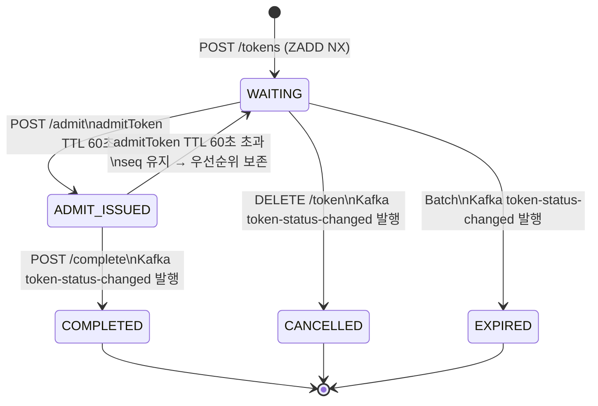

# 📄 Queue Platform — 기능 정의서 (FRS)

> 버전: v1.10 | 상태: 확정 | 대상: 실제 구현 범위
>
> v1.10 변경 이력: Java SDK 제거 → Tenant 서버 통합은 REST API + OpenAPI 명세로 전환. JS SDK는 유지.

---

## 1. 개요

### 목적

대규모 트래픽 상황에서 서버 부하를 제어하기 위해 대기열을 외부 플랫폼으로 분리한다.

### 핵심 원칙

```
Platform  → 순서(순번)만 관리
Tenant    → 슬롯 관리 + 입장 제어
유저      → Platform에 직접 Polling
세션 관리 → Tenant 책임 (Platform 관여 안 함)
통합 방식 → REST API 직접 호출 (언어 중립) + JS SDK (브라우저)
```

### 핵심 개념

| 용어 | 설명 |
|------|------|
| Tenant | 플랫폼을 사용하는 B2B 고객사 |
| Queue | Tenant가 생성하는 대기열 단위 |
| Token | 대기열 참여 단위. 순번은 Redis Sorted Set 전담. 메타데이터는 DB 저장 |
| 대기토큰 | Enqueue 시 발급. 유저가 Polling에 사용 |
| 입장토큰 (admitToken) | admit 시 발급. TTL 60초. 유저가 Tenant에 전달 |
| Enqueue | Tenant 서버가 유저 대신 Platform에 대기열 등록 요청 |
| Polling | 유저가 Platform에 직접 순위 확인 요청 (적응형 간격) |
| admit | Tenant 서버가 슬롯 여유 생길 때 Platform에 N명 입장토큰 요청 |
| verify | Tenant가 admitToken 유효성 확인 (상태 변경 없음) |
| complete | Tenant가 입장 완료 후 Platform에 통보 → COMPLETED + ZREM |
| maxCapacity | 대기열 최대 인원 |
| waitingTtl | 대기 중 절대 만료 시간 (기본 7200s) |
| inactiveTtl | 마지막 Polling 이후 비활동 만료 시간 (기본 300s) |
| sliceCount | Platform 자동 계산. ceil(maxCapacity ÷ 100,000) |
| global-seq | 슬라이스 간 FIFO 보장을 위한 전체 순번 |
| seq | 토큰별 global-seq 값. ADMIT_ISSUED→WAITING 복귀 시 score 복원 |
| nextPollAfterSec | Platform이 클라이언트에 전달하는 권장 Polling 간격 |
| avgWaitingTime | 평균 대기 시간 (issuedAt ~ completedAt). ETA 계산에 사용 |

### Token 저장 구조

```
DB tokens 테이블:
  tokenId, userId, queueId, seq, status(TINYINT), admit_token
  redis_sync_needed, issuedAt, completedAt
  → 메타데이터 원본. Redis 장애 시 복구 기준
  → Kafka Consumer가 INSERT 보장 (At-Least-Once)
  → admit_token: Redis 미스 시 DB Fallback용

Redis Sorted Set:
  Key: queue:{tenantId}:{queueId}:{sliceNumber}
  member: tokenId, score: global-seq
  → 순번 관리 전담. FIFO 보장
```

---

## 2. 전체 흐름 (9단계)

```
① Tenant → Platform: Queue 생성
   POST /queues

② 유저 서비스 접속 → Tenant 슬롯 확인
   여유 있음 → 바로 입장
   여유 없음 → Enqueue 결정

③ Tenant → Platform: Enqueue
   POST /queues/:queueId/tokens { userId }
   Platform: Redis Lua 처리 후 즉시 응답 (202 Accepted)
   비동기: Kafka enqueue-events 발행 → DB INSERT
   Tenant → 유저: 대기토큰 + Polling URL 전달

④ 유저 → Platform: Polling (직접, 적응형 간격)
   GET /queues/:queueId/tokens/:token
   ← { globalRank, estimatedWaitSeconds, nextPollAfterSec, ready, admitToken }

⑤ Tenant → Platform: admit (슬롯 여유 생길 때마다)
   POST /queues/:queueId/admit { count: N }
   ← { admitTokens: [ { userId, admitToken }, ... ] }
   Platform: 앞 N명 → ADMIT_ISSUED + admitToken 발급 (TTL 60초)

⑥ 유저 Polling 응답에 admitToken 포함 (ADMIT_ISSUED 상태일 때)
   ← { ready: true, admitToken: "at_xxx", nextPollAfterSec: 2 }
   유저 → Tenant: admitToken 전달

⑦ Tenant → Platform: verify (유효성 확인만. 상태 변경 없음)
   POST /admit-tokens/:admitToken/verify
   ← { valid: true, userId }

⑧ Tenant: 유효한 유저 입장 허용

⑨ Tenant → Platform: complete (입장 완료 통보)
   POST /tokens/:token/complete { admitToken }
   Platform: COMPLETED + ZREM + Kafka 발행
   ← { status: COMPLETED, completedAt }

(admitToken TTL 60초 초과 시 → WAITING 복귀. seq 유지. 우선순위 보존)
```

---

## 3. 기능 목록

| 영역 | 기능 | 구현 범위 |
|------|------|-----------|
| Tenant 관리 | 회원가입 / 로그인 / JWT 인증 | ✅ |
| API Key 관리 | 발급 / 검증 / Revoke / Rate limit | ✅ |
| Queue 관리 | 생성 / 수정 / 조회 / 정지 / 재개 / 삭제 | ✅ |
| Token Lifecycle | Enqueue / Polling / admit / verify / complete / 이탈 | ✅ |
| TTL / Batch | 만료 처리 / 파티션 운영 / 통계 집계 | ✅ |
| Kafka | Enqueue 버퍼 / 상태 변경 이벤트 | ✅ |
| Billing | 과금 집계 (Kafka Consumer) | ✅ |
| 외부 통합 | REST API + OpenAPI 3.0 명세 (Tenant 서버) / JS SDK (브라우저) | ✅ |

---

## 4. API 명세

### 4.1 Queue Engine API

| Method | Path | 인증 | 호출 주체 | 설명 |
|--------|------|------|----------|------|
| `POST` | `/api/v1/queues/:queueId/tokens` | X-API-Key | Tenant 서버 | Enqueue → 대기토큰 발급 |
| `GET` | `/api/v1/queues/:queueId/tokens/:token` | token | 유저 직접 | Polling |
| `POST` | `/api/v1/queues/:queueId/admit` | X-API-Key | Tenant 서버 | N명 입장토큰 발급 |
| `POST` | `/api/v1/admit-tokens/:admitToken/verify` | X-API-Key | Tenant 서버 | 입장토큰 유효성 확인 |
| `POST` | `/api/v1/tokens/:token/complete` | X-API-Key | Tenant 서버 | 입장 완료 통보 → COMPLETED |
| `DELETE` | `/api/v1/queues/:queueId/tokens/:token` | X-API-Key | Tenant 서버 | 이탈 → CANCELLED |

### 4.2 관리 API

| Method | Path | 인증 | 설명 |
|--------|------|------|------|
| `POST` | `/api/v1/tenants/signup` | - | 회원가입 |
| `POST` | `/api/v1/tenants/login` | - | 로그인 |
| `POST` | `/api/v1/tenants/refresh` | Refresh Token | 토큰 재발급 |
| `POST` | `/api/v1/queues` | JWT | 대기열 생성 |
| `PATCH` | `/api/v1/queues/:queueId` | JWT | 대기열 수정 |
| `GET` | `/api/v1/queues/:queueId` | JWT | 대기열 조회 |
| `POST` | `/api/v1/queues/:queueId/pause` | JWT | 대기열 정지 |
| `POST` | `/api/v1/queues/:queueId/resume` | JWT | 대기열 재개 |
| `DELETE` | `/api/v1/queues/:queueId` | JWT | 대기열 삭제 |
| `POST` | `/api/v1/tenants/me/api-keys` | JWT | API Key 발급 |
| `DELETE` | `/api/v1/tenants/me/api-keys/:id` | JWT | API Key Revoke |

---

## 5. Queue 설정

| 파라미터 | 타입 | 필수 | 기본값 | 설명 |
|----------|------|------|--------|------|
| name | String | ✅ | - | 큐 이름 (Tenant 내 유일) |
| maxCapacity | Int | ✅ | - | 대기열 최대 인원 |
| waitingTtl | Int(초) | ❌ | 7200 | 대기 중 절대 만료 시간 |
| inactiveTtl | Int(초) | ❌ | 300 | 비활동 만료 시간 |

---

## 6. Token Lifecycle

### 6.1 상태 머신 (TINYINT 매핑)

```
0 = WAITING
1 = ADMIT_ISSUED
2 = COMPLETED
3 = CANCELLED
4 = EXPIRED
```



### 6.2 Enqueue

```
POST /api/v1/queues/:queueId/tokens
Body: { userId: string }

처리 흐름:
1. API Key 검증 (Redis 캐시 60s → DB Replica fallback)
2. Rate limit (per-key 100rps)
3. 큐 상태 확인 (ACTIVE만 허용)
4. userId 중복 체크 (GET queue-user → 기존 토큰 반환)
5. Bulk Lua Script 원자 실행
   INCRBY global-seq N → startSeq~endSeq
   슬라이스별 ZADD multi-member NX
   slice = (seq-1) % sliceCount
6. 202 Accepted 즉시 응답
7. Kafka enqueue-events 발행
   → TokenEnqueueConsumer: DB INSERT (redis_sync_needed=0)
   → queue-user 역인덱스 SET

Response 202:
{ "token": "tok_Kx9mZ3", "globalRank": 42,
  "estimatedWaitSeconds": 300, "status": "WAITING" }
```

### 6.3 Polling (적응형 간격)

```
GET /api/v1/queues/:queueId/tokens/:token

처리 흐름:
1. token-info 캐시(TTL=nextPollAfterSec+2s) → DB Replica fallback
2. 전체 순위 계산 (Lua Script)
3. SET token-last-active EX inactiveTtl
4. avgWaitingTime → ETA
5. nextPollAfterSec 계산:
   globalRank > 500 → 30s
   globalRank > 100 → 10s
   globalRank > 10  → 5s
   globalRank ≤ 10  → 2s

Response (WAITING):
{ "status": "WAITING", "ready": false, "admitToken": null,
  "globalRank": 42, "estimatedWaitSeconds": 300,
  "nextPollAfterSec": 10 }

Response (ADMIT_ISSUED):
{ "status": "ADMIT_ISSUED", "ready": true,
  "admitToken": "at_abc123", "globalRank": 1,
  "nextPollAfterSec": 2 }
```

### 6.4 Admit → ADMIT_ISSUED

```
POST /api/v1/queues/:queueId/admit
Body: { count: N, requestId: "req_abc" }

처리 흐름:
1. admit-idem 멱등성 체크
2. DB admit_requests INSERT (PENDING) — 영속성 기준점
3. Kafka enqueue-admit 발행
   → AdmitConsumer: Lua Dequeue + admitToken 발급

Lua Dequeue:
  슬라이스별 ZRANGE WITHSCORES → score 정렬 → 상위 N명 ZREM
  DB WAITING 상태 확인 + verified-token 체크
  부족 시 최대 3회 추가 추출 (전체 재정렬 → FIFO 보장)

admitToken 발급:
  SET admit-token-by-token:{tokenId} EX 60
  SET admit-token-by-admit:{admitToken} EX 60
  DB tokens.admit_token = admitToken
  DB UPDATE ADMIT_ISSUED (100건씩 / 10ms 대기)
  SET token-info 캐시 즉시 갱신

admitToken TTL: 60초
만료 시: WAITING 복귀 (seq 유지 → 우선순위 보존)
```

### 6.5 Verify (유효성 확인만 — 상태 변경 없음)

```
POST /api/v1/admit-tokens/:admitToken/verify

처리 흐름:
1. Redis GET admit-token-by-admit:{admitToken} → tokenId
   없으면 → DB Fallback
     SELECT WHERE status=ADMIT_ISSUED AND admit_token=? AND issued_at > NOW()-60s
     없으면 → 404 TK_002_INVALID_ADMIT_TOKEN
2. DB ADMIT_ISSUED 상태 확인 (Replica)
3. SET verified-token:{tokenId} EX 60 (중복 입장 방지)
4. 상태 변경 없음

Response: { "valid": true, "userId": "user1" }
```

**[중요] verify 호출 순서 (Tenant 서버가 반드시 준수)**

```
올바른 순서:
  ① verify 즉시 호출 (유저 admitToken 전달받은 즉시)
  ② valid 확인
  ③ Tenant 내부 처리 (세션 생성, 외부 API 등)
  ④ complete 호출

잘못된 순서:
  ① Tenant 내부 처리 (30초 소요)
  ② verify 호출 → TTL 60초 초과 → 404 발생 위험

구현 가이드:
  SDK 없이 REST 직접 호출 방식이므로 Tenant 구현자가 순서를 보장해야 함
  OpenAPI 명세에 이 순서를 "Workflow" 섹션으로 명시
  Swagger UI에서 시각적으로 확인 가능
```

### 6.6 Complete → COMPLETED

```
POST /api/v1/tokens/:token/complete
Body: { admitToken: "at_xxx" }

처리 흐름:
1. DB ADMIT_ISSUED 확인 (Master)
2. admitToken 유효성 확인
   Redis GET admit-token-by-admit:{admitToken}
   없으면 → 404
3. DB status = COMPLETED (먼저)
4. Redis 정리 (나중)
   ZREM Sorted Set
   DEL admit-token-by-token + admit-token-by-admit
   DEL token-info + verified-token
5. Kafka token-status-changed 발행
   → BillingConsumer: tokens 원본 집계 → billing_snapshots UPSERT
6. avgWaitingTime 직접 갱신 (Kafka Consumer 없이)
   waitingSeconds = completedAt - issuedAt
   이상치 필터: waitingTtl × 0.8 초과 시 스킵
   HINCRBYFLOAT queue-stats:{t}:{q} waitingTimeSum {seconds}
   HINCRBY queue-stats:{t}:{q} waitingTimeCount 1

Response: { "status": "COMPLETED", "completedAt": "..." }
```

### 6.7 이탈 → CANCELLED

```
DELETE /api/v1/queues/:queueId/tokens/:token
조건: WAITING(0)만. ADMIT_ISSUED(1) → 409

처리:
  Redis ZREM
  DB status = CANCELLED(3)
  DEL queue-user + DEL token-info
  Kafka token-status-changed 발행
```

---

## 7. Kafka 설계

### 토픽

| 토픽 | 파티션 기준 | 보존 | 설명 |
|------|------------|------|------|
| `enqueue-events` | queueId | 7일 | Enqueue → DB INSERT |
| `enqueue-admit` | queueId | 7일 | admit → Dequeue + admitToken 발급 |
| `token-status-changed` | queueId | 7일 | 상태 변경 → Billing / Stats |

### 이벤트 스키마

```json
// enqueue-events
{
  "tokenId": "tok_Kx9mZ3",
  "queueId": "q_xyz789",
  "tenantId": "t_abc123",
  "userId": "user123",
  "seq": 42500,
  "issuedAt": "2026-03-19T10:00:00.123Z"
}

// enqueue-admit
{
  "requestId": "req_abc",
  "tenantId": "t_abc123",
  "queueId": "q_xyz789",
  "count": 100
}

// token-status-changed
{
  "tokenId": "tok_Kx9mZ3",
  "queueId": "q_xyz789",
  "tenantId": "t_abc123",
  "status": "COMPLETED",
  "waitingSeconds": 127,
  "expiredReason": null,
  "occurredAt": "2026-03-19T10:02:07.456Z"
}
```

### Consumer

| Consumer | 토픽 | 역할 |
|----------|------|------|
| `TokenEnqueueConsumer` | enqueue-events | DB INSERT 1000건 Bulk / redis_sync_needed=0 |
| `AdmitConsumer` | enqueue-admit | Lua Dequeue + admitToken 발급 |
| `BillingConsumer` | token-status-changed | COMPLETED → tokens 원본 집계 → billing_snapshots UPSERT |

---

## 8. Redis 데이터 구조 (RedisKeyFactory 중앙 관리)

| Key 패턴 | 자료구조 | TTL | 역할 |
|----------|----------|-----|------|
| `queue:{t}:{q}:{slice}` | Sorted Set | 없음 | 대기열. score=global-seq |
| `global-seq:{t}:{q}` | String | 없음 | 순번 채번. INCRBY 원자 |
| `queue-meta:{t}:{q}` | Hash | 없음 | 큐 설정 |
| `queue-stats:{t}:{q}` | Hash | 없음 | avgWaitingTime (complete 시 직접 갱신) |
| `queue-user:{t}:{q}:{userId}` | String | waitingTtl | 중복 Enqueue 방지 |
| `token-last-active:{tokenId}` | String | 300s | 비활동 TTL 감지 |
| `token-info:{tokenId}` | String | nextPollAfterSec+2s | Polling 캐시 |
| `admit-token-by-token:{tokenId}` | String | 60s | Polling 응답용 admitToken |
| `admit-token-by-admit:{admitToken}` | String | 60s | verify/complete용 tokenId |
| `admit-idem:{requestId}` | String | 300s | admit 멱등성 |
| `verified-token:{tokenId}` | String | 60s | 중복 입장 방지 |
| `batch-lock:{t}:{q}` | String | 15s | Batch 서버 분산 |
| `apikey-cache:{sha256}` | String | 60s | API Key 인증 캐시 |

> 제거된 Key:
> queue-count → ZCARD Pipeline으로 대체
> billing-count → Kafka BillingConsumer → tokens 원본 집계로 대체
> admit-request-queue, admit-processing-queue → Kafka enqueue-admit으로 대체

---

## 9. 동시성 제어

| 문제 | 해결 |
|------|------|
| 중복 Enqueue | queue-user 역인덱스 + ZADD NX |
| 용량 초과 | ZCARD Pipeline 합산 |
| Enqueue DB 유실 | Kafka At-Least-Once + UNIQUE KEY 방어 |
| 대량 Enqueue 병목 | INCRBY + ZADD multi (500건 Adaptive) |
| admit 순서 보장 | Kafka enqueue-admit → AdmitConsumer (순차 처리) |
| 중복 입장 | verified-token 플래그 + admitToken 교차 확인 |
| complete 동시성 | DB UPDATE WHERE status=1 (1번만 성공) |
| ZREM 실패 | DB 먼저 → Batch 10초 내 재실행 |
| billing 중복 | tokens 원본 집계 → 중복 개념 없음 |
| Redis 다운 중 INSERT | redis_sync_needed=1 → RedisSyncJob 복구 |

---

## 10. Batch Jobs

| Job | 주기 | 처리 |
|-----|------|------|
| `TokenExpiryJob` | 10초 | WAITING TTL 만료 → EXPIRED + Kafka 발행 |
| `AdmitTokenExpiryJob` | 10초 | ADMIT_ISSUED admitToken TTL → WAITING 복귀 (seq 유지) |
| `RedisSyncJob` | 5분 | redis_sync_needed=1 토큰 → Redis 재삽입 |
| `BillingSnapshotJob` | M+2월 초 | tokens 원본 집계 → queue_daily_stats + billing_snapshots → 파티션 DROP |

---

## 11. 에러 코드

| 코드 | HTTP | 상황 |
|------|------|------|
| `AK_001_UNAUTHORIZED` | 401 | API Key 무효 |
| `TK_001_INVALID_TOKEN` | 401 | 대기토큰 무효 |
| `TK_002_INVALID_ADMIT_TOKEN` | 404 | 입장토큰 만료 or 무효 |
| `RL_001_KEY_LIMIT` | 429 | per-key 100rps 초과 |
| `QM_001_NOT_FOUND` | 404 | 큐 없음 |
| `QM_004_NOT_ACTIVE` | 503 | 큐 PAUSED / DRAINING |
| `QE_001_CAPACITY_EXCEEDED` | 429 | maxCapacity 초과 |
| `QE_006_INVALID_STATUS` | 409 | 상태 전환 불가 |
| `CM_001_INVALID_PARAM` | 400 | 파라미터 오류 |
| `CM_003_INTERNAL_ERROR` | 500 | 서버 내부 오류 |
| `CM_004_SERVICE_UNAVAILABLE` | 503 | Redis / Kafka 장애 |

---

## 12. 외부 통합 설계 (SDK 전략)

### 12.1 통합 방식 결정

Queue Platform의 Tenant는 B2B 고객사로 **서버 스택 언어가 다양하다**. 단일 언어 SDK 제공은 차별적 지원 문제가 발생하므로 다음과 같이 결정한다.

| 대상 | 통합 방식 | 이유 |
|------|----------|------|
| Tenant 서버 (enqueue/admit/verify/complete/cancel) | **REST API + OpenAPI 3.0 명세** | 언어 중립. 모든 언어 동등 지원 |
| 브라우저 (유저 Polling) | **JS SDK** | 탭 비활성화·네트워크 offline 등 클라이언트 특화 문제 해결 |

### 12.2 REST API 직접 호출 (Tenant 서버용)

#### 제공 자료

```
1. OpenAPI 3.0 명세 (Springdoc 자동 생성)
   - /v3/api-docs (JSON)
   - /swagger-ui.html (인터랙티브 테스트)

2. Postman Collection
   - queue-platform.postman_collection.json

3. Workflow 문서 (6.5의 verify 순서 등)
   - OpenAPI의 description + example에 명시
   - Swagger UI에서 시각적으로 확인 가능
```

#### Tenant 구현 가이드라인

Tenant 서버가 REST 직접 호출 시 준수해야 할 규칙:

**A. verify 호출 순서**
```
1. admit 응답의 admitToken 획득
2. Tenant 내부 처리(세션 생성 등) 전에 먼저 verify 호출
3. valid=true 확인 후 내부 처리
4. 내부 처리 완료 후 complete 호출

이유: 내부 처리 후 verify 호출 시 TTL 60초 초과 위험
```

**B. complete 재시도**
```
admitToken TTL 60초 내에 complete 호출 보장
네트워크 오류 시 3회 재시도 (100ms → 500ms → 1500ms backoff)
재시도 금지:
  404 TK_002_INVALID_ADMIT_TOKEN (이미 만료/처리됨)
  409 QE_006_INVALID_STATUS (상태 불일치)
```

**C. 동시 verify 수 가이드 (BulkVerifier 패턴)**
```
admit count 1,000 기준 → 동시 verify 100개 권장

계산식:
  concurrency = admit_count × verify_time_ms / (ttl_ms × 안전마진 0.5)
  예: 1,000명, TTL 60초, verify 100ms
  = 1,000 × 100 / (60,000 × 0.5) ≈ 3.3 → 최소 4 → 안전하게 100

Platform per-key 100 rps 초과 시 429 → backoff 필요
```

**D. API Key 보안**
```
X-API-Key 헤더 전송 (HTTPS 필수)
환경변수 저장 (코드에 하드코딩 금지)
발급 시 1회만 표시 → 재발급은 Revoke 후 신규 발급
```

### 12.3 JS SDK (브라우저용)

브라우저 Polling은 다음과 같은 **클라이언트 특화 문제**가 있어 SDK로 제공:

```
- nextPollAfterSec 타이밍 (setTimeout 관리)
- 탭 비활성화 → Polling 자동 중단 (배터리/서버 부하)
- 네트워크 offline → 재연결 시 즉시 재개
- 상태 머신 추적 (IDLE → WAITING → READY → COMPLETED/EXPIRED)
```

#### 핵심 컴포넌트

| 컴포넌트 | 역할 |
|----------|------|
| `PollingManager` | nextPollAfterSec 타이밍 자동 적용. setTimeout 관리 |
| `StateManager` | IDLE → WAITING → READY → COMPLETED → EXPIRED 전환 |
| `VisibilityHandler` | visibilitychange 이벤트 자동 감지. 탭 비활성화 시 중단 |
| `NetworkHandler` | offline/online 이벤트 자동 처리 |

#### 사용법

```javascript
const queue = QueueSDK.init({
    baseUrl: 'https://api.queue-platform.com',
    queueId: queueId,  // Tenant 서버에서 받은 값
    token: token       // Tenant 서버에서 받은 값
});

queue.startPolling({
    onWaiting: ({ globalRank, estimatedWaitSeconds }) => {
        updateUI(globalRank, estimatedWaitSeconds);
        // nextPollAfterSec 타이밍은 SDK가 자동 처리
        // Platform이 계산해서 내려줌 → SDK가 setTimeout에 세팅
    },
    onReady: ({ admitToken }) => {
        sendToTenantServer(admitToken);
    },
    onExpired: () => {
        showExpiredMessage();
    }
});

// 탭 비활성화 → Polling 자동 중단 (배터리/서버 부하 절약)
// 탭 복귀 → 즉시 재개
// 네트워크 offline/online 이벤트 자동 처리
```

### 12.4 클라이언트 전체 흐름

```
1. 유저 → Tenant 서버: 서비스 접속 (슬롯 여유 확인)
2. Tenant 서버 → Platform (REST 직접 호출): POST /tokens
3. Tenant 서버 → 유저: token, queueId 전달
4. 유저 (JS SDK): queue.startPolling() 시작
5. JS SDK → Platform 직접: GET /tokens/:token (nextPollAfterSec 자동)
6. JS SDK → onReady 콜백: admitToken 수신
7. 유저 → Tenant 서버: admitToken 전달
8. Tenant 서버 → Platform (REST 직접 호출):
   verify 즉시 → 내부 처리 → complete (3회 재시도)
```

### 12.5 프로젝트 구조

| 레포 | 모듈 수 | 배포 | 역할 |
|------|--------|------|------|
| `queue-platform` | 5개 | Docker | 플랫폼 본체 (API, Batch, Domain, Infra, Common) |
| `queue-platform-sdk-js` | 1개 | npm + CDN | 브라우저용 (PollingManager, StateManager) |

> v1.9 → v1.10 변경: `queue-platform-sdk-java` 레포 삭제. Tenant 서버는 REST + OpenAPI 명세로 통합.

---

## 13. 비기능 요구사항

### 성능 목표

| API | p99 목표 | 목표 TPS |
|-----|----------|----------|
| Enqueue | < 50ms (202 즉시 응답) | 200 rps (10,000 rps 급증 → Kafka) |
| Polling | < 50ms | 2,000 rps |
| admit | < 100ms | 10 rps |

### 안정성

| 장애 | 영향 | 대응 |
|------|------|------|
| Redis Master 다운 | Enqueue/Polling 중단 | Sentinel Failover 5~10초 |
| Redis 다운 중 Enqueue | Sorted Set 미반영 | redis_sync_needed=1 → RedisSyncJob 복구 |
| Kafka 다운 | DB INSERT 지연 | 복구 후 Consumer 재처리 |
| MySQL Master 다운 | complete 중단 | Replica 승격 |

### MySQL Read/Write 분리

```
Write → Master: UPDATE (complete, cancel, expire)
Read  → Replica: SELECT (Polling, API Key)
INSERT → Kafka Consumer → Master (비동기)
@Transactional(readOnly = true) → Replica
@Transactional → Master
```

### Redis Read/Write 분리 미적용

```
모든 연산 → Master
Lua Script 원자성. In-Memory 충분
Slave: Failover + 백업
Sentinel: Master 1 + Slave 2 + Sentinel 3
쿼럼 = 2, min-replicas-to-write 1
```

### Virtual Thread (Spring MVC)

```yaml
# application.yml
spring:
  threads:
    virtual:
      enabled: true  # Tomcat이 모든 요청을 Virtual Thread로 처리
```

```
설정 한 줄로 Tomcat의 모든 요청이 Virtual Thread에서 처리됨
JPA blocking I/O → Virtual Thread가 OS Thread를 점유하지 않고 대기
BCrypt → 별도 스케줄러 격리 불필요
@Transactional → ThreadLocal 기반 → Virtual Thread에서 정상 동작
→ Polling 2,000 rps 달성 가능
```

---

## 🔥 핵심 원칙

> Platform은 **순서만 관리**한다.
> 입장 여부는 **Tenant 서버가 결정**한다.
> 유저는 **Platform에 직접 Polling**한다 (nextPollAfterSec 적응형).
> verify = 유효성 확인만. complete = COMPLETED + ZREM + Kafka 발행.
> DB 먼저, ZREM 나중 — **잔류가 유실보다 안전**하다.
> seq를 DB에 저장 — **ADMIT_ISSUED 복귀 시 순위 복원 가능**하다.
> Kafka At-Least-Once — **DB INSERT는 반드시 보장**된다.
> Tenant 서버 통합은 **REST + OpenAPI** — 언어 중립.
> 브라우저 Polling은 **JS SDK** — 탭 비활성화/네트워크 복구 특화.
