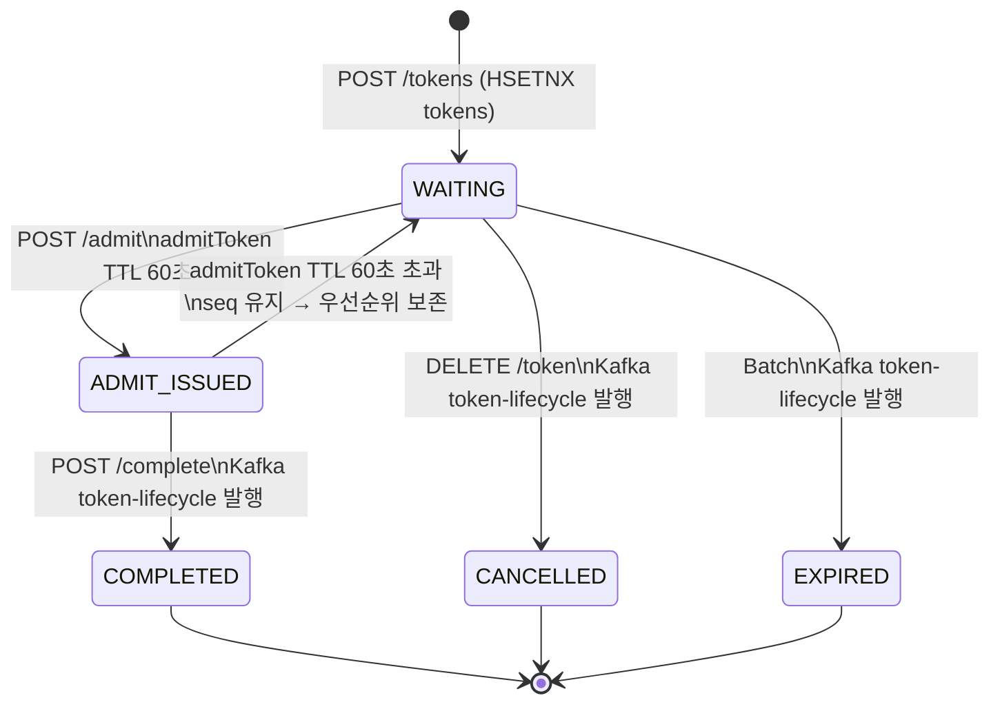

# 📄 Queue Platform — 기능 정의서 (FRS)

> 버전: v1.12 | 상태: 확정 | 대상: 실제 구현 범위
>
> v1.12 변경사항: 구현과 어긋난 서술 정정 — Redis 키표를 `QueueKeys` 4종으로 교체(slice·global-seq·
> queue-user·token-last-active 폐기, §66 D2·§70 D9·§74), Kafka를 단일 `token-lifecycle` + 키 `tokenId`로
> 정정(§73 D16·D18), 에러 코드표를 `ErrorCode.java`와 1:1로, Enqueue 응답 202 → **200**,
> `queue-consumer` 모듈 반영
>
> v1.11 변경사항: Java SDK 명세 **실제 삭제**(v1.10에서 "제거"라고 적고 §12에 남아 있던 것),
> 폴링 엔드포인트 2분할(`/status` + 개인, DECISIONS §79), `identifier` = UUIDv7 규약(§78),
> verify·complete 경로에 `queueId` 추가 + admitToken 키를 `queue:{queueId}:*` 로 이동
>
> v1.10 변경사항: Java SDK 제거 (REST API 명세로 대체), tenants.status 컬럼 추가, Queue update 전략 확정 (name만 변경 허용)

---

## 1. 개요

### 목적

대규모 트래픽 상황에서 서버 부하를 제어하기 위해 대기열을 외부 플랫폼으로 분리한다.

### 핵심 원칙

```
Platform  → 순서(순번)만 관리
Tenant    → 슬롯 관리 + 입장 제어
유저      → Platform에 직접 Polling
세션 관리 → Tenant 책임 (Platform 관여 안 함)
```

### 핵심 개념

| 용어 | 설명 |
|------|------|
| Tenant | 플랫폼을 사용하는 B2B 고객사 |
| Queue | Tenant가 생성하는 대기열 단위 |
| Token | 대기열 참여 단위. 순번은 Redis Sorted Set 전담. 메타데이터는 DB 저장 |
| 대기토큰 | Enqueue 시 발급. 유저가 Polling에 사용 |
| 입장토큰 (admitToken) | admit 시 발급. TTL 60초. 유저가 Tenant에 전달 |
| Enqueue | Tenant 서버가 유저 대신 Platform에 대기열 등록 요청 |
| Polling | 유저가 Platform에 직접 순위 확인 요청 (적응형 간격) |
| admit | Tenant 서버가 슬롯 여유 생길 때 Platform에 N명 입장토큰 요청 |
| verify | Tenant가 admitToken 유효성 확인 (상태 변경 없음) |
| complete | Tenant가 입장 완료 후 Platform에 통보 → COMPLETED + ZREM |
| maxCapacity | 대기열 최대 인원 |
| waitingTtl | 대기 중 절대 만료 시간 (기본 7200s) |
| inactiveTtl | 마지막 Polling 이후 비활동 만료 시간 (기본 300s) |
| ~~sliceCount~~ | 폐기 — 대기열을 여러 ZSet으로 쪼개던 값. ZSet 하나로 확정 (§66 D2) |
| ~~global-seq~~ | 폐기 — 큐별 `INCR queue:{queueId}:seq`로 대체 (§70 D9) |
| identifier | Tenant가 만드는 UUIDv7. `waiting` ZSet의 member이자 중복 판정 키 (§66 D1 · §78) |
| seq | 토큰의 순번(= ZSet score). ADMIT_ISSUED→WAITING 복귀 시 score 복원 |
| pacing | `/status`가 내려주는 폴링 간격 구간표. rank로 조회 → SDK가 지터를 더해 사용 (§79) |
| lastAdmittedSeq | 마지막으로 admit된 seq(전광판). `rank = mySeq − lastAdmittedSeq` (§79) |
| ~~nextPollAfterSec~~ | 폐기 — 서버가 개인별 간격을 계산해 내려주던 필드. `pacing`으로 대체 (§79) |
| avgWaitingTime | 평균 대기 시간 (issuedAt ~ completedAt). ETA 계산에 사용 |

### Token 저장 구조

```
DB tokens 테이블:
  tokenId, userId, queueId, seq, status(TINYINT), admit_token
  redis_sync_needed, issuedAt, completedAt
  → 메타데이터 원본. Redis 장애 시 복구 기준
  → Kafka Consumer가 INSERT 보장 (At-Least-Once)
  → admit_token: Redis 미스 시 DB Fallback용

Redis (QueueKeys — §8 참조):
  queue:{queueId}:waiting   Sorted Set. member=identifier, score=seq
  queue:{queueId}:seq       INCR로 score 발급
  queue:{queueId}:tokens    Hash. identifier → "tokenId|issuedAt"
  → 순번 관리 전담. FIFO 보장
```

---

## 2. 전체 흐름 (9단계)

```
① Tenant → Platform: Queue 생성
   POST /queues

② 유저 서비스 접속 → Tenant 슬롯 확인
   여유 있음 → 바로 입장
   여유 없음 → Enqueue 결정

③ Tenant → Platform: Enqueue
   POST /queues/:queueId/tokens { identifier }      ← identifier는 UUIDv7 (§6.2 참조)
   Platform: Redis Lua 처리 후 즉시 응답 (200 OK — 순번이 확정된 뒤 응답한다)
   비동기: Kafka token-lifecycle 발행 (key=tokenId) → DB INSERT
   Tenant → 유저: 대기 페이지를 서빙하면서 tokenId, seq 를 함께 실어 전달

④ 유저 → Platform: Polling (직접, 적응형 간격) — 엔드포인트 2개 (§6.3)
   GET /queues/:queueId/status              ← 평상시. 전원 동일 응답
   ← { lastAdmittedSeq, pacing }
   GET /queues/:queueId/tokens/:tokenId?seq=&ka=   ← 차례 근처 + keepalive만
   ← { ready, admitToken? }

⑤ Tenant → Platform: admit (슬롯 여유 생길 때마다)
   POST /queues/:queueId/admit { count: N }
   ← { admitTokens: [ { userId, admitToken }, ... ] }
   Platform: 앞 N명 → ADMIT_ISSUED + admitToken 발급 (TTL 60초)

⑥ 유저 Polling 응답에 admitToken 포함 (ADMIT_ISSUED 상태일 때)
   ← { ready: true, admitToken: "at_xxx" }
   유저 → Tenant: admitToken 전달

⑦ Tenant → Platform: verify (유효성 확인만. 상태 변경 없음)
   POST /queues/:queueId/admit-tokens/:admitToken/verify
   ← { valid: true, identifier }

⑧ Tenant: 유효한 유저 입장 허용

⑨ Tenant → Platform: complete (입장 완료 통보)
   POST /queues/:queueId/tokens/:tokenId/complete { admitToken }
   Platform: COMPLETED + ZREM + Kafka 발행
   ← { status: COMPLETED, completedAt }

(admitToken TTL 60초 초과 시 → WAITING 복귀. seq 유지. 우선순위 보존)
```

---

## 3. 기능 목록

| 영역 | 기능 | 구현 범위 |
|------|------|-----------|
| Tenant 관리 | 회원가입 / 로그인 / JWT 인증 | ✅ |
| API Key 관리 | 발급 / 검증 / Revoke / Rate limit | ✅ |
| Queue 관리 | 생성 / 수정 / 조회 / 정지 / 재개 / 삭제 | ✅ |
| Token Lifecycle | Enqueue / Polling / admit / verify / complete / 이탈 | ✅ |
| TTL / Batch | 만료 처리 / 파티션 운영 / 통계 집계 | ✅ |
| Kafka | Enqueue 버퍼 / 상태 변경 이벤트 | ✅ |
| Billing | 과금 집계 (Kafka Consumer) | ✅ |
| SDK | **JS SDK만** (Tenant 서버는 REST API 직접 호출) | ✅ |

---

## 4. API 명세

### 4.1 Queue Engine API

| Method | Path | 인증 | 호출 주체 | 설명 |
|--------|------|------|----------|------|
| `POST` | `/api/v1/queues/:queueId/tokens` | X-API-Key | Tenant 서버 | Enqueue → 대기토큰 발급 |
| `GET` | `/api/v1/queues/:queueId/status` | 없음 | 유저 직접 | **큐 전광판** — 전원 동일 응답. 캐시 대상 |
| `GET` | `/api/v1/queues/:queueId/tokens/:tokenId?seq=&ka=` | tokenId 소유 | 유저 직접 | **개인 상태** — ready / admitToken |
| `POST` | `/api/v1/queues/:queueId/admit` | X-API-Key | Tenant 서버 | N명 입장토큰 발급 |
| `POST` | `/api/v1/queues/:queueId/admit-tokens/:admitToken/verify` | X-API-Key | Tenant 서버 | 입장토큰 유효성 확인 |
| `POST` | `/api/v1/queues/:queueId/tokens/:tokenId/complete` | X-API-Key | Tenant 서버 | 입장 완료 통보 → COMPLETED |
| `DELETE` | `/api/v1/queues/:queueId/tokens/:tokenId` | X-API-Key | Tenant 서버 | 이탈 → CANCELLED |

> **verify·complete 경로에 `queueId`가 들어간 이유** (DECISIONS §79):
> admitToken 관련 Redis 키를 `queue:{queueId}:...` 해시태그로 묶기 위해서다. Tenant 서버는
> 자기가 admit을 건 큐를 알고 있으므로 URL에 실을 수 있다. Cluster에서 CROSSSLOT은 사라진다.
> 이는 **전 구간 원자성의 필요조건**이었고, **§80이 충분조건까지 채웠다** — 중간 DB 확인을 삭제해
> admit 전 구간이 Lua 하나에 들어갔고, 소속이 미정이던 `verified-token`은 폐기됐다.

### 4.2 관리 API

| Method | Path | 인증 | 설명 |
|--------|------|------|------|
| `POST` | `/api/v1/tenants/signup` | - | 회원가입 |
| `POST` | `/api/v1/tenants/login` | - | 로그인 |
| `POST` | `/api/v1/tenants/refresh` | Refresh Token | 토큰 재발급 |
| `POST` | `/api/v1/queues` | JWT | 대기열 생성 |
| `PATCH` | `/api/v1/queues/:queueId` | JWT | 대기열 수정 |
| `GET` | `/api/v1/queues/:queueId` | JWT | 대기열 조회 |
| `POST` | `/api/v1/queues/:queueId/pause` | JWT | 대기열 정지 |
| `POST` | `/api/v1/queues/:queueId/resume` | JWT | 대기열 재개 |
| `DELETE` | `/api/v1/queues/:queueId` | JWT | 대기열 삭제 |
| `POST` | `/api/v1/tenants/me/api-keys` | JWT | API Key 발급 |
| `DELETE` | `/api/v1/tenants/me/api-keys/:id` | JWT | API Key Revoke |

---

## 5. Queue 설정

| 파라미터 | 타입 | 필수 | 기본값 | 설명 |
|----------|------|------|--------|------|
| name | String | ✅ | - | 큐 이름 (Tenant 내 유일) |
| maxCapacity | Int | ✅ | - | 대기열 최대 인원 |
| waitingTtl | Int(초) | ❌ | 7200 | 대기 중 절대 만료 시간 |
| inactiveTtl | Int(초) | ❌ | 300 | 비활동 만료 시간 |

---

## 6. Token Lifecycle

### 6.1 상태 머신 (TINYINT 매핑)

```
0 = WAITING
1 = ADMIT_ISSUED
2 = COMPLETED
3 = CANCELLED
4 = EXPIRED
```


```mermaid
stateDiagram-v2
    [*] --> WAITING : POST /tokens (HSETNX tokens)
    WAITING --> ADMIT_ISSUED : POST /admit\nadmitToken TTL 60초
    ADMIT_ISSUED --> COMPLETED : POST /complete\nKafka token-lifecycle 발행
    ADMIT_ISSUED --> WAITING : admitToken TTL 60초 초과\nseq 유지 → 우선순위 보존
    WAITING --> CANCELLED : DELETE /token\nKafka token-lifecycle 발행
    WAITING --> EXPIRED : Batch\nKafka token-lifecycle 발행
    COMPLETED --> [*]
    CANCELLED --> [*]
    EXPIRED --> [*]
```

### 6.2 Enqueue

```
POST /api/v1/queues/:queueId/tokens
Body: { identifier: string }        ← UUIDv7. 생성·전달 주체는 Tenant (아래 규약)

처리 흐름:
1. API Key 검증 (Redis 캐시 60s → DB Replica fallback)
2. Rate limit (per-key)
3. 큐 상태 확인 (ACTIVE만 허용) + Tenant 소유권 검증
4. 요청을 Global Queue에 적재 → BatchProcessor가 주기적으로 drain (FLOW.md Enqueue 참조)
5. enqueue_bulk.lua 원자 실행 — KEYS 3개 (같은 해시태그)
   queue:{queueId}:waiting / queue:{queueId}:seq / queue:{queueId}:tokens
   항목마다: ZCARD ≥ maxCapacity → FULL
             INCR seq → score 발급 (§70 D9)
             HSETNX tokens[identifier] = "tokenId|issuedAt" → 신규 OK / 기존 EXISTS
               ← **중복 판정의 원장은 이 Hash다** (waiting ZSet이 아니다).
                 admit되면 waiting에서 빠지므로 ZADD NX로 판정하면 admit된 사람의
                 재-enqueue가 새 tokenId를 받아 과금이 두 번 잡힌다
             ZADD waiting member=identifier score=seq   ← 신규일 때만
             ZRANK → rank
6. Kafka token-lifecycle 발행 (key=tokenId) — **동기**. 브로커 ack까지 최대 12s 대기
   (`spring.kafka.producer` sendTimeout). 실패하면 QE001(503)이고 200이 안 나간다
7. 200 OK 응답
   → 이후 TokenLifecycleConsumer가 tokens INSERT (멱등)

Response 200:
{ "queueId": "q_xyz789", "identifier": "0190e2c1-...", "tokenId": "tok_Kx9mZ3",
  "seq": 42, "rank": 42, "total": 120, "already": false }

  rank는 1-based다 — Redis ZRANK가 0-based이고 EnqueueResponse가 +1 해서 내보낸다.
  already=true면 기존 토큰을 그대로 돌려준 것이다.
  ⚠️ 202가 아니라 200이다 — Lua가 순번을 확정한 뒤 응답하므로 seq·rank가 이미 결정돼 있다.
  ⚠️ **발행은 응답보다 먼저이고 동기다.** "Redis 쓰고 바로 200, Kafka는 뒤에서"가 아니다.
     비동기인 것은 **DB 적재(Consumer)뿐**이며, 발행 자체는 응답 지연에 포함된다.
```

**identifier 규약 (DECISIONS §66 D1 · §78)**

| 항목 | 내용 |
|---|---|
| 형식 | **UUIDv7**. Platform은 형식 가이드만 제시하고, 검증 책임은 **전적으로 Tenant** |
| 생성·저장 | Tenant가 `userId → identifier(UUIDv7)` 매핑을 **저장**한다 |
| 재사용 | **같은 사용자·같은 큐에는 항상 같은 UUID를 재사용**한다 |

```
⚠️ 매 요청 새 UUID를 만들면 enqueue_bulk.lua의 HSETNX가 안 걸려
   한 사람이 자리를 여러 개 차지한다.

⚠️ identifier가 추측 가능한 값(이메일 · 순번 ID)이면 안 된다.
   enqueue는 EXISTS일 때 기존 tokenId·seq를 그대로 반환하므로,
   남의 identifier를 아는 자가 그 사람의 identifier로 enqueue를 호출하면
   남의 tokenId·seq — 즉 남의 폴링 자격 증명(§74) — 을 손에 넣는다.
   UUIDv7이면 이 경로가 죽는다.
```

### 6.3 Polling — 엔드포인트 2분할 (DECISIONS §79. 설계 확정, 구현 미착수)

**① 큐 전광판 — 30만 명 전원 동일 응답. 캐시 가능**

```
GET /api/v1/queues/:queueId/status
인증: 없음 (permitAll)   Rate Limit: 없음   ← 아래 "가드레일" 참조

처리: 키 2개 MGET (같은 해시태그 → 1왕복)
  queue:{queueId}:admit-watermark   없으면 0
  queue:{queueId}:pacing            없으면 코드 상수 기본값

Response:
{ "lastAdmittedSeq": 47,
  "pacing": [[50,2],[1000,5],[5000,10],[10000,15],[null,20]] }

pacing = [[rank 상한, 폴링 간격 초], ...]. 마지막 항의 상한 null = 그 이상 전부.
기본값은 코드 상수(QueueEngineService)와 같다. Redis 키가 있으면 그 값이 이긴다.
```

```
SDK 계산 (서버는 rank를 계산하지 않는다):
  rank  = mySeq − lastAdmittedSeq          ← 뺄셈 1회
  간격  = pacing 표 조회 + ±20% 지터
  rank <= 0 → 그때만 ② 개인 엔드포인트로 admitToken 확인
```

**② 개인 상태 — 차례 근처 + keepalive(30~60초 1회)에만 호출**

```
GET /api/v1/queues/:queueId/tokens/:tokenId?seq={seq}&ka={0|1}
인증: tokenId 소유 (permitAll, DECISIONS §74)
Rate Limit: tokenId 기준 Token Bucket — cap 5 / refill 1.0 per sec

처리: poll_verify.lua 1회 (ZRANGEBYSCORE + HGET 대조 + ka=1이면 ZADD last-active)

Response (아직 대기):     { "ready": false }
Response (ADMIT_ISSUED):  { "ready": true, "admitToken": "at_abc123" }
```

**404 계약 — SDK는 HTTP 상태가 아니라 `errorCode`로 재시도를 결정한다**

| 상황 | errorCode | SDK 동작 |
|---|---|---|
| 취소·만료로 토큰이 진짜 사라짐 | `TK001` (기존 `TOKEN_NOT_FOUND`) | **종료** |
| admitToken TTL 만료 → WAITING 복귀 대기 중 (배치 반영 전) | **신규 ErrorCode (후속)** | **백오프 후 재시도** |

> ⚠️ 현재 `ErrorCode`에는 `TOKEN_NOT_FOUND` 하나뿐이라 두 상황이 뭉개진다.
> ErrorCode 추가는 **후속 작업**이며, 이 표는 그 전까지의 계약 정의다.

**가드레일 — `/status`에 `permitAll`만 추가하면 "인증 0 + 제한 0"이 된다**

`RateLimitFilter`는 미등록 public 경로를 **무조건 통과**시킨다(인증 필요 경로는 SecurityConfig가
401로 막는다는 전제). `/status`는 인증도 없으므로 필터를 그냥 지나간다.
→ 방어는 두 가지다.
① **CDN·WAS 캐시 키에서 쿼리스트링을 제외**한다. `?x=랜덤` cache-buster가 죽고,
   **유효한 queueId 1개당** 오리진 부하가 `1 ÷ 캐시 TTL`로 고정된다.
② **미지 queueId는 맵 선적재로 막는다.** 경로 자체(`/queues/{임의}/status`)가 cache-buster라
   ①만으로는 안 막힌다 — 매번 새 캐시 키다. 큐→클러스터 매핑은 **불변**이므로(DECISIONS §75 D27-2)
   **맵을 통째로 선적재하고, 맵에 없으면 그대로 404**로 끝낸다. DB 조회도, negative 캐시 엔트리도
   만들지 않는다(엔트리를 만들면 미지 ID마다 메모리가 는다).
   ⚠️ **맵은 주기적으로 통째 리로드한다.** 큐는 런타임에 생성되므로 부팅 시 선적재한 맵에는
   그 이후 만들어진 정상 큐가 없다 → 그대로 두면 **새 큐의 `/status`가 WAS 재기동 전까지 404**다.
   매핑이 불변이라 값 충돌이 없어 통째 교체가 안전하고, 런타임에 생성된 큐가 그때 들어온다.
   **미스는 DB로 내려보내지 않는다.** **리로드 주기는 미정** — 큐 생성 후 `/status`가
   열리기까지의 지연이 그 값이다.

**Rate Limit은 걸지 않는다** (30만 명이 한 버킷을 공유하면 남용자 1명이 정상 대기자 전원을 429시킨다).

### 6.4 Admit → ADMIT_ISSUED

> **동기 처리 + Lua 하나** (DECISIONS §80). 구 설계의 3단계(Lua pop → DB WAITING 확인 → 토큰 SET),
> `admit_requests` 테이블, 명령 토픽은 **전부 폐기**됐다.

```
POST /api/v1/queues/:queueId/admit
Body: { count: N, requestId: "req_abc" }

처리 흐름:
0. API Key tenant의 queueId 소유 검증 → 아니면 QUEUE_NOT_OWNED
   (queues 행 하나만 읽는다. tokens 행은 읽지 않는다)

1. EVAL admit.lua — 전 구간 원자. Redis 밖 호출 0회
     ZPOPMIN queue:{queueId}:waiting N
       → (identifier, seq) N쌍. ZSet 하나(§66 D2) + score가 INCR 단조증가(§70 D9)라
         이미 FIFO 순이고, 거를 대상이 없으므로 ZRANGE+ZREM이 아니라 ZPOPMIN 한 명령이다
     HGET queue:{queueId}:tokens {identifier}   → "tokenId|issuedAt"
     SET  queue:{queueId}:admit-by-token:{tokenId}    {admitToken} PX 60000
     SET  queue:{queueId}:admit-by-admit:{admitToken} "{tokenId}|{identifier}" PX 60000
       → identifier까지 담는 이유: verify가 돌려줄 값이 identifier인데 tokenId만 담으면
         DB에서만 얻을 수 있어, Kafka 적재 전인 정상 토큰이 404가 된다. 읽는 쪽은 첫 '|'로만 쪼갠다
       → 이 두 키와 admit-idem은 KEYS[]에 선언할 수 없다(두 번째 조각이 런타임 값).
         접두사는 Java가 만들어 ARGV로 넘기고 Lua는 prefix .. tokenId 만 한다 (§80 ⑥).
         QueueKeys.admitByTokenPrefix(queueId) 등 — Lua 파일에 접두사 리터럴 금지.
     ZADD queue:{queueId}:admitted {만료 epoch ms} "{seq}|{identifier}"
       → TTL 만료 복귀의 claim 대상 (§80, 배치가 ZRANGEBYSCORE 0 now 로 집어낸다)
     watermark 조건부 갱신 — 현재값보다 클 때만 (§79)
     queue:{queueId}:admit-idem:{requestId} 에 결과 payload 저장 → 재시도 시 REPLAY

2. Kafka token-lifecycle 발행 — ADMITTED × N (key=tokenId)
     → Consumer가 tokens.status 0 → 1, admit_token, admitted_at 기록

3. 200 { admitted: [ { tokenId, identifier, seq, admitToken }, ... ] }

⚠️ 200이 보장하는 것: "대기열에서 빠졌고 admitToken을 쥐었다" (Redis의 사실)
   보장하지 않는 것: "tokens.status가 이미 1이다" (Kafka 소비 후에 그렇게 된다)

HGET 미스/레거시(구분자 없는 값): ZADD로 원래 seq에 되돌리고 그 사람은 건너뛴다.
  되돌리지 않으면 대기열에서 빠진 채 admitToken도 못 받아 사라진다 — §80이 ②(중간 DB 확인)를
  폐기한 이유가 그 사고다. 되돌린 사람은 admit되지 않았으므로 admitted ZSet에도 안 들어가고
  Kafka 발행도 없다 (TTL 만료 복귀와는 다른 경로).

Kafka 발행 실패: 200을 준다. Lua가 이미 커밋됐고 되돌릴 수 없다.
  5xx를 주면 Tenant 재시도 → admit-idem이 REPLAY로 같은 답만 주고 Kafka는 여전히 안 간다.
  미반영의 피해는 complete가 status IN (0,1)로 관대해 이미 흡수한다.
  실패는 로그 + queue_admit_requests_total{result=error}로 남긴다.

count 상한: 100. @Max(100) 한 줄로 강제한다 (전용 검증 클래스 만들지 않는다).
  Redis는 단일 스레드라 N이 크면 스크립트 하나가 master를 수십~100ms 잡고,
  그동안 폴링을 포함한 모든 명령이 밀린다.
  왜 100인가: 상한은 올리는 건 하위호환이지만 내리는 건 파괴적 변경이라, 시작값은
  "견딜 수 있는 최대"가 아니라 "필요를 채우는 최소"여야 한다. 30만/2시간 = 평균 42/s인데
  cap 100 × admit 10 rps = 1,000/s로 이미 24배다. 근거·상향 절차는 §80 ⑦.

admitToken TTL: 60초
만료 시: WAITING 복귀 (seq 유지 → 우선순위 보존). 트리거는 admitted ZSet claim (§36·§80)

admitToken 생성: tokenId와 동일하게 UUIDv7(랜덤 74비트). 짧은 랜덤 금지.
  verify가 이 값 하나만으로 통과하므로 admitToken 자체가 입장 자격이다.
```

**왜 DB WAITING 확인을 하지 않는가 (§80)**

구 설계의 ②단계는 pop한 토큰을 DB에서 확인하고 불일치면 즉시 `ZREM`했다. 이것이
**enqueue의 저장 순서와 충돌한다** — 순번은 Redis에 먼저 쓰고 DB에는 Kafka를 거쳐 나중에
들어간다(§71 D11). 그 창에 들어온 정상 대기자를 "DB에 없으니 유령"으로 판정해 지우면
**대기열에서도 빠지고 DB에도 없어 복구 근거가 사라진다.**
→ **누가 대기 중인가에 대한 권위는 Redis다.** 그래서 확인을 없앴고, 없애니 거를 대상이 없어
`ZPOPMIN` 한 명령이 되었으며, 중간 왕복이 없어 전 구간이 Lua 하나에 들어갔다.
**대가**: 브라우저를 닫은 좀비도 뽑힌다(10자리 → 실입장 9명). DB를 봐도 해결되지 않으므로
(DB에도 좀비 여부는 없다) 막는 대신 **발급 수 대비 완료 수 격차로 관측**한다.

### 6.5 Verify (유효성 확인만 — 상태 변경 없음)

```
POST /api/v1/queues/:queueId/admit-tokens/:admitToken/verify
  ← 경로에 queueId가 있는 이유: Redis 키를 queue:{queueId}:* 해시태그로 묶기 위해서다 (§4.1 주석)

처리 흐름:
0. API Key tenant의 queueId 소유 검증 → 아니면 QUEUE_NOT_OWNED   ← enqueue와 동일
1. Redis GET queue:{queueId}:admit-by-admit:{admitToken} → "tokenId|identifier"
   → identifier를 그대로 응답한다. **DB 읽기 0회** (키의 PX 60초가 이미 유효성의 증명이다)
   없으면(또는 롤링 배포 중 남은 구 포맷=tokenId만) → DB Fallback
     SELECT WHERE queue_id=? AND tenant_id=?           ← 술어 필수 (0단계와 같은 이유)
            AND status=ADMIT_ISSUED AND admit_token=?
            AND admitted_at > UTC_TIMESTAMP(3) - INTERVAL 60 SECOND
     -- ⚠️ 기준 컬럼은 issued_at이 아니라 admitted_at이다 (DECISIONS §80에서 신설).
     --    issued_at은 "줄을 선 시각"이라 두 시간 전일 수 있다 — TTL 60초 판정에 쓸 값이 아니다.
     -- ⚠️ UTC_TIMESTAMP()로 쓴다. 시각 컬럼은 전부 UTC다(DECISIONS §77).
     --    앱의 JDBC 세션은 time_zone=+00:00 이라 NOW()도 UTC지만, 서버 default-time-zone은
     --    아직 +09:00 이라 mysql CLI로 같은 쿼리를 돌리면 NOW()가 KST다.
     --    UTC_TIMESTAMP()는 어느 경로에서도 같은 값이므로 이쪽을 쓴다.
     없으면 → 404 TK_002_INVALID_ADMIT_TOKEN
2. DB ADMIT_ISSUED 상태 확인 (Replica)
3. 끝. **Redis 쓰기 0회, DB 쓰기 0회.**

Response: { "valid": true, "identifier": "0190e2c1-..." }
```

> **"상태 변경 없음"이 이제 문자 그대로다** (DECISIONS §80).
> 구 설계는 여기서 `SET verified-token:{tokenId} EX 60`을 했는데 **그 키는 폐기됐다.**
> 존재 이유가 "admit이 verified 토큰을 제외한다"였는데, §80이 admit에서 Redis 밖 조회를
> 전부 걷어내면서 **읽는 곳이 사라졌다.**
> **TTL이 만료된 뒤의 verify는 404다** — 유효 창을 넘긴 토큰은 무효다.

**[중요] verify 호출 순서 — Tenant 책임 (SDK 없음, DECISIONS §35)**

```
올바른 순서:
  ① verify 즉시 호출 (유저 admitToken 전달받은 즉시)
  ② valid 확인
  ③ Tenant 내부 처리 (세션 생성, 외부 API 등)
  ④ complete 호출

잘못된 순서:
  ① Tenant 내부 처리 (30초 소요)
  ② verify 호출 → TTL 60초 초과 → 404 발생 위험

Tenant 서버용 SDK가 없으므로 이 순서를 코드 레벨에서 강제할 수단이 없다.
→ OpenAPI description에 명시. **서버가 "verify 없이 온 complete"를 거절하지는 않는다** (§80) —
  complete 자체가 admitToken을 검증하므로 verify를 건너뛴 호출도 정당한 토큰을 가진 정당한
  호출이다. 거절할 근거가 없다. 위 순서는 **Tenant가 404를 안 맞기 위한** 권고다.
```

### 6.6 Complete → COMPLETED

```
POST /api/v1/queues/:queueId/tokens/:tokenId/complete
Body: { admitToken: "at_xxx" }

처리 흐름:
0. API Key tenant의 queueId 소유 검증 → 아니면 QUEUE_NOT_OWNED   ← enqueue와 동일.
   complete는 DB 상태를 바꾸는 쓰기이므로 검증 없이 통과시키면 안 된다
1. DB 권위로 판정한다 — Redis가 아니라 여기가 기준이다 (§80)
   UPDATE tokens SET status = 2, completed_at = ?
    WHERE queue_id = ? AND tenant_id = ? AND token_id = ?
      AND admit_token = ?                    ← 이 값이 곧 입장 자격
      AND status IN (0, 1)                   ← 관대하게. 아래 이유
      AND admitted_at > UTC_TIMESTAMP(3) - INTERVAL {유효 창} SECOND
      -- ⚠️ {유효 창}은 미정이다. 제약은 하나 — **admitToken TTL 60초보다 길어야 한다.**
      --    TTL 만료로 WAITING 복귀했는데 Tenant는 이미 유저를 입장시킨 경우를 덮어야 하기
      --    때문이다(그게 §80이 complete를 관대하게 만든 이유다). 값 자체는 "테넌트가 얼마나
      --    늦어도 봐줄 것인가"라는 SLA 결정이라 Sprint 7 착수 시 확정한다.
   0행 → 404 (또는 409)

   ⚠️ status = 0(WAITING)을 허용하는 이유:
      admitToken TTL이 만료돼 WAITING으로 복귀했지만 Tenant는 이미 유저를 입장시킨
      경우가 실재한다. 그때 complete를 거절하면 유저는 들어가 있는데 플랫폼은
      계속 대기자로 세고, 그 자리는 영원히 안 빠진다.
      무한 소급은 admitted_at 유효 창이 막는다.

   ⚠️ 구 설계는 "Redis GET admit-by-admit 없으면 404"였다. 폐기 — Redis 키는 60초면
      사라지므로 그걸 기준으로 삼으면 정상 입장이 만료 직후 거절된다.

2. Redis 정리 (나중)
   ZREM queue:{queueId}:waiting  (복귀했다면 남아 있다)
   ZREM queue:{queueId}:admitted
   DEL queue:{queueId}:admit-by-token + queue:{queueId}:admit-by-admit
   DEL token-info
   HDEL queue:{queueId}:tokens {identifier}   ← **반드시 마지막**
     안 지우면: 이 Hash가 enqueue의 중복 게이트(HSETNX)라 완료한 사람이 다시 못 들어온다
     먼저 지우면: 중간에 죽었을 때 waiting에는 남고 Hash만 없어 폴링이 영영 404다
     (이 4개는 Lua가 아니라 개별 명령이라 원자적이지 않다 — 순서가 결과를 가른다)
3. Kafka token-lifecycle 발행 — COMPLETED (key=tokenId)
   → BillingConsumer: tokens 원본 집계 → billing_snapshots UPSERT
4. avgWaitingTime 직접 갱신 (Kafka Consumer 없이)
   waitingSeconds = completedAt - issuedAt
   이상치 필터: waitingTtl × 0.8 초과 시 스킵
   HINCRBYFLOAT queue-stats:{t}:{q} waitingTimeSum {seconds}
   HINCRBY queue-stats:{t}:{q} waitingTimeCount 1

Response: { "status": "COMPLETED", "completedAt": "..." }
```

### 6.7 이탈 → CANCELLED

```
DELETE /api/v1/queues/:queueId/tokens/:tokenId
조건: WAITING(0)만. ADMIT_ISSUED(1) → 409

처리:
  Redis ZREM queue:{queueId}:waiting {identifier}
  DB status = CANCELLED(3)
  HDEL queue:{queueId}:tokens {identifier} + DEL token-info
  Kafka token-lifecycle 발행 (key=tokenId)
```

---

## 7. Kafka 설계

### 토픽

| 토픽 | 파티션 키 | 파티션 | 설명 |
|------|------------|------|------|
| `token-lifecycle` | **`tokenId`** | 18 | 토큰 생명주기 **단일 토픽** — enqueue + 상태 전이(admit/complete/cancel/expire) |
| `token-lifecycle.DLT` | — | 18 | 격리된 실패 레코드 |

**왜 단일 토픽 + `tokenId` 키인가 (DECISIONS §73 D16·D18)**

- Kafka의 순서 보장은 **같은 토픽의 같은 파티션** 안에서만 성립한다. `enqueue-events` / `token-status-changed`로
  나누면 키가 같아도 `WAITING → ADMIT_ISSUED` 순서가 보장되지 않는다.
- ~~`queueId` 키~~는 **기각**됐다. 큐 카디널리티가 낮고 "한 큐에 30만 명"이 정상 시나리오라
  트래픽 99%가 한 파티션에 몰린다 — 파티션을 늘려도 해결되지 않는다.
- 컨슈머 그룹은 나누지 않는다. 병렬화는 파티션이 담당하고, "전담 컨슈머"는 한 리스너 안의 핸들러 분기로 표현한다.
- `replication.factor=3` / `min.insync.replicas=2` / `acks=all` / `enable.idempotence=true`
  (`scripts/kafka/create-topics.sh`). **파티션은 줄일 수 없고, 늘리면 살아 있는 토큰의 순서 관계가 끊긴다.**

> ✅ **admit 명령 토픽은 만들지 않는다 (DECISIONS §80).** admit이 **동기 처리**로 확정돼 전달할
> 명령 자체가 없다. `enqueue-admit` 토픽도, `AdmitConsumer`도, `admit_requests` 테이블도 없다.
> admit이 발행하는 것은 **결과 이벤트 `ADMITTED`**이며 같은 토픽·같은 키(`tokenId`)를 쓴다.

### 이벤트 스키마

```json
// token-lifecycle — enqueue (queue-domain의 EnqueueEvent record)
{
  "eventType": "ENQUEUED",
  "tokenId": "tok_Kx9mZ3",
  "queueId": "q_xyz789",
  "tenantId": 12,
  "userId": "0190e2c1-...",
  "seq": 42500,
  "issuedAt": "2026-03-19T10:00:00.123Z"
}
```

> `userId` 필드가 담는 값은 **`identifier`**다 (§6.2). 컬럼명은 `tokens.user_id`.
>
> `eventType`이 **판별 필드**다(§80, `TokenEventType`). **없으면 `ENQUEUED`로 읽는다** — 이 필드가
> 생기기 전에 쌓인 메시지와 구 프로듀서 메시지는 전부 enqueue이기 때문이다. 🔴 **새 타입을 발행하는
> 배포는 컨슈머가 먼저다.** 반대로 하면 구 컨슈머가 모르는 필드를 무시하고 enqueue로 조용히 적재한다.

**이벤트 타입은 판별 필드로 구분한다** (§80). 토픽도 그룹도 나누지 않는다 — 나누면 같은 토큰의
순서가 깨진다(§73 D18). 소비 측은 한 리스너 안에서 분기하고 **각 타입마다 허용 출발 상태를 강제**한다:

| 이벤트 | 허용 출발 | SQL |
|---|---|---|
| `ENQUEUED` | (신규) | `ON DUPLICATE KEY UPDATE token_id = token_id` (no-op) |
| `ADMITTED` | 0 | `IF(status = 0, 1, status)` |
| `RETURNED` | 1 | `IF(status = 1, 0, status)` |
| `COMPLETED` | 1 | `IF(status = 1, 2, status)` |
| `CANCELLED` | 0 | `IF(status = 0, 3, status)` |
| `EXPIRED` | 0 | `IF(status = 0, 4, status)` |

> 🔴 **순서를 파티션에 기대지 않는다.** 프로듀서가 여러 WAS라 브로커 도착 순서가 뒤집힐 수 있고,
> 특히 `ZADD`(enqueue Lua)가 Kafka 발행보다 먼저라 **`ENQUEUED`보다 `ADMITTED`가 먼저 도착**할 수 있다.
> `ENQUEUED`의 no-op upsert가 그 역전을 흡수한다.
>
> 🔴 **UPSERT 작성 시 함정 2개** (§80):
> ① MySQL ODKU의 `SET` 절은 **좌 → 우 평가**다. `status`를 먼저 쓰면 다음 줄이 이미 갱신된 값을 봐서
>    `admit_token`이 **영원히 NULL**이 된다 → **`status` 갱신을 마지막에** 둘 것
> ② ODKU 절에 **`?`를 쓰면 `rewriteBatchedStatements`가 조용히 꺼진다**(Connector/J `QueryInfo.java:168`).
>    `VALUES(admit_token)` 형태는 안전하다. **500건 배치가 500왕복으로 퇴화하는데 예외도 로그도 없다**

### Consumer

| Consumer | 모듈 | 토픽 | 역할 |
|----------|------|------|------|
| `TokenLifecycleConsumer` | `queue-consumer` | `token-lifecycle` | 배치 적재(`TokenPersistService`) → `tokens` INSERT (멱등) |
| `BillingConsumer` | (미구현) | `token-lifecycle` | COMPLETED → tokens 원본 집계 → billing_snapshots UPSERT |

> `queue-consumer`는 **독립 Spring Boot 앱**이다. `queue-batch`와 합치지 않는 이유는 확장 방향이
> 반대이기 때문이다 — 소비는 파티션 수만큼 늘리고, 스케줄 작업은 늘릴수록 중복 실행 방지가 필요해진다
> (DECISIONS §73 D20). actuator + micrometer-prometheus를 갖는다: 없으면 `/actuator/prometheus`가
> 아예 생성되지 않아 **컨슈머 lag을 PromQL로 볼 수단이 사라진다**.

---

## 8. Redis 데이터 구조

> **큐 상태 키는 `queue-infrastructure/.../queue/QueueKeys.java`가 조립한다.** 문자열 리터럴로 만들지 마라.
> 모든 큐 키는 `{queueId}` 해시태그를 갖는다 — 다중 키 Lua(`enqueue_bulk` 3키, `poll_verify` 3키)가
> 같은 슬롯을 요구하기 때문이다 (DECISIONS §70 D10 · §75 D26). **로컬 Sentinel에선 위반이 안 잡힌다.**
> 캐시성 키(`apikey:*`, `tenant:*` 등)는 `cache/RedisKeyFactory.java` 소관이다.
>
> **동적 키(`admit-by-token` · `admit-by-admit` · `admit-idem`)도 `QueueKeys`가 접두사까지 만든다.**
> `admit.lua`는 이 셋을 `KEYS[]`에 선언할 수 없어(두 번째 조각이 런타임 값) **CROSSSLOT 사전 검사가
> 아예 안 걸린다** — 선언 없는 접근은 `ERR ... non local key`이고, **슬롯이 달라도 같은 노드면 조용히
> 성공한다**(마스터 4대 = 약 25%). 남는 방어는 `QueueKeysSlotTest`의 리플렉션 전수 단언 하나뿐이므로,
> 접두사가 `.lua` 파일에 있으면 그 단언이 닿지 못한다 (DECISIONS §80 ⑥).

**큐 상태 키 (`QueueKeys`, 구현됨)**

| Key 패턴 | 자료구조 | TTL | 역할 |
|----------|----------|-----|------|
| `queue:{queueId}:waiting` | Sorted Set | 없음 | 대기열. **member=`identifier`**, score=`seq` |
| `queue:{queueId}:seq` | String | 없음 | 큐별 순번 카운터. `INCR`이 score를 발급 (§70 D9) |
| `queue:{queueId}:tokens` | Hash | 없음 | `identifier` → `"tokenId\|issuedAt"`. **중복 Enqueue 게이트(`HSETNX`)** + 폴링 소유권 대조(§74). 큐에서 빼는 경로는 반드시 `HDEL` |
| `queue:{queueId}:last-active` | Sorted Set | 없음 | keepalive. member=`seq`, score=epoch ms. `ka=1` 폴링이 갱신 (§74) |
| `queue:{queueId}:admitted` | Sorted Set | 없음 | **admit된 토큰의 만료 시각**. score=만료 epoch ms, member=`"seq\|identifier"`. TTL 만료 복귀 배치가 `ZRANGEBYSCORE 0 now`로 claim (§80) |

> ⚠️ `:tokens`의 회수는 **complete 경로(`cleanupCompleted`의 `HDEL`)뿐**이고, `:last-active`는 여전히 회수 경로가 **전 코드 0건**이다. 이탈자(complete하지 않은 사람) 회수 배치는 Sprint 9.

**그 외**

| Key 패턴 | 자료구조 | TTL | 역할 |
|----------|----------|-----|------|
| `queue-meta:{t}:{q}` | Hash | 없음 | 큐 설정 |
| `queue-stats:{t}:{q}` | Hash | 없음 | avgWaitingTime (complete 시 직접 갱신) |
| `token-info:{tokenId}` | String | 폴링 간격+2s | Polling 캐시 (⚠️ §79는 폴링 경로에서 DB status를 읽지 않으므로 존치 여부 후속 검토) |
| `queue:{queueId}:admit-by-token:{tokenId}` | String | 60s | Polling 응답용 admitToken |
| `queue:{queueId}:admit-by-admit:{admitToken}` | String | 60s | verify용 역참조. 값은 `"tokenId\|identifier"` — verify가 DB 없이 신원을 답한다 |
| `queue:{queueId}:admit-watermark` | String | 없음 | 마지막 admit seq. `/status` 전광판 원본 (§79) |
| `queue:{queueId}:pacing` | String | 없음 | 폴링 간격 구간표 **오버라이드**. 없으면 코드 상수 (§79) |
| `queue:{queueId}:admit-idem:{requestId}` | String | 300s | admit 멱등성. `requestId`는 **Tenant가 정하는 값**이라 큐 스코프 필수 |
| `batch-lock:{t}:{q}` | String | 15s | Batch 서버 분산 |
| `apikey:{keyHash}` | String | 60s | API Key 인증 캐시 |

> 제거된 Key:
> `queue:{t}:{q}:{slice}` · `global-seq:{t}:{q}` → 슬라이스 분할 폐기. ZSet 하나 + `INCR seq` (§66 D2 · §70 D9)
> `queue-user:{t}:{q}:{userId}` → `queue:{queueId}:tokens` Hash가 대체 (Lua 안에서 원자 처리, §66 D1)
> `verified-token:{tokenId}` → **폐기 (§80).** 존재 이유가 "admit이 verified 토큰을 제외한다"였는데
>   admit에서 Redis 밖 조회가 사라져 읽는 곳이 없어졌다. 중복 입장은 `admit_token` 유일성이 막는다
> `token-last-active:{tokenId}` → `queue:{queueId}:last-active` ZSet이 대체 (§74)
> queue-count → ZCARD로 대체
> billing-count → tokens 원본 집계로 대체
> admit-request-queue, admit-processing-queue → admit 요청 큐잉으로 대체 (§7)

---

## 9. 동시성 제어

| 문제 | 해결 |
|------|------|
| 중복 Enqueue | `queue:{queueId}:tokens` Hash에 **HSETNX** (identifier→"tokenId\|issuedAt") — `enqueue_bulk.lua` 안. waiting ZSet은 게이트가 아니다(admit되면 빠지므로) |
| 용량 초과 | `enqueue_bulk.lua`의 ZCARD ≥ maxCapacity 판정 |
| Enqueue DB 유실 | Kafka At-Least-Once + UNIQUE KEY 방어 |
| 대량 Enqueue 병목 | INCRBY + ZADD multi (500건 Adaptive) |
| admit 순서 보장 | **동기 + Lua 하나**(§80). `ZPOPMIN`이 곧 FIFO라 큐잉·워커·명령 토픽이 없다 |
| 중복 입장 | `admit_token` 유일성 + complete의 조건부 UPDATE (1행만 성공). ~~verified-token 플래그~~ 폐기 (§80) |
| complete 동시성 | DB UPDATE WHERE status=1 (1번만 성공) |
| ZREM 실패 | DB 먼저 → Batch 10초 내 재실행 |
| billing 중복 | tokens 원본 집계 → 중복 개념 없음 |
| Redis 다운 중 INSERT | redis_sync_needed=1 → RedisSyncJob 복구 |

---

## 10. Batch Jobs

| Job | 주기 | 처리 |
|-----|------|------|
| `TokenExpiryJob` | 10초 | WAITING TTL 만료 → EXPIRED + Kafka 발행 |
| `AdmitTokenExpiryJob` | 10초 | `queue:{q}:admitted` ZSet claim-Lua(`ZRANGEBYSCORE 0 now` + `ZREM` 한 Lua) → WAITING 복귀 (seq 유지) + `RETURNED` 발행. 실행 주체 **queue-batch** (§80). **ShedLock 없음** — `EVAL`이 곧 claim이라 N대가 동시에 돌아도 한 대만 멤버를 가져간다. 단 **큐 목록은 DB `queues`에서 읽는다**(Cluster `SCAN`은 노드별로 따로 돌아 조용히 누락) |
| `RedisSyncJob` | 5분 | redis_sync_needed=1 토큰 → Redis 재삽입 |
| `BillingSnapshotJob` | M+2월 초 | tokens 원본 집계 → queue_daily_stats + billing_snapshots → 파티션 DROP |

---

## 11. 에러 코드

> 정본은 `queue-common/.../exception/ErrorCode.java`다. 응답 body에 나가는 값은 **enum 상수명이 아니라
> `code` 컬럼**이다(예: `TOKEN_NOT_FOUND` → `"TK001"`). 아래 표는 그 파일과 1:1이다.

**구현됨**

| 상수 | code | HTTP | 상황 |
|------|------|------|------|
| `AK_001_UNAUTHORIZED` | `AK001` | 401 | 인증 필요 (API Key 무효) |
| `AK_002_FORBIDDEN` | `AK002` | 403 | 권한 없음 |
| `RL_001_KEY_LIMIT` | `RL001` | 429 | 요청 한도 초과 (+ `Retry-After`) |
| `TOKEN_NOT_FOUND` | `TK001` | 404 | 대기 토큰 없음 (폴링 소유권 실패 포함, §74) |
| `QUEUE_NOT_FOUND` | `Q001` | 404 | 큐 없음 |
| `QUEUE_NOT_OWNED` | `Q002` | 403 | 본인 큐 아님 |
| `DUPLICATE_QUEUE_NAME` | `Q003` | 409 | 큐 이름 중복 |
| `QUEUE_NOT_ACTIVE` | `Q004` | 503 | 큐 PAUSED / DRAINING |
| `QUEUE_FULL` | `Q005` | 429 | maxCapacity 초과 |
| `QUEUE_ENGINE_UNAVAILABLE` | `QE001` | 503 | 대기열 처리 일시 오류 |
| `DUPLICATE_EMAIL` | `T001` | 409 | 이메일 중복 |
| `TENANT_NOT_FOUND` | `T002` | 404 | Tenant 없음 |
| `INVALID_PASSWORD` | `T003` | 401 | 비밀번호 불일치 |
| `INVALID_TOKEN` | `T004` | 401 | JWT 무효 |
| `API_KEY_NOT_FOUND` | `A001` | 404 | API Key 없음 |
| `API_KEY_NOT_OWNED` | `A002` | 403 | 본인 API Key 아님 |
| `INTERNAL_SERVER_ERROR` | `I004` | 500 | 서버 오류 |

**미정의 (후속)** — 아래 상황을 이 문서가 참조하지만 `ErrorCode`에 아직 없다. 추가는 코드 변경이라 후속 작업이다.

| 가칭 | HTTP | 상황 | 필요해지는 시점 |
|------|------|------|---|
| `TK_002_INVALID_ADMIT_TOKEN` | 404 | 입장토큰 만료 or 무효 (§6.5 verify) | Sprint 7 |
| `QE_006_INVALID_STATUS` | 409 | 상태 전환 불가 (complete / 이탈) | Sprint 7 |
| (WAITING 복귀 대기) | 404 | admitToken TTL 만료 → 배치 반영 전 (§6.3 404 계약) | Sprint 7 |

---

## 12. SDK 설계

> **JS SDK만 만든다. Tenant 서버용 SDK는 만들지 않는다** (DECISIONS §35).
> 언어를 하나 고르는 순간 나머지 테넌트를 버리는 결정이 되므로, Tenant 서버는 이 문서의
> **REST 명세를 직접 호출**한다. 즉 **이 명세가 사실상의 SDK**다 — 응답 필드·에러 코드·순서
> 규칙이 부정확하면 그대로 테넌트 장애가 된다.
> JS SDK의 범위는 **폴링 + 대기 UI 전용**이며 **enqueue는 포함하지 않는다** (DECISIONS §78).

### Tenant 서버 (REST 직접 호출)

SDK가 없으므로 아래 제약은 **명세에 명시하고 서버가 방어**한다 (DECISIONS §35 Consequences).

| Tenant가 지켜야 할 것 | 위반 시 | Platform의 대응 |
|---|---|---|
| verify를 **Tenant 내부 처리 전에** 먼저 호출 | 내부 처리가 길면 admitToken TTL 60초 초과 → `TK_002` 404 | 순서 강제 불가(Tenant 책임). OpenAPI description에 명시 |
| complete는 admitToken TTL 60초 내 호출 | 만료된 admitToken → 404 | 위와 동일 |
| **verify 후 지체 없이 complete** | 내부 처리가 길어 `admitted_at` 유효 창을 넘기면 complete가 404 | **강제 불가 — Tenant 책임.** OpenAPI description에 명시 |
| `identifier`는 **UUIDv7**, 사용자·큐당 **같은 값을 재사용** | §6.2 참조 — 자리 중복 점유 / 자격 증명 유출 | 형식 가이드만 제시. 검증은 Tenant 책임 |

### JS SDK (브라우저용)

| 클래스 | 역할 |
|--------|------|
| `PollingManager` | `/status`의 `pacing` 표로 다음 호출 시각 계산 + 지터. setTimeout 관리 |
| `StateManager` | IDLE → WAITING → READY → COMPLETED → EXPIRED 전환 |

```javascript
const queue = QueueSDK.init({
    baseUrl: 'https://api.queue-platform.com',
    queueId: queueId,  // Tenant 서버에서 받은 값
    tokenId: tokenId,  // Tenant 서버에서 받은 값
    seq: seq           // Tenant 서버에서 받은 값 (rank 계산의 기준)
});

queue.startPolling({
    onWaiting: ({ rank }) => {
        updateUI(rank);
        // rank = seq − lastAdmittedSeq  → SDK가 뺄셈으로 계산 (§79)
        // 다음 호출 간격 = pacing 표 조회 + ±20% 지터 → SDK가 setTimeout에 세팅
    },
    onReady: ({ admitToken }) => {
        sendToTenantServer(admitToken); // Tenant 서버에 전달
    },
    onExpired: () => {
        showExpiredMessage(); // 재Enqueue 안내
    }
});

// 탭 비활성화 → Polling 자동 중단 (배터리/서버 부하 절약)
// 탭 복귀 → 즉시 재개
// 네트워크 offline/online 이벤트 자동 처리
```

**JS SDK가 해결하는 것:**

```
폴링 간격:
  /status 응답의 pacing 구간표 + rank로 간격 결정, ±20% 지터
  SDK가 setTimeout에 자동 세팅
  → Tenant가 Polling 간격 직접 관리 불필요
  → 서버는 pacing 값만 바꾸면 전원의 간격을 즉시 조정할 수 있다 (§79)

탭 비활성화 처리:
  visibilitychange 이벤트 자동 감지
  비활성화 → Polling 중단 (서버 부하 절약)
  복귀 → 즉시 재개

keepalive:
  개인 엔드포인트를 ka=1로 30~60초에 1회만 호출 → last-active 갱신
  (평상시 /status만 때리면 서버는 대기자가 살아 있는지 알 수 없다)

404 처리:
  errorCode로 분기 — 진짜 소멸이면 종료, WAITING 복귀 대기면 백오프 후 재시도 (§6.3)
```

### 클라이언트 전체 흐름

```
1. 유저 → Tenant 서버: 서비스 접속 (자격 판정 + 슬롯 여유 확인)
2. Tenant 서버 → Platform (REST, X-API-Key): POST /enqueue     ← SDK 아님 (DECISIONS §78)
3. Tenant 서버 → 유저: 대기 페이지를 서빙하면서 tokenId, seq, queueId 를 함께 실어 보냄
4. 유저 (JS SDK): queue.startPolling() 시작
5. JS SDK → Platform 직접 (API Key 없음)
   평상시:      GET /queues/:queueId/status          → rank·간격을 SDK가 계산
   차례 근처·ka: GET /queues/:queueId/tokens/:tokenId?seq=&ka=
6. JS SDK → onReady 콜백: admitToken 수신
7. 유저 → Tenant 서버: admitToken 전달
8. Tenant 서버 (REST): verify → 내부 처리 → complete
   ← 순서를 강제하는 SDK가 없다. 명세로 규정하고 서버가 위반을 방어한다 (§35)
```

### 프로젝트 구조

| 레포 | 모듈 수 | 배포 | 역할 |
|------|--------|------|------|
| `queue-platform` | 6개 | Docker | 플랫폼 본체 (API, Batch, **Consumer**, Domain, Infra, Common) |
| `queue-platform-sdk-js` | 1개 | npm + CDN | 브라우저용 (PollingManager, StateManager) |

> `queue-consumer`는 `token-lifecycle` 소비 전담 독립 앱이다. 분리 근거는 DECISIONS §73 D20.

> Tenant 서버용 SDK 레포는 만들지 않는다 (DECISIONS §35).

---

## 13. 비기능 요구사항

### 성능 목표

| API | p99 목표 | 목표 TPS |
|-----|----------|----------|
| Enqueue | < 50ms (200 즉시 응답) | 200 rps (10,000 rps 급증 → Kafka) |
| Polling | < 50ms | 2,000 rps |
| admit | < 100ms | 10 rps |

### 안정성

| 장애 | 영향 | 대응 |
|------|------|------|
| Redis Master 다운 | Enqueue/Polling 중단 | Sentinel Failover 5~10초 |
| Redis 다운 중 Enqueue | Sorted Set 미반영 | redis_sync_needed=1 → RedisSyncJob 복구 |
| Kafka 다운 | DB INSERT 지연 | 복구 후 Consumer 재처리 |
| MySQL Master 다운 | complete 중단 | Replica 승격 |

### MySQL Read/Write 분리

```
Write → Master: UPDATE (complete, cancel, expire)
Read  → Replica: SELECT (Polling, API Key)
INSERT → Kafka Consumer → Master (비동기)
@Transactional(readOnly = true) → Replica
@Transactional → Master
```

### Redis Read/Write 분리 미적용

```
모든 연산 → Master
Lua Script 원자성. In-Memory 충분
Slave: Failover + 백업
Sentinel: Master 1 + Slave 2 + Sentinel 3
쿼럼 = 2, min-replicas-to-write 1
```

> ⚠️ **위는 현재 구현(Sentinel) 기준이다.** 목표 구성은 **독립 2 Cluster + 큐 단위 이중 라우팅**으로
> 확정되었다(DECISIONS §75, 전환 시점 미정). 전환 후 위 표의 "Sentinel Failover 5~10초"는
> **각 클러스터 내부의 master–replica failover**로 바뀐다. 두 클러스터 분리는 **용량 방어**이며
> **가용성 방어가 아니다** — cluster1 장애를 cluster2가 대신 받지 않는다 (§75 Consequences ⑥).

### Virtual Thread (Spring MVC)

```yaml
# application.yml
spring:
  threads:
    virtual:
      enabled: true  # Tomcat이 모든 요청을 Virtual Thread로 처리
```

```
설정 한 줄로 Tomcat의 모든 요청이 Virtual Thread에서 처리됨
JPA blocking I/O → Virtual Thread가 OS Thread를 점유하지 않고 대기
BCrypt → 별도 스케줄러 격리 불필요
@Transactional → ThreadLocal 기반 → Virtual Thread에서 정상 동작
→ Polling 2,000 rps 달성 가능
```

---

## 🔥 핵심 원칙

> Platform은 **순서만 관리**한다.
> 입장 여부는 **Tenant 서버가 결정**한다.
> 유저는 **Platform에 직접 Polling**한다 (`pacing` 구간표 기반 적응형, §79).
> verify = 유효성 확인만. complete = COMPLETED + ZREM + Kafka 발행.
> DB 먼저, ZREM 나중 — **잔류가 유실보다 안전**하다.
> seq를 DB에 저장 — **ADMIT_ISSUED 복귀 시 순위 복원 가능**하다.
> Kafka At-Least-Once — **DB INSERT는 반드시 보장**된다.
