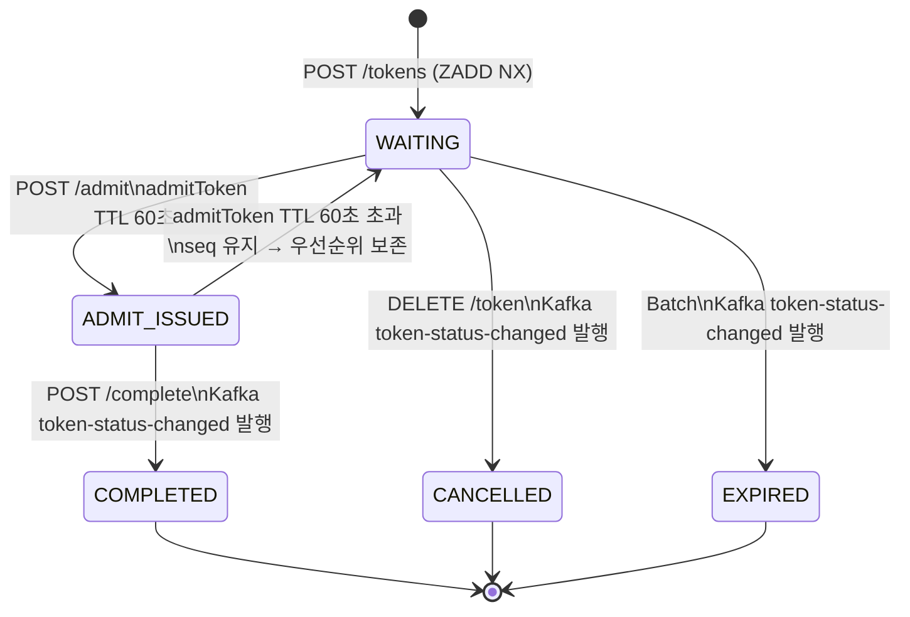

# 📄 Queue Platform — 기능 정의서 (FRS)

> 버전: v1.11 | 상태: 확정 | 대상: 실제 구현 범위
>
> v1.11 변경사항: Java SDK 명세 **실제 삭제**(v1.10에서 "제거"라고 적고 §12에 남아 있던 것),
> 폴링 엔드포인트 2분할(`/status` + 개인, DECISIONS §79), `identifier` = UUIDv7 규약(§78),
> verify·complete 경로에 `queueId` 추가 + admitToken 키를 `queue:{queueId}:*` 로 이동
>
> v1.10 변경사항: Java SDK 제거 (REST API 명세로 대체), tenants.status 컬럼 추가, Queue update 전략 확정 (name만 변경 허용)

---

## 1. 개요

### 목적

대규모 트래픽 상황에서 서버 부하를 제어하기 위해 대기열을 외부 플랫폼으로 분리한다.

### 핵심 원칙

```
Platform  → 순서(순번)만 관리
Tenant    → 슬롯 관리 + 입장 제어
유저      → Platform에 직접 Polling
세션 관리 → Tenant 책임 (Platform 관여 안 함)
```

### 핵심 개념

| 용어 | 설명 |
|------|------|
| Tenant | 플랫폼을 사용하는 B2B 고객사 |
| Queue | Tenant가 생성하는 대기열 단위 |
| Token | 대기열 참여 단위. 순번은 Redis Sorted Set 전담. 메타데이터는 DB 저장 |
| 대기토큰 | Enqueue 시 발급. 유저가 Polling에 사용 |
| 입장토큰 (admitToken) | admit 시 발급. TTL 60초. 유저가 Tenant에 전달 |
| Enqueue | Tenant 서버가 유저 대신 Platform에 대기열 등록 요청 |
| Polling | 유저가 Platform에 직접 순위 확인 요청 (적응형 간격) |
| admit | Tenant 서버가 슬롯 여유 생길 때 Platform에 N명 입장토큰 요청 |
| verify | Tenant가 admitToken 유효성 확인 (상태 변경 없음) |
| complete | Tenant가 입장 완료 후 Platform에 통보 → COMPLETED + ZREM |
| maxCapacity | 대기열 최대 인원 |
| waitingTtl | 대기 중 절대 만료 시간 (기본 7200s) |
| inactiveTtl | 마지막 Polling 이후 비활동 만료 시간 (기본 300s) |
| sliceCount | Platform 자동 계산. ceil(maxCapacity ÷ 100,000) |
| global-seq | 슬라이스 간 FIFO 보장을 위한 전체 순번 |
| seq | 토큰별 global-seq 값. ADMIT_ISSUED→WAITING 복귀 시 score 복원 |
| pacing | `/status`가 내려주는 폴링 간격 구간표. rank로 조회 → SDK가 지터를 더해 사용 (§79) |
| lastAdmittedSeq | 마지막으로 admit된 seq(전광판). `rank = mySeq − lastAdmittedSeq` (§79) |
| ~~nextPollAfterSec~~ | 폐기 — 서버가 개인별 간격을 계산해 내려주던 필드. `pacing`으로 대체 (§79) |
| avgWaitingTime | 평균 대기 시간 (issuedAt ~ completedAt). ETA 계산에 사용 |

### Token 저장 구조

```
DB tokens 테이블:
  tokenId, userId, queueId, seq, status(TINYINT), admit_token
  redis_sync_needed, issuedAt, completedAt
  → 메타데이터 원본. Redis 장애 시 복구 기준
  → Kafka Consumer가 INSERT 보장 (At-Least-Once)
  → admit_token: Redis 미스 시 DB Fallback용

Redis Sorted Set:
  Key: queue:{tenantId}:{queueId}:{sliceNumber}
  member: tokenId, score: global-seq
  → 순번 관리 전담. FIFO 보장
```

---

## 2. 전체 흐름 (9단계)

```
① Tenant → Platform: Queue 생성
   POST /queues

② 유저 서비스 접속 → Tenant 슬롯 확인
   여유 있음 → 바로 입장
   여유 없음 → Enqueue 결정

③ Tenant → Platform: Enqueue
   POST /queues/:queueId/tokens { identifier }      ← identifier는 UUIDv7 (§6.2 참조)
   Platform: Redis Lua 처리 후 즉시 응답 (202 Accepted)
   비동기: Kafka enqueue-events 발행 → DB INSERT
   Tenant → 유저: 대기 페이지를 서빙하면서 tokenId, seq 를 함께 실어 전달

④ 유저 → Platform: Polling (직접, 적응형 간격) — 엔드포인트 2개 (§6.3)
   GET /queues/:queueId/status              ← 평상시. 전원 동일 응답
   ← { lastAdmittedSeq, pacing }
   GET /queues/:queueId/tokens/:tokenId?seq=&ka=   ← 차례 근처 + keepalive만
   ← { ready, admitToken? }

⑤ Tenant → Platform: admit (슬롯 여유 생길 때마다)
   POST /queues/:queueId/admit { count: N }
   ← { admitTokens: [ { userId, admitToken }, ... ] }
   Platform: 앞 N명 → ADMIT_ISSUED + admitToken 발급 (TTL 60초)

⑥ 유저 Polling 응답에 admitToken 포함 (ADMIT_ISSUED 상태일 때)
   ← { ready: true, admitToken: "at_xxx" }
   유저 → Tenant: admitToken 전달

⑦ Tenant → Platform: verify (유효성 확인만. 상태 변경 없음)
   POST /queues/:queueId/admit-tokens/:admitToken/verify
   ← { valid: true, identifier }

⑧ Tenant: 유효한 유저 입장 허용

⑨ Tenant → Platform: complete (입장 완료 통보)
   POST /queues/:queueId/tokens/:tokenId/complete { admitToken }
   Platform: COMPLETED + ZREM + Kafka 발행
   ← { status: COMPLETED, completedAt }

(admitToken TTL 60초 초과 시 → WAITING 복귀. seq 유지. 우선순위 보존)
```

---

## 3. 기능 목록

| 영역 | 기능 | 구현 범위 |
|------|------|-----------|
| Tenant 관리 | 회원가입 / 로그인 / JWT 인증 | ✅ |
| API Key 관리 | 발급 / 검증 / Revoke / Rate limit | ✅ |
| Queue 관리 | 생성 / 수정 / 조회 / 정지 / 재개 / 삭제 | ✅ |
| Token Lifecycle | Enqueue / Polling / admit / verify / complete / 이탈 | ✅ |
| TTL / Batch | 만료 처리 / 파티션 운영 / 통계 집계 | ✅ |
| Kafka | Enqueue 버퍼 / 상태 변경 이벤트 | ✅ |
| Billing | 과금 집계 (Kafka Consumer) | ✅ |
| SDK | **JS SDK만** (Tenant 서버는 REST API 직접 호출) | ✅ |

---

## 4. API 명세

### 4.1 Queue Engine API

| Method | Path | 인증 | 호출 주체 | 설명 |
|--------|------|------|----------|------|
| `POST` | `/api/v1/queues/:queueId/tokens` | X-API-Key | Tenant 서버 | Enqueue → 대기토큰 발급 |
| `GET` | `/api/v1/queues/:queueId/status` | 없음 | 유저 직접 | **큐 전광판** — 전원 동일 응답. 캐시 대상 |
| `GET` | `/api/v1/queues/:queueId/tokens/:tokenId?seq=&ka=` | tokenId 소유 | 유저 직접 | **개인 상태** — ready / admitToken |
| `POST` | `/api/v1/queues/:queueId/admit` | X-API-Key | Tenant 서버 | N명 입장토큰 발급 |
| `POST` | `/api/v1/queues/:queueId/admit-tokens/:admitToken/verify` | X-API-Key | Tenant 서버 | 입장토큰 유효성 확인 |
| `POST` | `/api/v1/queues/:queueId/tokens/:tokenId/complete` | X-API-Key | Tenant 서버 | 입장 완료 통보 → COMPLETED |
| `DELETE` | `/api/v1/queues/:queueId/tokens/:tokenId` | X-API-Key | Tenant 서버 | 이탈 → CANCELLED |

> **verify·complete 경로에 `queueId`가 들어간 이유** (DECISIONS §79):
> admitToken 관련 Redis 키를 `queue:{queueId}:...` 해시태그로 묶기 위해서다. Tenant 서버는
> 자기가 admit을 건 큐를 알고 있으므로 URL에 실을 수 있다. Cluster에서 CROSSSLOT은 사라진다.
> 다만 이는 **전 구간 원자성의 필요조건**이며, 중간 DB 확인(Lua 밖)과 `verified-token`의
> 클러스터 소속 미정 때문에 **충분조건은 아니다** — DECISIONS §79 참조.

### 4.2 관리 API

| Method | Path | 인증 | 설명 |
|--------|------|------|------|
| `POST` | `/api/v1/tenants/signup` | - | 회원가입 |
| `POST` | `/api/v1/tenants/login` | - | 로그인 |
| `POST` | `/api/v1/tenants/refresh` | Refresh Token | 토큰 재발급 |
| `POST` | `/api/v1/queues` | JWT | 대기열 생성 |
| `PATCH` | `/api/v1/queues/:queueId` | JWT | 대기열 수정 |
| `GET` | `/api/v1/queues/:queueId` | JWT | 대기열 조회 |
| `POST` | `/api/v1/queues/:queueId/pause` | JWT | 대기열 정지 |
| `POST` | `/api/v1/queues/:queueId/resume` | JWT | 대기열 재개 |
| `DELETE` | `/api/v1/queues/:queueId` | JWT | 대기열 삭제 |
| `POST` | `/api/v1/tenants/me/api-keys` | JWT | API Key 발급 |
| `DELETE` | `/api/v1/tenants/me/api-keys/:id` | JWT | API Key Revoke |

---

## 5. Queue 설정

| 파라미터 | 타입 | 필수 | 기본값 | 설명 |
|----------|------|------|--------|------|
| name | String | ✅ | - | 큐 이름 (Tenant 내 유일) |
| maxCapacity | Int | ✅ | - | 대기열 최대 인원 |
| waitingTtl | Int(초) | ❌ | 7200 | 대기 중 절대 만료 시간 |
| inactiveTtl | Int(초) | ❌ | 300 | 비활동 만료 시간 |

---

## 6. Token Lifecycle

### 6.1 상태 머신 (TINYINT 매핑)

```
0 = WAITING
1 = ADMIT_ISSUED
2 = COMPLETED
3 = CANCELLED
4 = EXPIRED
```


```mermaid
stateDiagram-v2
    [*] --> WAITING : POST /tokens (ZADD NX)
    WAITING --> ADMIT_ISSUED : POST /admit\nadmitToken TTL 60초
    ADMIT_ISSUED --> COMPLETED : POST /complete\nKafka token-status-changed 발행
    ADMIT_ISSUED --> WAITING : admitToken TTL 60초 초과\nseq 유지 → 우선순위 보존
    WAITING --> CANCELLED : DELETE /token\nKafka token-status-changed 발행
    WAITING --> EXPIRED : Batch\nKafka token-status-changed 발행
    COMPLETED --> [*]
    CANCELLED --> [*]
    EXPIRED --> [*]
```

### 6.2 Enqueue

```
POST /api/v1/queues/:queueId/tokens
Body: { identifier: string }        ← UUIDv7. 생성·전달 주체는 Tenant (아래 규약)

처리 흐름:
1. API Key 검증 (Redis 캐시 60s → DB Replica fallback)
2. Rate limit (per-key 100rps)
3. 큐 상태 확인 (ACTIVE만 허용)
4. identifier 중복 체크 (EXISTS → 기존 tokenId·seq 반환)
5. Bulk Lua Script 원자 실행
   INCRBY global-seq N → startSeq~endSeq
   슬라이스별 ZADD multi-member NX
   slice = (seq-1) % sliceCount
6. 202 Accepted 즉시 응답
7. Kafka enqueue-events 발행
   → TokenEnqueueConsumer: DB INSERT (redis_sync_needed=0)
   → queue-user 역인덱스 SET

Response 202:
{ "tokenId": "tok_Kx9mZ3", "seq": 42, "status": "WAITING" }
```

**identifier 규약 (DECISIONS §66 D1 · §78)**

| 항목 | 내용 |
|---|---|
| 형식 | **UUIDv7**. Platform은 형식 가이드만 제시하고, 검증 책임은 **전적으로 Tenant** |
| 생성·저장 | Tenant가 `userId → identifier(UUIDv7)` 매핑을 **저장**한다 |
| 재사용 | **같은 사용자·같은 큐에는 항상 같은 UUID를 재사용**한다 |

```
⚠️ 매 요청 새 UUID를 만들면 enqueue_bulk.lua의 ZADD NX가 안 걸려
   한 사람이 자리를 여러 개 차지한다.

⚠️ identifier가 추측 가능한 값(이메일 · 순번 ID)이면 안 된다.
   enqueue는 EXISTS일 때 기존 tokenId·seq를 그대로 반환하므로,
   남의 identifier를 아는 자가 그 사람의 identifier로 enqueue를 호출하면
   남의 tokenId·seq — 즉 남의 폴링 자격 증명(§74) — 을 손에 넣는다.
   UUIDv7이면 이 경로가 죽는다.
```

### 6.3 Polling — 엔드포인트 2분할 (DECISIONS §79. 설계 확정, 구현 미착수)

**① 큐 전광판 — 30만 명 전원 동일 응답. 캐시 가능**

```
GET /api/v1/queues/:queueId/status
인증: 없음 (permitAll)   Rate Limit: 없음   ← 아래 "가드레일" 참조

처리: 키 2개 MGET (같은 해시태그 → 1왕복)
  queue:{queueId}:admit-watermark   없으면 0
  queue:{queueId}:pacing            없으면 코드 상수 기본값

Response:
{ "lastAdmittedSeq": 47,
  "pacing": [[50,2],[1000,5],[5000,10],[10000,15],[null,20]] }

pacing = [[rank 상한, 폴링 간격 초], ...]. 마지막 항의 상한 null = 그 이상 전부.
기본값은 코드 상수(QueueEngineService)와 같다. Redis 키가 있으면 그 값이 이긴다.
```

```
SDK 계산 (서버는 rank를 계산하지 않는다):
  rank  = mySeq − lastAdmittedSeq          ← 뺄셈 1회
  간격  = pacing 표 조회 + ±20% 지터
  rank <= 0 → 그때만 ② 개인 엔드포인트로 admitToken 확인
```

**② 개인 상태 — 차례 근처 + keepalive(30~60초 1회)에만 호출**

```
GET /api/v1/queues/:queueId/tokens/:tokenId?seq={seq}&ka={0|1}
인증: tokenId 소유 (permitAll, DECISIONS §74)
Rate Limit: tokenId 기준 Token Bucket — cap 5 / refill 1.0 per sec

처리: poll_verify.lua 1회 (ZRANGEBYSCORE + HGET 대조 + ka=1이면 ZADD last-active)

Response (아직 대기):     { "ready": false }
Response (ADMIT_ISSUED):  { "ready": true, "admitToken": "at_abc123" }
```

**404 계약 — SDK는 HTTP 상태가 아니라 `errorCode`로 재시도를 결정한다**

| 상황 | errorCode | SDK 동작 |
|---|---|---|
| 취소·만료로 토큰이 진짜 사라짐 | `TK001` (기존 `TOKEN_NOT_FOUND`) | **종료** |
| admitToken TTL 만료 → WAITING 복귀 대기 중 (배치 반영 전) | **신규 ErrorCode (후속)** | **백오프 후 재시도** |

> ⚠️ 현재 `ErrorCode`에는 `TOKEN_NOT_FOUND` 하나뿐이라 두 상황이 뭉개진다.
> ErrorCode 추가는 **후속 작업**이며, 이 표는 그 전까지의 계약 정의다.

**가드레일 — `/status`에 `permitAll`만 추가하면 "인증 0 + 제한 0"이 된다**

`RateLimitFilter`는 미등록 public 경로를 **무조건 통과**시킨다(인증 필요 경로는 SecurityConfig가
401로 막는다는 전제). `/status`는 인증도 없으므로 필터를 그냥 지나간다.
→ 방어는 두 가지다.
① **CDN·WAS 캐시 키에서 쿼리스트링을 제외**한다. `?x=랜덤` cache-buster가 죽고,
   **유효한 queueId 1개당** 오리진 부하가 `1 ÷ 캐시 TTL`로 고정된다.
② **미지 queueId는 맵 선적재로 막는다.** 경로 자체(`/queues/{임의}/status`)가 cache-buster라
   ①만으로는 안 막힌다 — 매번 새 캐시 키다. 큐→클러스터 매핑은 **불변**이므로(DECISIONS §75 D27-2)
   **맵을 통째로 선적재하고, 맵에 없으면 그대로 404**로 끝낸다. DB 조회도, negative 캐시 엔트리도
   만들지 않는다(엔트리를 만들면 미지 ID마다 메모리가 는다).
   ⚠️ **맵은 주기적으로 통째 리로드한다.** 큐는 런타임에 생성되므로 부팅 시 선적재한 맵에는
   그 이후 만들어진 정상 큐가 없다 → 그대로 두면 **새 큐의 `/status`가 WAS 재기동 전까지 404**다.
   매핑이 불변이라 값 충돌이 없어 통째 교체가 안전하고, 런타임에 생성된 큐가 그때 들어온다.
   **미스는 DB로 내려보내지 않는다.** **리로드 주기는 미정** — 큐 생성 후 `/status`가
   열리기까지의 지연이 그 값이다.

**Rate Limit은 걸지 않는다** (30만 명이 한 버킷을 공유하면 남용자 1명이 정상 대기자 전원을 429시킨다).

### 6.4 Admit → ADMIT_ISSUED

```
POST /api/v1/queues/:queueId/admit
Body: { count: N, requestId: "req_abc" }

처리 흐름:
1. queue:{queueId}:admit-idem:{requestId} 멱등성 체크
2. DB admit_requests INSERT (PENDING) — 영속성 기준점
3. Kafka enqueue-admit 발행
   → AdmitConsumer: Lua Dequeue + admitToken 발급

① Lua Dequeue (Redis 전용):
  슬라이스별 ZRANGE WITHSCORES → score 정렬 → 상위 N명 ZREM
  부족 시 최대 3회 추가 추출 (전체 재정렬 → FIFO 보장)

② DB WAITING 상태 확인 + verified-token 체크   ← Lua 밖. Lua는 MySQL을 못 만진다

③ admitToken 발급 (①과 별개 호출 — 사이에 "pop 성공 + SET 실패" 창이 있다. DECISIONS §79 미해결):
  SET queue:{queueId}:admit-by-token:{tokenId} EX 60
  SET queue:{queueId}:admit-by-admit:{admitToken} EX 60
  SET queue:{queueId}:admit-watermark = max(현재값, 방금 뽑은 최대 seq)   ← DECISIONS §79
  DB tokens.admit_token = admitToken
  DB UPDATE ADMIT_ISSUED (100건씩 / 10ms 대기)
  SET token-info 캐시 즉시 갱신

admitToken TTL: 60초
만료 시: WAITING 복귀 (seq 유지 → 우선순위 보존)

admitToken 생성: tokenId와 동일하게 UUIDv7(랜덤 74비트). 짧은 랜덤 금지.
  verify가 이 값 하나만으로 통과하므로 admitToken 자체가 입장 자격이다.
```

### 6.5 Verify (유효성 확인만 — 상태 변경 없음)

```
POST /api/v1/queues/:queueId/admit-tokens/:admitToken/verify
  ← 경로에 queueId가 있는 이유: Redis 키를 queue:{queueId}:* 해시태그로 묶기 위해서다 (§4.1 주석)

처리 흐름:
0. API Key tenant의 queueId 소유 검증 → 아니면 QUEUE_NOT_OWNED   ← enqueue와 동일
1. Redis GET queue:{queueId}:admit-by-admit:{admitToken} → tokenId
   없으면 → DB Fallback
     SELECT WHERE queue_id=? AND tenant_id=?           ← 술어 필수 (0단계와 같은 이유)
            AND status=ADMIT_ISSUED AND admit_token=?
            AND issued_at > UTC_TIMESTAMP(3) - INTERVAL 60 SECOND
     -- ⚠️ UTC_TIMESTAMP()로 쓴다. 시각 컬럼은 전부 UTC다(DECISIONS §77).
     --    앱의 JDBC 세션은 time_zone=+00:00 이라 NOW()도 UTC지만, 서버 default-time-zone은
     --    아직 +09:00 이라 mysql CLI로 같은 쿼리를 돌리면 NOW()가 KST다.
     --    UTC_TIMESTAMP()는 어느 경로에서도 같은 값이므로 이쪽을 쓴다.
     없으면 → 404 TK_002_INVALID_ADMIT_TOKEN
2. DB ADMIT_ISSUED 상태 확인 (Replica)
3. SET verified-token:{tokenId} EX 60 (중복 입장 방지)
4. 상태 변경 없음

Response: { "valid": true, "identifier": "0190e2c1-..." }
```

**[중요] verify 호출 순서 — Tenant 책임 (SDK 없음, DECISIONS §35)**

```
올바른 순서:
  ① verify 즉시 호출 (유저 admitToken 전달받은 즉시)
  ② valid 확인
  ③ Tenant 내부 처리 (세션 생성, 외부 API 등)
  ④ complete 호출

잘못된 순서:
  ① Tenant 내부 처리 (30초 소요)
  ② verify 호출 → TTL 60초 초과 → 404 발생 위험

Tenant 서버용 SDK가 없으므로 이 순서를 코드 레벨에서 강제할 수단이 없다.
→ OpenAPI description에 명시 + 서버가 위반을 방어 (verify 없이 온 complete는 거절)
```

### 6.6 Complete → COMPLETED

```
POST /api/v1/queues/:queueId/tokens/:tokenId/complete
Body: { admitToken: "at_xxx" }

처리 흐름:
0. API Key tenant의 queueId 소유 검증 → 아니면 QUEUE_NOT_OWNED   ← enqueue와 동일.
   complete는 DB 상태를 바꾸는 쓰기이므로 검증 없이 통과시키면 안 된다
1. DB ADMIT_ISSUED 확인 (Master. queue_id·tenant_id 술어 포함)
2. admitToken 유효성 확인
   Redis GET queue:{queueId}:admit-by-admit:{admitToken}
   없으면 → 404
3. DB status = COMPLETED (먼저)
4. Redis 정리 (나중)
   ZREM Sorted Set
   DEL queue:{queueId}:admit-by-token + queue:{queueId}:admit-by-admit
   DEL token-info + verified-token
5. Kafka token-status-changed 발행
   → BillingConsumer: tokens 원본 집계 → billing_snapshots UPSERT
6. avgWaitingTime 직접 갱신 (Kafka Consumer 없이)
   waitingSeconds = completedAt - issuedAt
   이상치 필터: waitingTtl × 0.8 초과 시 스킵
   HINCRBYFLOAT queue-stats:{t}:{q} waitingTimeSum {seconds}
   HINCRBY queue-stats:{t}:{q} waitingTimeCount 1

Response: { "status": "COMPLETED", "completedAt": "..." }
```

### 6.7 이탈 → CANCELLED

```
DELETE /api/v1/queues/:queueId/tokens/:tokenId
조건: WAITING(0)만. ADMIT_ISSUED(1) → 409

처리:
  Redis ZREM
  DB status = CANCELLED(3)
  DEL queue-user + DEL token-info
  Kafka token-status-changed 발행
```

---

## 7. Kafka 설계

### 토픽

| 토픽 | 파티션 기준 | 보존 | 설명 |
|------|------------|------|------|
| `enqueue-events` | queueId | 7일 | Enqueue → DB INSERT |
| `enqueue-admit` | queueId | 7일 | admit → Dequeue + admitToken 발급 |
| `token-status-changed` | queueId | 7일 | 상태 변경 → Billing / Stats |

### 이벤트 스키마

```json
// enqueue-events
{
  "tokenId": "tok_Kx9mZ3",
  "queueId": "q_xyz789",
  "tenantId": "t_abc123",
  "userId": "user123",
  "seq": 42500,
  "issuedAt": "2026-03-19T10:00:00.123Z"
}

// enqueue-admit
{
  "requestId": "req_abc",
  "tenantId": "t_abc123",
  "queueId": "q_xyz789",
  "count": 100
}

// token-status-changed
{
  "tokenId": "tok_Kx9mZ3",
  "queueId": "q_xyz789",
  "tenantId": "t_abc123",
  "status": "COMPLETED",
  "waitingSeconds": 127,
  "expiredReason": null,
  "occurredAt": "2026-03-19T10:02:07.456Z"
}
```

### Consumer

| Consumer | 토픽 | 역할 |
|----------|------|------|
| `TokenEnqueueConsumer` | enqueue-events | DB INSERT 1000건 Bulk / redis_sync_needed=0 |
| `AdmitConsumer` | enqueue-admit | Lua Dequeue + admitToken 발급 |
| `BillingConsumer` | token-status-changed | COMPLETED → tokens 원본 집계 → billing_snapshots UPSERT |

---

## 8. Redis 데이터 구조 (RedisKeyFactory 중앙 관리)

> ⚠️ 큐 상태 키의 표기(`queue:{t}:{q}:{slice}`, `global-seq:*`)는 Sprint 5-E 구현
> (`QueueKeys`: `queue:{queueId}:waiting|seq|tokens|last-active`)과 **아직 어긋나 있다** — 후속 정정 대상.
> 새로 추가되는 큐 키는 반드시 `QueueKeys`를 거치고 `{queueId}` 해시태그를 갖는다 (DECISIONS §70 D10 · §75 D26).

| Key 패턴 | 자료구조 | TTL | 역할 |
|----------|----------|-----|------|
| `queue:{t}:{q}:{slice}` | Sorted Set | 없음 | 대기열. score=global-seq |
| `global-seq:{t}:{q}` | String | 없음 | 순번 채번. INCRBY 원자 |
| `queue-meta:{t}:{q}` | Hash | 없음 | 큐 설정 |
| `queue-stats:{t}:{q}` | Hash | 없음 | avgWaitingTime (complete 시 직접 갱신) |
| `queue-user:{t}:{q}:{userId}` | String | waitingTtl | 중복 Enqueue 방지 |
| `token-last-active:{tokenId}` | String | 300s | 비활동 TTL 감지 |
| `token-info:{tokenId}` | String | 폴링 간격+2s | Polling 캐시 (⚠️ §79는 폴링 경로에서 DB status를 읽지 않으므로 존치 여부 후속 검토) |
| `queue:{queueId}:admit-by-token:{tokenId}` | String | 60s | Polling 응답용 admitToken |
| `queue:{queueId}:admit-by-admit:{admitToken}` | String | 60s | verify/complete용 tokenId |
| `queue:{queueId}:admit-watermark` | String | 없음 | 마지막 admit seq. `/status` 전광판 원본 (§79) |
| `queue:{queueId}:pacing` | String | 없음 | 폴링 간격 구간표 **오버라이드**. 없으면 코드 상수 (§79) |
| `queue:{queueId}:admit-idem:{requestId}` | String | 300s | admit 멱등성. `requestId`는 **Tenant가 정하는 값**이라 큐 스코프 필수 |
| `verified-token:{tokenId}` | String | 60s | 중복 입장 방지 |
| `batch-lock:{t}:{q}` | String | 15s | Batch 서버 분산 |
| `apikey-cache:{sha256}` | String | 60s | API Key 인증 캐시 |

> 제거된 Key:
> queue-count → ZCARD Pipeline으로 대체
> billing-count → Kafka BillingConsumer → tokens 원본 집계로 대체
> admit-request-queue, admit-processing-queue → Kafka enqueue-admit으로 대체

---

## 9. 동시성 제어

| 문제 | 해결 |
|------|------|
| 중복 Enqueue | queue-user 역인덱스 + ZADD NX |
| 용량 초과 | ZCARD Pipeline 합산 |
| Enqueue DB 유실 | Kafka At-Least-Once + UNIQUE KEY 방어 |
| 대량 Enqueue 병목 | INCRBY + ZADD multi (500건 Adaptive) |
| admit 순서 보장 | Kafka enqueue-admit → AdmitConsumer (순차 처리) |
| 중복 입장 | verified-token 플래그 + admitToken 교차 확인 |
| complete 동시성 | DB UPDATE WHERE status=1 (1번만 성공) |
| ZREM 실패 | DB 먼저 → Batch 10초 내 재실행 |
| billing 중복 | tokens 원본 집계 → 중복 개념 없음 |
| Redis 다운 중 INSERT | redis_sync_needed=1 → RedisSyncJob 복구 |

---

## 10. Batch Jobs

| Job | 주기 | 처리 |
|-----|------|------|
| `TokenExpiryJob` | 10초 | WAITING TTL 만료 → EXPIRED + Kafka 발행 |
| `AdmitTokenExpiryJob` | 10초 | ADMIT_ISSUED admitToken TTL → WAITING 복귀 (seq 유지) |
| `RedisSyncJob` | 5분 | redis_sync_needed=1 토큰 → Redis 재삽입 |
| `BillingSnapshotJob` | M+2월 초 | tokens 원본 집계 → queue_daily_stats + billing_snapshots → 파티션 DROP |

---

## 11. 에러 코드

| 코드 | HTTP | 상황 |
|------|------|------|
| `AK_001_UNAUTHORIZED` | 401 | API Key 무효 |
| `TK_001_INVALID_TOKEN` | 401 | 대기토큰 무효 |
| `TK_002_INVALID_ADMIT_TOKEN` | 404 | 입장토큰 만료 or 무효 |
| `RL_001_KEY_LIMIT` | 429 | per-key 100rps 초과 |
| `QM_001_NOT_FOUND` | 404 | 큐 없음 |
| `QM_004_NOT_ACTIVE` | 503 | 큐 PAUSED / DRAINING |
| `QE_001_CAPACITY_EXCEEDED` | 429 | maxCapacity 초과 |
| `QE_006_INVALID_STATUS` | 409 | 상태 전환 불가 |
| `CM_001_INVALID_PARAM` | 400 | 파라미터 오류 |
| `CM_003_INTERNAL_ERROR` | 500 | 서버 내부 오류 |
| `CM_004_SERVICE_UNAVAILABLE` | 503 | Redis / Kafka 장애 |

---

## 12. SDK 설계

> **JS SDK만 만든다. Tenant 서버용 SDK는 만들지 않는다** (DECISIONS §35).
> 언어를 하나 고르는 순간 나머지 테넌트를 버리는 결정이 되므로, Tenant 서버는 이 문서의
> **REST 명세를 직접 호출**한다. 즉 **이 명세가 사실상의 SDK**다 — 응답 필드·에러 코드·순서
> 규칙이 부정확하면 그대로 테넌트 장애가 된다.
> JS SDK의 범위는 **폴링 + 대기 UI 전용**이며 **enqueue는 포함하지 않는다** (DECISIONS §78).

### Tenant 서버 (REST 직접 호출)

SDK가 없으므로 아래 제약은 **명세에 명시하고 서버가 방어**한다 (DECISIONS §35 Consequences).

| Tenant가 지켜야 할 것 | 위반 시 | Platform의 대응 |
|---|---|---|
| verify를 **Tenant 내부 처리 전에** 먼저 호출 | 내부 처리가 길면 admitToken TTL 60초 초과 → `TK_002` 404 | 순서 강제 불가(Tenant 책임). OpenAPI description에 명시 |
| complete는 admitToken TTL 60초 내 호출 | 만료된 admitToken → 404 | 위와 동일 |
| verify 없이 complete 호출 금지 | 중복 입장 방지 플래그(`verified-token`)가 안 걸림 | **서버가 거절** |
| `identifier`는 **UUIDv7**, 사용자·큐당 **같은 값을 재사용** | §6.2 참조 — 자리 중복 점유 / 자격 증명 유출 | 형식 가이드만 제시. 검증은 Tenant 책임 |

### JS SDK (브라우저용)

| 클래스 | 역할 |
|--------|------|
| `PollingManager` | `/status`의 `pacing` 표로 다음 호출 시각 계산 + 지터. setTimeout 관리 |
| `StateManager` | IDLE → WAITING → READY → COMPLETED → EXPIRED 전환 |

```javascript
const queue = QueueSDK.init({
    baseUrl: 'https://api.queue-platform.com',
    queueId: queueId,  // Tenant 서버에서 받은 값
    tokenId: tokenId,  // Tenant 서버에서 받은 값
    seq: seq           // Tenant 서버에서 받은 값 (rank 계산의 기준)
});

queue.startPolling({
    onWaiting: ({ rank }) => {
        updateUI(rank);
        // rank = seq − lastAdmittedSeq  → SDK가 뺄셈으로 계산 (§79)
        // 다음 호출 간격 = pacing 표 조회 + ±20% 지터 → SDK가 setTimeout에 세팅
    },
    onReady: ({ admitToken }) => {
        sendToTenantServer(admitToken); // Tenant 서버에 전달
    },
    onExpired: () => {
        showExpiredMessage(); // 재Enqueue 안내
    }
});

// 탭 비활성화 → Polling 자동 중단 (배터리/서버 부하 절약)
// 탭 복귀 → 즉시 재개
// 네트워크 offline/online 이벤트 자동 처리
```

**JS SDK가 해결하는 것:**

```
폴링 간격:
  /status 응답의 pacing 구간표 + rank로 간격 결정, ±20% 지터
  SDK가 setTimeout에 자동 세팅
  → Tenant가 Polling 간격 직접 관리 불필요
  → 서버는 pacing 값만 바꾸면 전원의 간격을 즉시 조정할 수 있다 (§79)

탭 비활성화 처리:
  visibilitychange 이벤트 자동 감지
  비활성화 → Polling 중단 (서버 부하 절약)
  복귀 → 즉시 재개

keepalive:
  개인 엔드포인트를 ka=1로 30~60초에 1회만 호출 → last-active 갱신
  (평상시 /status만 때리면 서버는 대기자가 살아 있는지 알 수 없다)

404 처리:
  errorCode로 분기 — 진짜 소멸이면 종료, WAITING 복귀 대기면 백오프 후 재시도 (§6.3)
```

### 클라이언트 전체 흐름

```
1. 유저 → Tenant 서버: 서비스 접속 (자격 판정 + 슬롯 여유 확인)
2. Tenant 서버 → Platform (REST, X-API-Key): POST /enqueue     ← SDK 아님 (DECISIONS §78)
3. Tenant 서버 → 유저: 대기 페이지를 서빙하면서 tokenId, seq, queueId 를 함께 실어 보냄
4. 유저 (JS SDK): queue.startPolling() 시작
5. JS SDK → Platform 직접 (API Key 없음)
   평상시:      GET /queues/:queueId/status          → rank·간격을 SDK가 계산
   차례 근처·ka: GET /queues/:queueId/tokens/:tokenId?seq=&ka=
6. JS SDK → onReady 콜백: admitToken 수신
7. 유저 → Tenant 서버: admitToken 전달
8. Tenant 서버 (REST): verify → 내부 처리 → complete
   ← 순서를 강제하는 SDK가 없다. 명세로 규정하고 서버가 위반을 방어한다 (§35)
```

### 프로젝트 구조

| 레포 | 모듈 수 | 배포 | 역할 |
|------|--------|------|------|
| `queue-platform` | 5개 | Docker | 플랫폼 본체 (API, Batch, Domain, Infra, Common) |
| `queue-platform-sdk-js` | 1개 | npm + CDN | 브라우저용 (PollingManager, StateManager) |

> Tenant 서버용 SDK 레포는 만들지 않는다 (DECISIONS §35).

---

## 13. 비기능 요구사항

### 성능 목표

| API | p99 목표 | 목표 TPS |
|-----|----------|----------|
| Enqueue | < 50ms (202 즉시 응답) | 200 rps (10,000 rps 급증 → Kafka) |
| Polling | < 50ms | 2,000 rps |
| admit | < 100ms | 10 rps |

### 안정성

| 장애 | 영향 | 대응 |
|------|------|------|
| Redis Master 다운 | Enqueue/Polling 중단 | Sentinel Failover 5~10초 |
| Redis 다운 중 Enqueue | Sorted Set 미반영 | redis_sync_needed=1 → RedisSyncJob 복구 |
| Kafka 다운 | DB INSERT 지연 | 복구 후 Consumer 재처리 |
| MySQL Master 다운 | complete 중단 | Replica 승격 |

### MySQL Read/Write 분리

```
Write → Master: UPDATE (complete, cancel, expire)
Read  → Replica: SELECT (Polling, API Key)
INSERT → Kafka Consumer → Master (비동기)
@Transactional(readOnly = true) → Replica
@Transactional → Master
```

### Redis Read/Write 분리 미적용

```
모든 연산 → Master
Lua Script 원자성. In-Memory 충분
Slave: Failover + 백업
Sentinel: Master 1 + Slave 2 + Sentinel 3
쿼럼 = 2, min-replicas-to-write 1
```

> ⚠️ **위는 현재 구현(Sentinel) 기준이다.** 목표 구성은 **독립 2 Cluster + 큐 단위 이중 라우팅**으로
> 확정되었다(DECISIONS §75, 전환 시점 미정). 전환 후 위 표의 "Sentinel Failover 5~10초"는
> **각 클러스터 내부의 master–replica failover**로 바뀐다. 두 클러스터 분리는 **용량 방어**이며
> **가용성 방어가 아니다** — cluster1 장애를 cluster2가 대신 받지 않는다 (§75 Consequences ⑥).

### Virtual Thread (Spring MVC)

```yaml
# application.yml
spring:
  threads:
    virtual:
      enabled: true  # Tomcat이 모든 요청을 Virtual Thread로 처리
```

```
설정 한 줄로 Tomcat의 모든 요청이 Virtual Thread에서 처리됨
JPA blocking I/O → Virtual Thread가 OS Thread를 점유하지 않고 대기
BCrypt → 별도 스케줄러 격리 불필요
@Transactional → ThreadLocal 기반 → Virtual Thread에서 정상 동작
→ Polling 2,000 rps 달성 가능
```

---

## 🔥 핵심 원칙

> Platform은 **순서만 관리**한다.
> 입장 여부는 **Tenant 서버가 결정**한다.
> 유저는 **Platform에 직접 Polling**한다 (`pacing` 구간표 기반 적응형, §79).
> verify = 유효성 확인만. complete = COMPLETED + ZREM + Kafka 발행.
> DB 먼저, ZREM 나중 — **잔류가 유실보다 안전**하다.
> seq를 DB에 저장 — **ADMIT_ISSUED 복귀 시 순위 복원 가능**하다.
> Kafka At-Least-Once — **DB INSERT는 반드시 보장**된다.
