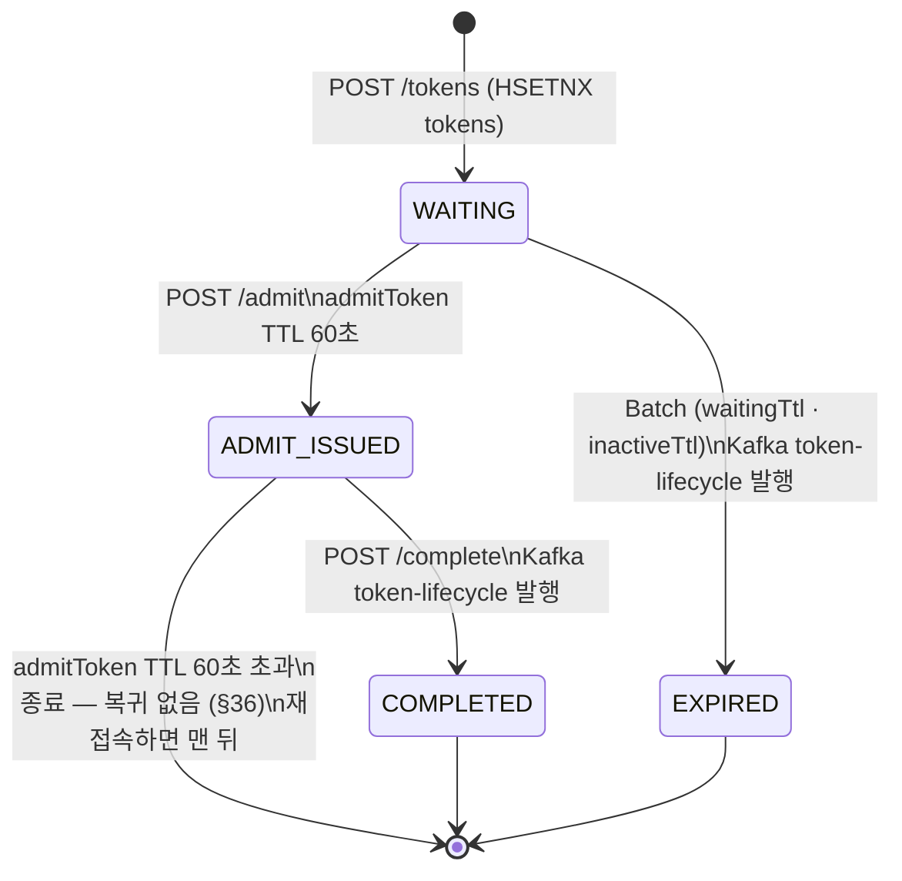

# 📄 Queue Platform — 기능 정의서 (FRS)

> 버전: v1.16 | 상태: 확정 | 대상: 실제 구현 범위
>
> ⚠️ **API 필드 명세의 정본은 [`API.md`](API.md)다** — 코드에서 추출한 것이라 구현과 어긋나지
> 않는다. 이 문서는 **설계 시점의 요구사항 원본**이며, 여기 적힌 필드가 구현과 갈리면
> `API.md`가 맞다. (이 문서는 이력이 일이므로 사후에 고치지 않는다.)
>
> v1.16 변경사항: **§6.2에 "세션 경계 3종" 신설** — ① `identifier` 매핑의 영속성 요구,
> ② `tokenId`·`seq`의 브라우저 보관처(SDK 규약, 미정), ③ 비로그인 상태로 `admitToken`을
> 받았을 때의 입장 처리와 그 보안 대가. 셋 다 Tenant·SDK 책임이고 Platform 코드는 0줄이다
>
> v1.15 변경사항 (DECISIONS §36): **admitToken TTL 만료 시 WAITING 복귀 폐기** — 만료는 종료이고
> 재접속 → 재-enqueue → 맨 뒤다. `RETURNED` 이벤트 삭제, §6.3의 상태 B·B′와 그 미해결 `ErrorCode`
> 후속이 **소멸**, `TokenReclaimJob`은 `HDEL tokens` + `EXPIRED` 발행으로 바뀐다.
> ⚠️ DB `status`는 `1`로 남는다(`EXPIRED` 가드가 `status = 0` 전용) — 그것이 complete 300초 창을 살린다
>
> v1.14 변경사항 (DECISIONS §82): **Cancel API(`DELETE /tokens/:tokenId`) 폐기** — 엔드포인트 표·
> 상태 머신·소비 측 가드에서 삭제, §6.7을 "이탈 → EXPIRED"로 재작성(`inactiveTtl` 판정 배치가
> 유일 경로, 유예 창 개념 추가), `status = 3`을 예약값으로 표기, `QE_006_INVALID_STATUS`를
> **쓰이는 곳 없음**으로 정정
>
> v1.13 변경사항 (Sprint 7 구현 반영 — `dev` `ba21221`, PR #31~38): 중복 게이트 `HSETNX`(=`tokens` Hash)
> 명시, verify는 **DB 읽기 0회**(§6.5), complete 유효 창 **300초 확정**(§6.6),
> `INVALID_ADMIT_TOKEN`/`TK002`를 **구현됨 표로 이동**(§11), admit 관측 메트릭은 **미구현**임을 명시(§6.4),
> `avgWaitingTime`·`queue-stats` **삭제**(DECISIONS §81), ODKU 함정 ②를 `AS new` 별칭으로 정정(§7)
>
> v1.12 변경사항: 구현과 어긋난 서술 정정 — Redis 키표를 `QueueKeys` 4종으로 교체(slice·global-seq·
> queue-user·token-last-active 폐기, §66 D2·§70 D9·§74), Kafka를 단일 `token-lifecycle` + 키 `tokenId`로
> 정정(§73 D16·D18), 에러 코드표를 `ErrorCode.java`와 1:1로, Enqueue 응답 202 → **200**,
> `queue-consumer` 모듈 반영
>
> v1.11 변경사항: Java SDK 명세 **실제 삭제**(v1.10에서 "제거"라고 적고 §12에 남아 있던 것),
> 폴링 엔드포인트 2분할(`/status` + 개인, DECISIONS §79), `identifier` = UUIDv7 규약(§78),
> verify·complete 경로에 `queueId` 추가 + admitToken 키를 `queue:{queueId}:*` 로 이동
>
> v1.10 변경사항: Java SDK 제거 (REST API 명세로 대체), tenants.status 컬럼 추가, Queue update 전략 확정 (name만 변경 허용)

---

## 1. 개요

### 목적

대규모 트래픽 상황에서 서버 부하를 제어하기 위해 대기열을 외부 플랫폼으로 분리한다.

### 핵심 원칙

```
Platform  → 순서(순번)만 관리
Tenant    → 슬롯 관리 + 입장 제어
유저      → Platform에 직접 Polling
세션 관리 → Tenant 책임 (Platform 관여 안 함)
```

### 핵심 개념

| 용어 | 설명 |
|------|------|
| Tenant | 플랫폼을 사용하는 B2B 고객사 |
| Queue | Tenant가 생성하는 대기열 단위 |
| Token | 대기열 참여 단위. 순번은 Redis Sorted Set 전담. 메타데이터는 DB 저장 |
| 대기토큰 | Enqueue 시 발급. 유저가 Polling에 사용 |
| 입장토큰 (admitToken) | admit 시 발급. TTL 60초. 유저가 Tenant에 전달 |
| Enqueue | Tenant 서버가 유저 대신 Platform에 대기열 등록 요청 |
| Polling | 유저가 Platform에 직접 순위 확인 요청 (적응형 간격) |
| admit | Tenant 서버가 슬롯 여유 생길 때 Platform에 N명 입장토큰 요청 |
| verify | Tenant가 admitToken 유효성 확인 + **완료 확정**(`COMPLETED` 발행, PR #48). Redis·DB 직접 쓰기만 0회 |
| complete | Tenant가 입장 완료 후 Platform에 통보 → COMPLETED + ZREM |
| maxCapacity | 대기열 최대 인원 |
| waitingTtl | 대기 중 절대 만료 시간 (기본 7200s) |
| inactiveTtl | 마지막 Polling 이후 비활동 만료 시간 (기본 300s) |
| ~~sliceCount~~ | 폐기 — 대기열을 여러 ZSet으로 쪼개던 값. ZSet 하나로 확정 (§66 D2) |
| ~~global-seq~~ | 폐기 — 큐별 `INCR queue:{queueId}:seq`로 대체 (§70 D9) |
| identifier | Tenant가 만드는 UUIDv7. `waiting` ZSet의 member이자 중복 판정 키 (§66 D1 · §78) |
| seq | 토큰의 순번(= ZSet score). Redis 전손 시 DB 재구성용(§71). ~~복귀 시 score 복원~~은 §36이 폐기 |
| pacing | `/status`가 내려주는 폴링 간격 구간표. rank로 조회 → SDK가 지터를 더해 사용 (§79) |
| lastAdmittedSeq | 마지막으로 admit된 seq(전광판). `rank = mySeq − lastAdmittedSeq` (§79) |
| ~~nextPollAfterSec~~ | 폐기 — 서버가 개인별 간격을 계산해 내려주던 필드. `pacing`으로 대체 (§79) |
| ~~avgWaitingTime~~ | 폐기 — 평균 대기 시간. ETA와 `queue-stats` 키까지 함께 폐기 (§81). 필요해지면 `tokens` 사후 집계 |

### Token 저장 구조

```
DB tokens 테이블:
  tokenId, userId, queueId, seq, status(TINYINT), admit_token
  issuedAt, completedAt
  → 메타데이터 원본. Redis 장애 시 복구 기준
  → Kafka Consumer가 INSERT 보장 (At-Least-Once)
  → admit_token: Redis 미스 시 DB Fallback용

Redis (QueueKeys — §8 참조):
  queue:{queueId}:waiting   Sorted Set. member=identifier, score=seq
  queue:{queueId}:seq       INCR로 score 발급
  queue:{queueId}:tokens    Hash. identifier → "tokenId|issuedAt"
  → 순번 관리 전담. FIFO 보장
```

---

## 2. 전체 흐름 (9단계)

```
① Tenant → Platform: Queue 생성
   POST /queues

② 유저 서비스 접속 → Tenant 슬롯 확인
   여유 있음 → 바로 입장
   여유 없음 → Enqueue 결정

③ Tenant → Platform: Enqueue
   POST /queues/:queueId/tokens { identifier }      ← identifier는 UUIDv7 (§6.2 참조)
   Platform: Redis Lua 처리 후 즉시 응답 (200 OK — 순번이 확정된 뒤 응답한다)
   비동기: Kafka token-lifecycle 발행 (key=tokenId) → DB INSERT
   Tenant → 유저: 대기 페이지를 서빙하면서 tokenId, seq 를 함께 실어 전달

④ 유저 → Platform: Polling (직접, 적응형 간격) — 엔드포인트 2개 (§6.3)
   GET /queues/:queueId/status              ← 평상시. 전원 동일 응답
   ← { lastAdmittedSeq, pacing }
   GET /queues/:queueId/tokens/:tokenId?seq=&ka=   ← 차례 근처 + keepalive만
   ← { ready, admitToken? }

⑤ Tenant → Platform: admit (슬롯 여유 생길 때마다)
   POST /queues/:queueId/admit { count: N }
   ← { admitTokens: [ { userId, admitToken }, ... ] }
   Platform: 앞 N명 → ADMIT_ISSUED + admitToken 발급 (TTL 60초)

⑥ 유저 Polling 응답에 admitToken 포함 (ADMIT_ISSUED 상태일 때)
   ← { ready: true, admitToken: "at_xxx" }
   유저 → Tenant: admitToken 전달

⑦ Tenant → Platform: verify (**이 응답 시점이 완료다** — COMPLETED 발행. Redis·DB 직접 쓰기는 0회)
   POST /queues/:queueId/admit-tokens/:admitToken/verify
   ← { valid: true, identifier }

⑧ Tenant: 유효한 유저 입장 허용

⑨ Tenant → Platform: complete (입장 완료 통보)
   POST /queues/:queueId/tokens/:tokenId/complete { admitToken }
   Platform: COMPLETED + ZREM + Kafka 발행
   ← { status: COMPLETED, completedAt }

(admitToken TTL 60초 초과 시 → **종료**. 복귀하지 않는다 — §36. 재접속 → 재-enqueue → 맨 뒤)
```

---

## 3. 기능 목록

| 영역 | 기능 | 구현 범위 |
|------|------|-----------|
| Tenant 관리 | 회원가입 / 로그인 / JWT 인증 | ✅ |
| API Key 관리 | 발급 / 검증 / Revoke / Rate limit | ✅ |
| Queue 관리 | 생성 / 수정 / 조회 / 정지 / 재개 / 삭제 | ✅ |
| Token Lifecycle | Enqueue / Polling / admit / verify / complete / 이탈 | ✅ |
| TTL / Batch | 만료 처리 / 파티션 운영 / 통계 집계 | ✅ |
| Kafka | Enqueue 버퍼 / 상태 변경 이벤트 | ✅ |
| Billing | 과금 집계 — ~~Kafka Consumer~~ **일 1회 배치**(`BillingSnapshotJob`, §84). `BillingConsumer`는 없다 | ✅ |
| SDK | **JS SDK만** (Tenant 서버는 REST API 직접 호출) | ✅ |

---

## 4. API 명세

### 4.1 Queue Engine API

| Method | Path | 인증 | 호출 주체 | 설명 |
|--------|------|------|----------|------|
| `POST` | `/api/v1/queues/:queueId/tokens` | X-API-Key | Tenant 서버 | Enqueue → 대기토큰 발급 |
| `GET` | `/api/v1/queues/:queueId/status` | 없음 | 유저 직접 | **큐 전광판** — 전원 동일 응답. 캐시 대상 |
| `GET` | `/api/v1/queues/:queueId/tokens/:tokenId?seq=&ka=` | tokenId 소유 | 유저 직접 | **개인 상태** — ready / admitToken |
| `POST` | `/api/v1/queues/:queueId/admit` | X-API-Key | Tenant 서버 | N명 입장토큰 발급 |
| `POST` | `/api/v1/queues/:queueId/admit-tokens/:admitToken/verify` | X-API-Key | Tenant 서버 | 입장토큰 유효성 확인 |
| `POST` | `/api/v1/queues/:queueId/tokens/:tokenId/complete` | X-API-Key | Tenant 서버 | 입장 완료 통보 → COMPLETED |

> **verify·complete 경로에 `queueId`가 들어간 이유** (DECISIONS §79):
> admitToken 관련 Redis 키를 `queue:{queueId}:...` 해시태그로 묶기 위해서다. Tenant 서버는
> 자기가 admit을 건 큐를 알고 있으므로 URL에 실을 수 있다. Cluster에서 CROSSSLOT은 사라진다.
> 이는 **전 구간 원자성의 필요조건**이었고, **§80이 충분조건까지 채웠다** — 중간 DB 확인을 삭제해
> admit 전 구간이 Lua 하나에 들어갔고, 소속이 미정이던 `verified-token`은 폐기됐다.

> 🔴 **위 "인증" 칸은 `ApiKeyAuthenticationFilter.shouldNotFilter`의 화이트리스트와 1:1이어야 한다.**
> 실제로 어긋났다 — §80이 admit·verify·complete를 추가했는데 화이트리스트가 `enqueue` 하나에 머물러
> **세 경로가 전부 401**이었다(`28106ba`. JWT Bearer로는 통과해서 테스트가 못 잡았다).
> **인증 주체가 경로마다 다르다는 것이 함정이다** — `GET /{queueId}/tokens/{tokenId}`(폴링)는
> **유저가 직접** 부르고 API Key가 없으며, `GET /{queueId}/status`는 `permitAll`이다.
> 즉 `/tokens/{tokenId}/complete`와 `/tokens/{tokenId}`를 정규식으로 **구분**해야 하고, 뭉개면
> **폴링이 401**이 된다. (~~`DELETE /{queueId}/tokens/{tokenId}`~~는 §82로 폐기돼 이 함정이 하나 줄었다.)

### 4.2 관리 API

| Method | Path | 인증 | 설명 |
|--------|------|------|------|
| `POST` | `/api/v1/tenants/signup` | - | 회원가입 |
| `POST` | `/api/v1/tenants/login` | - | 로그인 |
| `POST` | `/api/v1/tenants/refresh` | Refresh Token | 토큰 재발급 |
| `POST` | `/api/v1/queues` | JWT | 대기열 생성 |
| `PATCH` | `/api/v1/queues/:queueId` | JWT | 대기열 수정 |
| `GET` | `/api/v1/queues/:queueId` | JWT | 대기열 조회 |
| `POST` | `/api/v1/queues/:queueId/pause` | JWT | 대기열 정지 |
| `POST` | `/api/v1/queues/:queueId/resume` | JWT | 대기열 재개 |
| `DELETE` | `/api/v1/queues/:queueId` | JWT | 대기열 삭제 |
| `POST` | `/api/v1/tenants/me/api-keys` | JWT | API Key 발급 |
| `DELETE` | `/api/v1/tenants/me/api-keys/:id` | JWT | API Key Revoke |

---

> ✏️ **누락 정정(2026-08-26): `POST /api/v1/tenants/logout`** (`TenantController.java:33`).
> 본문 `RefreshRequest`로 refresh 토큰을 받아 폐기한다. 위 표에 없었다.

## 5. Queue 설정

| 파라미터 | 타입 | 필수 | 기본값 | 설명 |
|----------|------|------|--------|------|
| name | String | ✅ | - | 큐 이름 (Tenant 내 유일) |
| maxCapacity | Int | ✅ | - | 대기열 최대 인원 |
| waitingTtl | Int(초) | ❌ | 7200 | 대기 중 절대 만료 시간 |
| inactiveTtl | Int(초) | ❌ | 300 | 비활동 만료 시간 |

---

## 6. Token Lifecycle

### 6.1 상태 머신 (TINYINT 매핑)

```
0 = WAITING
1 = ADMIT_ISSUED
2 = COMPLETED
3 = (결번)      ← 🔴 CANCELLED였다. Cancel 미구현으로 한 행도 없어 상수까지 삭제(§82). 재사용 금지
4 = EXPIRED
```


```mermaid
stateDiagram-v2
    [*] --> WAITING : POST /tokens (HSETNX tokens)
    WAITING --> ADMIT_ISSUED : POST /admit\nadmitToken TTL 60초
    ADMIT_ISSUED --> COMPLETED : POST /complete\nKafka token-lifecycle 발행
    ADMIT_ISSUED --> [*] : admitToken TTL 60초 초과\n종료 — 복귀 없음 (§36)\n재접속하면 맨 뒤
    WAITING --> EXPIRED : Batch (waitingTtl · inactiveTtl)\nKafka token-lifecycle 발행
    COMPLETED --> [*]
    EXPIRED --> [*]
```

### 6.2 Enqueue

```
POST /api/v1/queues/:queueId/tokens
Body: { identifier: string }        ← UUIDv7. 생성·전달 주체는 Tenant (아래 규약)

처리 흐름:
1. API Key 검증 (Redis 캐시 60s → DB **master** fallback — 필터라 트랜잭션 밖이다. §4-3)
2. Rate limit (per-key)
3. 큐 상태 확인 (ACTIVE만 허용) + Tenant 소유권 검증
4. 요청을 Global Queue에 적재 → BatchProcessor가 주기적으로 drain (FLOW.md Enqueue 참조)
5. enqueue_bulk.lua 원자 실행 — KEYS 3개 (같은 해시태그)
   queue:{queueId}:waiting / queue:{queueId}:seq / queue:{queueId}:tokens
   항목마다: ZCARD ≥ maxCapacity → FULL
             INCR seq → score 발급 (§70 D9)
             HSETNX tokens[identifier] = "tokenId|issuedAt" → 신규 OK / 기존 EXISTS
               ← **중복 판정의 원장은 이 Hash다** (waiting ZSet이 아니다).
                 admit되면 waiting에서 빠지므로 ZADD NX로 판정하면 admit된 사람의
                 재-enqueue가 새 tokenId를 받아 과금이 두 번 잡힌다
             ZADD waiting member=identifier score=seq   ← 신규일 때만
             ZRANK → rank
6. Kafka token-lifecycle 발행 (key=tokenId) — **동기**. 브로커 ack까지 최대 12s 대기
   (`spring.kafka.producer` sendTimeout). 실패하면 QE001(503)이고 200이 안 나간다
7. 200 OK 응답
   → 이후 TokenLifecycleConsumer가 tokens INSERT (멱등)

Response 200:
{ "queueId": "q_xyz789", "identifier": "0190e2c1-...", "tokenId": "tok_Kx9mZ3",
  "seq": 42, "rank": 42, "total": 120, "already": false }

  rank는 1-based다 — Redis ZRANK가 0-based이고 EnqueueResponse가 +1 해서 내보낸다.
  already=true면 기존 토큰을 그대로 돌려준 것이다.
  ⚠️ 202가 아니라 200이다 — Lua가 순번을 확정한 뒤 응답하므로 seq·rank가 이미 결정돼 있다.
  ⚠️ **발행은 응답보다 먼저이고 동기다.** "Redis 쓰고 바로 200, Kafka는 뒤에서"가 아니다.
     비동기인 것은 **DB 적재(Consumer)뿐**이며, 발행 자체는 응답 지연에 포함된다.
```

**identifier 규약 (DECISIONS §66 D1 · §78)**

| 항목 | 내용 |
|---|---|
| 형식 | **UUIDv7**. Platform은 형식 가이드만 제시하고, 검증 책임은 **전적으로 Tenant** |
| 생성·저장 | Tenant가 `userId → identifier(UUIDv7)` 매핑을 **저장**한다 |
| 재사용 | **같은 사용자·같은 큐에는 항상 같은 UUID를 재사용**한다 |
| **영속성** | 매핑은 **브라우저 종료를 견뎌야 한다** — 로그인 세션 또는 영속 쿠키. 세션 쿠키(비영속)만 쓰면 비로그인 유저는 재접속 시 새 사람이 되어 `inactiveTtl` 유예 창이 무의미해진다 (아래 "세션 경계 3종" ①) |

```
⚠️ 매 요청 새 UUID를 만들면 enqueue_bulk.lua의 HSETNX가 안 걸려
   한 사람이 자리를 여러 개 차지한다.

⚠️ identifier가 추측 가능한 값(이메일 · 순번 ID)이면 안 된다.
   enqueue는 EXISTS일 때 기존 tokenId·seq를 그대로 반환하므로,
   남의 identifier를 아는 자가 그 사람의 identifier로 enqueue를 호출하면
   남의 tokenId·seq — 즉 남의 폴링 자격 증명(§74) — 을 손에 넣는다.
   UUIDv7이면 이 경로가 죽는다.
```


### 🔴 세션 경계 3종 — 브라우저 종료·로그아웃을 견디는가 (2026-08-21 신설)

**§78이 유저 식별을 Tenant에 넘겼다. 넘기면서 "무엇을 견뎌야 하는가"를 말하지 않았다.**
아래 셋이 비어 있으면 `inactiveTtl` 유예 창(§82)이 비로그인 유저에게 **사실상 무의미**해지고,
그 사실이 Platform 버그로 오인된다. 셋 다 **Tenant·SDK 책임이고 Platform 코드는 0줄**이다.

⚠️ 업계 제품(Queue-it · Cloudflare Waiting Room)은 **엣지에서 자기 영속 쿠키를 직접 심어** 이
문제를 제품이 보장한다. 우리는 §78 경계 때문에 Tenant에 넘겼으므로, **넘긴다는 사실 자체를
명시**해야 한다.

#### ① `identifier` 매핑은 브라우저 종료를 견뎌야 한다

| | |
|---|---|
| 요구 | `userId → identifier` 매핑을 **브라우저 종료 후에도 복원**할 수 있어야 한다 |
| 수단 | 로그인 세션(DB) 또는 **영속 쿠키**(`Max-Age` 지정). **세션 쿠키(비영속)는 안 된다** |
| 안 지키면 | 비로그인 유저가 브라우저를 끄고 돌아오면 Tenant가 **누구인지 모른다** → 새 `identifier` → 새 사람. `inactiveTtl`이 300초든 3000초든 자리를 못 찾아준다 |

#### ② `tokenId`·`seq`의 브라우저 보관처를 정해야 한다 (SDK 규약)

폴링(`GET /queues/:queueId/tokens/:tokenId?seq=`)은 **`permitAll`이라 로그인이 필요 없다** —
`tokenId` 소지가 곧 자격이다(§74). 따라서 **재접속 후 폴링을 이어갈 수 있는지는 오직
"브라우저가 `tokenId`·`seq`를 아직 갖고 있는가"에 달렸다.**

| 보관처 | 브라우저 종료 후 |
|---|---|
| 메모리(JS 변수)만 | ❌ 소실 → 폴링 불가 → `last-active` 정지 → 유예 창을 못 쓴다 |
| `localStorage` / 영속 쿠키 | ✅ 복원 → 폴링 재개 → 정상 대기자 |
| `sessionStorage` | ⚠️ 탭 단위. 새로고침은 견디나 **브라우저 종료는 못 견딘다** |

⬜ **미정.** SDK가 아직 한 줄도 없으므로(Sprint 10) **지금 정하면 공짜**다.
🔴 `tokenId`는 **자격 증명**이다(§74). 보관처를 정할 때 XSS 노출 범위를 함께 본다 —
`localStorage`는 스크립트가 읽을 수 있고, `HttpOnly` 쿠키는 SDK(JS)가 못 읽는다.

#### ③ 비로그인 상태로 `admitToken`을 받았을 때의 입장 처리

②가 충족되면 **로그아웃된 유저도 폴링을 이어가 `admitToken`을 받는다.** 그 사람이 Tenant에
토큰을 들고 오는데, Tenant 세션은 없다.

```
유저(비로그인) → Tenant에 admitToken 전달
Tenant → POST /admit-tokens/{admitToken}/verify (X-API-Key)
      ← { valid: true, identifier: "0190e2c1-..." }
Tenant는 identifier → userId 매핑을 갖고 있다 → 누구인지는 안다
                     ↓
             그래서 입장시킬 것인가?
```

| 선택 | 대가 |
|---|---|
| `identifier`로 로그인 세션을 복원한다 | 🔴 **`admitToken` 소지가 로그인 자격이 된다.** 토큰이 새면 계정 탈취 경로다 |
| 재로그인을 요구한 뒤 입장시킨다 | 안전하다. 다만 `admitToken` TTL 60초 안에 로그인까지 끝나야 한다 |

**Platform은 이 선택을 하지 않는다**(§78 — 입장 제어는 Tenant). 다만 **선택지가 존재한다는
사실과 그 대가**는 여기 적어 둔다. 첫 번째를 고를 Tenant가 위험을 모르고 고르면 안 된다.

📌 `verify`가 돌려주는 것은 `identifier`뿐이다. Platform은 `userId`를 모르고, 알 필요도 없다.

### 6.3 Polling — 엔드포인트 2분할 (DECISIONS §79. **구현 완료** — 404 ErrorCode 분리만 미해결)

**① 큐 전광판 — 30만 명 전원 동일 응답. 캐시 가능**

```
GET /api/v1/queues/:queueId/status
인증: 없음 (permitAll)   Rate Limit: 없음   ← 아래 "가드레일" 참조

처리: 키 3개 MGET (같은 해시태그 → 1왕복)
  queue:{queueId}:admit-watermark   없으면 0
  queue:{queueId}:pacing            없으면 코드 상수 기본값(PacingTier.DEFAULT)
  queue:{queueId}:seq               큐 실재 판정 (§79 D3)

  seq 없음 AND admit-watermark 없음 → 404 Q001. DB로 내려가지 않는다.
  대가: enqueue가 0건인 실존 큐는 404다(대기 페이지는 enqueue 이후에 서빙되므로 실사용 경로가 아니다).

Response:
{ "lastAdmittedSeq": 47,
  "pacing": [[50,2],[1000,5],[5000,10],[10000,15],[null,20]] }

pacing = [[rank 상한, 폴링 간격 초], ...]. 마지막 항의 상한 null = 그 이상 전부.
기본값은 코드 상수(PacingTier.DEFAULT)다. Redis 키가 있으면 그 값이 이긴다.

Redis 오버라이드 값 형식 (사고 중에 사람이 redis-cli로 직접 치는 운영 레버라 CSV):
  "50:2,1000:5,5000:10,10000:15,*:20"      상한:간격초 CSV, 마지막은 반드시 *:초
  형식이 깨지면 조용히 기본 사다리로 폴백한다 — 폴링 핫패스(최대 15만/s)라 로그를 남기지 않는다.
  바꾼 뒤에는 반드시 /status 응답으로 반영을 확인할 것.
```

```
SDK 계산 (서버는 rank를 계산하지 않는다):
  wm    = max(직전 wm, lastAdmittedSeq)    ← 단조 clamp. 세션 어피니티가 없어 값이 작아질 수 있다
  rank  = max(0, mySeq − wm)               ← 뺄셈 1회
  간격  = pacing 표 조회 + 지터             ← ⚠️ 지터 규약 미확정. 아래 참조
  rank <= 0 → 그때만 ② 개인 엔드포인트로 admitToken 확인
```

> 🔴 **지터 규약이 §79 안에서 갈린다 (미해결 — SDK 착수 전 결론 필요).**
> §79 본문은 `±20% 지터`(대칭)라고 적었는데, 같은 절의 Consequences는 SDK로 이관되는 불변식을
> **"지터는 등급 하한 위로만"**(비대칭, `base ~ base+max(1,base/4)`)이라고 적었다. 대칭이면 실효
> 간격이 등급 하한 아래로 내려간다. 삭제된 서버 구현(`nextPollAfterSec`)은 **비대칭**이었다.
> 지금은 서버가 간격을 계산하지 않으므로 **어느 쪽이든 서버 코드로 강제할 수단이 없다** —
> 이 값을 지키는 유일한 장치가 SDK인데 SDK에는 테스트 인프라가 없다.

**② 개인 상태 — 차례 근처 + keepalive(30~60초 1회)에만 호출**

```
GET /api/v1/queues/:queueId/tokens/:tokenId?seq={seq}&ka={0|1}
인증: tokenId 소유 (permitAll, DECISIONS §74)
Rate Limit: tokenId 기준 Token Bucket — cap 5 / refill 1.0 per sec

처리: poll_verify.lua 1회 (ZRANGEBYSCORE + HGET 대조 + **항상** ZADD last-active)
      ⚠️ `ka`는 **무시된다**(§82 F안) — 폴링이 오면 **언제나** `last-active`를 갱신한다. 파라미터는 하위호환으로만 받는다.
      검증 실패 시에만 GET queue:{queueId}:admit-by-token:{tokenId}  ← 추가 왕복은 이 경우뿐이다
        값이 있으면  → ready:true + admitToken  (admit되면 waiting에서 빠지므로 필수. 없으면 정상 입장자가 404)
        값이 없으면  → 404 TK001

Response (아직 대기):     { "ready": false }
Response (ADMIT_ISSUED):  { "ready": true, "admitToken": "adm_..." }

⚠️ 대기 중인 폴링(최대 15만/s)은 그 추가 왕복에 도달하지 않는다 — verifyWaiting이 통과하기 때문.
```

**404 계약 — SDK는 HTTP 상태가 아니라 `errorCode`로 재시도를 결정한다**

| 상황 | errorCode | SDK 동작 |
|---|---|---|
| admit됐다 (`waiting`엔 없지만 `admit-by-token`에 있다) | — (200) | `ready:true` + `admitToken` |
| 취소·만료로 토큰이 진짜 사라짐 | `TK001` (기존 `TOKEN_NOT_FOUND`) | **종료** |
| ~~admitToken TTL 만료 → WAITING 복귀 대기 중~~ | 🔴 **소멸 (§36)** — 복귀가 없으므로 이 상태가 존재하지 않는다 | `TK001` → **재접속 안내** |

> 🔴 **미해결.** 현재 `ErrorCode`에는 `TOKEN_NOT_FOUND` 하나뿐이라 아래 두 줄이 뭉개진다.
> **판정 수단이 없는 것이 원인이다** — 복귀 대기 중인 사람은 `admitted` ZSet에 남아 있는데,
> 그 멤버가 `"seq|identifier"` 형식이라 조회하려면 `identifier`가 필요하고, `seq → identifier`
> 역방향 조회는 `waiting` ZSet을 통해서만 가능한데 그 사람은 거기서 빠져 있다.
> 즉 **ErrorCode만 추가해서는 아무도 던질 수 없다.** 자료구조 변경이 함께 필요하며,
> 그것은 §79가 정하지 않은 사항이라 별도 결정 대상이다.
>
> **깨지는 것**: Tenant가 admitToken을 대량으로 소비하지 못하는 사고 중, TTL 만료 ~ 복귀 배치
> 실행 사이(≈ 배치 주기)의 코호트 전체가 `TK001`을 받고 SDK가 일제히 종료한다.

**가드레일 — `/status`는 "인증 0 + 제한 0"이다. 모르고 그런 것이 아니라 알고 그렇게 뒀다**

`RateLimitFilter`는 미등록 public 경로를 **무조건 통과**시킨다(인증 필요 경로는 SecurityConfig가
401로 막는다는 전제). `/status`는 `isPollPath` 정규식(`/queues/*/tokens/*`)에도 안 걸리므로
필터를 그냥 지나간다.

- **막아야 할 것은 "인증 없는 요청이 MySQL을 때우는 증폭"이고, 그건 위 D3이 끝낸다.**
  미지 `queueId`는 `MGET`에 포함된 `queue:{q}:seq`가 비어 있어 **DB로 내려가지 않고 404**다.
  🔴 단 **"1왕복"은 거짓이다**(2026-08-28 실측). §75 이중 클러스터 라우팅이 소유자를 못 찾으면
  양쪽에 `EXISTS`를 던지고 그 결과를 캐시하지 않아(카디널리티 방어) **매 요청 EXISTS×2 + MGET = 3왕복**이고,
  슬롯이 무작위라 **8개 마스터 전체로 퍼진다.** 정상 큐는 해당 마스터에 `MGET` 1회뿐이다.
  🔴 그래서 **"남는 비용은 값싼 404 하나뿐"도 거짓이다**(2026-08-28). 그 문장이 `/status`에
  Rate Limit을 안 다는 **마지막 근거**였다. 결론(L7 flood은 **CDN·WAF 소관**)은 그대로지만
  근거가 바뀐다 — 지금 근거는 **리미터가 보호 대상보다 20~25배 비싸고**(`EVALSHA` 31~43µs vs
  `MGET` 1.0~1.8µs, `INFO commandstats` 누적 평균), 개인 폴링에 **더 싼 우회로**가 있어
  앱에 달아도 효과가 0이라는 것이다(security·architect·monitoring 3인 실측 합의).
- **큐 단위 Rate Limit은 오히려 해롭다.** 30만 명이 한 버킷을 공유하므로 남용자 1명이 정상
  대기자 **전원을 429**시킨다 — 429는 부하 제어가 아니라 사용자 대기 실패다.
- **CDN 도입 시(Sprint 11) 캐시 키에서 쿼리스트링을 제외**한다. `?x=랜덤` cache-buster가 죽고
  유효한 queueId 1개당 오리진 부하가 `1 ÷ max-age`로 고정된다.
  🔴 **단 이것은 유효 queueId에 한해서만 참이다.** cache-buster는 쿼리스트링에만 있지 않다 —
  **경로 자체(`/queues/{랜덤}/status`)가 매번 새 캐시 키**라 미지 queueId flood는 엣지에서
  전량 미스이고, 위 3왕복 비용이 그대로 오리진에 닿는다. **캐시는 방어가 아니다.**
  지금은 CDN이 없어
  `Cache-Control`도 붙이지 않는다(§79 D1).

> ✏️ 초판의 "맵 선적재 + 주기 리로드"는 **§79 D2·D3이 폐기**했다. 큐→클러스터 매핑의 거처는
> §75 D27-1(`queues` 테이블)이 이미 정했고, 미지 큐 판정은 `seq` 키 하나로 끝난다 —
> 맵 리로드 주기 미정값도, "새 큐가 리로드 전까지 404"라는 최악의 타이밍 문제도 함께 사라졌다.

### 6.4 Admit → ADMIT_ISSUED

> **동기 처리 + Lua 하나** (DECISIONS §80). 구 설계의 3단계(Lua pop → DB WAITING 확인 → 토큰 SET),
> `admit_requests` 테이블, 명령 토픽은 **전부 폐기**됐다.

```
POST /api/v1/queues/:queueId/admit
Body: { count: N, requestId: "req_abc" }

처리 흐름:
0. API Key tenant의 queueId 소유 검증 → 아니면 QUEUE_NOT_OWNED
   (queues 행 하나만 읽는다. tokens 행은 읽지 않는다)

1. EVAL admit.lua — 전 구간 원자. Redis 밖 호출 0회
     ZPOPMIN queue:{queueId}:waiting N
       → (identifier, seq) N쌍. ZSet 하나(§66 D2) + score가 INCR 단조증가(§70 D9)라
         이미 FIFO 순이고, 거를 대상이 없으므로 ZRANGE+ZREM이 아니라 ZPOPMIN 한 명령이다
     HGET queue:{queueId}:tokens {identifier}   → "tokenId|issuedAt"
     SET  queue:{queueId}:admit-by-token:{tokenId}    {admitToken} PX 60000
     SET  queue:{queueId}:admit-by-admit:{admitToken} "{tokenId}|{identifier}" PX 60000
       → identifier까지 담는 이유: verify가 돌려줄 값이 identifier인데 tokenId만 담으면
         DB에서만 얻을 수 있어, Kafka 적재 전인 정상 토큰이 404가 된다. 읽는 쪽은 첫 '|'로만 쪼갠다
       → 이 두 키와 admit-idem은 KEYS[]에 선언할 수 없다(두 번째 조각이 런타임 값).
         접두사는 Java가 만들어 ARGV로 넘기고 Lua는 prefix .. tokenId 만 한다 (§80 ⑥).
         QueueKeys.admitByTokenPrefix(queueId) 등 — Lua 파일에 접두사 리터럴 금지.
     ZADD queue:{queueId}:admitted {만료 epoch ms} "{seq}|{identifier}"
       → TTL 만료 복귀의 claim 대상 (§80, 배치가 ZRANGEBYSCORE 0 now 로 집어낸다)
     watermark 조건부 갱신 — 현재값보다 클 때만 (§79)
     queue:{queueId}:admit-idem:{requestId} 에 결과 payload 저장 → 재시도 시 REPLAY

2. Kafka token-lifecycle 발행 — ADMITTED × N (key=tokenId)
     → Consumer가 tokens.status 0 → 1, admit_token, admitted_at 기록

3. 200 { admitted: [ { tokenId, identifier, seq, admitToken }, ... ] }

⚠️ 200이 보장하는 것: "대기열에서 빠졌고 admitToken을 쥐었다" (Redis의 사실)
   보장하지 않는 것: "tokens.status가 이미 1이다" (Kafka 소비 후에 그렇게 된다)

HGET 미스/레거시(구분자 없는 값): ZADD로 원래 seq에 되돌리고 그 사람은 건너뛴다.
  되돌리지 않으면 대기열에서 빠진 채 admitToken도 못 받아 사라진다 — §80이 ②(중간 DB 확인)를
  폐기한 이유가 그 사고다. 되돌린 사람은 admit되지 않았으므로 admitted ZSet에도 안 들어가고
  Kafka 발행도 없다 (TTL 만료 복귀와는 다른 경로).

Kafka 발행 실패: 200을 준다. Lua가 이미 커밋됐고 되돌릴 수 없다.
  5xx를 주면 Tenant 재시도 → admit-idem이 REPLAY로 같은 답만 주고 Kafka는 여전히 안 간다.
  🔴 **첫 발행 실패에서 나머지를 건너뛴다.** 발행은 건별 12초 블로킹이라 count=100이면 최악 20분간
     요청 스레드를 잡는다 — 첫 건이 시한을 다 쓰고 실패했다면 나머지도 같은 브로커를 기다릴 뿐이다.
  ⚠️ **건너뛴 분은 자동 복구되지 않는다.** admit은 실패해도 200이라 Tenant가 재시도할 이유가 없다 —
     "복구는 REPLAY"는 같은 requestId로 **마침** 다시 불렀을 때만 성립하는 가능성이지 경로가 아니다.
  실패는 로그(건너뛴 건수 + 첫 tokenId)로 남는다.
     ⬜ `queue_admit_requests_total{result=error}`는 **아직 미구현**이다 — 계측 코드 0건이라
        현재 유일한 흔적은 그 ERROR 로그다.
  🔴 대가: 발행이 실패하면 admitted_at이 NULL로 남아 complete가 영구 404다.
     complete 술어의 admitted_at > UTC_TIMESTAMP(3) - INTERVAL {유효 창} SECOND 가
     NULL을 배제하므로, status IN (0,1)의 관대함이 여기 닿지 못한다 (DECISIONS §80 정정).
     ADMITTED 소비 전(컨슈머 랙)에도 같은 창이 열린다.

count 상한: 100. @Max(100) 한 줄로 강제한다 (전용 검증 클래스 만들지 않는다).
  Redis는 단일 스레드라 N이 크면 스크립트 하나가 master를 수십~100ms 잡고,
  그동안 폴링을 포함한 모든 명령이 밀린다.
  왜 100인가: 상한은 올리는 건 하위호환이지만 내리는 건 파괴적 변경이라, 시작값은
  "견딜 수 있는 최대"가 아니라 "필요를 채우는 최소"여야 한다. 30만/2시간 = 평균 42/s인데
  cap 100 × admit 10 rps = 1,000/s로 이미 24배다. 근거·상향 절차는 §80 ⑦.

admitToken TTL: 60초
만료 시: **종료** (§36). claim 잡이 `HGET`→`HDEL tokens`로 중복 게이트를 풀고 `EXPIRED` 발행.
           복귀하지 않는다. 트리거는 admitted ZSet claim (§80)

admitToken 생성: tokenId와 동일하게 UUIDv7(랜덤 74비트). 짧은 랜덤 금지.
  verify가 이 값 하나만으로 통과하므로 admitToken 자체가 입장 자격이다.
```

**왜 DB WAITING 확인을 하지 않는가 (§80)**

구 설계의 ②단계는 pop한 토큰을 DB에서 확인하고 불일치면 즉시 `ZREM`했다. 이것이
**enqueue의 저장 순서와 충돌한다** — 순번은 Redis에 먼저 쓰고 DB에는 Kafka를 거쳐 나중에
들어간다(§71 D11). 그 창에 들어온 정상 대기자를 "DB에 없으니 유령"으로 판정해 지우면
**대기열에서도 빠지고 DB에도 없어 복구 근거가 사라진다.**
→ **누가 대기 중인가에 대한 권위는 Redis다.** 그래서 확인을 없앴고, 없애니 거를 대상이 없어
`ZPOPMIN` 한 명령이 되었으며, 중간 왕복이 없어 전 구간이 Lua 하나에 들어갔다.
**대가**: 브라우저를 닫은 좀비도 뽑힌다(10자리 → 실입장 9명). DB를 봐도 해결되지 않으므로
(DB에도 좀비 여부는 없다) 막는 대신 **발급 수 대비 완료 수 격차로 관측**한다.

### 6.5 Verify (유효성 확인 + **완료 확정**)

> ✏️ **구 제목 "유효성 확인만 — 상태 변경 없음"은 더 이상 사실이 아니다.** verify는 **응답을 주는
> 시점에 `COMPLETED`를 발행한다**(PR #48). Platform의 책임이 답을 돌려주는 데까지이기 때문이다.
> 아래 "2. Redis 쓰기 0회, DB 쓰기 0회"는 **여전히 참**이다 — 직접 쓰지 않고 **이벤트만** 낸다
> (~~`@Transactional(readOnly = true)`라 Replica로 가고~~ — **2026-08-27 정정: 거짓이다.**
> `verify`에는 트랜잭션 어노테이션이 **아예 없고**(Kafka 12초를 커넥션 쥔 채 기다리지 않으려고
> 일부러 뺐다), 트랜잭션이 없으면 그 조회는 **master**로 간다. CLAUDE.md §4-3.
> 🪤 **여기에 `@Transactional(readOnly = true)`를 되붙이지 마라** — `QueueEngineService:213`이
> 경고한 F-3 재발 경로다).

```
POST /api/v1/queues/:queueId/admit-tokens/:admitToken/verify
  ← 경로에 queueId가 있는 이유: Redis 키를 queue:{queueId}:* 해시태그로 묶기 위해서다 (§4.1 주석)

처리 흐름:
0. API Key tenant의 queueId 소유 검증 → 아니면 QUEUE_NOT_OWNED   ← enqueue와 동일
1. Redis GET queue:{queueId}:admit-by-admit:{admitToken} → "tokenId|identifier"
   → identifier를 그대로 응답한다. **DB 읽기 0회** (키의 PX 60초가 이미 유효성의 증명이다)
   없으면(또는 롤링 배포 중 남은 구 포맷=tokenId만) → DB Fallback
     SELECT WHERE queue_id=? AND tenant_id=?           ← 술어 필수 (0단계와 같은 이유)
            AND status=ADMIT_ISSUED AND admit_token=?
            AND admitted_at > UTC_TIMESTAMP(3) - INTERVAL 60 SECOND
     -- ⚠️ 기준 컬럼은 issued_at이 아니라 admitted_at이다 (DECISIONS §80에서 신설).
     --    issued_at은 "줄을 선 시각"이라 두 시간 전일 수 있다 — TTL 60초 판정에 쓸 값이 아니다.
     -- ⚠️ UTC_TIMESTAMP()로 쓴다. 시각 컬럼은 전부 UTC다(DECISIONS §77).
     --    앱의 JDBC 세션은 time_zone=+00:00 이라 NOW()도 UTC지만, 서버 default-time-zone은
     --    아직 +09:00 이라 mysql CLI로 같은 쿼리를 돌리면 NOW()가 KST다.
     --    UTC_TIMESTAMP()는 어느 경로에서도 같은 값이므로 이쪽을 쓴다.
     없으면 → 404 `INVALID_ADMIT_TOKEN` (`TK002`)
2. 끝. **Redis 쓰기 0회, DB 쓰기 0회.**

⚠️ 구 서술의 "2. DB ADMIT_ISSUED 상태 확인"은 **별도 단계가 아니다.** 상태·신선도 술어는 위
   fallback 쿼리 안에 이미 있고(`status = 1` + `admitted_at` 60초), Redis 히트 경로는 **DB를
   아예 읽지 않는다.** 구 포맷(tokenId만) 히트일 때만 `token_id`로 한 줄 읽어 신원을 얻는다.

Response: { "valid": true, "identifier": "0190e2c1-..." }
```

> ✏️ 구 서술 **"\"상태 변경 없음\"이 이제 문자 그대로다"는 §80 시점의 사실**이고 지금은 아니다 —
> PR #48로 verify가 `COMPLETED`를 발행한다. **Redis·DB 직접 쓰기가 0회**인 것은 여전히 참이다.
> 구 설계는 여기서 `SET verified-token:{tokenId} EX 60`을 했는데 **그 키는 폐기됐다.**
> 존재 이유가 "admit이 verified 토큰을 제외한다"였는데, §80이 admit에서 Redis 밖 조회를
> 전부 걷어내면서 **읽는 곳이 사라졌다.**
> **TTL이 만료된 뒤의 verify는 404다** — 유효 창을 넘긴 토큰은 무효다.

**[중요] verify 호출 순서 — Tenant 책임 (SDK 없음, DECISIONS §35)**

```
올바른 순서:
  ① verify 즉시 호출 (유저 admitToken 전달받은 즉시)
  ② valid 확인
  ③ Tenant 내부 처리 (세션 생성, 외부 API 등)
  ④ complete 호출

잘못된 순서:
  ① Tenant 내부 처리 (30초 소요)
  ② verify 호출 → TTL 60초 초과 → 404 발생 위험

Tenant 서버용 SDK가 없으므로 이 순서를 코드 레벨에서 강제할 수단이 없다.
→ OpenAPI description에 명시. **서버가 "verify 없이 온 complete"를 거절하지는 않는다** (§80) —
  complete 자체가 admitToken을 검증하므로 verify를 건너뛴 호출도 정당한 토큰을 가진 정당한
  호출이다. 거절할 근거가 없다. 위 순서는 **Tenant가 404를 안 맞기 위한** 권고다.
```

### 6.6 Complete → COMPLETED

```
POST /api/v1/queues/:queueId/tokens/:tokenId/complete
Body: { admitToken: "at_xxx" }

처리 흐름:
0. API Key tenant의 queueId 소유 검증 → 아니면 QUEUE_NOT_OWNED   ← enqueue와 동일.
   complete는 DB 상태를 바꾸는 쓰기이므로 검증 없이 통과시키면 안 된다
1. DB 권위로 판정한다 — Redis가 아니라 여기가 기준이다 (§80)
   UPDATE tokens SET status = 2, completed_at = ?
    WHERE queue_id = ? AND tenant_id = ? AND token_id = ?
      AND admit_token = ?                    ← 이 값이 곧 입장 자격
      AND status IN (0, 1)                   ← 관대하게. 아래 이유
      AND admitted_at > UTC_TIMESTAMP(3) - INTERVAL 300 SECOND
      -- ✅ 유효 창 = **300초 확정** (`QueueEngineService.COMPLETE_VALID_WINDOW_SECONDS`).
      --    제약은 하나였다 — **admitToken TTL 60초보다 길어야 한다.** TTL 만료로 WAITING
      --    복귀했는데 Tenant는 이미 유저를 입장시킨 경우를 덮어야 하기 때문이다.
      --    300인 이유: "얼마나 늦어도 봐줄 것인가"는 SLA 판단이라 시스템 상수에서 유도되지
      --    않는다. 그래서 **이미 있는 숫자**에 맞췄다 — admit 멱등키 TTL(300s)이 "Tenant
      --    재시도가 끝났을 시점"이고, 큐 기본 inactiveTtl도 300s다. 외울 숫자가 하나로 준다.
      --    늘리는 건 하위호환, 줄이는 건 파괴적 변경이라 여기서도 "필요를 채우는 최소"다.
   0행 → 404 `INVALID_ADMIT_TOKEN` (`TK002`)   ← 409를 따로 두지 않는다. 원인이 여럿이지만
        (상태 불가 · admitToken 불일치 · 유효 창 초과) Tenant가 할 일은 어느 쪽이든 같다

   ⚠️ status = 0(WAITING)을 허용하는 이유:
      admitToken TTL이 만료돼 WAITING으로 복귀했지만 Tenant는 이미 유저를 입장시킨
      경우가 실재한다. 그때 complete를 거절하면 유저는 들어가 있는데 플랫폼은
      계속 대기자로 세고, 그 자리는 영원히 안 빠진다.
      무한 소급은 admitted_at 유효 창이 막는다.

   ⚠️ 구 설계는 "Redis GET admit-by-admit 없으면 404"였다. 폐기 — Redis 키는 60초면
      사라지므로 그걸 기준으로 삼으면 정상 입장이 만료 직후 거절된다.

2. Redis 정리 (나중)
   cleanup_completed.lua — EVAL 1회 (원자)
   ZREM queue:{queueId}:admitted                                          ← 무조건
   DEL queue:{queueId}:admit-by-token + queue:{queueId}:admit-by-admit    ← 무조건
     member/키에 seq·tokenId·admitToken이 박혀 있어 회차마다 유일하다. 남의 것을 지울 수 없다.
     여기에 가드를 걸면 완료된 admitToken으로 verify가 TTL 60초 동안 계속 통과한다.
   HGET queue:{queueId}:tokens {identifier} → tokenId 대조
     일치할 때만 ZREM waiting → HDEL tokens {identifier}   ← HDEL은 여전히 마지막
     🔴 대조가 없으면: identifier는 회차 간 재사용되는 사람 이름표라, admitToken TTL(60초)
        만료 후 재-enqueue한 **다음 회차의 자리와 게이트**를 지운다. complete 창이 300초라
        취약 창이 240초다. 피해자는 폴링 404를 받을 뿐 아무 신호가 없다.
     🔴 구분자 없는 레거시 값은 **전체를 tokenId로 본다**(poll_verify.lua와 같은 규약).
        미스 취급하면 롤링 배포 중 게이트가 영영 안 풀려 영구 락아웃이다.
3. Kafka token-lifecycle 발행 — COMPLETED (key=tokenId)
   → BillingConsumer: tokens 원본 집계 → billing_snapshots UPSERT
   ⚠️ 발행 실패는 삼킨다(로그만). DB는 이미 status=2로 확정됐고, 여기서 5xx를 주면 Tenant
      재시도가 status IN (0,1)에 걸려 404를 받는다 — 더 나쁘다.
   ⚠️ admittedAt은 싣지 않는다 — COMPLETED UPSERT는 status만 만지고 admitted_at은 ADMITTED가
      이미 채운 값이다(§7 가드 표).

   ⛔ 구 4단계 "avgWaitingTime 직접 갱신(HINCRBYFLOAT)"은 **폐기**됐다 (DECISIONS §81).
      ETA와 `queue-stats` 키도 함께 폐기다 — 한 줄도 구현된 적이 없다.

Response: { "status": "COMPLETED", "completedAt": "..." }
```

### 6.7 이탈 → EXPIRED

> 🔴 **이탈 전용 엔드포인트는 없다 (DECISIONS §82).** `DELETE /tokens/:tokenId`를 만들지 않는다.
> Cancel은 이탈의 일부(취소 버튼)만 덮는데 그 일부조차 `inactiveTtl`이 이미 덮고, 탭 닫기·네트워크
> 끊김은 Tenant가 알 방법이 없어 Cancel로는 못 잡는다. 이탈 감지 배치는 어차피 필요하다.

```
트리거: 브라우저가 **개인 폴링을 멈춘다** (취소 버튼 · 탭 닫음 · 네트워크 끊김 — 신호는 하나다)
        ※ `ka` 여부와 무관하다 — 폴링이 곧 생존 신호다 (§82 F안)

판정:   seqs = ZRANGEBYSCORE queue:{queueId}:last-active -inf (now_ms - inactiveTtl_ms) LIMIT 0 N
        🔴 last-active의 member는 **seq**다 (§8 키표 · poll_verify.lua). identifier가 아니다.
        ※ EVAL 하나 안에서 판정+제거 → 그 자체가 claim (admit_expire.lua와 같은 근거, §80 ⑧).
          Java로 쪼개면 batch N대의 유일한 동시성 방어가 사라진다.

처리 (seq마다):
  identifier = ZRANGEBYSCORE queue:{queueId}:waiting {seq} {seq}    ← seq→identifier 역산.
        🔴 admit_expire.lua는 member가 "seq|identifier"라 이 단계가 없다. 복사하면 안 된다.
        없으면(= admit되어 waiting에 없음) → 아래 "미해결 ②" 참조
  stored = HGET queue:{queueId}:tokens {identifier}   → "tokenId|issuedAt"
        🔴 HDEL보다 **먼저** 읽어야 한다. issuedAt 원본을 못 실으면 UNIQUE(token_id, issued_at)에
          충돌이 안 나 **같은 토큰의 두 번째 행**이 생기고, 과금이 상태를 안 보므로(§82)
          그 행이 한 건 더 청구된다. admit.lua가 같은 이유로 HGET을 먼저 한다.

  Redis ZREM queue:{queueId}:waiting     {identifier}
        ZREM queue:{queueId}:last-active {seq}
        HDEL queue:{queueId}:tokens      {identifier}   ← complete와 같은 이유로 마지막 (§6.6)
  DB status = EXPIRED(4)
        ⚠️ expiredReason은 현재 TRANSITION_INSERT 컬럼에 없다 — 실으려면 별도 결정이 필요하다
  Kafka token-lifecycle 발행 (key=tokenId, eventType=EXPIRED, issuedAt=원본)
```

**`HDEL tokens`가 중복 게이트를 푸는 행위이므로, `inactiveTtl`은 곧 유예 창이다.**
그 전에 같은 identifier로 재-enqueue하면 `enqueue_bulk.lua`의 `HSETNX`가 `EXISTS`를 돌려주어
**기존 `tokenId`·`seq`·`rank`가 복원**된다(§6.2). 창을 넘기면 신규로 판정되어 맨 뒤에 선다.
값은 `QueueCreateRequest.inactiveTtl`로 Tenant가 큐마다 정한다(기본 300초).

⚠️ **재-enqueue는 생존 신호가 아니다.** `enqueue_bulk.lua`는 `last-active`를 건드리지 않는다(KEYS는 `waiting`·`seq`·`tokens` 3종). 순번이 복원돼도 다음 `ka=1` 폴링이 오기 전에 배치가 돌면 그대로 회수된다. 창을 되살리는 유일한 신호는 **`ka=1` 폴링 재개**다.

✅ **구현 완료** (2026-08-21) — `inactive_expire.lua` + `TokenReclaimJob`. `cutoff`는 큐별
`inactiveTtl`로 Java가 계산한다. `waiting`에 없는 `seq`(= admit 대기자)는 `last-active`에서만 빼고
건드리지 않는다(§36 역산 미스 규약).

---

## 7. Kafka 설계

### 토픽

| 토픽 | 파티션 키 | 파티션 | 설명 |
|------|------------|------|------|
| `token-lifecycle` | **`tokenId`** | 18 | 토큰 생명주기 **단일 토픽** — enqueue + 상태 전이(admit/complete/expire) |
| `token-lifecycle.DLT` | — | 18 | 격리된 실패 레코드 |

**왜 단일 토픽 + `tokenId` 키인가 (DECISIONS §73 D16·D18)**

- Kafka의 순서 보장은 **같은 토픽의 같은 파티션** 안에서만 성립한다. `enqueue-events` / `token-status-changed`로
  나누면 키가 같아도 `WAITING → ADMIT_ISSUED` 순서가 보장되지 않는다.
- ~~`queueId` 키~~는 **기각**됐다. 큐 카디널리티가 낮고 "한 큐에 30만 명"이 정상 시나리오라
  트래픽 99%가 한 파티션에 몰린다 — 파티션을 늘려도 해결되지 않는다.
- 컨슈머 그룹은 나누지 않는다. 병렬화는 파티션이 담당하고, "전담 컨슈머"는 한 리스너 안의 핸들러 분기로 표현한다.
- `replication.factor=3` / `min.insync.replicas=2` / `acks=all` / `enable.idempotence=true`
  (`scripts/kafka/create-topics.sh`). **파티션은 줄일 수 없고, 늘리면 살아 있는 토큰의 순서 관계가 끊긴다.**

> ✅ **admit 명령 토픽은 만들지 않는다 (DECISIONS §80).** admit이 **동기 처리**로 확정돼 전달할
> 명령 자체가 없다. `enqueue-admit` 토픽도, `AdmitConsumer`도, `admit_requests` 테이블도 없다.
> admit이 발행하는 것은 **결과 이벤트 `ADMITTED`**이며 같은 토픽·같은 키(`tokenId`)를 쓴다.

### 이벤트 스키마

```json
// token-lifecycle — enqueue (queue-domain의 EnqueueEvent record)
{
  "eventType": "ENQUEUED",
  "tokenId": "tok_Kx9mZ3",
  "queueId": "q_xyz789",
  "tenantId": 12,
  "userId": "0190e2c1-...",
  "seq": 42500,
  "issuedAt": "2026-03-19T10:00:00.123Z"
}
```

> `userId` 필드가 담는 값은 **`identifier`**다 (§6.2). 컬럼명은 `tokens.user_id`.
>
> `eventType`이 **판별 필드**다(§80, `TokenEventType`). **없으면 `ENQUEUED`로 읽는다** — 이 필드가
> 생기기 전에 쌓인 메시지와 구 프로듀서 메시지는 전부 enqueue이기 때문이다. 🔴 **새 타입을 발행하는
> 배포는 컨슈머가 먼저다.** 반대로 하면 구 컨슈머가 모르는 필드를 무시하고 enqueue로 조용히 적재한다.

**이벤트 타입은 판별 필드로 구분한다** (§80). 토픽도 그룹도 나누지 않는다 — 나누면 같은 토큰의
순서가 깨진다(§73 D18). 소비 측은 한 리스너 안에서 분기하고 **각 타입마다 허용 출발 상태를 강제**한다:

| 이벤트 | 허용 출발 | SQL |
|---|---|---|
| `ENQUEUED` | (신규) | `ON DUPLICATE KEY UPDATE token_id = token_id` (no-op) |
| `ADMITTED` | 0 | `IF(status = 0, 1, status)` |
| `COMPLETED` | 1 | `IF(status = 1, 2, status)` |
| `EXPIRED` | 0 | `IF(status = 0, 4, status)` |

> 🔴 **순서를 파티션에 기대지 않는다.** 프로듀서가 여러 WAS라 브로커 도착 순서가 뒤집힐 수 있고,
> 특히 `ZADD`(enqueue Lua)가 Kafka 발행보다 먼저라 **`ENQUEUED`보다 `ADMITTED`가 먼저 도착**할 수 있다.
> `ENQUEUED`의 no-op upsert가 그 역전을 흡수한다.
>
> 🔴 **UPSERT 작성 시 함정 2개** (§80):
> ① MySQL ODKU의 `SET` 절은 **좌 → 우 평가**다. `status`를 먼저 쓰면 다음 줄이 이미 갱신된 값을 봐서
>    `admit_token`이 **영원히 NULL**이 된다 → **`status` 갱신을 마지막에** 둘 것
> ② ODKU 절에 **`?`를 쓰면 `rewriteBatchedStatements`가 조용히 꺼진다**(Connector/J `QueryInfo.java:168`).
>    **500건 배치가 500왕복으로 퇴화하는데 예외도 로그도 없다.** 그래서 가드의 상수는 전부 리터럴이다
> ③ 값 참조는 `VALUES(col)`이 아니라 **`VALUES (...) AS new` 별칭 + `new.col`**이다.
>    `VALUES(col)`은 MySQL 8.0.20부터 deprecated라 **사용 1회마다 경고 1287**이 쌓인다(실측).
>    ⚠️ 별칭을 붙이면 ODKU 안의 맨 컬럼명이 모호해져 `ERROR 1052 ... ambiguous`가 난다 —
>    **기존 행은 `tokens.`, 새 값은 `new.`로 전부 한정**할 것. `AS` 절은 Connector/J가 VALUES 절의
>    끝으로 인식하므로 재작성은 유지된다(`TokenUpsertRewriteTest`가 왕복 횟수로 못박는다)

### Consumer

| Consumer | 모듈 | 토픽 | 역할 |
|----------|------|------|------|
| `TokenLifecycleConsumer` | `queue-consumer` | `token-lifecycle` | 배치 적재(`TokenPersistService`) → `tokens` INSERT (멱등) |
| `BillingConsumer` | (미구현) | `token-lifecycle` | COMPLETED → tokens 원본 집계 → billing_snapshots UPSERT |

> `queue-consumer`는 **독립 Spring Boot 앱**이다. `queue-batch`와 합치지 않는 이유는 확장 방향이
> 반대이기 때문이다 — 소비는 파티션 수만큼 늘리고, 스케줄 작업은 늘릴수록 중복 실행 방지가 필요해진다
> (DECISIONS §73 D20). actuator + micrometer-prometheus를 갖는다: 없으면 `/actuator/prometheus`가
> 아예 생성되지 않아 **컨슈머 lag을 PromQL로 볼 수단이 사라진다**.

---

## 8. Redis 데이터 구조

> **큐 상태 키는 `queue-infrastructure/.../queue/QueueKeys.java`가 조립한다.** 문자열 리터럴로 만들지 마라.
> 모든 큐 키는 `{queueId}` 해시태그를 갖는다 — 다중 키 Lua(`enqueue_bulk` 3키, `poll_verify` 3키)가
> 같은 슬롯을 요구하기 때문이다 (DECISIONS §70 D10 · §75 D26). **로컬 Sentinel에선 위반이 안 잡힌다.**
> 캐시성 키(`apikey:*`, `tenant:*` 등)는 `cache/RedisKeyFactory.java` 소관이다.
>
> **동적 키(`admit-by-token` · `admit-by-admit` · `admit-idem`)도 `QueueKeys`가 접두사까지 만든다.**
> `admit.lua`는 이 셋을 `KEYS[]`에 선언할 수 없어(두 번째 조각이 런타임 값) **CROSSSLOT 사전 검사가
> 아예 안 걸린다** — 선언 없는 접근은 `ERR ... non local key`이고, **슬롯이 달라도 같은 노드면 조용히
> 성공한다**(마스터 4대 = 약 25%). 남는 방어는 `QueueKeysSlotTest`의 리플렉션 전수 단언 하나뿐이므로,
> 접두사가 `.lua` 파일에 있으면 그 단언이 닿지 못한다 (DECISIONS §80 ⑥).

**큐 상태 키 (`QueueKeys`, 구현됨)**

| Key 패턴 | 자료구조 | TTL | 역할 |
|----------|----------|-----|------|
| `queue:{queueId}:waiting` | Sorted Set | 없음 | 대기열. **member=`identifier`**, score=`seq` |
| `queue:{queueId}:seq` | String | 없음 | 큐별 순번 카운터. `INCR`이 score를 발급 (§70 D9) |
| `queue:{queueId}:tokens` | Hash | 없음 | `identifier` → `"tokenId\|issuedAt"`. **중복 Enqueue 게이트(`HSETNX`)** + 폴링 소유권 대조(§74). 큐에서 빼는 경로는 반드시 `HDEL` |
| `queue:{queueId}:last-active` | Sorted Set | 없음 | keepalive. member=`seq`, score=epoch ms. **모든 개인 폴링이 갱신** (§74 · §82 F안 — `ka` 분기 삭제). 회수 시 `ZREM` (§82) |
| `queue:{queueId}:admitted` | Sorted Set | 없음 | **admit된 토큰의 만료 시각**. score=만료 epoch ms, member=`"seq\|identifier"`. TTL 만료 복귀 배치가 `ZRANGEBYSCORE 0 now`로 claim (§80) |

> ✏️ **정정(2026-08-26).** `:tokens`는 complete 외에 **회수 3경로가 전부 `HDEL`**하고, `:last-active`도
> `inactive_expire.lua:43`·`waiting_expire.lua:66`이 **`ZREM`한다.** 아래 구 서술은 폐기됐다. ~~ 이탈자(complete하지 않은 사람) 회수 배치는 Sprint 9.

**그 외**

| Key 패턴 | 자료구조 | TTL | 역할 |
|----------|----------|-----|------|
| ~~`queue-meta:{t}:{q}`~~ | — | — | 🔴 **구현된 적 없다**(전 코드 0건). 큐 설정은 DB `queues`에서 읽는다 |
| `token-info:{tokenId}` | String | — | ⚠️ **구현된 적 없다**(전 코드 0건). 존재 이유였던 "폴링의 DB status 조회 대체"를 §79가 없앴다(폴링은 DB를 안 읽는다). **폐기 여부 미판정** |
| `queue:{queueId}:admit-by-token:{tokenId}` | String | 60s | Polling 응답용 admitToken |
| `queue:{queueId}:admit-by-admit:{admitToken}` | String | 60s | verify용 역참조. 값은 `"tokenId\|identifier"` — verify가 DB 없이 신원을 답한다 |
| `queue:{queueId}:admit-watermark` | String | 없음 | 마지막 admit seq. `/status` 전광판 원본 (§79) |
| `queue:{queueId}:pacing` | String | 없음 | 폴링 간격 구간표 **오버라이드**. 없으면 코드 상수 (§79) |
| `queue:{queueId}:admit-idem:{requestId}` | String | 300s | admit 멱등성. `requestId`는 **Tenant가 정하는 값**이라 큐 스코프 필수 |
| ~~`batch-lock:{t}:{q}`~~ | — | — | 🔴 **구현된 적 없다**(전 코드 0건). 배치는 락을 안 쓴다 — `EVAL`이 곧 claim (§80) |
| `apikey:{keyHash}` | String | 60s | API Key 인증 캐시 |

> 제거된 Key:
> `queue:{t}:{q}:{slice}` · `global-seq:{t}:{q}` → 슬라이스 분할 폐기. ZSet 하나 + `INCR seq` (§66 D2 · §70 D9)
> `queue-user:{t}:{q}:{userId}` → `queue:{queueId}:tokens` Hash가 대체 (Lua 안에서 원자 처리, §66 D1)
> `verified-token:{tokenId}` → **폐기 (§80).** 존재 이유가 "admit이 verified 토큰을 제외한다"였는데
>   admit에서 Redis 밖 조회가 사라져 읽는 곳이 없어졌다. 중복 입장은 `admit_token` 유일성이 막는다
> `token-last-active:{tokenId}` → `queue:{queueId}:last-active` ZSet이 대체 (§74)
> queue-count → ZCARD로 대체
> billing-count → tokens 원본 집계로 대체
> admit-request-queue, admit-processing-queue → admit 요청 큐잉으로 대체 (§7)

---

## 9. 동시성 제어

| 문제 | 해결 |
|------|------|
| 중복 Enqueue | `queue:{queueId}:tokens` Hash에 **HSETNX** (identifier→"tokenId\|issuedAt") — `enqueue_bulk.lua` 안. waiting ZSet은 게이트가 아니다(admit되면 빠지므로) |
| 용량 초과 | `enqueue_bulk.lua`의 ZCARD ≥ maxCapacity 판정 |
| Enqueue DB 유실 | Kafka At-Least-Once + UNIQUE KEY 방어 |
| 대량 Enqueue 병목 | INCRBY + ZADD multi (500건 Adaptive) |
| admit 순서 보장 | **동기 + Lua 하나**(§80). `ZPOPMIN`이 곧 FIFO라 큐잉·워커·명령 토픽이 없다 |
| 중복 입장 | `admit_token` 유일성 + complete의 조건부 UPDATE (1행만 성공). ~~verified-token 플래그~~ 폐기 (§80) |
| complete 동시성 | DB UPDATE WHERE status=1 (1번만 성공) |
| ZREM 실패 | DB 먼저 → Batch 10초 내 재실행 |
| billing 중복 | tokens 원본 집계 → 중복 개념 없음 |
| Redis 다운 중 INSERT | 🗑 발생 불가 — Redis 가 게이트라 죽으면 503, 어디에도 INSERT 되지 않는다 (2026-08-27) |

---

## 10. Batch Jobs

| Job | 주기 | 처리 |
|-----|------|------|
| ~~`TokenExpiryJob`~~ | — | ⛔ **그런 클래스는 없다.** `waitingTtl`·`inactiveTtl` 판정은 아래 `TokenReclaimJob` 안에 들어갔다 — 셋 다 같은 10초 주기에 같은 큐 목록을 도는 작업이라 프로세스를 나눌 이유가 없었다 |
| `TokenReclaimJob` ✅ | 10초 (`fixedDelay`) | `queue:{q}:admitted` ZSet claim-Lua(`ZRANGEBYSCORE 0 now` + `ZREM` 한 Lua) → **`HGET`→`HDEL tokens` + `EXPIRED` 발행**(§36. ~~WAITING 복귀~~ 폐기. ~~`RETURNED` 발행~~ — **그 이벤트 타입은 존재하지 않는다**: `TokenEventType`은 `ENQUEUED·ADMITTED·COMPLETED·EXPIRED` 4개다). ⚠️ 이 경로에서 **DB `status`는 1에 머문다** — `EXPIRED` 소비 가드가 `IF(status=0,4,status)`라 1에서 no-op이고, 그건 `complete`의 300초 창을 살리려는 의도다. 잔류분은 `ReconcileJob`이 정리한다. **회수 경로는 총 3개**(admitToken TTL · `inactiveTtl` · `waitingTtl`). 실행 주체 **queue-batch** (§80). **ShedLock 없음** — `EVAL`이 곧 claim이라 N대가 동시에 돌아도 한 대만 멤버를 가져간다. 단 **큐 목록은 DB `queues`에서 읽는다**(Cluster `SCAN`은 노드별로 따로 돌아 조용히 누락) |
| ~~`RedisSyncJob`~~ 🗑 | — | **폐기 (2026-08-27).** 컬럼·인덱스까지 삭제. 전제가 성립 불가 |
| `BillingSnapshotJob` ✅ | **매일 UTC 00:30** | `tokens` 원본을 `PARTITION (pYYYY_MM)`로 집계 → `billing_snapshots` UPSERT. **전월 + 당월**만 본다(더 과거는 DROP된 달을 깎는다). `READ COMMITTED` 필수 — 안 걸면 `INSERT ... SELECT`가 `tokens` 적재를 막는다(실측 6초 `ERROR 1205`). ShedLock 없음(UPSERT 멱등). 상세 §84 |
| ~~`queue_daily_stats` 집계 + 파티션 DROP/REORGANIZE~~ | ⬜ M+2월 초 | **미착수.** §84가 `BillingSnapshotJob`에서 분리했다 — 과금이 아니라 파티션 운영이고 DDL이라 성격이 다르다 |

> 🔴 **`TokenReclaimJob`의 한 주기 상한은 큐당 `CLAIM_LIMIT = 500`이고, 적체는 실재한다.**
> 통합테스트에서 **14,747건이 약 30주기(≈300초)에 걸쳐** 복귀했다. **에러도 경고도 없이 지연만
> 늘어난다** — 관측 없이는 보이지 않는다. 상한을 두는 이유는 두 가지다: `ZREM`이 `unpack`으로
> 인자를 펴므로 Lua 스택 상한(≈8000)을 넘으면 안 되고, 만료가 몰려도 Redis 단일 스레드를 오래
> 잡으면 **같은 노드의 폴링이 함께 밀린다.** 올릴 때는 `count` 상한과 같은 기준 — admit 단독
> 지연이 아니라 **폴링 p99 증가분**을 잰다.
>
> ⚠️ 그 사이 사용자는 폴링에서 **404**를 받는다(실측 창 ≈1초, 이론 최악은 배치 주기 10초).
> 그 404가 "진짜 사라짐"과 구분되지 않는 것이 §6.3의 미해결 404 계약 문제다.

---

## 11. 에러 코드

> 정본은 `queue-common/.../exception/ErrorCode.java`다. 응답 body에 나가는 값은 **enum 상수명이 아니라
> `code` 컬럼**이다(예: `TOKEN_NOT_FOUND` → `"TK001"`). 아래 표는 그 파일과 1:1이다.

**구현됨**

| 상수 | code | HTTP | 상황 |
|------|------|------|------|
| `AK_001_UNAUTHORIZED` | `AK001` | 401 | 인증 필요 (API Key 무효) |
| `AK_002_FORBIDDEN` | `AK002` | 403 | 권한 없음 |
| `RL_001_KEY_LIMIT` | `RL001` | 429 | 요청 한도 초과 (+ `Retry-After`) |
| `TOKEN_NOT_FOUND` | `TK001` | 404 | 대기 토큰 없음 (폴링 소유권 실패 포함, §74) |
| `INVALID_ADMIT_TOKEN` | `TK002` | 404 | 입장토큰 무효 — verify(Redis·DB 둘 다 없음) / complete(짝이 완료 가능 상태 아님). **둘을 나누지 않는다** |
| `QUEUE_NOT_FOUND` | `Q001` | 404 | 큐 없음 |
| `QUEUE_NOT_OWNED` | `Q002` | 403 | 본인 큐 아님 |
| `DUPLICATE_QUEUE_NAME` | `Q003` | 409 | 큐 이름 중복 |
| `QUEUE_NOT_ACTIVE` | `Q004` | 503 | 큐 PAUSED / DRAINING |
| `QUEUE_FULL` | `Q005` | 429 | maxCapacity 초과 |
| `QUEUE_ENGINE_UNAVAILABLE` | `QE001` | 503 | 대기열 처리 일시 오류 |
| `DUPLICATE_EMAIL` | `T001` | 409 | 이메일 중복 |
| `TENANT_NOT_FOUND` | `T002` | 404 | Tenant 없음 |
| `INVALID_PASSWORD` | `T003` | 401 | 비밀번호 불일치 |
| `INVALID_TOKEN` | `T004` | 401 | JWT 무효 |
| `API_KEY_NOT_FOUND` | `A001` | 404 | API Key 없음 |
| `API_KEY_NOT_OWNED` | `A002` | 403 | 본인 API Key 아님 |
| `INTERNAL_SERVER_ERROR` | `I004` | 500 | 서버 오류 |

**미정의 (후속)** — 아래 상황을 이 문서가 참조하지만 `ErrorCode`에 아직 없다. 추가는 코드 변경이라 후속 작업이다.

| 가칭 | HTTP | 상황 | 필요해지는 시점 |
|------|------|------|---|
| ~~`TK_002_INVALID_ADMIT_TOKEN`~~ | — | **구현됨** — 위 표의 `INVALID_ADMIT_TOKEN`(`TK002`) | — |
| `QE_006_INVALID_STATUS` | 409 | 상태 전환 불가 — **complete에는 쓰지 않는다.** §6.6이 원인(상태 불가 · admitToken 불일치 · 유효 창 초과)을 구분하지 않고 전부 `TK002` 404로 답하기로 확정했다. 남은 후보였던 이탈(`DELETE /tokens/:tokenId`)은 **§82로 폐기**됐다 → **쓰이는 곳이 없다** | 없음 |
| ~~(WAITING 복귀 대기)~~ | 404 | 🔴 **소멸 (§36)** — 복귀가 없어 이 상태가 존재하지 않는다 | ~~**미해결** — ErrorCode만 추가해선 던질 수 없다(§6.3 판정 수단 부재) |

---

## 12. SDK 설계

> **JS SDK만 만든다. Tenant 서버용 SDK는 만들지 않는다** (DECISIONS §35).
> 언어를 하나 고르는 순간 나머지 테넌트를 버리는 결정이 되므로, Tenant 서버는 이 문서의
> **REST 명세를 직접 호출**한다. 즉 **이 명세가 사실상의 SDK**다 — 응답 필드·에러 코드·순서
> 규칙이 부정확하면 그대로 테넌트 장애가 된다.
> JS SDK의 범위는 **폴링 + 대기 UI 전용**이며 **enqueue는 포함하지 않는다** (DECISIONS §78).

### Tenant 서버 (REST 직접 호출)

SDK가 없으므로 아래 제약은 **명세에 명시**한다. 순서를 지키게 만드는 것은 **Tenant 책임**이다.

> ✏️ **"서버가 방어한다"는 §80이 철회했다.** 그 방어는 `verified-token` 플래그에 기대고 있었는데
> §80이 그 키를 폐기했고, 애초에 독립적인 실효가 없었다 — `complete` 자체가 `admitToken`을
> 검증하므로 verify를 건너뛴 호출도 정당하다. "Tenant 책임을 명세로 못박는다"는 원칙은 유지된다.

> 📖 **Tenant가 읽어야 하는 문서는 [`TENANT_INTEGRATION.md`](TENANT_INTEGRATION.md)다.**
> 통합 순서, 계약 6건(완료 호출 / 429 / 폴링 한도 / 세션 경계 / 창 비대칭 / 첫 폴링 예약), 흔한 실수가 거기 있다.
> 아래 표는 그 계약의 **요약**이다.

| Tenant가 지켜야 할 것 | 위반 시 | Platform의 대응 |
|---|---|---|
| verify를 **Tenant 내부 처리 전에** 먼저 호출 | 내부 처리가 길면 verify 창 **60초** 초과 → `TK002` 404 | 순서 강제 불가(Tenant 책임). 가이드 계약 ⑤ |
| complete는 **300초** 안에 호출 | 창 밖이면 404 | 🔑 **verify 60초 / complete 300초 — 창이 다르다.** 늦은 완료 통보를 받아 주려는 의도다(실측: admit 후 98초 complete가 200) |
| **verify·complete 중 최소 하나**를 호출 | 둘 다 안 부르면 원장이 `ADMIT_ISSUED`로 남고 대사가 300초 뒤 만료 처리 | 요금은 안 변하지만(과금은 상태 무관) **완료율 지표가 틀어진다.** 가이드 계약 ① |
| 브라우저는 **탭 하나만** 폴링 | 버킷 키가 `tokenId` 하나(용량 5·초당 1) → 탭 2개면 여유 0, 3개면 10초 안에 429 | 강제 불가. `BroadcastChannel` 리더 탭 권고. 가이드 계약 ③ |
| `429`는 **재시도 신호**로 처리 | 오류 화면을 띄우면 자리를 잃지 않은 사용자가 이탈한다 | `Retry-After` 항상 제공(폴링은 2초). 가이드 계약 ② |
| `admitToken`을 **세션으로 쓰지 않는다** | Platform은 세션을 만들지도 동시 접속을 세지도 않는다 | verify가 준 `identifier`로 Tenant가 자기 세션을 만든다. 가이드 계약 ④ |
| `identifier`는 **UUIDv7**, 사용자·큐당 **같은 값을 재사용** | §6.2 참조 — 자리 중복 점유 / 자격 증명 유출 | 형식 가이드만 제시. 검증은 Tenant 책임 |

### JS SDK (브라우저용)

| 클래스 | 역할 |
|--------|------|
| `PollingManager` | `/status`의 `pacing` 표로 다음 호출 시각 계산 + 지터. setTimeout 관리 |
| `StateManager` | IDLE → WAITING → READY → COMPLETED → EXPIRED 전환 |

```javascript
const queue = QueueSDK.init({
    baseUrl: 'https://api.queue-platform.com',
    queueId: queueId,  // Tenant 서버에서 받은 값
    tokenId: tokenId,  // Tenant 서버에서 받은 값
    seq: seq           // Tenant 서버에서 받은 값 (rank 계산의 기준)
});

queue.startPolling({
    onWaiting: ({ rank }) => {
        updateUI(rank);
        // rank = seq − lastAdmittedSeq  → SDK가 뺄셈으로 계산 (§79)
        // 다음 호출 간격 = pacing 표 조회 + ±20% 지터 → SDK가 setTimeout에 세팅
    },
    onReady: ({ admitToken }) => {
        sendToTenantServer(admitToken); // Tenant 서버에 전달
    },
    onExpired: () => {
        showExpiredMessage(); // 재Enqueue 안내
    }
});

// 탭 비활성화 → Polling 자동 중단 (배터리/서버 부하 절약)
// 탭 복귀 → 즉시 재개
// 네트워크 offline/online 이벤트 자동 처리
```

**JS SDK가 해결하는 것:**

```
폴링 간격:
  /status 응답의 pacing 구간표 + rank로 간격 결정, ±20% 지터
  SDK가 setTimeout에 자동 세팅
  → Tenant가 Polling 간격 직접 관리 불필요
  → 서버는 pacing 값만 바꾸면 전원의 간격을 즉시 조정할 수 있다 (§79)

탭 비활성화 처리:
  visibilitychange 이벤트 자동 감지
  비활성화 → Polling 중단 (서버 부하 절약)
  복귀 → 즉시 재개

keepalive:
  개인 엔드포인트를 30~60초에 1회만 호출 → last-active 갱신 (`ka` 불필요 — §82 F안)
  (평상시 /status만 때리면 서버는 대기자가 살아 있는지 알 수 없다)

404 처리:
  errorCode로 분기 — 진짜 소멸이면 종료, WAITING 복귀 대기면 백오프 후 재시도 (§6.3)
```

### 클라이언트 전체 흐름

```
1. 유저 → Tenant 서버: 서비스 접속 (자격 판정 + 슬롯 여유 확인)
2. Tenant 서버 → Platform (REST, X-API-Key): POST /enqueue     ← SDK 아님 (DECISIONS §78)
3. Tenant 서버 → 유저: 대기 페이지를 서빙하면서 tokenId, seq, queueId 를 함께 실어 보냄
4. 유저 (JS SDK): queue.startPolling() 시작
5. JS SDK → Platform 직접 (API Key 없음)
   평상시:      GET /queues/:queueId/status          → rank·간격을 SDK가 계산
   차례 근처·ka: GET /queues/:queueId/tokens/:tokenId?seq=&ka=
6. JS SDK → onReady 콜백: admitToken 수신
7. 유저 → Tenant 서버: admitToken 전달
8. Tenant 서버 (REST): verify → 내부 처리 → complete
   ← 순서를 강제하는 SDK가 없다. 명세로 규정하고 서버가 위반을 방어한다 (§35)
```

### 프로젝트 구조

| 레포 | 모듈 수 | 배포 | 역할 |
|------|--------|------|------|
| `queue-platform` | 6개 | Docker | 플랫폼 본체 (API, Batch, **Consumer**, Domain, Infra, Common) |
| `queue-platform-sdk-js` | 1개 | npm + CDN | 브라우저용 (PollingManager, StateManager) |

> `queue-consumer`는 `token-lifecycle` 소비 전담 독립 앱이다. 분리 근거는 DECISIONS §73 D20.

> Tenant 서버용 SDK 레포는 만들지 않는다 (DECISIONS §35).

---

## 13. 비기능 요구사항

### 성능 목표

| API | p99 목표 | 목표 RPS |
|-----|----------|----------|
| Enqueue | < 50ms | 200 rps |
| Polling | < 50ms | 2,000 rps |
| admit | < 100ms | 10 rps |

> 🔴 **규모 전제: 동시에 여러 티켓팅이 열린다** (2026-09-02 확정). 이 문장이 문서 어디에도
> 없었고, **위 표는 "한 번에 하나가 열린다"를 암묵 전제로 만들어졌다.**
>
> `Enqueue 200 rps`는 §6.4의 단일 큐 시나리오("30만/2시간 = 평균 42/s")에 오픈 버스트 5배를
> 곱한 값 — 즉 **오픈 하나짜리 숫자**다. **표의 200 rps는 플랫폼 목표가 아니라 "티켓팅 하나의
> 오픈 버스트"로 읽어야 맞다.**
>
> ### 동시 오픈 수용량 — 실측 (2026-09-02, 큐당 200 rps 고정, 각 방향 반복)
> **조건: `capacity-cache-ttl-ms=0`(캐시 끔) · drain 20ms · 큐 TTL 크게(회수 배치 비간섭) · 폴링 부하 0.**
> 🔑 조건 없이 이 숫자만 인용하지 마라 — 그렇게 해서 "2.5배까지 여유"가 큐 40개 값이었던 것을
> 뒤늦게 발견했다.
> ```
>   동시 오픈 N   총 유입      p99            판정
>        1         200 rps   34.4 / 34.3ms    ✓
>        3         600 rps   34.2 / 33.2ms    ✓
>        5       1,000 rps   36.8 / 33.9ms    ✓
>        7       1,400 rps   37.4 / 35.9ms    ✓
>        8       1,600 rps   36.8 ~ 42.4ms    ✓  (12판 전부 충족)
> ```
> **동시 티켓팅 8개까지 SLO(p99 < 50ms)를 지킨다.** 429·503 0건.
> 🔑 목표 구성(**마스터당 큐 2개** × 마스터 4대 = 큐 8개)이 그 안에 있다.
>
> 🪤 **초기에 "동시 2~3개가 한계"라고 썼던 것은 철회한다.** 그 계산은 "안전 상한 500 rps"에
> 기댔는데, 그 500은 **큐 40개 조건의 값**이었다. 활성 큐가 적으면 훨씬 유리하다 —
> 같은 1,000 rps가 큐 40개에서는 순서 의존으로 흔들렸고 큐 5개에서는 양방향 33~37ms였다.
>
> 🪤 **큐가 20개로 늘면 드레인의 DB 조회가 병목이 된다** — 틱(20ms)마다 큐 수만큼
> `getMaxCapacity`가 master를 친다(초당 50×N). 큐 8개(400/s)는 견디지만 큐 20개(1,000/s)에서
> 무너진다. A/B 실측: 캐시 OFF p99 평균 73.95ms(4판 전부 초과) → ON 40.02ms(전부 충족),
> **판 간 폭 60ms → 0.9ms**. `queue.enqueue.capacity-cache-ttl-ms`(기본 30,000)로 해소했다.
>
> 🪤 **Redis 마스터 배치는 enqueue에 영향이 없다**(실측). 최악 마스터가 큐 2개든 6개든 p99가
> 같다 — enqueue는 배칭돼서 마스터가 보는 것이 **틱 주파수 × 큐 수**이지 유입 rps가 아니다.
> 배치 균등이 의미를 갖는 곳은 **폴링**이다(배칭이 없어 요청 1건 = MGET 1회).
>
> ### 폴링(`/status`) 수용량 — 실측 (2026-09-02, 큐 1개 집중)
> ```
>   유입        캐시 OFF p99 / MGET        캐시 1s p99 / MGET
>    2,000 rps    1.47ms /  60,000          1.14ms /     44
>   10,000 rps    4.42ms / 300,001          3.49ms /    411
>   20,000 rps   18.25ms / 598,528         14.56ms /  1,337     ← MGET 448배 ↓
> ```
> **캐시 없이도 20,000 rps에서 p99 18.25ms**로 목표(50ms)의 1/3이다. MGET 증가분이 200 응답
> 수와 정확히 1:1이라 "`/status` 1회 = MGET 1왕복"이 확인됐다.
> 🔑 **Redis는 병목이 아니다.** MGET을 448배 줄여도 p99가 20%만 좋아진다 —
> 지연의 대부분이 Redis가 아니라 앱(톰캣·직렬화)에 있다.
> ⚠️ 20,000 rps는 **하니스 한계에 가깝다**(k6가 서버와 같은 머신, 200 응답 99.75%).
> 목표 규모(마스터당 2큐 × 30만 ≈ 30,900 rps)는 **측정 범위 밖 — 미측정**이다.
>
> ⛔ **미정: 동시 오픈 N을 얼마로 상정하는가.** 현 구조가 8까지 지탱하는 것은 확인됐지만,
> 비즈니스가 그 이상을 요구하는지는 정해지지 않았다.
>
> 🔴 **~~"10,000 rps 급증 → Kafka"~~ 삭제 (2026-08-27).** 거짓이었다. Kafka 발행은
> **응답보다 먼저이고 동기다** — `KafkaEnqueueEventPublisher.publish()`가 `.get(12초)`로
> ack을 기다린 뒤에야 200이 나가고, 실패하면 QE001(503)이다. 즉 **발행 지연이 응답 지연에
> 그대로 포함되고, Kafka는 버스트 완충 장치가 아니다.** 비동기인 것은 DB 적재뿐이다.
>
> ⚠️ **위 숫자 셋은 근거가 약하다 — 목표로 인용하기 전에 읽어라.**
> - `Enqueue 200 rps`의 근거는 §6.4의 "30만/2시간 = 평균 42/s"인데, 티켓팅은 오픈 직후에
>   몰리지 균등 도착이 아니다. 평균 42/s는 **대기열이 필요 없는 시나리오**다.
> - ✅ **`Enqueue p99 < 50ms`는 충족한다 (2026-08-27).** 단 그 전까지는 **불가능했다** —
>   `BatchProcessor` drain 주기가 1000ms라 p99가 **1000ms**였다. 20ms로 내려
>   **목표 부하 200 rps에서 32.32ms**(여유 17.7ms, 큐 40개, 429·503 0).
>   2.5배(500 rps)까지 여유가 있다. ~~5배(1,000 rps)부터 초과~~ — **이 서술은 철회됐다**
>   (역순 재측정. 아래 🪤 참조). 코드 주석(`BatchProcessor`)에는 반영됐는데 여기 남아 있었다.
>   🔴 **p99는 큐 수의 함수다** — 2,000 rps에서 큐 10개 64.42ms · 20개 77.37ms · 43개 130.50ms(429 0%).
>   🪤 **1,000 rps는 순서 의존이라 단정 불가**(정순 75.13ms / 역순 37.07ms — JIT 워밍업).
>   견고한 것은 200·500 rps 충족과 2,000 rps 초과뿐이다.
>   틱당 그룹마다 `getMaxCapacity`(DB) + Lua가 붙기 때문이다. **큐 수 없이 인용하지 마라.**
>   지연의 정체는 Redis도 Kafka도 아니고 **틱 대기**였다: `p99 ≈ 0.99 × 주기 + c` (c ≈ 7~19ms).
>   ⚠️ 로컬 측정이다(부하 도구가 서버와 같은 머신, **큐 40개**). c는 프로덕션에서 다시 재라.
> - `admit 10 rps × count 상한 100 = 초당 1,000명 배출`이라 유입 200 rps보다 5배 크다.
>   두 목표를 그대로 두면 **큐가 아예 쌓이지 않는다.** 셋 중 최소 하나는 틀렸다.
> - `Polling 2,000 rps`는 pacing 구간표(§6.3) × 30만으로 산술하면 약 15,000 rps가 나온다.
>   `/status`에 **캐시 코드는 0건**이므로 그 전량이 Redis로 간다.
> - 2026-08-27 로컬 실측 enqueue **1,818 events/s** — 목표의 9배다. 단 부하 도구가 서버와
>   같은 머신이라 **상한이 아니라 하한**으로만 읽어야 한다.
>
> 숫자는 k6 분리 환경 측정 후 갱신한다. 그전까지 이 표를 SLO로 쓰지 마라.

### 안정성

| 장애 | 영향 | 대응 |
|------|------|------|
| Redis Master 다운 | 해당 슬롯의 Enqueue/Polling 중단 | **Cluster 자동 failover**(replica 승격). ~~Sentinel~~은 §75에서 **코드에서 제거**됐다 — `RedisConfig`는 Cluster 전용이고 Sentinel은 학습·로컬 자산이다 |
| Redis 다운 중 Enqueue | enqueue 자체가 실패 | QE001(503). Redis 가 순번 게이트라 부분 반영이 없다 |
| Kafka 다운 | DB INSERT 지연 | 복구 후 Consumer 재처리 |
| MySQL Master 다운 | complete 중단 | Replica 승격 — ⚠️ **자동화 도구 없음.** 오케스트레이터가 없어 현재는 수동 절차다 |

### MySQL Read/Write 분리

```
Write → Master: UPDATE (complete, expire)
INSERT → Kafka Consumer → Master (비동기)
@Transactional(readOnly = true) → Replica
@Transactional → Master
어노테이션 없음      → Master   ← 기본값이다. isCurrentTransactionReadOnly()가 false다
```

> 🔴 **~~`Read → Replica: SELECT (Polling, API Key)`~~ 삭제 (2026-08-27).** 둘 다 거짓이었다.
> - **Polling은 DB를 읽지 않는다.** `poll()`은 트랜잭션 어노테이션이 없고 `poll_verify.lua`로
>   Redis만 친다. replica로 갈 SELECT 자체가 없다.
> - **API Key 조회는 Filter에서 일어난다**(`ApiKeyAuthenticationFilter`). 트랜잭션 밖이라
>   `ReplicationRoutingDataSource`가 **master로 보낸다.** (캐시 히트면 DB를 안 친다)
>
> 🪤 라우팅을 판단하는 것은 "읽기인가"가 아니라 **`@Transactional(readOnly=true)`가 붙었는가**다.
>   어노테이션이 없으면 읽기여도 master다. §4-3.

### Redis Read/Write 분리 미적용

```
모든 연산 → Master
Lua Script 원자성. In-Memory 충분
Slave: Failover + 백업
Sentinel: Master 1 + Slave 2 + Sentinel 3
쿼럼 = 2, min-replicas-to-write 1
```

> ⚠️ **위는 현재 구현(Sentinel) 기준이다.** 목표 구성은 **독립 2 Cluster + 큐 단위 이중 라우팅**으로
> 확정되었다(DECISIONS §75, 전환 시점 미정). 전환 후 위 표의 "Sentinel Failover 5~10초"는
> **각 클러스터 내부의 master–replica failover**로 바뀐다. 두 클러스터 분리는 **용량 방어**이며
> **가용성 방어가 아니다** — cluster1 장애를 cluster2가 대신 받지 않는다 (§75 Consequences ⑥).

### Virtual Thread (Spring MVC)

```yaml
# application.yml
spring:
  threads:
    virtual:
      enabled: true  # Tomcat이 모든 요청을 Virtual Thread로 처리
```

```
설정 한 줄로 Tomcat의 모든 요청이 Virtual Thread에서 처리됨
JPA blocking I/O → Virtual Thread가 OS Thread를 점유하지 않고 대기
BCrypt → 별도 스케줄러 격리 불필요
@Transactional → ThreadLocal 기반 → Virtual Thread에서 정상 동작
→ Polling 2,000 rps 달성 가능
```

---

## 🔥 핵심 원칙

> Platform은 **순서만 관리**한다.
> 입장 여부는 **Tenant 서버가 결정**한다.
> 유저는 **Platform에 직접 Polling**한다 (`pacing` 구간표 기반 적응형, §79).
> verify = **완료 확정**(응답 시점에 COMPLETED 발행, 직접 쓰기 0회). complete = COMPLETED + ZREM + Kafka 발행.
> **둘 중 하나만 불러도 완료된다.** 둘 다 불러도 멱등이다.
> DB 먼저, ZREM 나중 — **잔류가 유실보다 안전**하다.
> seq를 DB에 저장 — **Redis 전손 시 DB 재구성**(§71)이 주 용도다. ~~ADMIT_ISSUED 복귀 시 순위 복원~~은 §36이 폐기.
> Kafka At-Least-Once — **DB INSERT는 반드시 보장**된다.
