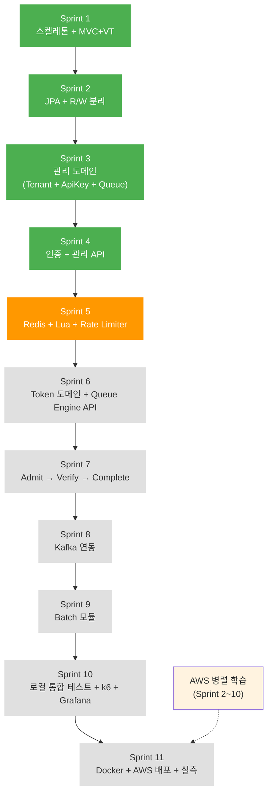

# 🗺 Queue Platform — Sprint Roadmap

> 작성일: 2026-04-16 | 최신화: **2026-08-17** (구현 대조 — 진행 현황·Kafka 체계·폐기 DoD 정정)

---

## 개요

| 항목 | 내용 |
|------|------|
| 총 Sprint | 11개 |
| 예상 기간 | 약 19.5주 (5개월) |
| 유연 범위 | 4~5개월 |
| 면접 타이밍 | 약 4개월 후 전제 (정직 품질 확보) |
| 우선순위 철학 | 총체적 균형 (MVP 심화 + 운영 완성도 + 부하 실측 + AWS 배포) |
| Sprint 구성 원칙 | "한 Sprint = 한 성격". 기술 구현과 문서 수정은 분리 |
| 인프라 전략 | Sprint 2~10: WSL2(Ubuntu) 직접 설치. Sprint 11: Docker화 + AWS 배포 |

### 카테고리별 시간 배분

```
MVP 심화 (Sprint 2,3,5,6,7,8):   11.0주  (56%)
운영 완성도 (Sprint 4,9):          3.0주  (15%)
부하 실측 + 로컬 모니터링 (10):    3.0주  (15%)
AWS 배포 + 대용량 실측 (11):       3.0주  (15%)  ← 신규
```

### 인프라 참조

- **로컬 (Sprint 2~10):** [INFRA_SETUP.md](INFRA_SETUP.md) — WSL2 직접 설치
- **AWS 배포 (Sprint 11):** `AWS_LEARNING_PATH.md` — **미작성**

| Sprint | 인프라 | 가이드 |
|:-:|------|:-:|
| 2 | MySQL 8.0 × 2 (Master + Replica) | INFRA_SETUP §1 |
| 5 | Redis Sentinel (M1 + S2 + Sen3) + Prometheus + Grafana | INFRA_SETUP §2, §7 |
| 8 | Kafka 3 브로커 (KRaft) | INFRA_SETUP §3 |
| 10 | k6 + Prometheus + Grafana 통합 | INFRA_SETUP §4, §5 |
| **11** | **Docker + AWS (EC2/RDS/ElastiCache/MSK Serverless)** | **AWS_LEARNING_PATH** |

### 진행 현황

> **Sprint는 순서대로 끝나지 않았다.** 6·8이 부분적으로 먼저 진행됐다 — enqueue를 만들려면
> 적재 경로가 필요했기 때문이다(§71 → §72 → §73). 아래는 **코드로 확인한 상태**다.

```
✅ Sprint 1   완료 (2026-04-16)
✅ Sprint 2   완료 (2026-04-22)
✅ Sprint 3   완료 (2026-04-23)
✅ Sprint 4   완료 (2026-04-24)
🔄 Sprint 5   5-A/B/C/D/E 완료, 5-F(문서) 진행 중
🔄 Sprint 6   Token 도메인 + Enqueue + Polling 구현 / Cancel(DELETE) 미착수
⬜ Sprint 7   admit·verify·complete — 컨트롤러 0건. §79(/status·watermark·pacing)도 여기서 함께
🔄 Sprint 8   token-lifecycle 적재 경로 + queue-consumer 구현 / 상태 전이 이벤트는 Sprint 7과 함께
⬜ Sprint 9   queue-batch는 Application 클래스 1개뿐 (껍데기)
⬜ Sprint 10
⬜ Sprint 11  ← AWS 배포
🎯 Cluster 로컬 실습 완료 (2026-07-08, 병행 학습) — 프로덕션 도입은 §75, 시점 미정
```

**판정 근거 (2026-08-17 실측)**

| 확인한 것 | 명령 | 결과 |
|---|---|---|
| Queue Engine 엔드포인트 | `grep -rn "Mapping(" queue-api/src/main` | `POST /{queueId}/tokens`, `GET /{queueId}/tokens/{tokenId}` **2개뿐**. admit·verify·complete·DELETE **0건** |
| `queue-batch` 내용물 | `find queue-batch/src -name "*.java"` | `QueueBatchApplication.java` **1개** |
| `queue-consumer` 내용물 | `find queue-consumer/src/main -name "*.java"` | Application · KafkaConsumerConfig · `TokenLifecycleConsumer` · `TokenPersistService` **4개** |
| Lua 스크립트 | `ls .../resources/lua/` | `enqueue_bulk` · `poll_verify` · `token-bucket` · `fixed-window` **4개** |
| §79 미착수 | `grep "private final" PollResponse.java` | `frontSeq` · `total` · `nextPollAfterSec`가 **아직 있다** |
| 회수 경로 부재 | `grep -rn "ZREM\|HDEL" queue-*/src/main` | **0건** (Sprint 9 과제) |
| `queue-batch` actuator | `grep actuator queue-batch/build.gradle` | **없음** — `starter-web`만 (reconciliation 선행 조건) |

**주요 학습 자산 축적**: 총 88개 통찰 (Line Pay Plus 시니어 백엔드 지원 자산)

---

## Sprint 의존성 흐름



---

## Sprint 상세

### ✅ Sprint 1 — 멀티모듈 스켈레톤 + MVC + Virtual Thread

**완료일:** 2026-04-16
**소요 시간:** 약 2시간 (재세팅 포함)
**카테고리:** MVP

**주요 산출물:**
- 5개 모듈 Gradle 멀티모듈 구조 (`queue-common`, `queue-domain`, `queue-infrastructure`, `queue-api`, `queue-batch`)
- `QueueApiApplication`, `QueueBatchApplication` 메인 클래스
- `spring.threads.virtual.enabled=true` 적용
- `spring.autoconfigure.exclude`로 JPA/Redis/Kafka 비활성화 (Sprint별 점진 활성화 경로)
- Actuator `/health` 엔드포인트

**완료 기준 (DoD):**
- [x] `./gradlew build` 성공
- [x] `./gradlew :queue-api:bootRun` 성공 (2.954s 기동)
- [x] `GET /actuator/health` → 200 OK `{"status":"UP"}`
- [x] `/thread-check` → `isVirtual: true` 확인
- [x] `scanBasePackages=com.sonix.queue`로 멀티모듈 빈 스캔 검증

**결과물 증거:** `/actuator/health` 200 응답, `/thread-check` 응답의 `isVirtual: true`

---

### ✅ Sprint 2 — JPA + MySQL R/W 분리

**완료일:** 2026-04-22
**소요 시간:** 약 3일 (인프라 세팅 포함)
**카테고리:** MVP

**선행 인프라:** [INFRA_SETUP.md §1](INFRA_SETUP.md) — MySQL Master(3306) + Replica(3307) WSL2 직접 설치 + GTID 복제

**주요 산출물:**
- WSL2에 MySQL 8.0 × 2 인스턴스 기동 (Master 3306 / Replica 3307, GTID 기반 복제)
- `~/.bashrc` 자동 시작 스크립트 + NOPASSWD 설정
- `ReplicationRoutingDataSource` + `LazyConnectionDataSourceProxy`
- `DataSourceConfig`: master/replica/routing/lazy Bean 4개
- `JpaConfig`: @EnableJpaRepositories + @EntityScan (infrastructure 모듈)
- `RoutingDataSourceTest`: R/W 라우팅 실증 (HikariPool 2개 분리)

**완료 기준 (DoD):**
- [x] MySQL Master(3306) + Replica(3307) 기동 확인
- [x] Replica `SHOW REPLICA STATUS`: IO/SQL Running Yes
- [x] Master INSERT → Replica SELECT로 복제 동작 확인
- [x] `ReplicationRoutingDataSource` 단위 테스트
- [x] R/W 라우팅 로그로 실증 (Write → master, Read → replica)
- [x] `./gradlew :queue-api:bootRun` 성공

**참조 문서:** DECISIONS §29, §41, §46, §47, §48

---

### ✅ Sprint 3 — 관리 도메인 (Tenant + ApiKey + Queue)

**완료일:** 2026-04-23
**소요 시간:** 약 2일
**카테고리:** MVP

**주요 산출물:**
- `queue-domain` 모듈에 Rich Domain Model (순수 Java, Spring 의존성 없음)
  - `Tenant`: create(), deactivate(), changePassword(), isActive(), reconstruct()
  - `ApiKey`: create(), revoke(), isActive(), matchesHash(), reconstruct()
  - `Queue`: create(), pause(), resume(), drain(), delete(), update(), isEnqueueable(), isCapacityExceeded()
- Port 인터페이스: `TenantRepository`, `ApiKeyRepository`, `QueueRepository`, `PasswordHasher`
- JPA Entity (`toDomain()`, `fromDomain()`) + JpaAdapter (Port 구현체)
- `BcryptPasswordHasher`: PasswordHasher Port 구현체 (infrastructure)
- `IdGenerator`, `RawKeyGenerator` 공통 유틸
- 도메인 단위 테스트 ~47개 (JUnit 5, Spring 없음)

**완료 기준 (DoD):**
- [x] `queue-domain` 모듈에 Spring 의존성 전혀 없음 (순수 Java)
- [x] Rich Domain 메서드 단위 테스트 통과 (상태 전환 전수, 경계값, 라이프사이클)
- [x] Port ↔ Entity 매핑 (`toDomain()`, `fromDomain()` 팩토리 메서드)
- [x] `ApiKey.revoke()` → REVOKED 전환 + `revokedAt` 기록 검증
- [x] `Queue.isCapacityExceeded()` 경계값 테스트
- [x] `Queue.delete()` PAUSED 상태에서만 허용

**참조 문서:** DECISIONS §8, §49, §50, §51, §52, §53

---

### ✅ Sprint 4 — 인증 (JWT + API Key) + 관리 API + 테스트

**완료일:** 2026-04-24
**소요 시간:** 약 2일
**카테고리:** 운영

**주요 산출물:**
- **Phase 1: Tenant signup/login**
  - POST /tenants/signup: BCrypt 해싱 + 중복 이메일 체크
  - POST /tenants/login: 비밀번호 검증 + Replica 라우팅 (readOnly)
  - GlobalExceptionHandler: BusinessException → HTTP 에러 응답
- **Phase 2: JWT 인증**
  - JwtProvider: Access Token(15분) + Refresh Token(7일)
  - JwtAuthenticationFilter: Bearer 토큰 → SecurityContext 저장
  - SecurityConfig: signup/login/refresh permitAll, 나머지 authenticated
  - TenantAuth: @AuthenticationPrincipal 인증 객체
- **Phase 3: 관리 API 완성**
  - API Key 발급 (rawKey 1회 반환) + Revoke (본인 소유 확인)
  - Token Refresh (Token Rotation 패턴)
  - Queue CRUD 6개 API (생성/조회/이름변경/정지/재개/삭제)
- **테스트**
  - Service 단위 (Mockito): TenantServiceTest, ApiKeyServiceTest, QueueServiceTest
  - Controller 통합 (MockMvc): TenantControllerTest, ApiKeyControllerTest, QueueControllerTest

**완료 기준 (DoD):**
- [x] Tenant 회원가입 → 로그인 → JWT 발급 → API Key 생성 → Queue CRUD 시나리오 E2E 동작
- [x] JWT 만료 후 Refresh Token으로 재발급 (Token Rotation)
- [x] API Key SHA-256 해시 DB 저장 (원본 불가역)
- [x] BCrypt 비밀번호 해싱이 Virtual Thread에서 동작 확인
- [x] 관리 API 통합 테스트 (MockMvc)
- [x] 토큰 없이 API 접근 → 403 차단
- [x] 전체 테스트 약 50개 PASSED

**참조 문서:** DECISIONS §4, §42, §53, §54, §55, §56

---

### 🔄 Sprint 5 — Redis + Lua Script + Sentinel + Rate Limiter (진행 중)

**예상 기간:** 3주 (Sentinel + 모니터링 + Rate Limiter + 캐시 + Queue Lua)
**카테고리:** MVP
**진행률:** 약 75% (5-A/5-B/5-C/5-D 완료, 5-E 진입)

**선행 인프라:** [INFRA_SETUP.md §2](INFRA_SETUP.md) — Redis Master(6379) + Slave(6380, 6381) + Sentinel(26379, 26380, 26381) WSL2 직접 설치

### 진행 현황

| Phase | 내용 | 상태 |
|-------|------|------|
| 5-A | Redis Sentinel 인프라 | ✅ |
| 5-B | 모니터링 시스템 (Prometheus + Grafana) | ✅ |
| 5-C | Rate Limiter (Token Bucket + Fixed Window) | ✅ |
| 5-D | Redis 캐시 (API Key + Refresh Token) | ✅ |
| 5-E | Queue Engine Lua Scripts (Sprint 6 준비) | 🔄 |
| 5-F | Sprint 5 마무리 (문서 갱신) | 🔄 |

### 5-A. Redis Sentinel 인프라 ✅

- ✅ WSL2 Redis Sentinel 구성 (Master + Slave 2 + Sentinel 3)
- ✅ `~/.bashrc` 자동 시작 스크립트
- ✅ `RedisConfig` LettuceConnectionFactory + StringRedisTemplate
- ✅ `application*.yml` Sentinel 연결 정보 (master + nodes)
- ✅ Failover 실증 (Master 강제 종료 → Slave 승격 5~10초 내)
- ✅ CONFIG REWRITE 자동 동작 확인

### 5-B. 모니터링 시스템 ✅

- ✅ Prometheus 3.0.1 + Grafana (WSL2 직접 설치)
- ✅ `micrometer-registry-prometheus` 의존성
- ✅ `/actuator/prometheus` 엔드포인트 노출
- ✅ MONITORING_DESIGN.md (4개 카테고리: System / Application / Business / Infrastructure)
- ✅ INFRA_SETUP.md §7 Prometheus + Grafana 섹션
- ✅ 핵심 메트릭: `hikaricp_connections_pending`, `http_server_requests_seconds`, JVM/GC

### 5-C. Rate Limiter ✅

**알고리즘 분리 적용** (DECISIONS §60, §61):

| 용도 | 알고리즘 | 키 패턴 | 인터페이스 |
|------|---------|--------|-----------|
| Tenant SLA (인증 후) | Token Bucket | `rl:tenant:{tenantId}` | `RateLimiter` |
| 인증 전 (signup/login/refresh) | Fixed Window | `rl:{action}:ip:{ip}` | `FixedWindowRateLimiter` |

**구성:**
- ✅ `RateLimiter` / `FixedWindowRateLimiter` 도메인 포트 (queue-domain)
- ✅ `InMemoryTokenBucketRateLimiter` (학습/단일 JVM)
- ✅ `RedisTokenBucketRateLimiter` (운영, Lua 원자 실행)
- ✅ `RedisFixedWindowRateLimiter` (운영, INCR + EXPIRE 원자 실행)
- ✅ `token-bucket.lua` (HMGET → 회복 계산 → HMSET + EXPIRE)
- ✅ `fixed-window.lua` (시간 윈도우별 키 분리 + 자동 만료)
- ✅ Tenant Plan 도입 (FREE/STARTER/PRO/ENTERPRISE, DECISIONS §62)
- ✅ `RateLimitFilter` HTTP 통합 (JwtAuthFilter 후 실행, addFilterAfter)
- ✅ `PublicEndpointRateLimit` (SIGNUP 5/분, LOGIN 10/분, REFRESH 30/분)
- ✅ ErrorCode RL_001_KEY_LIMIT (HTTP 429 + Retry-After 헤더)
- ✅ 동시성 검증 (1,000 동시 요청 → 정확히 capacity개만 통과, Lua 원자성)
- ✅ 수동 검증 (signup 6회 → 6번째부터 429 응답)

### 5-D. Redis 캐시 적용 ✅

- ✅ ApiKey Redis 캐시 (`apikey:{keyHash}`, TTL 60s)
- ✅ 캐시 히트율 로그
- ✅ `RedisKeyFactory` (static 메서드 방식)
- ✅ Facade 도입 → Anti-pattern 인식 후 롤백 (중요 학습 자산)
- ⬜ Refresh Token Redis 이중 저장 (5-E 이후 결정)
- ⬜ Tenant 정보 Redis 캐시 (Rate Limiter 최적화)

### 5-E. Queue Engine 🔄 (Phase A-E 완료, 커밋만 남음)

**Phase A 완료** (2026-07-08):
- ✅ `QueueEngine.java` Port 인터페이스 (queue-domain)
- ✅ `EnqueueResult.java` Value Object (OK/EXISTS/FULL)

**Phase B-E 완료** (2026-07-15) — **하이브리드 폐기, Bulk 단독으로 선회** (§70):
- ✅ `enqueue_bulk.lua` (ZRANK 중복 방지 + ZADD NX + ZCARD Capacity + INCR seq)
- ❌ ~~`enqueue.lua`~~ — 폐기 (경로 2개는 순번 일관성 증명 부담)
- ❌ ~~`SlidingWindowCounter`~~ — 폐기 (임계값 분기가 없어져 부하 측정 불필요)
- ✅ `PendingEnqueue` + `RedisQueueEngine`(Global Queue, Producer) + `BatchProcessor`(Consumer)
- ✅ `QueueKeys` (Hash Tag) — `RateLimitKeys` 선례를 따름
- ✅ `QueueEngineService` + `QueueEngineController` + `ApiKeyAuthenticationFilter`
- ✅ 검증: 전체 **160건 통과**
  - 1,000 동시 Enqueue → 순번 0~999 유일 (실제 Redis)
  - 동일 identifier 중복 → OK 1 + EXISTS n (멱등성)
  - WAS 3대 분산 10,000건 → 5개 큐에 2,000씩, 순번 중복 0
  - 로컬 Cluster A에서 `enqueue_bulk.lua` 실행 검증 (Hash Tag)

**Phase F ✅**: 커밋 완료

**확정 결정** (DECISIONS §66-70 참조):
- D1: 자유 identifier (Tenant 제공)
- D2: ZSet 하나 (`queue:{queueId}:waiting`)
- D3: ZRANK + ZCARD
- D4: Java + Lua 분리
- D5: Lua ZRANK 중복 방지
- D6: Lua ZCARD Capacity
- ~~D7: enqueue.lua + enqueue_bulk.lua~~ → **`enqueue_bulk.lua` 단독** (§70)
- ~~D8: 하이브리드 (임계값 1000 req/s, 배치 100, 간격 10ms, 타임아웃 1s)~~ → **하이브리드 폐기** (§70)
  - 현재: `MAX_DRAIN=5000`, `CHUNK_SIZE=500`, `fixedRate=1000ms`, 타임아웃 30s
  - ⚠️ 원안 대비 100배/30배 이탈 → **재조정 후속 과제**
- **D9: score = `INCR queue:{queueId}:seq`** (신설, §70)
- **D10: Hash Tag 필수** (신설, §70)

### 5-F. Sprint 5 마무리 🔄

- 🔄 DECISIONS.md 갱신 (Rate Limiter 결정 사항 #60~#65)
- 🔄 ROADMAP.md Sprint 5 진행 반영
- ⬜ `doc/sprint-5/RATE_LIMITER.md` 신규 작성
- ⬜ FRS_final.md Rate Limiter 명세 갱신
- ⬜ FLOW.md Filter 흐름도 추가
- ⬜ CLAUDE.md 진행 상황 반영
- ⬜ KPT 회고 (선택)

### 완료 기준 (DoD)

**5-A (완료) — Redis Sentinel 인프라**
- [x] Redis Sentinel 3노드 기동 확인 (`redis-cli -p 26379 sentinel master mymaster`)
- [x] `num-sentinels=3, num-slaves=2, quorum=2` 확인
- [x] Failover 시나리오 테스트 (Master 강제 종료 → Slave 승격 5~10초 내)
- [x] `autoconfigure.exclude`에서 `RedisAutoConfiguration`, `RedisRepositoriesAutoConfiguration` 제거
- [x] Redis 장애 시 Circuit Breaker → 503 응답 (LettuceConnectionFactory가 자동 처리)

**5-B (완료) — 모니터링**
- [x] Prometheus + Grafana 기동
- [x] `/actuator/prometheus` 노출
- [x] 모니터링 4개 카테고리 설계 완료
- [x] HikariCP, JVM, HTTP 메트릭 수집 확인

**5-C (완료) — Rate Limiter**
- [x] Rate Limiter 알고리즘 분리 (Token Bucket + Fixed Window)
- [x] Tenant Plan 도입 (FREE/STARTER/PRO/ENTERPRISE)
- [x] RateLimitFilter HTTP 통합 (JwtAuthenticationFilter 후 실행)
- [x] 동시 1,000 요청 → 정확히 capacity개만 통과 (Lua 원자성)
- [x] HTTP 429 + Retry-After 응답 표준 준수
- [x] signup 6회 → 6번째 429 수동 검증 완료
- [x] InMemoryTokenBucketRateLimiter 단위 테스트
- [x] RedisTokenBucketRateLimiter 통합 테스트

**5-D (예정) — Redis 캐시**
- [ ] API Key 캐시 히트율 로그로 확인 (60s TTL)
- [ ] Refresh Token Redis 조회 우선 → DB fallback 동작 검증
- [ ] RedisKeyFactory 단위 테스트 (키 포맷 검증)

**5-E — Queue Engine Lua**
- [x] Lua Script 원자성 통합 테스트 (동시 1,000 Enqueue → 순번 중복 없음)
- [x] WAS 3대 분산 10,000건 → 5개 큐에 2,000씩, 순번 중복 0
- [x] 로컬 Cluster A에서 `enqueue_bulk.lua` 실행 검증 (해시태그 — **Sentinel 테스트로는 CROSSSLOT이 안 잡힌다**)

> ~~슬라이스 라운드로빈 분배 확인 (`slice = (seq-1) % sliceCount`)~~ — **§66 D2가 폐기했다.**
> 대기열은 ZSet 하나(`queue:{queueId}:waiting`)이고 score는 `INCR queue:{queueId}:seq`다(§70 D9).
> 쪼개지 않으니 분배도 없다.
> ~~Ranking Lua Script~~ — 별도 스크립트를 만들지 않았다. 순위는 `enqueue_bulk.lua`의 `ZRANK`(응답)와
> SDK의 `rank = mySeq − lastAdmittedSeq`(폴링, §79)로 나뉘었다.

**참조 문서:**
- DECISIONS §5 (Redis 장애 복구), §17 (대용량 처리), §30 (Redis Sentinel)
- DECISIONS §60-§65 (Rate Limiter 결정 사항)
- `doc/sprint-5/RATE_LIMITER.md` (신규)
- `doc/sprint-5/REDIS_SENTINEL.md`
- `doc/sprint-5/LUA_SCRIPTS.md`

**Sprint 핵심 차별 포인트:**
- Lua Script 원자성 + Sentinel Failover 실증
- **Token Bucket + Fixed Window 알고리즘 분리** (책임/의도 명확)
- **Tenant Plan 기반 동적 SLA 한도 적용** (SaaS 비즈니스 모델 매핑)
- **인증 전 보안 한도** (Brute Force/회원가입 남용 방지)
- 슬라이스 파티셔닝

**실증 증거 수집:**
- Failover 로그 + Lua Script 동시성 테스트 결과
- Rate Limiter 1,000 동시 요청 정확성 검증
- signup 429 응답 수동 검증
- Token Bucket burst 허용 + 회복 시나리오

---

### 🔄 Sprint 6 — Token 도메인 + Queue Engine API (Enqueue / Polling) — **Cancel만 남음**

**예상 기간:** 1.5주
**카테고리:** MVP

**주요 산출물:**
- ✅ **Token 도메인 모델** (분할된 Sprint 3의 후반)
  - Token Rich Domain (`complete`, `cancel`, `expire`, `returnToWaiting`, `waitingSeconds`)
  - `TokenRepository` Port 인터페이스
  - JPA Entity 파티셔닝 고려 (PK = token_id + issued_at)
- ✅ **Enqueue API**
  - `POST /queues/:queueId/tokens` — **200 OK**(순번을 확정한 뒤 응답한다. 202가 아니다)
  - `enqueue_bulk.lua` 3키 호출 — `waiting` / `seq` / `tokens` Hash
    - ~~queue-user 역인덱스~~ → `queue:{queueId}:tokens` Hash가 대체 (Lua 안에서 원자 처리, §66 D1)
  - Kafka 적재는 Sprint 8에서 이미 붙었다 (동기 DB INSERT 단계를 거치지 않았다)
- ✅ **Polling API**
  - `GET /queues/:queueId/tokens/:tokenId?seq=&ka=` — `poll_verify.lua` 소유권 검증 (§74)
- ⬜ **Cancel API**
  - `DELETE /queues/:queueId/tokens/:tokenId` → CANCELLED **(미착수 — 이 Sprint의 잔여 전부)**

**완료 기준 (DoD):**
- [x] Token 도메인 단위 테스트 (상태 전환 매트릭스 전체)
- [x] 1,000명 동시 Enqueue → 순번 중복 0건 (실제 Redis)
- [x] 중복 identifier Enqueue 시 기존 토큰 반환 (멱등 처리)
- [x] 폴링 소유권 — 남의 `seq` + 내 `tokenId` → 404 (§74)
- [ ] Cancel 후 같은 identifier 재Enqueue 가능 (맨 뒤로)
- [ ] Polling 응답 시간 p99 < 50ms — **로컬 수치는 신뢰 구간이 아니다.** Sprint 10(k6)로 이관

> ~~`nextPollAfterSec` 4단계(30/10/5/2초) 분기 테스트~~ — **§79가 이 필드를 응답에서 제거**하고
> `/status`의 `pacing` 구간표 + SDK 계산으로 바꿨다. **다만 현재 코드는 아직 `nextPollAfterSec`를
> 내려준다**(`PollResponse`에 필드가 살아 있고 등급은 2/5/10/15/20초 + 지터). §79 구현은 **Sprint 7**이므로
> 그때까지 코드와 이 DoD는 어긋난 채로 둔다 — 지금 지우면 현재 동작을 검증하는 항목이 사라진다.
> ~~token-info 캐시 히트율~~ — §79는 폴링 경로에서 DB status를 읽지 않는다. **키 존치 여부 자체가 후속 검토**다.

**참조 문서:** FRS §6.2 (Enqueue), §6.3 (Polling), §74 (폴링 소유권), FLOW.md Enqueue/Polling 다이어그램

---

### ⬜ Sprint 7 — Admit → Verify → Complete + 상태 머신

**예상 기간:** 1.5주
**카테고리:** MVP

> **설계는 닫혔다 — DECISIONS §80.** admit은 **동기 + Lua 하나**다. 구 설계의 3단계
> (Lua pop → DB WAITING 확인 → 토큰 SET), `admit_requests` 테이블, 명령 토픽, `verified-token`은
> **전부 폐기**됐다. 착수 전 미판정이던 4건 중 3건이 §80에서 닫혔다(아래 참조).

**주요 산출물:**
- `POST /queues/:queueId/admit` — **동기 응답.** `queues` 행 1개 읽기 → `EVAL admit.lua` → Kafka → 200
  - `admit.lua` 하나에 `ZPOPMIN` + `HGET tokens` + 토큰 키 2종 `SET`(PX 60000) + `admitted` ZADD
    + watermark 조건부 갱신 + `admit-idem` payload 저장이 전부 들어간다 (**Redis 밖 호출 0회**)
  - `count` 상한 도입 — 값은 실측 후(임시 1,000). N이 크면 단일 스레드 master를 수십~100ms 잡는다
- `POST /queues/:queueId/admit-tokens/:admitToken/verify` — DB Fallback 술어는 **`admitted_at`** 기준
  - **Redis·DB 쓰기 0회.** "상태 변경 없음"이 문자 그대로가 된다
- `POST /queues/:queueId/tokens/:tokenId/complete` — **DB 권위** 조건부 UPDATE
  (`admit_token = ?` + `status IN (0,1)` + `admitted_at` 유효 창) → Redis 정리는 나중
- `queue:{queueId}:admitted` ZSet 신설 (score=만료 epoch ms, member=`"seq|identifier"`) — `QueueKeys` 경유
- `tokens.admitted_at` 컬럼 추가
- Kafka `ADMITTED`·`RETURNED` 이벤트 + **소비 측 전이 가드**(허용 출발 상태별 조건부 UPSERT)
- **ADMIT_TOKEN_TTL 만료 → WAITING 복귀** — `admitted` ZSet claim-Lua, 실행 주체 **`queue-batch`**
  ← 포트폴리오 차별 포인트
- **`queue-batch`에 actuator + micrometer-prometheus 추가** (claim-Lua 계측. Sprint 9 reconciliation과 **같은 선행 작업**)
- 관측 메트릭 **2개 + 조건부 1개**: `queue_admit_requests_total{queueId,result}` /
  `queue_admit_tokens_issued_total{queueId}` / (복귀 구현 시) `queue_admit_returned_to_waiting_total{queueId}`
  - `admit_seconds` 히스토그램은 **넣지 않는다** — `le` 버킷 실측 69개 × 큐 100개 = 6,900 시계열로
    현재 전체(857개)의 8배다
- avgWaitingTime 직접 갱신 (HINCRBYFLOAT)
- **`/status` 엔드포인트 + `pacing` 구간표 (§79 구현)** — Sprint 6이 아니라 여기인 이유: **watermark는 admit이 있어야 존재한다.** admit이 0건이면 `lastAdmittedSeq`가 영원히 0이라 SDK의 `rank = mySeq − lastAdmittedSeq`가 무의미하다
  - 3키 `MGET`(watermark + pacing + **seq**) 직행. **WAS 캐시는 만들지 않는다**(§79 D1)
  - 딸려오는 것: `PollResponse`에서 `frontSeq`·`total`·`nextPollAfterSec` 제거 → **`QueueSnapshotCache`(Caffeine) 제거**(**도메인 포트 시그니처가 바뀌므로 문서로 안 끝난다**) + 404 계약용 `ErrorCode` 신규 추가 + **`QueueEnginePollTest` 재작성**(5개 중 2개 소멸, 1개 부분 소멸)

**완료 기준 (DoD):**
- [ ] admit 100명 동시 요청 → FIFO 순서 보장
- [ ] **`ADMITTED`가 `ENQUEUED`보다 먼저 도착해도 최종 상태가 `ADMIT_ISSUED`** (이벤트 역순 주입 테스트)
  - `ZADD`가 Kafka 발행보다 먼저라 이 역전은 실재한다. `ENQUEUED`의 no-op upsert가 흡수해야 한다
- [ ] **`COMPLETED` 행에 `ADMITTED`가 도착해도 되살아나지 않는다** (가드가 허용 출발 상태를 본다)
- [ ] **WAS N대에서 동시 admit → watermark 단조증가, 후퇴 0건** (조건부 갱신이 없으면 늦게 도착한 작은 seq가 값을 되돌린다)
- [ ] **TTL 만료로 WAITING 복귀한 토큰이 다음 admit 배치의 맨 앞에 온다** — `ZPOPMIN`이 곧 최소 seq이므로 자동으로 성립해야 한다
  - §79가 "watermark는 **표시 전용**"이라고 🔴 가드레일로 못 박았지만 **강제 수단이 없다.** 이 DoD가 그 수단이다. watermark를 커서로 쓰면 복귀 토큰(seq < watermark)이 영구히 건너뛰어진다
- [ ] admitToken TTL 60초 경과 → `admitted` ZSet claim → WAITING 복귀 + seq 복원 검증
- [ ] TTL 만료 후 verify → **404**
- [ ] complete가 `status = 0`(복귀 후)에도 성공한다 — 유효 창 안이면
- [ ] 중복 complete 요청 → 1번만 성공 (조건부 UPDATE가 0행)
- [ ] **`queue-batch`의 `/actuator/prometheus`가 200** (claim-Lua 계측의 전제)
- [ ] Rich Domain 상태 전환 메서드로 비즈니스 로직 검증

**착수 전 검증 2건 (§80):**
- [ ] **admit Lua의 동적 키가 Cluster에서 도는가** — 로컬 Cluster A(7001-7008)에서 실증.
      `{tokenId}`·`{admitToken}`이 런타임에 정해져 `KEYS[]` 선언이 안 된다.
      **Sentinel로는 절대 안 잡힌다**
- [ ] **`ALGORITHM=INSTANT`가 파티션 테이블 `ADD COLUMN`에서 되는가** — `admitted_at`이 여기 달렸다.
      안 되면 13파티션 재구축 + replica 지연

**착수 전 결정할 것 (남은 미판정):**
- `count` 상한값 — 실측 후 (임시 1,000)
- ~~"pop 성공 + admitToken SET 실패" 창~~ → **§80이 닫음** (Lua 하나 = 창 없음)
- ~~`verified-token` 클러스터 소속~~ → **§80이 닫음** (키 폐기)
- ~~admit 요청 전달 수단~~ → **§80이 닫음** (동기라 명령이 없다)
- `/status` **캐시 TTL** → **§79 D1이 닫음**(안 만든다). CDN 도입 시 `max-age`로 Sprint 11에서 부활

**참조 문서:** **DECISIONS §80 (이 Sprint의 설계 정본)**, §79 (watermark·pacing), §36 (TTL 복귀),
FRS §6.4~6.6, STATE.md 전이 가드 표

**Sprint 핵심 차별 포인트:** admitToken 만료 시 WAITING 복귀 (seq 기반 우선순위 보존)

---

### 🔄 Sprint 8 — Kafka 연동 (Enqueue 버퍼 + Consumer) — **Enqueue 경로 구현 완료**

**예상 기간:** 2주 (Kafka 3 브로커 설치 + 기존 동기 → 비동기 리팩토링 포함)
**카테고리:** MVP

> ⚠️ **이 절의 원안(3토픽 체계)은 폐기됐다.** `enqueue-events`/`enqueue-admit`/`token-status-changed`를
> `queueId`로 파티셔닝하려던 설계는 **§73 D16·D18이 뒤집었다** — 순서 보장은 같은 토픽의 같은 파티션
> 안에서만 성립하고, `queueId` 키는 한 큐 30만 명이 통째로 한 파티션에 몰려 파티션을 늘려도 소용이 없다.
> **현행: 단일 토픽 `token-lifecycle` / 파티션 키 `tokenId` / 18 파티션 / RF 3 / min.insync 2**
> (`scripts/kafka/create-topics.sh`). Enqueue 적재 경로는 **이미 구현·실측 완료**(100만건, §73)이며,
> 남은 것은 **상태 전이 이벤트**(admit/complete/cancel/expire)로 Sprint 7과 함께 온다.

**선행 인프라:** [INFRA_SETUP.md §3](INFRA_SETUP.md) — Kafka 3 브로커 KRaft 모드 (9092/9192/9292) WSL2 직접 설치

**주요 산출물:**
- WSL2에 Kafka 3 브로커 KRaft 클러스터 기동 (Zookeeper 미사용)
- WSL2 메모리 12GB 권장 설정 (`.wslconfig`)
- `~/.bashrc` 자동 시작 스크립트
- ✅ 토픽 `token-lifecycle` + `token-lifecycle.DLT` 생성 (**18 파티션** / RF 3 / `min.insync.replicas=2`)
  - 파티션은 **줄일 수 없고**, 늘리면 `hash % N`이 바뀌어 살아 있는 토큰(최대 `waitingTtl` 2시간)의 순서가 끊긴다 → 처음에 넉넉히 (§73 D17)
- ✅ Producer 설정 (`acks=all`, `enable.idempotence=true`, 발행 시한 §73 D19)
- ✅ **Sprint 6의 동기 Enqueue DB INSERT → Kafka 비동기로 전환**
- ✅ **`queue-consumer` 모듈 신설** — 소비 전담 독립 앱 (§73 D20)
  - `queue-batch`와 합치지 않는다: 소비는 파티션 수만큼 늘리고, 스케줄 작업은 늘릴수록 중복 실행 방지가 필요 → 확장 방향이 반대
  - `@EnableScheduling` 금지 (붙이면 infra의 `@Scheduled` 빈까지 돌아 이중 적재)
  - actuator + micrometer-prometheus 포함 (없으면 컨슈머 lag을 PromQL로 볼 수단이 사라진다)
- ✅ `TokenLifecycleConsumer` (배치 적재 → `tokens` 멱등 INSERT) + `TokenPersistService`
- ⬜ **상태 전이 이벤트 발행** (admit/complete/cancel/expire) — 같은 토픽·같은 키(`tokenId`). **Sprint 7과 동시**
- ✅ admit 요청 전달 수단 — **명령 토픽을 만들지 않는 것으로 닫혔다(§80).** admit이 동기 처리라 전달할 명령이 없다. 구 `enqueue-admit`·`AdmitConsumer`·`admit_requests`는 전부 폐기
- ⬜ `BillingConsumer` 스켈레톤 (실제 집계는 Sprint 9)

**완료 기준 (DoD):**
- [x] Kafka 3 브로커 KRaft Quorum 형성 확인 (로그에 LEADER 메시지)
- [x] 토픽 생성 완료 (`create-topics.sh` — 파티션 수 불일치 감지 포함)
- [x] `autoconfigure.exclude`에서 `KafkaAutoConfiguration` 제거
- [x] At-Least-Once 보장 검증 (`tokens` UNIQUE + `ON DUPLICATE KEY`로 중복 INSERT 무해화)
- [x] **100만건 실측** — Redis `ZCARD` = `seq` = DB `tokens` 전부 일치, seq 중복·결번 0, lag 0, DLT 0, 18 파티션 편차 **1.4%** (§73)
- [ ] Consumer 재시작 시 미처리 메시지 재처리 확인
- [ ] 브로커 1개 강제 종료 시 ISR 유지로 프로듀싱 계속 가능 확인
- [ ] 상태 전이 이벤트가 같은 토큰에서 순서대로 소비됨 (Sprint 7과 함께)

> ~~MANUAL_IMMEDIATE ack 모드 동작 검증~~ — **수동 ack을 쓰지 않기로 했다.** 컨테이너 기본값
> `AckMode.BATCH`가 리스너 정상 반환 뒤 커밋하므로 "DB 커밋 후 ack" 의도가 이미 성립한다
> (`TokenLifecycleConsumer` javadoc).
> ~~Enqueue p99 < 50ms 복원~~ — 로컬 수치는 신뢰 구간이 아니다. 성능 실측은 Sprint 10(k6)로 미룬다.

**참조 문서:** DECISIONS **§73 (현행 — 토픽·키·모듈 분리)**, §71 (저장 순서·복구), §14·§32·§40 (구 설계 — 배너 확인)

**주의:** 이 Sprint에서 가장 큰 변경은 **기존 동기 흐름을 비동기로 리팩토링**하는 것. 테스트 수트가 대거 수정될 수 있음. WSL2 리소스도 부담이 크니 메모리 할당 확인 필수.

**실증 증거 수집:** 브로커 로그 + At-Least-Once 재처리 시나리오 결과

---

### ⬜ Sprint 9 — Batch 모듈 (TokenExpiryJob + RedisSyncJob + BillingSnapshotJob)

**예상 기간:** 1.5주
**카테고리:** 운영

**주요 산출물:**
- `queue-batch` 모듈 활성화 (bootRun 가능)
- `TokenExpiryJob` (10초 주기)
  - waitingTtl / inactiveTtl / admit-token TTL 3종 감지
  - `batch-lock:{t}:{q}` 분산 락
- `RedisSyncJob` (5분 주기)
  - `redis_sync_needed=1` 토큰 → Redis 재삽입
- `BillingSnapshotJob` (월 1회, M+2월 초)
  - `queue_daily_stats` 집계
  - `billing_snapshots` UPSERT
  - 파티션 DROP + REORGANIZE
  - > **실제 월 1회 스케줄 대기 대신 수동 트리거 + dry-run 쿼리로 검증**
- ShedLock 또는 `batch-lock` 기반 멀티 인스턴스 분산

**후속 과제 배치** (`doc/reviews/2026-08-17-pr26-agent-review.md` §7 등재분 — 새 항목이 아니라 일정에 얹는 것)

| # | 과제 | 왜 지금인가 |
|---|---|---|
| 1 | **`queue-batch`에 actuator + micrometer-prometheus 추가** | **reconciliation의 선행 조건.** 현재 `queue-batch/build.gradle`에는 `starter-web`만 있고 actuator·micrometer가 **없다** → 만들어도 유령 토큰 수를 지표로 못 낸다. `queue-consumer`가 같은 이유로 이미 갖고 있다 |
| 2 | **회수 배치** — `queue:{q}:last-active` ZSet `ZREM` / `queue:{q}:tokens` Hash `HDEL` | 두 명령 모두 **전 프로덕션 코드 0건**이다. 쓰기만 하고 지우지 않아 30만 큐가 한 바퀴 돌 때마다 멤버가 영구 누적된다. TokenExpiryJob이 만료를 판정하는 이 스프린트가 회수를 붙일 자리다 |
| 3 | **reconciliation 스위퍼** (Redis엔 있고 DB엔 없는 유령 토큰) | §73이 "Redis-Kafka 사이엔 분산 트랜잭션이 없어 발행 갭은 **영구적**"이라며 필수 후속으로 남겼다. 100만건 실측에서 실제로 835건 발생. **1번 다음에 온다** |
| 4 | `ApiKeyCache.invalidate` 프로덕션 호출 연결 (revoke 경로) | 구현·포트 선언은 있는데 **호출부가 0건**이라 폐기된 키가 최대 60초 살아 있다. 배치가 아니라 revoke 서비스 쪽 한 줄이지만, 다른 정리 작업과 함께 처리 |

**완료 기준 (DoD):**
- [ ] Batch Server 기동 후 TokenExpiryJob 10초 주기 실행 로그 확인
- [ ] `queue-batch`의 `/actuator/prometheus`가 200을 반환 (위 1번 — reconciliation 지표의 전제)
- [ ] 만료 처리 후 `zcard last-active` ≤ `zcard waiting` 유지 (위 2번 — 누적이 멈췄다는 증거)
- [ ] admitToken TTL 만료 케이스 → WAITING 복귀 동작 (Sprint 7 로직 재사용)
- [ ] Redis 다운 시뮬레이션 → 복구 후 RedisSyncJob이 미반영 토큰 재삽입
- [ ] **BillingSnapshotJob 수동 트리거 동작 확인** (예: HTTP endpoint 또는 테스트 프로파일)
- [ ] **파티션 운영 쿼리 dry-run 검증** (schema.sql의 Step 1~4 각 쿼리 실행 + EXPLAIN)
  - `INSERT INTO queue_daily_stats ... ON DUPLICATE KEY UPDATE id = id` 멱등성 확인
  - `INSERT INTO billing_snapshots ... ON DUPLICATE KEY UPDATE count = VALUES(count)` 멱등성 확인
  - `EXPLAIN SELECT ... partitions: p2026_04` Partition Pruning 확인
- [ ] Batch 2대 동시 기동 시 `batch-lock`으로 중복 실행 방지
- [ ] Gap Lock 방지 (LIMIT 100 순차 처리)

**참조 문서:** schema.sql의 파티션 운영 섹션, DECISIONS §39 (RedisSyncJob), §43 (Queue 삭제 흐름), §44 (파티션 유예 전략)

**주의:** BillingSnapshotJob은 월 1회 스케줄이라 실제 시간 기반 검증 불가. 수동 트리거 + dry-run 쿼리로 대체. 실제 프로덕션에서는 ShedLock으로 배타 실행 보장.

---

### ⬜ Sprint 10 — 통합 테스트 + k6 부하 + Grafana 모니터링 + JS SDK + 최종 문서화

**예상 기간:** 3주
**카테고리:** 부하 / 운영

**선행 인프라:** [INFRA_SETUP.md §4](INFRA_SETUP.md) — k6 설치 / [§7](INFRA_SETUP.md) — Prometheus + Grafana (Sprint 5에서 이미 구축)

**주요 산출물:**

**A. 통합 테스트 (WSL2 로컬 인프라 기반)**
- 실제 MySQL/Redis/Kafka에 연결하는 E2E 테스트 수트
- 시나리오: signup → API Key → Queue → Enqueue → Polling → Admit → Verify → Complete
- 장애 복구 시나리오 (Redis Failover, Kafka 브로커 재시작 등)
- > Docker/Testcontainers 미사용 노선 → 로컬 환경이 테스트 환경

**B. k6 부하 실측**
- 시나리오 1: Enqueue 200 rps 지속
- 시나리오 2: **Polling 2,000 rps 지속 → p99 < 50ms 검증 (포트폴리오 핵심)**
- 시나리오 3: Enqueue 10,000 rps 급증 (Kafka 버퍼 효과 검증)
- 시나리오 4: Rate Limit 한도 초과 시나리오 (Tenant Plan별 burst 동작)
- p50/p95/p99 레이턴시, 에러율, Throughput 측정

**C. Grafana 대시보드 확장** (Sprint 5에서 기초 구축)
- 추가 대시보드:
  - Rate Limiter 한도 도달 통계 (Tenant 단위)
  - Polling 응답 시간 p50/p95/p99
  - Kafka Consumer lag
  - Redis 커맨드 레이턴시
  - Virtual Thread 수
- k6 부하 실측 중 실시간 대시보드 관찰

**D. OpenAPI 3.0 자동 생성**
- Springdoc-openapi 의존성 추가
- `/swagger-ui.html` 배포
- verify 순서 등 Workflow를 description에 명시
- Tenant 구현 가이드라인 (FRS §12.2) → OpenAPI description 반영

**E. JS SDK 구현** (별도 레포 `queue-platform-sdk-js`)
- `PollingManager` (`/status`의 `pacing` 구간표로 간격 계산 + ±20% 지터, setTimeout 관리 — §79)
  - `rank = mySeq − lastAdmittedSeq`를 **SDK가** 계산한다. 서버는 rank를 계산하지 않는다
  - `rank <= 0`일 때만 개인 엔드포인트 호출 + 30~60초에 1회 `ka=1`
- `RetryHandler` (429 응답 시 Retry-After 헤더 활용)
- `StateManager` (IDLE → WAITING → READY → COMPLETED → EXPIRED)
- `VisibilityHandler` (visibilitychange → Polling 중단/재개)
- `NetworkHandler` (offline/online 자동 처리)
- 데모 HTML 페이지 (간단한 대기열 시각화)
- npm publish (선택) / CDN 배포 (선택)
- queue-platform 본체와는 별도 Git 레포로 관리

**F. 성능 튜닝 리포트**
- JVM GC 튜닝 (G1GC 옵션)
- HikariCP 풀 사이즈 실측 조정
- Redis 커넥션 풀 튜닝
- Kafka Consumer 파티션/concurrency 조정

**G. 최종 docx 재생성** (메모리 컨벤션 준수)
- 업데이트된 FRS/DECISIONS/FLOW/STATE/ROADMAP을 하나의 docx로 통합

**완료 기준 (DoD):**
- [ ] k6 설치 확인 (`k6 version`)
- [ ] 통합 테스트 실행 시간 < 10분
- [ ] k6 시나리오 2 (Polling 2,000 rps) 성공 → **p99 < 50ms 증거 스크린샷 확보** ⭐
- [ ] k6 시나리오 3 (Enqueue 10,000 rps 급증) → Kafka 버퍼 효과로 p99 < 100ms
- [ ] k6 시나리오 4 (Rate Limit 한도 초과) → 429 정상 응답 + Retry-After 검증
- [ ] **Grafana 대시보드 6개 완성** (JVM / HTTP / HikariCP / Kafka lag / Redis / Rate Limiter)
- [ ] **k6 실측 중 Grafana 실시간 모니터링 스크린샷 확보** ⭐
- [ ] Swagger UI 접근 가능 + 모든 API 응답 예시 포함
- [ ] **JS SDK 데모 HTML로 대기열 참여 → Polling → admitToken 수신 E2E 시나리오 동작**
- [ ] 성능 튜닝 전/후 비교 리포트 작성
- [ ] `queue_platform_final.docx` 재생성 + Git 커밋

**Sprint 핵심 차별 포인트:** 2,000 rps 실측 + Grafana 대시보드 + JS SDK 데모 = 면접 시 가장 강력한 증거 세트

**실증 증거 수집:**
- k6 리포트 HTML
- Grafana 대시보드 스크린샷 (부하 전/중/후)
- OpenAPI Swagger UI 캡처
- JS SDK 데모 녹화 (선택)

---

### ⬜ Sprint 11 — Docker화 + AWS 배포 + 대용량 실측

**예상 기간:** 3주
**카테고리:** 배포 / 운영

**선행 요건:** AWS 병렬 학습 완료 (Sprint 2~10 동안). ⚠️ `AWS_LEARNING_PATH.md`는 **아직 없다** — 학습 경로·진입 체크리스트가 문서화되지 않았다.

**주요 산출물:**

**A. Docker 전환 (Sprint 11 시작 시점)**
- queue-api Dockerfile (Amazon Corretto 21 multi-stage build)
- queue-batch Dockerfile
- `.dockerignore`
- 로컬 WSL2에서 Docker Engine으로 전체 실행 검증
- docker-compose.yml (선택: 로컬 통합 테스트 편의용)

**B. AWS 인프라 프로비저닝**
- VPC + Public/Private Subnet + IGW + NAT (최소)
- IAM Role + Security Group + Parameter Group
- **RDS MySQL** (db.t3.small Multi-AZ, Read Replica 1개)
- **ElastiCache Redis** (cache.t3.micro, Cluster Mode Disabled + Replication Group)
- **MSK Serverless** (Private Subnet, IAM 인증, 토픽 3개)
- **EC2** (queue-api × 2 + queue-batch × 1, t3.medium)
- **ALB** (queue-api 앞에)
  - ⚠️ **`application-prod.yml`에 `server.forward-headers-strategy: native` + `server.tomcat.remoteip.internal-proxies`(ALB 서브넷 CIDR로 좁힐 것) 필수.**
    앱은 XFF를 신뢰하지 않고 TCP peer만 쓰므로(§74), 이 설정이 없으면 **모든 요청의 peer가 ALB 사설 IP 하나**가 되어
    인증 전 Rate Limit이 단일 버킷을 공유한다 → signup/login이 전역 차단(역방향 self-DoS).
  - ⚠️ **8080 인바운드는 ALB의 Security Group에서만 허용.** VPC 내부 직결이 열려 있으면 사설대역에서 XFF 위조가 살아난다(설정이 아니라 SG가 실질 방어).
- **ECR** 레포지토리 (queue-api, queue-batch)
- CloudWatch Log Group 2개

**C. 배포 파이프라인**
- EC2에 Docker 설치 + 초기 설정
- ECR 인증 → 이미지 푸시 (`docker push`)
- EC2에서 `docker pull` + `docker run` (환경변수 주입)
- ALB Target Group 등록 + 헬스체크
- Systems Manager Session Manager로 EC2 접속 (SSH 미사용)

**D. AWS 환경 통합 테스트**
- 전체 시나리오 E2E (signup → queue → enqueue → polling → admit → complete)
- 장애 시뮬레이션 (RDS Failover, EC2 인스턴스 종료)
- VPC 네트워크 검증 (Private Subnet의 RDS/ElastiCache 접근)

**E. AWS 환경 k6 부하 실측**
- Polling 2,000 rps 지속 → p99 확인 (AWS 네트워크 레이턴시 감안)
- Enqueue 10,000 rps 급증 (MSK Serverless 버퍼 효과 검증)
- Rate Limit Tenant Plan 한도 실측 (PRO 10,000 RPS burst 검증)
- **로컬 vs AWS 비교 리포트** (레이턴시, 비용, 가용성)

**F. CloudWatch 모니터링**
- EC2 메트릭 (CPU, 메모리, 네트워크)
- RDS 메트릭 (연결 수, Read/Write IOPS)
- ElastiCache 메트릭 (캐시 히트율, 메모리)
- 애플리케이션 로그 (Fluent Bit 또는 CloudWatch Agent)
- 기본 대시보드 + 주요 알람 3개

**G. 비용 및 정리**
- 실제 발생 비용 리포트 (Cost Explorer)
- 모든 테스트 완료 후 리소스 종료 (체크리스트 기반)
- 최종 AWS 아키텍처 다이어그램 (draw.io 또는 Cloudcraft)

**완료 기준 (DoD):**
- [ ] AWS 계정 + 예산 알림 $100 설정
- [ ] Queue Platform Dockerfile 작성 + 로컬 WSL2에서 전체 시나리오 통과
- [ ] VPC + RDS + ElastiCache + MSK Serverless + EC2 + ALB 프로비저닝 완료
- [ ] Docker 이미지 ECR 푸시 + EC2 배포 + ALB 헬스체크 통과
- [ ] AWS 환경에서 전체 시나리오 E2E 통과
- [ ] AWS 환경 k6 시나리오 2 (Polling 2,000 rps) → **p99 < 100ms 확인** ⭐
- [ ] AWS 환경 k6 시나리오 3 (Enqueue 10,000 rps 급증) 성공
- [ ] CloudWatch 기본 대시보드 + 알람 3개
- [ ] 로컬 vs AWS 비교 리포트 작성 (레이턴시, 비용, 운영 부담)
- [ ] 최종 아키텍처 다이어그램 + 배포 가이드 문서화
- [ ] **테스트 완료 후 리소스 종료 확인** ⭐ (비용 지속 방지 체크리스트 전수 수행)
- [ ] 총 발생 비용 $300 이하

**Sprint 핵심 차별 포인트:**
- 실제 클라우드 환경 실측 데이터 (로컬 vs AWS 비교 데이터)
- 관리형 서비스(RDS, ElastiCache, MSK Serverless) 실전 경험
- 비용 인식 + 관리 경험 (포트폴리오에서 흔치 않음)

**참조 문서:** 별도 AWS_DEPLOYMENT.md 작성 예정 (Sprint 11 시작 시)

**예상 비용 (3주 집중 실험 기준):**
```
EC2 t3.medium × 3           : ~$50
RDS db.t3.small Multi-AZ    : ~$60
ElastiCache cache.t3.micro  : ~$40
MSK Serverless (간헐 사용)   : ~$30~50
ALB + 데이터 전송 + 기타     : ~$20~30
ECR, CloudWatch, 기타        : ~$10
────────────────────────────
총 예상: $210~240 (목표 $300 이하)
```

**주의:**
- 부하 테스트 시간만 리소스 기동. 평소 유휴 시간엔 EC2 중지, MSK는 사용량 기반이라 OK
- **Sprint 11 종료 체크리스트**는 AWS_LEARNING_PATH.md §4 참조
- 모든 리소스 종료 후 익일까지 비용 지속 여부 확인

---

## 운영 원칙 (Sprint 1 회고 반영)

### 각 Sprint 시작 시
1. **DoD 먼저 문서화** — 이 로드맵의 해당 Sprint DoD를 리뷰하고 필요 시 추가
2. **브랜치 분기** — `feat/sprint-N-<범위>` (예: `feat/sprint-2-jpa-replication`)
3. **application.yml 점진 확장** — 해당 Sprint 범위만 추가. 미래 인프라 설정은 `application-local.yml`에 별도 보관

### Sprint 진행 중
4. **기술 구현 vs 문서 수정 분리** — 한 Sprint 내에서도 별도 커밋
5. **전략 결정은 Sprint 진입 전에** — 진행 중 번복은 비용이 크다
6. **실증 증거 캡처** — 로그/스크린샷/테스트 결과를 `doc/evidence/sprint-N/`에 저장

### Sprint 완료 시
7. **DoD 체크리스트 전수 통과** 확인 후 브랜치 merge
8. **KPT 회고 작성** — `doc/retrospective/sprint-N.md` (선택)
9. **해당 Sprint 체크박스 업데이트** — 이 ROADMAP.md의 진행 현황
10. **메인 브랜치 푸시 후 다음 Sprint DoD 재확인**

### 병렬 학습 (AWS 대비)
11. **Sprint 2부터 AWS 병렬 학습 시작** — 주당 4~5시간. AWS_LEARNING_PATH.md 참조
12. **Sprint 8~9 시점에 Sprint 11 진입 체크리스트 80% 이상 ✓** 상태 목표

---

## 아키텍처 진화 로드맵 (대규모 확장 준비)

Sprint 8+ 이후 대규모 확장을 위한 인프라 진화 계획.
상세: `doc/ARCHITECTURE_ROADMAP.md` (Phase 0-4 + 부록 A-I)

### Cluster 학습 병행 (Sprint 5-D 이후 완료)

**로컬 실습 완료** (2026-07-08):
- Sentinel (Sprint 5-D 인프라) 유지
- Cluster A (7001-7008): 4 Master + 4 Replica × 1GB
- Cluster B (8001-8008): 4 Master + 4 Replica × 1GB
- 총 22 Redis 프로세스
- Failover 검증 완료
- 완전 독립성 확인
- 상세: `doc/INFRA_SETUP.md` §6.5

### Phase별 인프라 진화

| Phase | Sprint | 구성 | 처리량 | 대응 규모 |
|-------|--------|------|--------|----------|
| Phase 0 | 완료 | Sentinel + WAS 1대 | 40k ops/s | 1만 대기 |
| Phase 1 | 5-E~7 | Sentinel + WAS 2-3대 | 40k ops/s | 10만 대기 |
| Phase 2 | 8-10 | 3-Master Cluster | 120k ops/s | 100만 대기 |
| Phase 3 | 11-14 | 5-7 Master + Kafka | 200k ops/s | 1000만 대기 |
| Phase 4 | 15+ | 4x4x4GB 극대 분산 | 640k ops/s | 1억 대기 |

### 주요 인프라 결정 (2026-07-08 세션 반영)

- ~~**Sprint 10**: Sentinel → Cluster 전환 (§66)~~ → **전환 확정, 시점 미정** (§75)
- ~~**Sprint 12**: 이중 라우팅 (Cluster + Hash Tag) 도입 (§67)~~ → **채택 확정, 시점 미정** (§75 D25·D26)
- **Sprint 15+**: Master 크기 최적화 → 4 GB (§68) — 확정 여부 미확인
- **Sprint 15+**: 4 Cluster × 4 Master 극대 분산 (§69) — 확정 여부 미확인

> ⚠️ 위 Phase 표의 "3-Master Cluster / 5-7 Master" 및 처리량 수치는 **단일 Cluster 확장 전제**로 작성됐다.
> §75에서 목표가 **독립 2 Cluster + 큐 단위 이중 라우팅**으로 바뀌었으므로 재산정 대상이다.
> 해시태그로 한 큐가 Master 한 대에 고정되므로 저 수치는 **큐가 여러 개일 때만** 성립한다.

**통찰 축적**: 오늘 세션 통찰 55-88번 (34개 신규, 총 88개)

---

## 미배정 작업 — Redis 이중 Cluster 전환 (DECISIONS §75)

> **어느 Sprint에 넣을지 미정이다.** 전환 시점은 사용자가 정한다.
> 아래는 "선행 결정"이 끝나야 "작업"에 착수할 수 있는 의존 순서로 정렬했다.

### ✅ 확정된 선행 결정 (2026-08-11)

| 결정 | 내용 | 착수에 미치는 영향 |
|---|---|---|
| 매핑 저장 위치 (§75 D27-1) | **`queues` 테이블 별도 컬럼** | 스키마 변경이 **1번 작업**으로 확정. 컬럼명·타입은 DBA 몫 |
| rebalancing (§75 D27-2) | **새 큐만 이동, 기존 큐 불변** | 마이그레이션 절차·정합성 검증·라우팅 캐시 무효화가 **작업 목록에서 통째로 빠진다** |
| 50% 임계 (§75 D27-3) | **master 노드별 개별 판정 · replica 포함 · `maxmemory` 대비** | 배정 로직 구현 가능. 단 **`maxmemory` 설정**과 **노드별 메모리 관측**이 전제로 딸려온다 |
| shard 태그 전환 (§75 Rationale) | **하지 않는다** | `QueueKeys` + Lua 2개 **변경 0**. 대신 `QueueKeys` 클래스 주석의 `{shard_X}` 계획이 **정정 대상**(코드) |
| 큐 비종속 키의 소속 (§75 D27-4) | **cluster1 고정** (`rl:*`, `apikey:*`, `tenant:*`, `refresh-token:*`) | `RedisTemplate` 주입 6곳 중 **5곳이 고정 연결로 확정** → 라우팅 계층이 실제로 걸리는 곳은 `RedisQueueEngine` **한 곳**뿐 |

### 남은 선행 결정 (이게 안 정해지면 착수 불가)

| # | 결정할 것 | 왜 지금(=먼저)인가 |
|:-:|---|---|
| 1 | **50% 판정의 측정 주기·캐시 위치** | 기준은 D27-3에서 확정됐으나, 매 큐 생성마다 전 노드에 `INFO`를 칠 수는 없다. 배정 로직(작업 4) 직전에 필요 |
| 2 | **임계 히스테리시스** | 50% 부근 진동 시 큐가 두 클러스터에 번갈아 배정된다. 1번과 함께 정하는 게 자연스럽다 |
| 3 | **클러스터 개수** (2 고정인가, N 확장형인가) | 라우팅 계층을 2개 전용으로 짤지 목록 기반으로 짤지가 갈린다 |
| 4 | **프로덕션 노드 구성** (§69의 4×4×4GB가 확정인가) | `maxmemory` 값이 여기서 나오고, 그게 D27-3 판정의 분모다 |
| 5 | **전환 시점** (어느 Sprint) | 위가 정해져야 기간 산정이 가능 |

### 작업 (선행 결정 이후, 의존 순서)

| # | 작업 | 왜 이 순서인가 |
|:-:|---|---|
| 1 | **`queues` 스키마 변경** + `Queue` 도메인 필드 + 조회 경로 (D27-1) | 라우팅의 **조회 키**. 이게 없으면 라우터가 물어볼 대상이 없다. 컬럼명·타입은 DBA 확정 필요 |
| 2 | **노드별 메모리 관측 보강** (`MONITORING_DESIGN.md` §2-2 — 클러스터별 × 노드별 `used_memory`/`maxmemory`, 슬롯, 리다이렉트) | **3번보다 앞이다.** D27-3이 "master 노드 각각을 `maxmemory` 대비로 판정"이므로, 관측이 없으면 배정 로직이 읽을 값이 없다. 이전 판 순서(맨 뒤)는 틀렸다 |
| 3 | ~~**`maxmemory` 명시 설정**~~ **(해소, 2026-08-18 실측)** | D27-3의 분모다. 0(무제한)이면 판정이 성립하지 않아 재조정 대상이었으나, 실측 결과 Cluster A/B 16노드 전부 `maxmemory=1gb` + `maxmemory-policy=noeviction`, Sentinel 3노드는 2gb로 **이미 설정돼 있다.** 충돌은 없다 |
| 4 | 큐 생성 시 클러스터 배정 로직 (노드별 50% 판정 + 배정 + 불변 고정) | 매핑이 **써지는** 경로. 1~3이 입력값을 만들어준 뒤 |
| 5 | Redis 연결 라우팅 계층 (`StringRedisTemplate` 단일 빈 → 큐로 템플릿을 고르는 계층) | **가장 무거운 작업.** 단 D27-4로 나머지 5곳이 cluster1 고정 연결로 확정돼, 라우팅이 실제로 걸리는 곳은 `RedisQueueEngine` **한 곳**이다 |
| 6 | `application*.yml` 9개 + `RedisConfig` Sentinel → Cluster 전환 | 5번이 요구하는 형태가 정해진 뒤에 설정을 맞춘다 |
| 7 | Lettuce Cluster 옵션 결정 (`ClusterTopologyRefreshOptions`, MOVED/ASK, `ReadFrom`) | 6번 위에서만 의미 있음. 현재 **전부 미설정** |
| 8 | 배치·스위퍼를 "DB에서 큐 목록 → 큐별 클러스터 지정 접근" 형태로 설계 | 5번 라우터가 있어야 큐별 접근이 가능. §73에서 `findDrainableQueueIds`가 제거돼 큐 목록 출처가 DB로 확정된 상태 |
| 9 | `QueueKeys` 클래스 주석 정정 (`{shard_X}` 계획 폐기 명시) | 키 생성 코드는 **무변경**. 주석만 틀렸다. 아무 때나 가능하나 잊기 쉬우므로 목록에 남김 |
| 10 | 다중 키 Lua 로컬 Cluster A 실증 (`enqueue_bulk` 3키, `poll_verify` 3키) | 6번 이후. **Sentinel 테스트로는 CROSSSLOT이 절대 안 잡힌다** |
| 11 | 이중 라우팅 통합 테스트 (로컬 A/B 동시 사용, 큐가 갈리는지 + 갈린 큐가 서로 안 섞이는지) | 마지막. 로컬에 A(7001-7008)/B(8001-8008)가 이미 있어 실증 가능 |

**변경 없음 (확정)**: `QueueKeys` 키 생성 로직, `enqueue_bulk.lua`, `poll_verify.lua`, 도메인 포트 시그니처, API·배치 코드.
**마이그레이션 절차·라우팅 캐시 무효화**: D27-2(기존 큐 불변)로 **필요 없음**.

### 이번에 하지 않은 것 (미룬 이유)

- **운영 코드·yml 수정** — 이번 작업은 문서 드리프트 정리다. 전환 시점이 미정이므로 코드를 먼저 바꾸면 Sentinel 환경이 즉시 깨진다
- **Sprint 배정** — 사용자가 정할 사항 (남은 선행 결정 5번)
- **`QueueKeys.java` 주석 정정** — 코드 파일이라 이번 문서 작업 범위 밖. 작업 9번으로 등록
- **`ARCHITECTURE_ROADMAP.md` 전면 재작성** — Phase 2~4가 단일 Cluster 확장 전제로 쓰여 있어 재산정 대상이나, 노드 구성이 미정이라 지금 고치면 두 번 고친다. 해당 절에 개정 배너만 달아둠

---

## 포트폴리오 차별 포인트 요약

면접 시 가장 임팩트 있게 설명할 수 있는 포인트들을 Sprint별로 정리:

| Sprint | 차별 포인트 |
|--------|------------|
| 1 | Virtual Thread 실증 (isVirtual=true) + autoconfigure.exclude 단계적 활성화 전략 |
| 2 | ReplicationRoutingDataSource + @Transactional(readOnly) 자동 라우팅 (GTID 복제 기반) |
| 4 | Refresh Token 버전 기반 재사용 감지 + Rotation |
| **5** | **Lua Script 원자성 + Sentinel Failover 실증 + Rate Limiter 알고리즘 분리 + Tenant Plan 동적 SLA** ⭐ |
| 6 | 폴링 소유권 검증을 Lua 원자 1회로 (§74) — seq 존재 판정만으로는 남의 자리를 훔칠 수 있었다 |
| **7** | **admitToken TTL 만료 → WAITING 복귀 (seq 기반 우선순위 보존)** ⭐ |
| 8 | Kafka KRaft + At-Least-Once + 동기→비동기 리팩토링 경험 |
| 9 | 파티션 1달 유예 DROP 전략 (월말 과금 누락 방지) |
| **10** | **k6 2,000 rps 로컬 실측 p99 < 50ms + Grafana 대시보드 + JS SDK 데모** ⭐ |
| **11** | **AWS 배포 + 관리형 서비스 경험 (RDS/ElastiCache/MSK Serverless) + 로컬 vs AWS 실측 비교** ⭐ |

---

## 우선순위 가이드

### 즉시 (이번 주)
- 5-E-A: QueueEngine Port + EnqueueResult ✅ 완료 (2026-07-08)
- 5-E-B: enqueue_bulk.lua 단독 + Bean 등록 ✅ 완료 (2026-07-15, §70 — enqueue.lua 폐기)
- 5-E-C: PendingEnqueue + RedisQueueEngine(Global Queue) + BatchProcessor ✅ 완료
  (~~SlidingWindowCounter~~ 폐기 — 하이브리드 폐기로 불필요)
- 5-E-D: QueueEngineService + QueueEngineController ✅ 완료
- 5-E-E: 검증 ✅ 완료 (160건 통과 + Cluster A Hash Tag 검증)
- 5-E-F: 커밋 ⬜

### 단기 (1-2주)
- **Sprint 7 착수** — 위 "착수 전 결정할 것" 4건을 먼저 정한다. 특히 "pop 성공 + SET 실패" 창
- Sprint 6 잔여: Cancel(`DELETE /tokens/:tokenId`)
- 5-F: Sprint 5 마무리 (문서 갱신 · 회고)

### 중기 (다음 Sprint)
- §79 구현(`/status` · watermark · pacing) — **Sprint 7과 한 묶음.** watermark는 admit이 있어야 존재한다
- Sprint 9: 회수 배치 + reconciliation (**`queue-batch` actuator가 선행**)
- Sprint 8+: Cluster 프로덕션 도입 준비 (§75, 시점 미정 / 로컬 학습은 완료)

---

## 참조 문서

- [INFRA_SETUP.md](INFRA_SETUP.md) — WSL2 인프라 설치 가이드 (MySQL/Redis Sentinel/Cluster/Kafka/k6/Prometheus/Grafana)
- `AWS_LEARNING_PATH.md` — **미작성.** Sprint 11 대비 AWS 병렬 학습 경로 (파일 없음, 링크 걸지 말 것)
- [FRS v1.12](FRS_final.md) — 기능 정의
- [DECISIONS](DECISIONS.md) — 79개 설계 결정 (기능별 목차는 문서 맨 앞)
- [FLOW](FLOW.md) — 상세 흐름도
- [STATE](STATE.md) — 상태 머신
- [CONCURRENCY](CONCURRENCY.md) — 동시성 제어
- **[ARCHITECTURE_ROADMAP.md](ARCHITECTURE_ROADMAP.md) — 아키텍처 진화 로드맵 (Phase 0-4 + 부록 A-I)**
- [sprint-5/RATE_LIMITER.md](sprint-5/RATE_LIMITER.md) — Rate Limiter 설계 통합 문서
- [sprint-5/REDIS_SENTINEL.md](sprint-5/REDIS_SENTINEL.md) — Redis Sentinel 학습 노트
- [sprint-5/LUA_SCRIPTS.md](sprint-5/LUA_SCRIPTS.md) — Lua Script 학습 노트

---

<p align="center">
  <sub>2026-08-17 구현 대조 · Sprint 5-E 완료 · Sprint 6·8 부분 구현 · 다음 목표: Sprint 7 (Admit + §79)</sub>
</p>