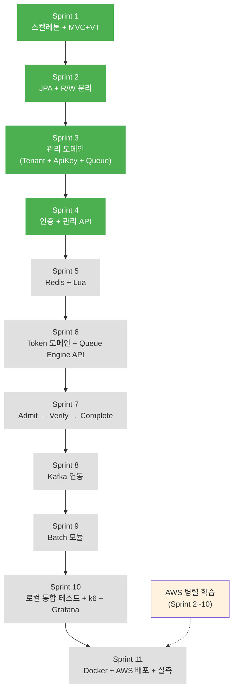

# 🗺 Queue Platform — Sprint Roadmap

> 작성일: 2026-04-16 | Sprint 4 완료 후 최신화 (2026-04-25)

---

## 개요

| 항목 | 내용 |
|------|------|
| 총 Sprint | 11개 |
| 예상 기간 | 약 19.5주 (5개월) |
| 유연 범위 | 4~5개월 |
| 면접 타이밍 | 약 4개월 후 전제 (정직 품질 확보) |
| 우선순위 철학 | 총체적 균형 (MVP 심화 + 운영 완성도 + 부하 실측 + AWS 배포) |
| Sprint 구성 원칙 | "한 Sprint = 한 성격". 기술 구현과 문서 수정은 분리 |
| 인프라 전략 | Sprint 2~10: WSL2(Ubuntu) 직접 설치. Sprint 11: Docker화 + AWS 배포 |

### 카테고리별 시간 배분

```
MVP 심화 (Sprint 2,3,5,6,7,8):   11.0주  (56%)
운영 완성도 (Sprint 4,9):          3.0주  (15%)
부하 실측 + 로컬 모니터링 (10):    3.0주  (15%)
AWS 배포 + 대용량 실측 (11):       3.0주  (15%)  ← 신규
```

### 인프라 참조

- **로컬 (Sprint 2~10):** [INFRA_SETUP.md](INFRA_SETUP.md) — WSL2 직접 설치
- **AWS 배포 (Sprint 11):** [AWS_LEARNING_PATH.md](AWS_LEARNING_PATH.md) — 병렬 학습 경로

| Sprint | 인프라 | 가이드 |
|:-:|------|:-:|
| 2 | MySQL 8.0 × 2 (Master + Replica) | INFRA_SETUP §1 |
| 5 | Redis Sentinel (M1 + S2 + Sen3) | INFRA_SETUP §2 |
| 8 | Kafka 3 브로커 (KRaft) | INFRA_SETUP §3 |
| 10 | k6 + Prometheus + Grafana | INFRA_SETUP §4, §5 |
| **11** | **Docker + AWS (EC2/RDS/ElastiCache/MSK Serverless)** | **AWS_LEARNING_PATH** |

### 진행 현황

```
✅ Sprint 1   완료 (2026-04-16)
✅ Sprint 2   완료 (2026-04-22)
✅ Sprint 3   완료 (2026-04-23)
✅ Sprint 4   완료 (2026-04-24)
⬜ Sprint 5   ← 다음
⬜ Sprint 6
⬜ Sprint 7
⬜ Sprint 8
⬜ Sprint 9
⬜ Sprint 10
⬜ Sprint 11  ← AWS 배포
```

---

## Sprint 의존성 흐름



---

## Sprint 상세

### ✅ Sprint 1 — 멀티모듈 스켈레톤 + MVC + Virtual Thread

**완료일:** 2026-04-16
**소요 시간:** 약 2시간 (재세팅 포함)
**카테고리:** MVP

**주요 산출물:**
- 5개 모듈 Gradle 멀티모듈 구조 (`queue-common`, `queue-domain`, `queue-infrastructure`, `queue-api`, `queue-batch`)
- `QueueApiApplication`, `QueueBatchApplication` 메인 클래스
- `spring.threads.virtual.enabled=true` 적용
- `spring.autoconfigure.exclude`로 JPA/Redis/Kafka 비활성화 (Sprint별 점진 활성화 경로)
- Actuator `/health` 엔드포인트

**완료 기준 (DoD):**
- [x] `./gradlew build` 성공
- [x] `./gradlew :queue-api:bootRun` 성공 (2.954s 기동)
- [x] `GET /actuator/health` → 200 OK `{"status":"UP"}`
- [x] `/thread-check` → `isVirtual: true` 확인
- [x] `scanBasePackages=com.sonix.queue`로 멀티모듈 빈 스캔 검증

**결과물 증거:** `/actuator/health` 200 응답, `/thread-check` 응답의 `isVirtual: true`

---

### ✅ Sprint 2 — JPA + MySQL R/W 분리

**완료일:** 2026-04-22
**소요 시간:** 약 3일 (인프라 세팅 포함)
**카테고리:** MVP

**선행 인프라:** [INFRA_SETUP.md §1](INFRA_SETUP.md) — MySQL Master(3306) + Replica(3307) WSL2 직접 설치 + GTID 복제

**주요 산출물:**
- WSL2에 MySQL 8.0 × 2 인스턴스 기동 (Master 3306 / Replica 3307, GTID 기반 복제)
- `~/.bashrc` 자동 시작 스크립트 + NOPASSWD 설정
- `ReplicationRoutingDataSource` + `LazyConnectionDataSourceProxy`
- `DataSourceConfig`: master/replica/routing/lazy Bean 4개
- `JpaConfig`: @EnableJpaRepositories + @EntityScan (infrastructure 모듈)
- `RoutingDataSourceTest`: R/W 라우팅 실증 (HikariPool 2개 분리)

**완료 기준 (DoD):**
- [x] MySQL Master(3306) + Replica(3307) 기동 확인
- [x] Replica `SHOW REPLICA STATUS`: IO/SQL Running Yes
- [x] Master INSERT → Replica SELECT로 복제 동작 확인
- [x] `ReplicationRoutingDataSource` 단위 테스트
- [x] R/W 라우팅 로그로 실증 (Write → master, Read → replica)
- [x] `./gradlew :queue-api:bootRun` 성공

**참조 문서:** DECISIONS §29, §41, §46, §47, §48

---

### ✅ Sprint 3 — 관리 도메인 (Tenant + ApiKey + Queue)

**완료일:** 2026-04-23
**소요 시간:** 약 2일
**카테고리:** MVP

**주요 산출물:**
- `queue-domain` 모듈에 Rich Domain Model (순수 Java, Spring 의존성 없음)
  - `Tenant`: create(), deactivate(), changePassword(), isActive(), reconstruct()
  - `ApiKey`: create(), revoke(), isActive(), matchesHash(), reconstruct()
  - `Queue`: create(), pause(), resume(), drain(), delete(), update(), isEnqueueable(), isCapacityExceeded()
- Port 인터페이스: `TenantRepository`, `ApiKeyRepository`, `QueueRepository`, `PasswordHasher`
- JPA Entity (`toDomain()`, `fromDomain()`) + JpaAdapter (Port 구현체)
- `BcryptPasswordHasher`: PasswordHasher Port 구현체 (infrastructure)
- `IdGenerator`, `RawKeyGenerator` 공통 유틸
- 도메인 단위 테스트 ~47개 (JUnit 5, Spring 없음)

**완료 기준 (DoD):**
- [x] `queue-domain` 모듈에 Spring 의존성 전혀 없음 (순수 Java)
- [x] Rich Domain 메서드 단위 테스트 통과 (상태 전환 전수, 경계값, 라이프사이클)
- [x] Port ↔ Entity 매핑 (`toDomain()`, `fromDomain()` 팩토리 메서드)
- [x] `ApiKey.revoke()` → REVOKED 전환 + `revokedAt` 기록 검증
- [x] `Queue.isCapacityExceeded()` 경계값 테스트
- [x] `Queue.delete()` PAUSED 상태에서만 허용

**참조 문서:** DECISIONS §8, §49, §50, §51, §52, §53

---

### ✅ Sprint 4 — 인증 (JWT + API Key) + 관리 API + 테스트

**완료일:** 2026-04-24
**소요 시간:** 약 2일
**카테고리:** 운영

**주요 산출물:**
- **Phase 1: Tenant signup/login**
  - POST /tenants/signup: BCrypt 해싱 + 중복 이메일 체크
  - POST /tenants/login: 비밀번호 검증 + Replica 라우팅 (readOnly)
  - GlobalExceptionHandler: BusinessException → HTTP 에러 응답
- **Phase 2: JWT 인증**
  - JwtProvider: Access Token(15분) + Refresh Token(7일)
  - JwtAuthenticationFilter: Bearer 토큰 → SecurityContext 저장
  - SecurityConfig: signup/login/refresh permitAll, 나머지 authenticated
  - TenantAuth: @AuthenticationPrincipal 인증 객체
- **Phase 3: 관리 API 완성**
  - API Key 발급 (rawKey 1회 반환) + Revoke (본인 소유 확인)
  - Token Refresh (Token Rotation 패턴)
  - Queue CRUD 6개 API (생성/조회/이름변경/정지/재개/삭제)
- **테스트**
  - Service 단위 (Mockito): TenantServiceTest, ApiKeyServiceTest, QueueServiceTest
  - Controller 통합 (MockMvc): TenantControllerTest, ApiKeyControllerTest, QueueControllerTest

**완료 기준 (DoD):**
- [x] Tenant 회원가입 → 로그인 → JWT 발급 → API Key 생성 → Queue CRUD 시나리오 E2E 동작
- [x] JWT 만료 후 Refresh Token으로 재발급 (Token Rotation)
- [x] API Key SHA-256 해시 DB 저장 (원본 불가역)
- [x] BCrypt 비밀번호 해싱이 Virtual Thread에서 동작 확인
- [x] 관리 API 통합 테스트 (MockMvc)
- [x] 토큰 없이 API 접근 → 403 차단
- [x] 전체 테스트 약 50개 PASSED

**참조 문서:** DECISIONS §4, §42, §53, §54, §55, §56

---

### ⬜ Sprint 5 — Redis 어댑터 + Lua Script + Sentinel

**예상 기간:** 2.5주 (Sentinel 3노드 설치 + Lua Script 구현 포함)
**카테고리:** MVP

**선행 인프라:** [INFRA_SETUP.md §2](INFRA_SETUP.md) — Redis Master(6379) + Slave(6380, 6381) + Sentinel(26379, 26380, 26381) WSL2 직접 설치

**주요 산출물:**
- WSL2에 Redis Sentinel 구성 (기존 Redis Master + Slave 2 + Sentinel 3)
- `~/.bashrc` 자동 시작 스크립트
- `RedisKeyFactory` (static 메서드 방식)
- Enqueue Bulk Lua Script (INCRBY global-seq + ZADD multi-member NX)
- Admit Dequeue Lua Script (ZRANGE WITHSCORES + ZREM + 재정렬)
- Ranking Lua Script (ZSCORE + 슬라이스별 ZCOUNT 합산)
- **API Key 캐시** Redis 적용 (Sprint 4의 DB 조회 구조에 Redis 캐시 레이어 추가, TTL 60s)
- **JWT Refresh Token** Redis 이중 저장 적용 (Sprint 4의 DB 단일 구조를 Redis + DB로 확장)
- **Rate Limit** Redis 카운터로 처음부터 구현 (per-key 100 rps, 슬라이딩 윈도우 또는 토큰 버킷)

**완료 기준 (DoD):**
- [ ] Redis Sentinel 3노드 기동 확인 (`redis-cli -p 26379 sentinel master mymaster`)
- [ ] `num-sentinels=3, num-slaves=2, quorum=2` 확인
- [ ] Failover 시나리오 테스트 (Master 강제 종료 → Slave 승격 5~10초 내)
- [ ] `autoconfigure.exclude`에서 `RedisAutoConfiguration`, `RedisRepositoriesAutoConfiguration` 제거
- [ ] Lua Script 원자성 통합 테스트 (동시 1,000 Enqueue → 순번 중복 없음)
- [ ] 슬라이스 라운드로빈 분배 확인 (`slice = (seq-1) % sliceCount`)
- [ ] Redis 장애 시 Circuit Breaker → 503 응답
- [ ] RedisKeyFactory 단위 테스트 (키 포맷 검증)
- [ ] **Rate Limit per-key 100 rps 초과 시 429 응답** (Redis 카운터 기반)
- [ ] **API Key 캐시 히트율 로그로 확인** (60s TTL 적용)
- [ ] **Refresh Token Redis 조회 우선 → DB fallback 동작 검증**

**참조 문서:** DECISIONS §5 (Redis 장애 복구), §17 (대용량 처리 - Redis), §30 (Redis Sentinel)

**Sprint 핵심 차별 포인트:** Lua Script 원자성 + Sentinel Failover 실증

**실증 증거 수집:** Failover 로그 + Lua Script 동시성 테스트 결과

---

### ⬜ Sprint 6 — Token 도메인 + Queue Engine API (Enqueue / Polling)

**예상 기간:** 1.5주
**카테고리:** MVP

**주요 산출물:**
- **Token 도메인 모델** (분할된 Sprint 3의 후반)
  - Token Rich Domain (`complete`, `cancel`, `expire`, `returnToWaiting`, `waitingSeconds`)
  - `TokenRepository` Port 인터페이스
  - JPA Entity 파티셔닝 고려 (PK = id + issued_at)
- **Enqueue API**
  - `POST /queues/:queueId/tokens` (202 Accepted 즉시 응답)
  - Bulk Lua Script 호출 + queue-user 역인덱스
  - (Kafka 연동은 Sprint 8, 이 Sprint에서는 동기 DB INSERT 먼저)
- **Polling API**
  - `GET /queues/:queueId/tokens/:token`
  - nextPollAfterSec 적응형 간격 로직
  - token-info 캐시 + Replica Fallback
- **Cancel API**
  - `DELETE /queues/:queueId/tokens/:token` → CANCELLED

**완료 기준 (DoD):**
- [ ] Token 도메인 단위 테스트 (상태 전환 매트릭스 전체)
- [ ] 1,000명 동시 Enqueue → 순번 중복 0건
- [ ] Polling 응답 시간 p99 < 50ms (로컬 기준)
- [ ] nextPollAfterSec 4단계(30/10/5/2초) 분기 테스트
- [ ] token-info 캐시 히트율 로그로 확인
- [ ] 중복 Enqueue 시 기존 토큰 반환 (멱등 처리)

**참조 문서:** FRS §6.2 (Enqueue), §6.3 (Polling), FLOW.md Enqueue/Polling 다이어그램

**주의:** 이 Sprint에서는 Enqueue → DB INSERT가 **동기**로 처리됨. Sprint 8에서 Kafka 버퍼로 전환.

---

### ⬜ Sprint 7 — Admit → Verify → Complete + 상태 머신

**예상 기간:** 1.5주
**카테고리:** MVP

**주요 산출물:**
- `POST /queues/:queueId/admit` (동기 처리 버전. Kafka는 Sprint 8)
- `POST /admit-tokens/:admitToken/verify` (DB Fallback 포함)
- `POST /tokens/:token/complete` (DB 먼저 → ZREM)
- `admit-idem` 멱등성 체크
- `verified-token` 중복 입장 방지 플래그
- avgWaitingTime 직접 갱신 (HINCRBYFLOAT)
- **ADMIT_TOKEN_TTL 만료 → WAITING 복귀 로직** ← 포트폴리오 차별 포인트

**완료 기준 (DoD):**
- [ ] admit 100명 동시 요청 → FIFO 순서 보장
- [ ] admitToken TTL 60초 경과 → WAITING 복귀 + seq 복원 검증
- [ ] complete DB 먼저 → ZREM 실패 시뮬레이션 → Batch 재실행(Sprint 9 위임)
- [ ] verify 호출 순서 규칙 OpenAPI description에 명시
- [ ] 중복 complete 요청 → 1번만 성공 (DB UPDATE WHERE status=1)
- [ ] Rich Domain 상태 전환 메서드로 비즈니스 로직 검증

**참조 문서:** FRS §6.4~6.6, DECISIONS §34, §36 (admitToken TTL → WAITING), STATE.md

**Sprint 핵심 차별 포인트:** admitToken 만료 시 WAITING 복귀 (seq 기반 우선순위 보존)

---

### ⬜ Sprint 8 — Kafka 연동 (Enqueue 버퍼 + Consumer)

**예상 기간:** 2주 (Kafka 3 브로커 설치 + 기존 동기 → 비동기 리팩토링 포함)
**카테고리:** MVP

**선행 인프라:** [INFRA_SETUP.md §3](INFRA_SETUP.md) — Kafka 3 브로커 KRaft 모드 (9092/9192/9292) WSL2 직접 설치

**주요 산출물:**
- WSL2에 Kafka 3 브로커 KRaft 클러스터 기동 (Zookeeper 미사용)
- WSL2 메모리 12GB 권장 설정 (`.wslconfig`)
- `~/.bashrc` 자동 시작 스크립트
- 토픽 3개 생성: `enqueue-events`, `enqueue-admit`, `token-status-changed` (각 3 파티션, replication-factor 3)
- Producer 설정 (acks=all, idempotence=true)
- **Sprint 6의 동기 Enqueue DB INSERT → Kafka 비동기로 전환**
- **Sprint 7의 동기 admit → Kafka 기반 AdmitConsumer로 전환**
- `TokenEnqueueConsumer` (1,000건 Bulk INSERT, redis_sync_needed=0)
- `AdmitConsumer` (admit_requests PENDING → PROCESSING → COMPLETED)
- `BillingConsumer` 스켈레톤 (실제 집계는 Sprint 9)

**완료 기준 (DoD):**
- [ ] Kafka 3 브로커 KRaft Quorum 형성 확인 (로그에 LEADER 메시지)
- [ ] 토픽 3개 생성 완료 (`kafka-topics.sh --list`)
- [ ] 간단한 Producer/Consumer 수동 테스트 성공
- [ ] `autoconfigure.exclude`에서 `KafkaAutoConfiguration` 제거
- [ ] Enqueue p99 < 50ms 복원 (Kafka 버퍼 효과)
- [ ] Consumer 재시작 시 미처리 메시지 재처리 확인
- [ ] At-Least-Once 보장 검증 (UNIQUE KEY로 중복 INSERT 방어)
- [ ] MANUAL_IMMEDIATE ack 모드 동작 검증
- [ ] 브로커 1개 강제 종료 시 ISR 유지로 프로듀싱 계속 가능 확인

**참조 문서:** DECISIONS §14 (admit 순서 보장), §32 (Kafka 도입 설계), §40 (Kafka Consumer 설정)

**주의:** 이 Sprint에서 가장 큰 변경은 **기존 동기 흐름을 비동기로 리팩토링**하는 것. 테스트 수트가 대거 수정될 수 있음. WSL2 리소스도 부담이 크니 메모리 할당 확인 필수.

**실증 증거 수집:** 브로커 로그 + At-Least-Once 재처리 시나리오 결과

---

### ⬜ Sprint 9 — Batch 모듈 (TokenExpiryJob + RedisSyncJob + BillingSnapshotJob)

**예상 기간:** 1.5주
**카테고리:** 운영

**주요 산출물:**
- `queue-batch` 모듈 활성화 (bootRun 가능)
- `TokenExpiryJob` (10초 주기)
  - waitingTtl / inactiveTtl / admit-token TTL 3종 감지
  - `batch-lock:{t}:{q}` 분산 락
- `RedisSyncJob` (5분 주기)
  - `redis_sync_needed=1` 토큰 → Redis 재삽입
- `BillingSnapshotJob` (월 1회, M+2월 초)
  - `queue_daily_stats` 집계
  - `billing_snapshots` UPSERT
  - 파티션 DROP + REORGANIZE
  - > **실제 월 1회 스케줄 대기 대신 수동 트리거 + dry-run 쿼리로 검증**
- ShedLock 또는 `batch-lock` 기반 멀티 인스턴스 분산

**완료 기준 (DoD):**
- [ ] Batch Server 기동 후 TokenExpiryJob 10초 주기 실행 로그 확인
- [ ] admitToken TTL 만료 케이스 → WAITING 복귀 동작 (Sprint 7 로직 재사용)
- [ ] Redis 다운 시뮬레이션 → 복구 후 RedisSyncJob이 미반영 토큰 재삽입
- [ ] **BillingSnapshotJob 수동 트리거 동작 확인** (예: HTTP endpoint 또는 테스트 프로파일)
- [ ] **파티션 운영 쿼리 dry-run 검증** (schema.sql의 Step 1~4 각 쿼리 실행 + EXPLAIN)
  - `INSERT INTO queue_daily_stats ... ON DUPLICATE KEY UPDATE id = id` 멱등성 확인
  - `INSERT INTO billing_snapshots ... ON DUPLICATE KEY UPDATE count = VALUES(count)` 멱등성 확인
  - `EXPLAIN SELECT ... partitions: p2026_04` Partition Pruning 확인
- [ ] Batch 2대 동시 기동 시 `batch-lock`으로 중복 실행 방지
- [ ] Gap Lock 방지 (LIMIT 100 순차 처리)

**참조 문서:** schema.sql의 파티션 운영 섹션, DECISIONS §39 (RedisSyncJob), §43 (Queue 삭제 흐름), §44 (파티션 유예 전략)

**주의:** BillingSnapshotJob은 월 1회 스케줄이라 실제 시간 기반 검증 불가. 수동 트리거 + dry-run 쿼리로 대체. 실제 프로덕션에서는 ShedLock으로 배타 실행 보장.

---

### ⬜ Sprint 10 — 통합 테스트 + k6 부하 + Grafana 모니터링 + JS SDK + 최종 문서화

**예상 기간:** 3주
**카테고리:** 부하 / 운영

**선행 인프라:** [INFRA_SETUP.md §4](INFRA_SETUP.md) — k6 설치 / [§5 (신규)](INFRA_SETUP.md) — Prometheus + Grafana 설치

**주요 산출물:**

**A. 통합 테스트 (WSL2 로컬 인프라 기반)**
- 실제 MySQL/Redis/Kafka에 연결하는 E2E 테스트 수트
- 시나리오: signup → API Key → Queue → Enqueue → Polling → Admit → Verify → Complete
- 장애 복구 시나리오 (Redis Failover, Kafka 브로커 재시작 등)
- > Docker/Testcontainers 미사용 노선 → 로컬 환경이 테스트 환경

**B. k6 부하 실측**
- 시나리오 1: Enqueue 200 rps 지속
- 시나리오 2: **Polling 2,000 rps 지속 → p99 < 50ms 검증 (포트폴리오 핵심)**
- 시나리오 3: Enqueue 10,000 rps 급증 (Kafka 버퍼 효과 검증)
- p50/p95/p99 레이턴시, 에러율, Throughput 측정

**C. Grafana 모니터링 구축**
- WSL2에 Prometheus + Grafana 설치
- Queue Platform 측에 `micrometer-registry-prometheus` 의존성 추가 (Sprint 2 이후 점진 확장)
- `/actuator/prometheus` 엔드포인트 노출
- Grafana 대시보드 구성:
  - JVM 메트릭 (GC, Heap, Thread)
  - HTTP 요청 (p99 레이턴시, RPS, 에러율)
  - HikariCP 커넥션 풀 상태
  - Kafka Consumer lag
  - Redis 커맨드 레이턴시
  - Virtual Thread 수
- k6 부하 실측 중 실시간 대시보드 관찰

**D. OpenAPI 3.0 자동 생성**
- Springdoc-openapi 의존성 추가
- `/swagger-ui.html` 배포
- verify 순서 등 Workflow를 description에 명시
- Tenant 구현 가이드라인 (FRS §12.2) → OpenAPI description 반영

**E. JS SDK 구현** (별도 레포 `queue-platform-sdk-js`)
- `PollingManager` (nextPollAfterSec 자동 적용, setTimeout 관리)
- `StateManager` (IDLE → WAITING → READY → COMPLETED → EXPIRED)
- `VisibilityHandler` (visibilitychange → Polling 중단/재개)
- `NetworkHandler` (offline/online 자동 처리)
- 데모 HTML 페이지 (간단한 대기열 시각화)
- npm publish (선택) / CDN 배포 (선택)
- queue-platform 본체와는 별도 Git 레포로 관리

**F. 성능 튜닝 리포트**
- JVM GC 튜닝 (G1GC 옵션)
- HikariCP 풀 사이즈 실측 조정
- Redis 커넥션 풀 튜닝
- Kafka Consumer 파티션/concurrency 조정

**G. 최종 docx 재생성** (메모리 컨벤션 준수)
- 업데이트된 FRS/DECISIONS/FLOW/STATE/ROADMAP을 하나의 docx로 통합

**완료 기준 (DoD):**
- [ ] k6 설치 확인 (`k6 version`)
- [ ] Prometheus + Grafana 기동 확인
- [ ] 통합 테스트 실행 시간 < 10분
- [ ] k6 시나리오 2 (Polling 2,000 rps) 성공 → **p99 < 50ms 증거 스크린샷 확보** ⭐
- [ ] k6 시나리오 3 (Enqueue 10,000 rps 급증) → Kafka 버퍼 효과로 p99 < 100ms
- [ ] **Grafana 대시보드 6개 완성** (JVM / HTTP / HikariCP / Kafka lag / Redis / Virtual Thread)
- [ ] **k6 실측 중 Grafana 실시간 모니터링 스크린샷 확보** ⭐
- [ ] Swagger UI 접근 가능 + 모든 API 응답 예시 포함
- [ ] **JS SDK 데모 HTML로 대기열 참여 → Polling → admitToken 수신 E2E 시나리오 동작**
- [ ] 성능 튜닝 전/후 비교 리포트 작성
- [ ] `queue_platform_final.docx` 재생성 + Git 커밋

**Sprint 핵심 차별 포인트:** 2,000 rps 실측 + Grafana 대시보드 + JS SDK 데모 = 면접 시 가장 강력한 증거 세트

**실증 증거 수집:** 
- k6 리포트 HTML
- Grafana 대시보드 스크린샷 (부하 전/중/후)
- OpenAPI Swagger UI 캡처
- JS SDK 데모 녹화 (선택)

---

### ⬜ Sprint 11 — Docker화 + AWS 배포 + 대용량 실측 (신규)

**예상 기간:** 3주
**카테고리:** 배포 / 운영

**선행 요건:** [AWS_LEARNING_PATH.md](AWS_LEARNING_PATH.md) — Sprint 2~10 동안 병렬 학습 완료. Sprint 11 진입 시점 체크리스트(§5) 전부 ✓

**주요 산출물:**

**A. Docker 전환 (Sprint 11 시작 시점)**
- queue-api Dockerfile (Amazon Corretto 21 multi-stage build)
- queue-batch Dockerfile
- `.dockerignore`
- 로컬 WSL2에서 Docker Engine으로 전체 실행 검증
- docker-compose.yml (선택: 로컬 통합 테스트 편의용)

**B. AWS 인프라 프로비저닝**
- VPC + Public/Private Subnet + IGW + NAT (최소)
- IAM Role + Security Group + Parameter Group
- **RDS MySQL** (db.t3.small Multi-AZ, Read Replica 1개)
- **ElastiCache Redis** (cache.t3.micro, Cluster Mode Disabled + Replication Group)
- **MSK Serverless** (Private Subnet, IAM 인증, 토픽 3개)
- **EC2** (queue-api × 2 + queue-batch × 1, t3.medium)
- **ALB** (queue-api 앞에)
- **ECR** 레포지토리 (queue-api, queue-batch)
- CloudWatch Log Group 2개

**C. 배포 파이프라인**
- EC2에 Docker 설치 + 초기 설정
- ECR 인증 → 이미지 푸시 (`docker push`)
- EC2에서 `docker pull` + `docker run` (환경변수 주입)
- ALB Target Group 등록 + 헬스체크
- Systems Manager Session Manager로 EC2 접속 (SSH 미사용)

**D. AWS 환경 통합 테스트**
- 전체 시나리오 E2E (signup → queue → enqueue → polling → admit → complete)
- 장애 시뮬레이션 (RDS Failover, EC2 인스턴스 종료)
- VPC 네트워크 검증 (Private Subnet의 RDS/ElastiCache 접근)

**E. AWS 환경 k6 부하 실측**
- Polling 2,000 rps 지속 → p99 확인 (AWS 네트워크 레이턴시 감안)
- Enqueue 10,000 rps 급증 (MSK Serverless 버퍼 효과 검증)
- **로컬 vs AWS 비교 리포트** (레이턴시, 비용, 가용성)

**F. CloudWatch 모니터링**
- EC2 메트릭 (CPU, 메모리, 네트워크)
- RDS 메트릭 (연결 수, Read/Write IOPS)
- ElastiCache 메트릭 (캐시 히트율, 메모리)
- 애플리케이션 로그 (Fluent Bit 또는 CloudWatch Agent)
- 기본 대시보드 + 주요 알람 3개

**G. 비용 및 정리**
- 실제 발생 비용 리포트 (Cost Explorer)
- 모든 테스트 완료 후 리소스 종료 (체크리스트 기반)
- 최종 AWS 아키텍처 다이어그램 (draw.io 또는 Cloudcraft)

**완료 기준 (DoD):**
- [ ] AWS 계정 + 예산 알림 $100 설정
- [ ] Queue Platform Dockerfile 작성 + 로컬 WSL2에서 전체 시나리오 통과
- [ ] VPC + RDS + ElastiCache + MSK Serverless + EC2 + ALB 프로비저닝 완료
- [ ] Docker 이미지 ECR 푸시 + EC2 배포 + ALB 헬스체크 통과
- [ ] AWS 환경에서 전체 시나리오 E2E 통과
- [ ] AWS 환경 k6 시나리오 2 (Polling 2,000 rps) → **p99 < 100ms 확인** ⭐
- [ ] AWS 환경 k6 시나리오 3 (Enqueue 10,000 rps 급증) 성공
- [ ] CloudWatch 기본 대시보드 + 알람 3개
- [ ] 로컬 vs AWS 비교 리포트 작성 (레이턴시, 비용, 운영 부담)
- [ ] 최종 아키텍처 다이어그램 + 배포 가이드 문서화
- [ ] **테스트 완료 후 리소스 종료 확인** ⭐ (비용 지속 방지 체크리스트 전수 수행)
- [ ] 총 발생 비용 $300 이하

**Sprint 핵심 차별 포인트:**
- 실제 클라우드 환경 실측 데이터 (로컬 vs AWS 비교 데이터)
- 관리형 서비스(RDS, ElastiCache, MSK Serverless) 실전 경험
- 비용 인식 + 관리 경험 (포트폴리오에서 흔치 않음)

**참조 문서:** 별도 AWS_DEPLOYMENT.md 작성 예정 (Sprint 11 시작 시)

**예상 비용 (3주 집중 실험 기준):**
```
EC2 t3.medium × 3           : ~$50
RDS db.t3.small Multi-AZ    : ~$60
ElastiCache cache.t3.micro  : ~$40
MSK Serverless (간헐 사용)   : ~$30~50
ALB + 데이터 전송 + 기타     : ~$20~30
ECR, CloudWatch, 기타        : ~$10
────────────────────────────
총 예상: $210~240 (목표 $300 이하)
```

**주의:**
- 부하 테스트 시간만 리소스 기동. 평소 유휴 시간엔 EC2 중지, MSK는 사용량 기반이라 OK
- **Sprint 11 종료 체크리스트**는 AWS_LEARNING_PATH.md §4 참조
- 모든 리소스 종료 후 익일까지 비용 지속 여부 확인

---

## 운영 원칙 (Sprint 1 회고 반영)

### 각 Sprint 시작 시
1. **DoD 먼저 문서화** — 이 로드맵의 해당 Sprint DoD를 리뷰하고 필요 시 추가
2. **브랜치 분기** — `feat/sprint-N-<범위>` (예: `feat/sprint-2-jpa-replication`)
3. **application.yml 점진 확장** — 해당 Sprint 범위만 추가. 미래 인프라 설정은 `application-local.yml`에 별도 보관

### Sprint 진행 중
4. **기술 구현 vs 문서 수정 분리** — 한 Sprint 내에서도 별도 커밋
5. **전략 결정은 Sprint 진입 전에** — 진행 중 번복은 비용이 크다
6. **실증 증거 캡처** — 로그/스크린샷/테스트 결과를 `doc/evidence/sprint-N/`에 저장

### Sprint 완료 시
7. **DoD 체크리스트 전수 통과** 확인 후 브랜치 merge
8. **KPT 회고 작성** — `doc/retrospective/sprint-N.md` (선택)
9. **해당 Sprint 체크박스 업데이트** — 이 ROADMAP.md의 진행 현황
10. **메인 브랜치 푸시 후 다음 Sprint DoD 재확인**

### 병렬 학습 (AWS 대비)
11. **Sprint 2부터 AWS 병렬 학습 시작** — 주당 4~5시간. AWS_LEARNING_PATH.md 참조
12. **Sprint 8~9 시점에 Sprint 11 진입 체크리스트 80% 이상 ✓** 상태 목표

---

## 포트폴리오 차별 포인트 요약

면접 시 가장 임팩트 있게 설명할 수 있는 포인트들을 Sprint별로 정리:

| Sprint | 차별 포인트 |
|--------|------------|
| 1 | Virtual Thread 실증 (isVirtual=true) + autoconfigure.exclude 단계적 활성화 전략 |
| 2 | ReplicationRoutingDataSource + @Transactional(readOnly) 자동 라우팅 (GTID 복제 기반) |
| 4 | Refresh Token 버전 기반 재사용 감지 + Rotation |
| 5 | Lua Script 원자성 + Sentinel Failover 실증 + 슬라이스 파티셔닝 + Rate Limit |
| 6 | nextPollAfterSec 적응형 간격 (서버 부하 최적화) |
| **7** | **admitToken TTL 만료 → WAITING 복귀 (seq 기반 우선순위 보존)** ⭐ |
| 8 | Kafka KRaft + At-Least-Once + 동기→비동기 리팩토링 경험 |
| 9 | 파티션 1달 유예 DROP 전략 (월말 과금 누락 방지) |
| **10** | **k6 2,000 rps 로컬 실측 p99 < 50ms + Grafana 대시보드 + JS SDK 데모** ⭐ |
| **11** | **AWS 배포 + 관리형 서비스 경험 (RDS/ElastiCache/MSK Serverless) + 로컬 vs AWS 실측 비교** ⭐ |

---

## 참조 문서

- [INFRA_SETUP.md](INFRA_SETUP.md) — WSL2 인프라 설치 가이드 (MySQL/Redis/Kafka/k6/Prometheus/Grafana)
- [AWS_LEARNING_PATH.md](AWS_LEARNING_PATH.md) — Sprint 11 대비 AWS 병렬 학습 경로
- [FRS v1.10](FRS_final.md) — 기능 정의
- [DECISIONS](DECISIONS.md) — 45개 설계 결정
- [FLOW](FLOW.md) — 상세 흐름도
- [STATE](STATE.md) — 상태 머신

---

<p align="center">
  <sub>Sprint 1 완료 · 2026-04-16 · 다음 목표: Sprint 2 (JPA + R/W 분리) · 병렬 학습: AWS_LEARNING_PATH</sub>
</p>
