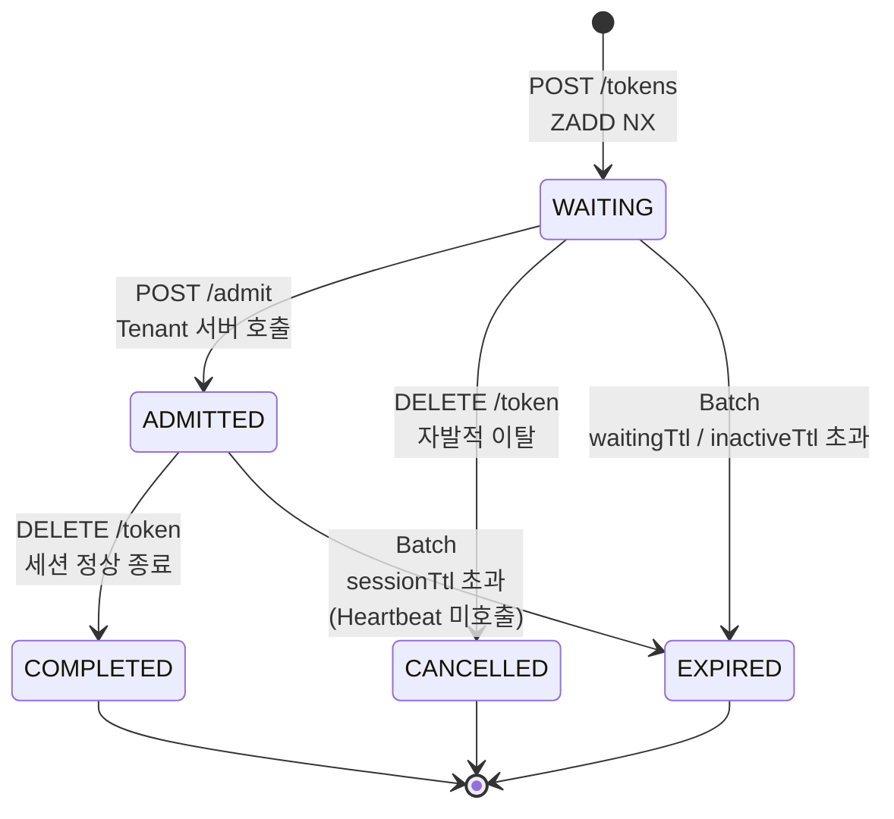
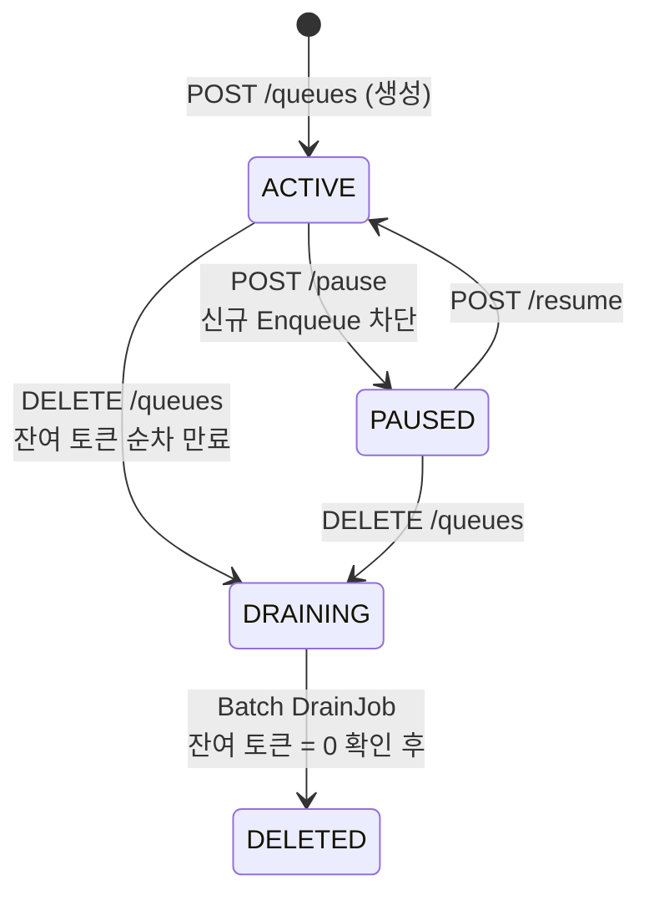
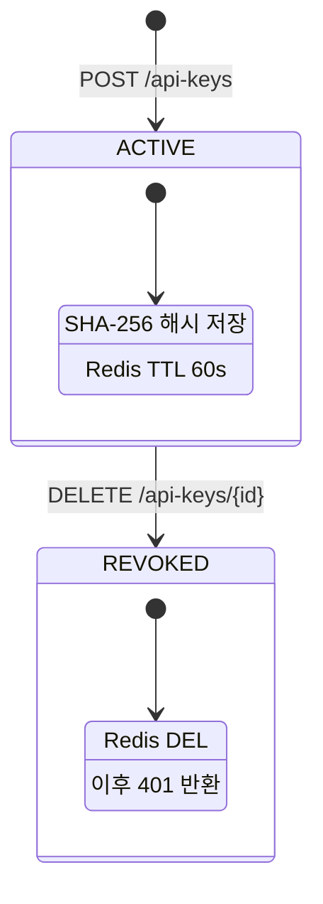

# 📊 Queue Platform — 상태 흐름도

---

## Token 상태 머신

### expiredReason

| 값 | 원인 | 감지 방법 |
|----|------|----------|
| `WAITING_TTL` | waitingTtl 초과 | `ZRANGEBYSCORE 0 ~ (now - waitingTtl)` |
| `INACTIVE_TTL` | Polling 없어 비활동 | `EXISTS token-last-active:{token}` = 0 |
| `SESSION_TTL` | Heartbeat 미호출 | `DB expiresAt < now` |

---

## Queue 상태 머신

---

## API Key 상태 머신

