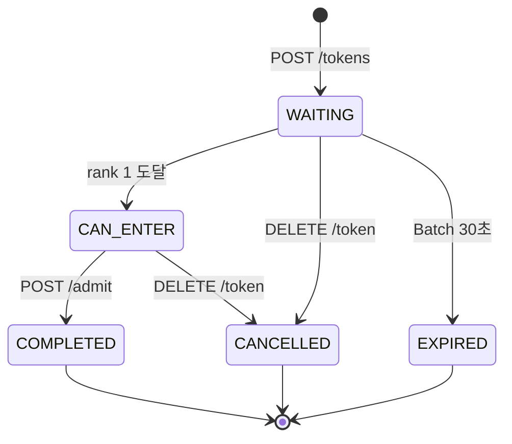
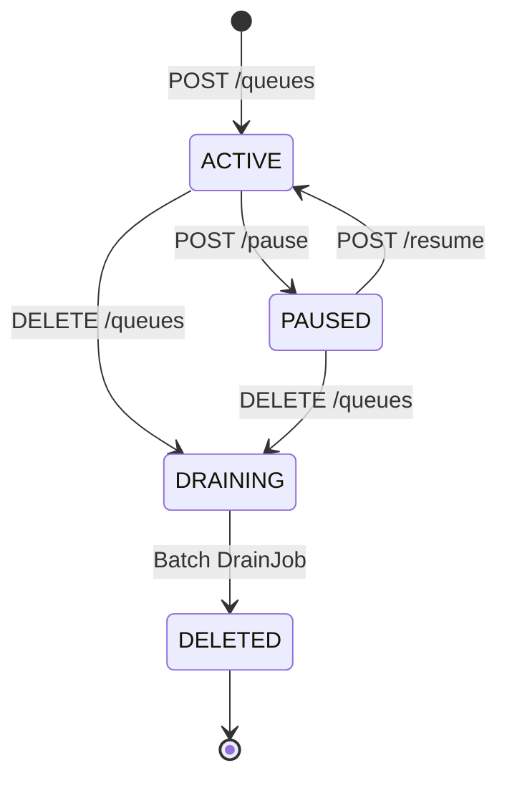
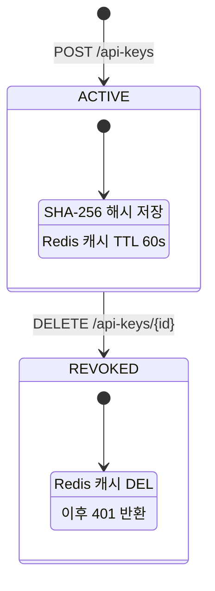

# 📊 Queue Platform — 상태 흐름도

> FRS v1.5 기준

---

## Token 상태 머신



### 상태별 의미

| 상태 | 내부 의미 | 클라이언트 응답 |
|------|----------|----------------|
| `WAITING` | 대기 중 | `isFirst: false` |
| `CAN_ENTER` | rank 1 도달. 입장 가능 | `isFirst: true` |
| `COMPLETED` | 입장 완료 | `isFirst: false` |
| `CANCELLED` | 유저 자발적 이탈 | `isFirst: false` |
| `EXPIRED` | TTL 초과 만료 | `isFirst: false` |

> `CAN_ENTER`는 내부 상태값. 클라이언트에게는 `isFirst: true`로만 노출.
> 클라이언트는 상태값(status)이 아닌 `isFirst` 플래그로 입장 가능 여부를 판단.

### 핵심 설계 결정

| 항목 | 내용 |
|------|------|
| ADMITTED 상태 | **없음** — Admit 즉시 COMPLETED |
| CAN_ENTER 전이 시점 | rank 1 도달 시 Lua Script 내에서 원자적으로 SET |
| 세션 관리 | Tenant 책임. Platform 관여 안 함 |
| Admit 순서 | DB 먼저 → ZREM 나중 (잔류가 유실보다 안전) |
| 복구 | Batch 싱크 스케줄러가 5분 내 Redis 정합성 복구 |

### CAN_ENTER 전이 Lua Script

```lua
-- 누군가 대기열에서 빠질 때 (COMPLETED / CANCELLED / EXPIRED 전이 시)
redis.call('ZREM', queueKey, tokenId)
redis.call('SET', 'token-status:' .. tokenId, 'COMPLETED', 'EX', 300)

-- 다음 1등 확인 후 CAN_ENTER 전이
local next = redis.call('ZRANGE', queueKey, 0, 0)
if #next > 0 then
    redis.call('SET', 'token-status:' .. next[1], 'CAN_ENTER', 'EX', 300)
end
```

### expiredReason

| 값 | 원인 | Batch 감지 방법 |
|----|------|----------------|
| `WAITING_TTL` | waitingTtl(기본 7200s) 초과 | `ZRANGEBYSCORE 0 ~ (now_ms - waitingTtl_ms)` |
| `INACTIVE_TTL` | 마지막 Polling 후 inactiveTtl(기본 1800s) 초과 | `EXISTS token-last-active:{tokenId}` = 0 |

> `CAN_ENTER` 상태에서 만료된 경우도 동일하게 `INACTIVE_TTL` 처리.
> Batch가 다음 1등에게 `CAN_ENTER` 전이 후 DB도 업데이트.

---

## Queue 상태 머신



### 상태별 Enqueue 허용 여부

| 상태 | Enqueue | 기존 대기자 |
|------|---------|------------|
| ACTIVE | ✅ 허용 | 유지 |
| PAUSED | ❌ 503 | 유지 |
| DRAINING | ❌ 503 | 순차 만료 |
| DELETED | ❌ 404 | 없음 |

---

## API Key 상태 머신


