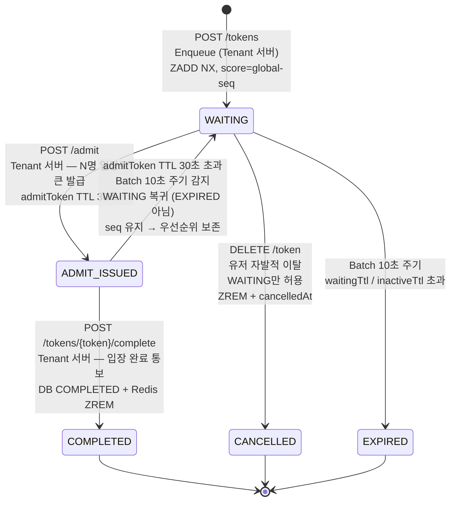
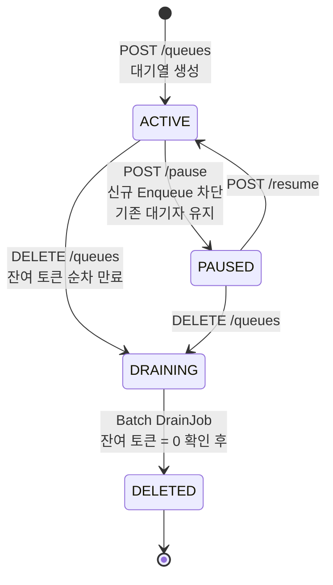
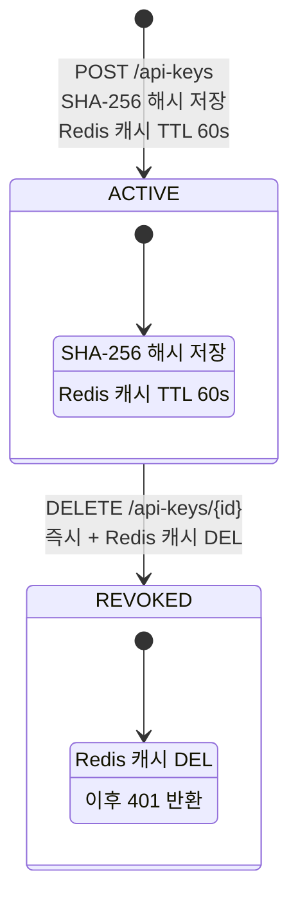

# 📊 Queue Platform — 상태 흐름도

> FRS v1.6 기준

---

## Token 상태 머신

### 핵심 설계 결정

| 항목 | 내용 |
|------|------|
| ADMIT_ISSUED | 입장토큰 발급됨. 유저가 Polling으로 admitToken 수신 대기 |
| verify | ADMIT_ISSUED 상태 유지. 유효성 확인만. 상태 변경 없음 |
| complete | Tenant가 입장 완료 후 명시적 통보 → COMPLETED + ZREM |
| admitToken 만료 | WAITING 복귀 (EXPIRED 아님). seq DB 저장값으로 순위 복원 |
| 이탈 허용 | WAITING만. ADMIT_ISSUED → 409 (유저 귀책) |
| 세션 관리 | Tenant 책임. Platform 관여 안 함 |
| complete 순서 | DB 먼저 → ZREM 나중 (잔류가 유실보다 안전) |
| 복구 | Batch 10초 내 ZREM 재실행 (멱등) |
| seq 저장 | DB tokens.seq 컬럼 — ADMIT_ISSUED→WAITING 복귀 시 score 복원 |

### expiredReason

| 값 | 원인 | 대상 상태 | Batch 감지 방법 |
|----|------|----------|----------------|
| `WAITING_TTL` | waitingTtl(기본 7200s) 초과 | WAITING | `ZRANGEBYSCORE 0 ~ (now_ms - waitingTtl_ms)` |
| `INACTIVE_TTL` | 마지막 Polling 후 inactiveTtl(기본 300s) 초과 | WAITING | `EXISTS token-last-active:{tokenId}` = 0 |
| `ADMIT_TOKEN_TTL` | 입장토큰 30초 초과 미사용 → WAITING 복귀 (EXPIRED 아님) | ADMIT_ISSUED | `EXISTS admit-token:{tokenId}` = 0 |

> ADMIT_TOKEN_TTL은 EXPIRED 처리가 아닌 WAITING 복귀
> DB tokens.seq 기준으로 Redis ZADD score 복원 → 우선순위 유지

---

## Queue 상태 머신

### 상태별 Enqueue 허용 여부

| 상태 | Enqueue | 기존 대기자 |
|------|---------|------------|
| ACTIVE | ✅ 허용 | 유지 |
| PAUSED | ❌ 503 | 유지 |
| DRAINING | ❌ 503 | 순차 만료 |
| DELETED | ❌ 404 | 없음 |

---

## API Key 상태 머신

