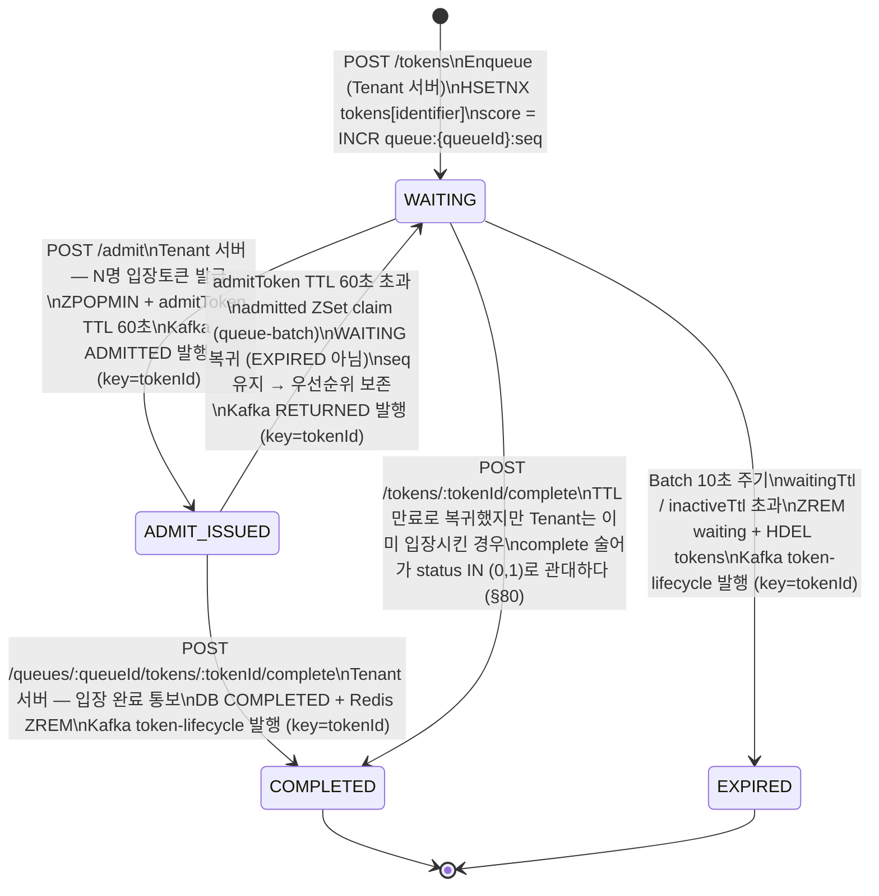
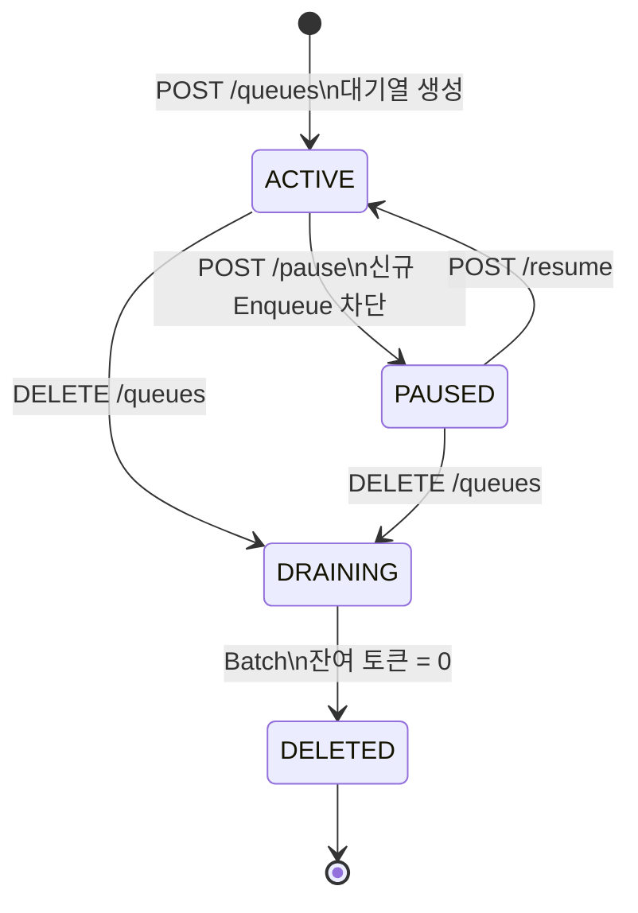
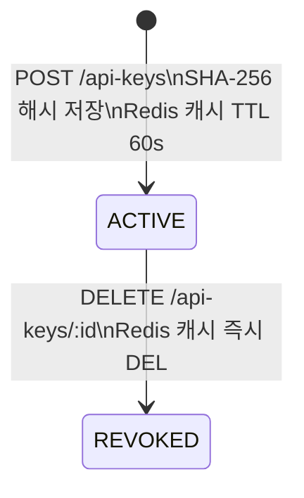

# 📊 Queue Platform — 상태 흐름도

> FRS v1.13 기준 | 전이 가드는 DECISIONS §80

---

## Token 상태 머신

```mermaid
stateDiagram-v2
    [*] --> WAITING : POST /tokens\nEnqueue (Tenant 서버)\nHSETNX tokens[identifier]\nscore = INCR queue:{queueId}:seq

    WAITING --> ADMIT_ISSUED : POST /admit\nTenant 서버 — N명 입장토큰 발급\nZPOPMIN + admitToken TTL 60초\nKafka ADMITTED 발행 (key=tokenId)

    ADMIT_ISSUED --> COMPLETED : POST /queues/:queueId/tokens/:tokenId/complete\nTenant 서버 — 입장 완료 통보\nDB COMPLETED + Redis ZREM\nKafka token-lifecycle 발행 (key=tokenId)

    WAITING --> COMPLETED : POST /tokens/:tokenId/complete\nTTL 만료로 복귀했지만 Tenant는 이미 입장시킨 경우\ncomplete 술어가 status IN (0,1)로 관대하다 (§80)

    ADMIT_ISSUED --> WAITING : admitToken TTL 60초 초과\nadmitted ZSet claim (queue-batch)\nWAITING 복귀 (EXPIRED 아님)\nseq 유지 → 우선순위 보존\nKafka RETURNED 발행 (key=tokenId)

    WAITING --> EXPIRED : Batch 10초 주기\nwaitingTtl / inactiveTtl 초과\nZREM waiting + HDEL tokens\nKafka token-lifecycle 발행 (key=tokenId)

    COMPLETED --> [*]
    EXPIRED --> [*]
```

> 🔴 **`CANCELLED(3)`으로 가는 전이는 없다 (DECISIONS §82).** `DELETE /tokens/:tokenId`를
> 만들지 않기로 확정했다. 유저가 취소 버튼을 누르든 탭을 닫든 신호는 **"폴링이 멈춘다"** 하나이고,
> `inactiveTtl` 판정 배치가 그것을 잡아 **EXPIRED(4)** 로 보낸다. `status = 3`은 예약값으로만 남는다.
>
> **`inactiveTtl`은 유예 창이다.** 배치가 `HDEL tokens`를 하기 전에 같은 identifier로 재-enqueue하면
> `enqueue_bulk.lua`의 `HSETNX` 게이트가 `EXISTS`를 돌려주어 **기존 `tokenId`·`seq`·`rank`가 복원**된다.
> 창을 넘기면 신규로 판정되어 맨 뒤에 선다.

### 🔴 전이를 실제로 강제하는 것 = Kafka 소비 측 가드 (DECISIONS §80)

위 다이어그램은 그림이고, **강제는 이 표가 한다.** 모든 이벤트는 같은 토픽 `token-lifecycle`,
key = `tokenId`다. 허용 출발 상태가 아니면 **UPDATE가 0행이 되어 조용히 무시**된다.

| 이벤트 | 허용 출발 | SQL |
|---|---|---|
| `ENQUEUED` | (신규) | `ON DUPLICATE KEY UPDATE token_id = token_id` (no-op) |
| `ADMITTED` | 0 WAITING | `IF(status = 0, 1, status)` |
| `RETURNED` | 1 ADMIT_ISSUED | `IF(status = 1, 0, status)` |
| `COMPLETED` | 1 ADMIT_ISSUED | `IF(status = 1, 2, status)` |
| `EXPIRED` | 0 WAITING | `IF(status = 0, 4, status)` |

> **왜 파티션 순서에 기대지 않는가**: 프로듀서가 여러 WAS라 브로커 도착 순서가 뒤집힐 수 있다.
> 특히 `ZADD`(enqueue Lua)가 Kafka 발행보다 먼저라 **`ENQUEUED`보다 `ADMITTED`가 먼저 도착**하는
> 창이 실재한다. `ENQUEUED`의 no-op upsert가 그 역전을 흡수한다.
>
> ℹ️ **`COMPLETED` 가드가 `1`만 허용하는데 complete API는 `status IN (0,1)`을 허용하는 것은 모순이 아니다.**
> complete는 **동기 UPDATE로 이미 2를 쓰고** 나서 이벤트를 발행하므로, 소비 시점의 행은 이미 `2`다 —
> 이 가드는 되살아남만 막는 안전장치이고 상태를 만드는 주체가 아니다(권위는 API의 조건부 UPDATE).
>
> ⚠️ **알려진 구멍**: `0 → 1 → (TTL 만료) → 0` 왕복 뒤 **옛 `ADMITTED`가 재전달**되면 낡은 토큰으로
> 다시 1이 된다. 가드는 `status`만 보고 **세대를 모르기 때문**이다. 60초를 넘긴 재전달이라 희박해
> 지금은 막지 않는다(막으려면 버전 컬럼 — §80에 기록만).

### 핵심 설계 결정

| 항목 | 내용 |
|------|------|
| ADMIT_ISSUED | 입장토큰 발급됨. 유저가 Polling으로 admitToken 수신 대기 |
| verify | ADMIT_ISSUED 상태 유지. 유효성 확인만. 상태 변경 없음 |
| complete | Tenant가 입장 완료 후 명시적 통보 → COMPLETED + ZREM |
| admitToken 만료 | WAITING 복귀 (EXPIRED 아님). seq 기반 순위 복원 |
| 이탈 허용 | WAITING만. ADMIT_ISSUED → 409 (유저 귀책). ⬜ **API 미구현** — `DELETE /tokens/:tokenId`도 `QE_006_INVALID_STATUS`도 아직 없다 |
| 세션 관리 | Tenant 책임. Platform 관여 안 함 |
| complete 순서 | DB 먼저 → ZREM 나중 (잔류가 유실보다 안전) |
| 복구 | Batch 10초 내 ZREM 재실행 (멱등) |
| seq 저장 | DB tokens.seq 컬럼 — ADMIT_ISSUED→WAITING 복귀 시 score 복원 |
| admit_token 컬럼 | DB 저장 → Redis 미스 시 Fallback용 + verify DB Fallback |
| redis_sync_needed | Redis 다운 중 INSERT된 토큰 추적 → 복구 배치 기준 |
| Kafka 발행 | **모든 상태 변경**에서 발행 (ENQUEUED/ADMITTED/RETURNED/COMPLETED/EXPIRED). 단일 토픽 `token-lifecycle`, key=`tokenId` |

### expiredReason

| 값 | 원인 | 대상 | Batch 감지 |
|----|------|------|------------|
| `WAITING_TTL` | waitingTtl(7200s) 초과 | WAITING | ZRANGEBYSCORE 0 ~ (now_ms - waitingTtl_ms) |
| `INACTIVE_TTL` | inactiveTtl(300s) 초과 | WAITING | ZRANGEBYSCORE `queue:{queueId}:last-active` 0 ~ (now_ms - inactiveTtl_ms) — **이탈 회수의 유일한 경로다(§82). 미구현** |
| `ADMIT_TOKEN_TTL` | admitToken 60초 초과 → WAITING 복귀 (EXPIRED 아님) | ADMIT_ISSUED | `ZRANGEBYSCORE queue:{queueId}:admitted 0 now` — claim-Lua (§80) |

> ADMIT_TOKEN_TTL은 EXPIRED 아닌 WAITING 복귀
> DB tokens.seq 기반 Redis ZADD score 복원 → 우선순위 유지

---

## Queue 상태 머신

```mermaid
stateDiagram-v2
    [*] --> ACTIVE : POST /queues\n대기열 생성

    ACTIVE --> PAUSED : POST /pause\n신규 Enqueue 차단
    PAUSED --> ACTIVE : POST /resume

    ACTIVE --> DRAINING : DELETE /queues
    PAUSED --> DRAINING : DELETE /queues

    DRAINING --> DELETED : Batch\n잔여 토큰 = 0

    DELETED --> [*]
```

| 상태 | Enqueue | 기존 대기자 |
|------|---------|------------|
| ACTIVE | ✅ | 유지 |
| PAUSED | ❌ 503 | 유지 |
| DRAINING | ❌ 503 | 순차 만료 |
| DELETED | ❌ 404 | 없음 |

---

## API Key 상태 머신

```mermaid
stateDiagram-v2
    [*] --> ACTIVE : POST /api-keys\nSHA-256 해시 저장\nRedis 캐시 TTL 60s

    ACTIVE --> REVOKED : DELETE /api-keys/:id\nRedis 캐시 즉시 DEL
```
