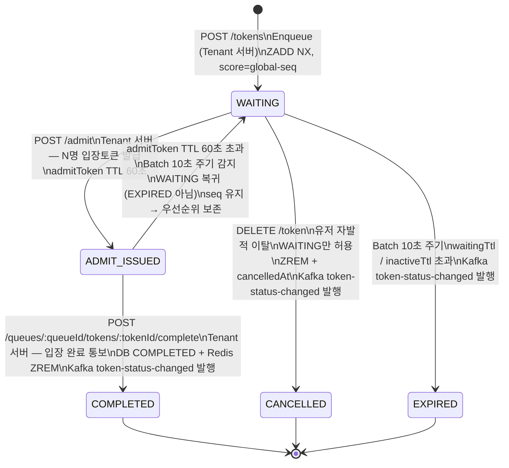
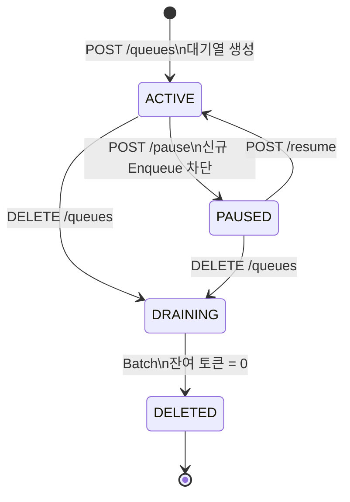
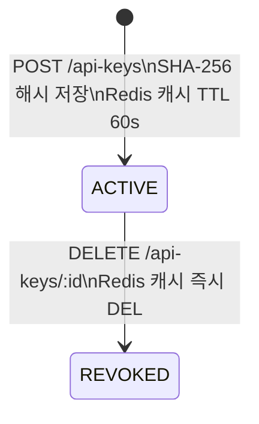

# 📊 Queue Platform — 상태 흐름도

> FRS v1.9 기준

---

## Token 상태 머신

```mermaid
stateDiagram-v2
    [*] --> WAITING : POST /tokens\nEnqueue (Tenant 서버)\nZADD NX, score=global-seq

    WAITING --> ADMIT_ISSUED : POST /admit\nTenant 서버 — N명 입장토큰 발급\nadmitToken TTL 60초

    ADMIT_ISSUED --> COMPLETED : POST /queues/:queueId/tokens/:tokenId/complete\nTenant 서버 — 입장 완료 통보\nDB COMPLETED + Redis ZREM\nKafka token-status-changed 발행

    ADMIT_ISSUED --> WAITING : admitToken TTL 60초 초과\nBatch 10초 주기 감지\nWAITING 복귀 (EXPIRED 아님)\nseq 유지 → 우선순위 보존

    WAITING --> CANCELLED : DELETE /token\n유저 자발적 이탈\nWAITING만 허용\nZREM + cancelledAt\nKafka token-status-changed 발행

    WAITING --> EXPIRED : Batch 10초 주기\nwaitingTtl / inactiveTtl 초과\nKafka token-status-changed 발행

    COMPLETED --> [*]
    CANCELLED --> [*]
    EXPIRED --> [*]
```

### 핵심 설계 결정

| 항목 | 내용 |
|------|------|
| ADMIT_ISSUED | 입장토큰 발급됨. 유저가 Polling으로 admitToken 수신 대기 |
| verify | ADMIT_ISSUED 상태 유지. 유효성 확인만. 상태 변경 없음 |
| complete | Tenant가 입장 완료 후 명시적 통보 → COMPLETED + ZREM |
| admitToken 만료 | WAITING 복귀 (EXPIRED 아님). seq 기반 순위 복원 |
| 이탈 허용 | WAITING만. ADMIT_ISSUED → 409 (유저 귀책) |
| 세션 관리 | Tenant 책임. Platform 관여 안 함 |
| complete 순서 | DB 먼저 → ZREM 나중 (잔류가 유실보다 안전) |
| 복구 | Batch 10초 내 ZREM 재실행 (멱등) |
| seq 저장 | DB tokens.seq 컬럼 — ADMIT_ISSUED→WAITING 복귀 시 score 복원 |
| admit_token 컬럼 | DB 저장 → Redis 미스 시 Fallback용 + verify DB Fallback |
| redis_sync_needed | Redis 다운 중 INSERT된 토큰 추적 → 복구 배치 기준 |
| Kafka 발행 | 상태 변경(COMPLETED/EXPIRED/CANCELLED) 시 이벤트 발행 |

### expiredReason

| 값 | 원인 | 대상 | Batch 감지 |
|----|------|------|------------|
| `WAITING_TTL` | waitingTtl(7200s) 초과 | WAITING | ZRANGEBYSCORE 0 ~ (now_ms - waitingTtl_ms) |
| `INACTIVE_TTL` | inactiveTtl(300s) 초과 | WAITING | EXISTS token-last-active = 0 |
| `ADMIT_TOKEN_TTL` | admitToken 60초 초과 → WAITING 복귀 (EXPIRED 아님) | ADMIT_ISSUED | EXISTS queue:{queueId}:admit-by-token:{tokenId} = 0 |

> ADMIT_TOKEN_TTL은 EXPIRED 아닌 WAITING 복귀
> DB tokens.seq 기반 Redis ZADD score 복원 → 우선순위 유지

---

## Queue 상태 머신

```mermaid
stateDiagram-v2
    [*] --> ACTIVE : POST /queues\n대기열 생성

    ACTIVE --> PAUSED : POST /pause\n신규 Enqueue 차단
    PAUSED --> ACTIVE : POST /resume

    ACTIVE --> DRAINING : DELETE /queues
    PAUSED --> DRAINING : DELETE /queues

    DRAINING --> DELETED : Batch\n잔여 토큰 = 0

    DELETED --> [*]
```

| 상태 | Enqueue | 기존 대기자 |
|------|---------|------------|
| ACTIVE | ✅ | 유지 |
| PAUSED | ❌ 503 | 유지 |
| DRAINING | ❌ 503 | 순차 만료 |
| DELETED | ❌ 404 | 없음 |

---

## API Key 상태 머신

```mermaid
stateDiagram-v2
    [*] --> ACTIVE : POST /api-keys\nSHA-256 해시 저장\nRedis 캐시 TTL 60s

    ACTIVE --> REVOKED : DELETE /api-keys/:id\nRedis 캐시 즉시 DEL
```
