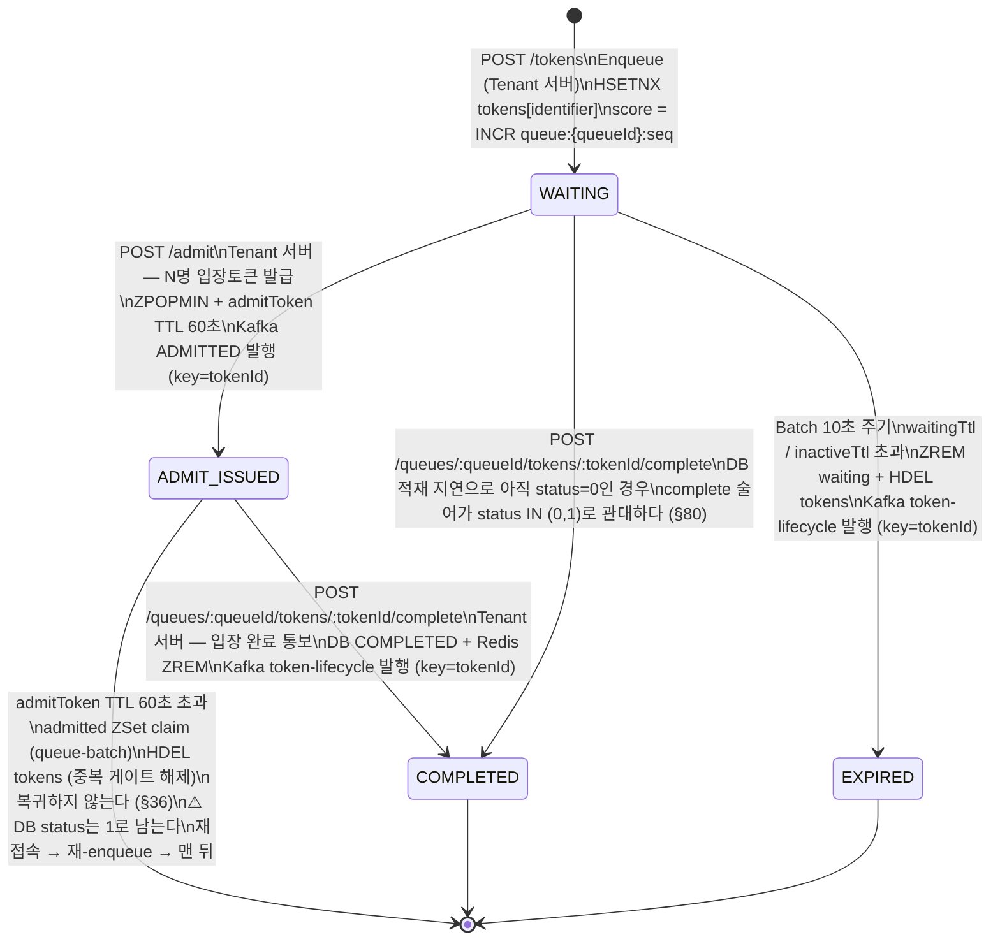
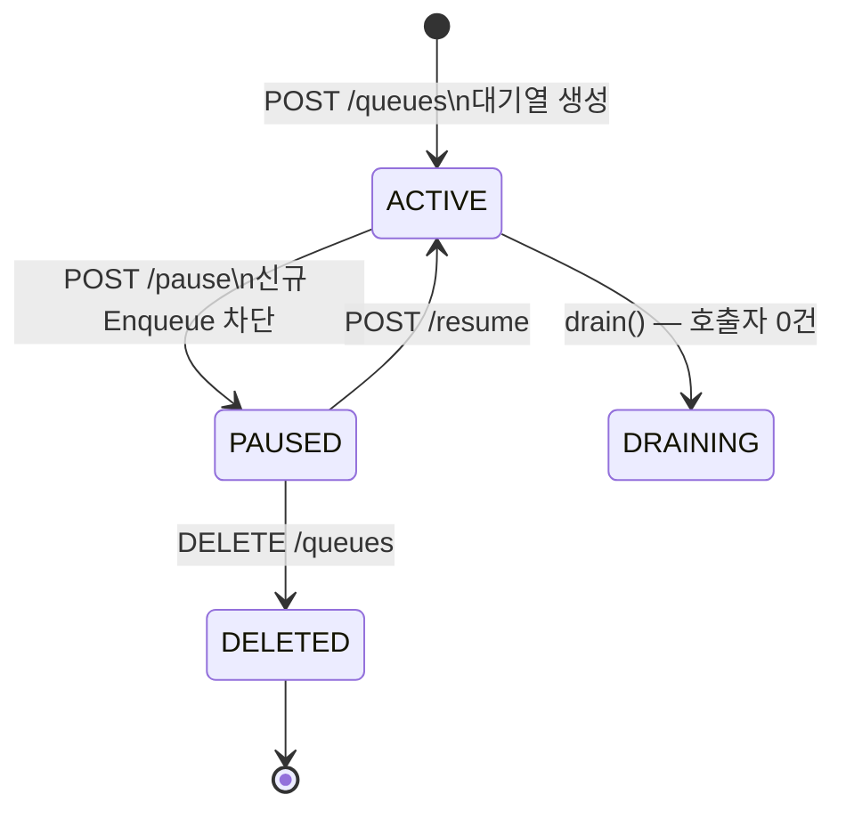
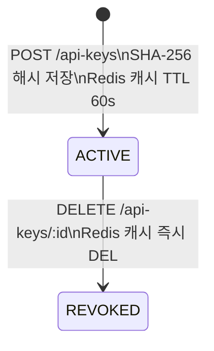

# 📊 Queue Platform — 상태 흐름도

> FRS v1.14 기준 | 전이 가드는 DECISIONS §80

---

## Token 상태 머신

```mermaid
stateDiagram-v2
    [*] --> WAITING : POST /tokens\nEnqueue (Tenant 서버)\nHSETNX tokens[identifier]\nscore = INCR queue:{queueId}:seq

    WAITING --> ADMIT_ISSUED : POST /admit\nTenant 서버 — N명 입장토큰 발급\nZPOPMIN + admitToken TTL 60초\nKafka ADMITTED 발행 (key=tokenId)

    ADMIT_ISSUED --> COMPLETED : POST /queues/:queueId/tokens/:tokenId/complete\nTenant 서버 — 입장 완료 통보\nDB COMPLETED + Redis ZREM\nKafka token-lifecycle 발행 (key=tokenId)

    WAITING --> COMPLETED : POST /queues/:queueId/tokens/:tokenId/complete\nDB 적재 지연으로 아직 status=0인 경우\ncomplete 술어가 status IN (0,1)로 관대하다 (§80)

    ADMIT_ISSUED --> [*] : admitToken TTL 60초 초과\nadmitted ZSet claim (queue-batch)\nHDEL tokens (중복 게이트 해제)\n복귀하지 않는다 (§36)\n⚠️ DB status는 1로 남는다\n재접속 → 재-enqueue → 맨 뒤

    WAITING --> EXPIRED : Batch 10초 주기\nwaitingTtl / inactiveTtl 초과\nZREM waiting + HDEL tokens\nKafka token-lifecycle 발행 (key=tokenId)

    COMPLETED --> [*]
    EXPIRED --> [*]
```

> 🔴 **`CANCELLED(3)`으로 가는 전이는 없다 (DECISIONS §82).** `DELETE /tokens/:tokenId`를
> 만들지 않기로 확정했다. 유저가 취소 버튼을 누르든 탭을 닫든 신호는 **"폴링이 멈춘다"** 하나이고,
> `inactiveTtl` 판정 배치가 그것을 잡아 **EXPIRED(4)** 로 보낸다. `status = 3`은 **결번**이다 — `TokenStatus.CANCELED` 상수도 삭제했다(재사용 금지, `schema.sql` 주석).
>
> **`inactiveTtl`은 유예 창이다.** 배치가 `HDEL tokens`를 하기 전에 같은 identifier로 재-enqueue하면
> `enqueue_bulk.lua`의 `HSETNX` 게이트가 `EXISTS`를 돌려주어 **기존 `tokenId`·`seq`·`rank`가 복원**된다.
> 창을 넘기면 신규로 판정되어 맨 뒤에 선다.
>
> ⚠️ 다만 **재-enqueue 자체는 생존 신호가 아니다** — `enqueue_bulk.lua`는 `last-active`를 갱신하지
> 않는다. 창을 되살리는 것은 **개인 폴링 재개**뿐이다 (`ka` 여부 무관 — §82 F안).

### 🔴 전이를 실제로 강제하는 것 = Kafka 소비 측 가드 (DECISIONS §80)

위 다이어그램은 그림이고, **강제는 이 표가 한다.** 모든 이벤트는 같은 토픽 `token-lifecycle`,
key = `tokenId`다. 허용 출발 상태가 아니면 **UPDATE가 0행이 되어 조용히 무시**된다.

| 이벤트 | 허용 출발 | SQL |
|---|---|---|
| `ENQUEUED` | (신규) | `ON DUPLICATE KEY UPDATE token_id = token_id` (no-op) |
| `ADMITTED` | 0 WAITING | `IF(status = 0, 1, status)` |
| `COMPLETED` | 1 ADMIT_ISSUED | `IF(status = 1, 2, status)` |
| `EXPIRED` | 0 WAITING | `IF(status = 0, 4, status)` |

> 🔴 **`admitToken` TTL 만료는 `4`에 도달하지 않는다.** 그 사람은 `status = 1`이고 가드가 `0`만
> 받으므로 **no-op**이다. **의도된 동작이다** — `complete`의 술어가 `status IN (0, 1)`이고 유효 창이
> 300초라, admitToken TTL(60초)이 지난 뒤 도착하는 **늦은 입장이 정상 경로로 실재**한다(§36).
> 가드를 `IN (0, 1)`로 넓히면 그 경로가 죽는다. **넓히지 마라.**
> `4`에 도달하는 것은 `waitingTtl`·`inactiveTtl` 만료(출발이 `0`)뿐이다.

> **왜 파티션 순서에 기대지 않는가**: 프로듀서가 여러 WAS라 브로커 도착 순서가 뒤집힐 수 있다.
> 특히 `ZADD`(enqueue Lua)가 Kafka 발행보다 먼저라 **`ENQUEUED`보다 `ADMITTED`가 먼저 도착**하는
> 창이 실재한다. `ENQUEUED`의 no-op upsert가 그 역전을 흡수한다.
>
> ℹ️ **`COMPLETED` 가드가 `1`만 허용하는데 complete API는 `status IN (0,1)`을 허용하는 것은 모순이 아니다.**
> complete는 **동기 UPDATE로 이미 2를 쓰고** 나서 이벤트를 발행하므로, 소비 시점의 행은 이미 `2`다 —
> 이 가드는 되살아남만 막는 안전장치이고 상태를 만드는 주체가 아니다(권위는 API의 조건부 UPDATE).
>
> ⚠️ **알려진 구멍**: `0 → 1 → (TTL 만료) → 0` 왕복 뒤 **옛 `ADMITTED`가 재전달**되면 낡은 토큰으로
> 다시 1이 된다. 가드는 `status`만 보고 **세대를 모르기 때문**이다. 60초를 넘긴 재전달이라 희박해
> 지금은 막지 않는다(막으려면 버전 컬럼 — §80에 기록만).

### 핵심 설계 결정

| 항목 | 내용 |
|------|------|
| ADMIT_ISSUED | 입장토큰 발급됨. 유저가 Polling으로 admitToken 수신 대기 |
| verify | **verify가 완료를 확정한다**(응답 시점에 `COMPLETED` 발행, PR #48). Redis·DB **직접** 쓰기는 0회 — 이벤트만 낸다. ~~상태 변경 없음~~ |
| complete | Tenant가 입장 완료 후 명시적 통보 → COMPLETED + ZREM |
| admitToken 만료 | **복귀하지 않는다 (§36).** `HDEL tokens`로 게이트만 풀고 끝. 재접속 → 재-enqueue → 맨 뒤. ⚠️ **DB `status`는 `1`로 남는다** — `EXPIRED` 가드가 `status = 0` 전용이라 no-op이고, 그것이 `complete`의 300초 창을 살린다 |
| 이탈 | **전용 API 없음 (§82).** 폴링 중단 → `inactiveTtl` 판정 배치 → EXPIRED(4). `QE_006_INVALID_STATUS`(409)는 큐 상태 전이 위반에 쓰인다(`QueueService`) — 토큰 이탈과는 무관하다 |
| 세션 관리 | Tenant 책임. Platform 관여 안 함 |
| complete 순서 | DB 먼저 → ZREM 나중 (잔류가 유실보다 안전) |
| 복구 | **완료 토큰의 ZREM을 재시도하는 코드는 없다.** 잔류분은 `inactiveTtl` 배치가 결국 걷어간다 |
| seq 저장 | DB `tokens.seq` 컬럼 — **Redis 전손 시 DB 재구성**(§71). ~~복귀 시 score 복원~~은 §36이 폐기 |
| admit_token 컬럼 | DB 저장 → Redis 미스 시 Fallback용 + verify DB Fallback |
| Kafka 발행 | **모든 상태 변경**에서 발행 (ENQUEUED/ADMITTED/COMPLETED/EXPIRED). 단일 토픽 `token-lifecycle`, key=`tokenId`. ~~RETURNED~~는 §36이 폐기 |

### expiredReason

`ExpiredReason.java`가 정본이다. **코드를 재사용하지 마라** — 지난 파티션에 쓰인 값의 뜻이 바뀌면
과거 통계 해석이 통째로 틀어진다(`TokenStatus` 3번 결번과 같은 이유).

| 코드 | 값 | 원인 | 기록 주체 |
|---|---|---|---|
| 1 | `ADMIT_TTL` | admitToken TTL(60초) 만료 — 입장권을 받고 안 씀 | `TokenReclaimJob` → Kafka |
| 2 | `ADMIT_STALE` | complete 창(300초)이 지나도록 `ADMIT_ISSUED` 잔류 | `ReconcileJob`이 **직접 UPDATE** |
| 3 | `INACTIVE` | `inactiveTtl`(300초) 초과 — 폴링이 끊김. 이탈이고 정상이다(§82) | `TokenReclaimJob` → Kafka |
| 4 | `WAITING_TTL` | `waitingTtl`(기본 7200초) 초과 — 기다리고도 못 뽑힘. **용량 부족 신호** | `TokenReclaimJob` → Kafka |

🪤 **`ADMIT_TTL`은 DB에 그 값으로 남지 않는다.** 컨슈머 가드가 `IF(status = 0, 4, status)`라
`ADMIT_ISSUED(1)`에서 통째로 no-op이고, 그 가드는 늦은 입장(complete 300초 창)을 살리려고 일부러
넣은 것이다(§36). 같은 사람이 DB에 남는 것은 300초 뒤 `ReconcileJob`이 쓰는 `ADMIT_STALE(2)`다.
`ADMIT_TTL`은 **이벤트에서 사유를 잃지 않기 위한** 값이다.

감지 방식:
- `WAITING_TTL` — 🔴 `ZRANGEBYSCORE`가 **아니다.** `waiting`의 score는 seq라 시간축이 아니다.
  앞부분 고정량 `ZRANGE` 스캔 + `tokens` Hash의 `issuedAt` 비교다(`waiting_expire.lua`).
- `INACTIVE` — `queue:{queueId}:last-active`를 `ZRANGEBYSCORE 0 (now_ms - inactiveTtl_ms)`.
  **이탈 회수의 유일한 경로다**(§82).
- `ADMIT_STALE` — Redis를 안 본다. DB만 본다(`TokenJpaRepository:114`).

`expired_reason` 컬럼은 실제로 채워진다 — `TokenJpaAdapter`의 INSERT 컬럼 목록에 있고,
`BillingJdbcAdapter`가 읽는다(§86).

---

## Queue 상태 머신

```mermaid
stateDiagram-v2
    [*] --> ACTIVE : POST /queues\n대기열 생성

    ACTIVE --> PAUSED : POST /pause\n신규 Enqueue 차단
    PAUSED --> ACTIVE : POST /resume

    PAUSED --> DELETED : DELETE /queues

    %% 🔴 DRAINING은 도달도 탈출도 불가능하다 (2026-08-26 실측)
    %%   drain()은 ACTIVE만 받는데 프로덕션 호출이 0건이고,
    %%   delete()는 PAUSED만 받는다 (Queue.java:100-112). DRAINING → DELETED 배치도 없다.
    ACTIVE --> DRAINING : drain() — 호출자 0건

    DELETED --> [*]
```

| 상태 | Enqueue | 기존 대기자 |
|------|---------|------------|
| ACTIVE | ✅ | 유지 |
| PAUSED | ❌ 503 | 유지 |
| DRAINING | ❌ 503 | 순차 만료 |
| DELETED | ❌ **503 Q004** | 없음 |
  ※ ~~404~~가 아니다 — 조회는 되고(`findByQueueId`가 삭제를 안 거른다) `isEnqueueable()`이 `ACTIVE`만 봐서 `QUEUE_NOT_ACTIVE`다

---

## API Key 상태 머신

```mermaid
stateDiagram-v2
    [*] --> ACTIVE : POST /api-keys\nSHA-256 해시 저장\nRedis 캐시 TTL 60s

    ACTIVE --> REVOKED : DELETE /api-keys/:id\nRedis 캐시 즉시 DEL
```
