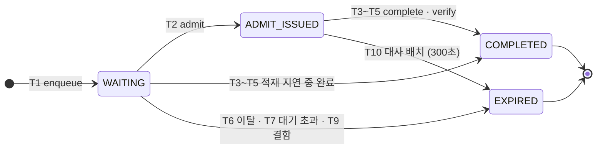
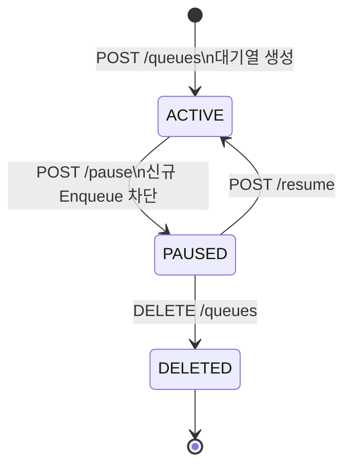
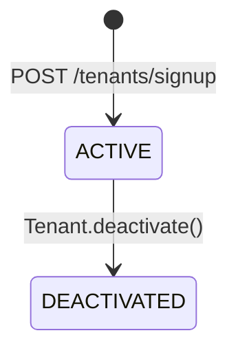
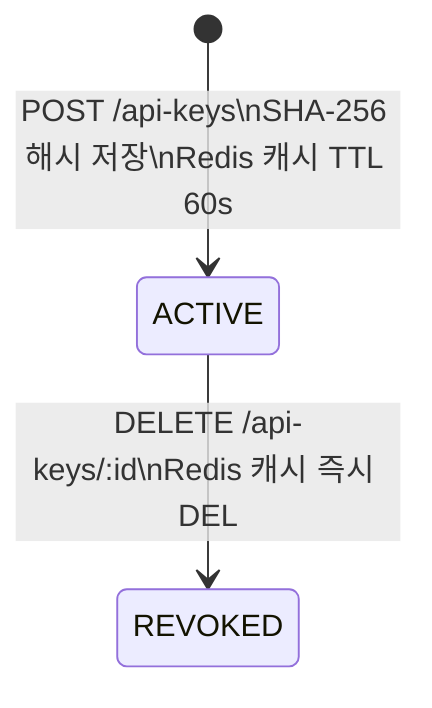

# 📊 Queue Platform — 상태 흐름도

> 코드 대조 2026-09-25 (dev `890b536`) | 전이 가드는 DECISIONS §80·§91

---

## Token 상태 머신

값: `0 WAITING` · `1 ADMIT_ISSUED` · `2 COMPLETED` · `4 EXPIRED` (**3은 결번** — Cancel API를 만들지 않았다, §82)

```mermaid
stateDiagram-v2
    direction LR
    [*] --> WAITING : T1 enqueue
    WAITING --> ADMIT_ISSUED : T2 admit
    ADMIT_ISSUED --> COMPLETED : T3~T5 complete · verify
    WAITING --> COMPLETED : T3~T5 적재 지연 중 완료
    WAITING --> EXPIRED : T6 이탈 · T7 대기 초과 · T9 결함
    ADMIT_ISSUED --> EXPIRED : T10 대사 배치 (300초)
    COMPLETED --> [*]
    EXPIRED --> [*]
```

`2`와 `4`는 **종착**이다 — 모든 가드가 두 값을 배제한다. 재-enqueue는 전이가 아니다: `tokens` Hash에
같은 identifier가 남아 있으면 **같은 tokenId·seq를 돌려주고**(자리 유지), 지워졌으면 새 토큰(T1)이다.

| # | 전이 | 누가 | 가드 (어긋나면 조용히 무시) | 코드 |
|---|---|---|---|---|
| T1 | ∅ → 0 | `POST /tokens` → 20ms 드레인 | Redis `HSETNX tokens[identifier]` · DB는 `ODKU token_id=token_id` | `enqueue_bulk.lua`, `TokenJpaAdapter.ENQUEUE_INSERT` |
| T2 | 0 → 1 | `POST /admit` | Redis `ZPOPMIN`(원자) · DB `IF(status=0, 1, …)` · `admitted_at` = MySQL 시각(§90) | `admit.lua`, `TokenJpaAdapter` ADMITTED |
| T3 | 0·1 → 2 | `complete` **DB 경로** — 이벤트 없음 | `status IN (0,1)` · `admitted_at > UTC-300초` | `TokenJpaRepository.markCompleted` |
| T4 | 0·1 → 2 | `complete` **Redis 폴백** (DB가 아직 모를 때) | 컨슈머 `IF(status IN (0,1), 2, …)` | `QueueEngineService.complete` |
| T5 | 0·1 → 2 | `verify` — 응답 시점에 완료 확정 | T4와 같은 컨슈머 가드 | `QueueEngineService.verify` |
| T6 | 0 → 4 | 회수 배치(10초) — 폴링이 `inactiveTtl` 동안 끊김 | 컨슈머 `IF(status=0, 4, …)` · 사유 3 | `inactive_expire.lua` |
| T7 | 0 → 4 | 회수 배치 — `waitingTtl`(기본 2시간) 초과 | 같음 · 사유 4 | `waiting_expire.lua` |
| T8 | 1 → (1) | 회수 배치 — 입장권 60초 만료 | Redis만 정리. DB는 **1에 머문다**(의도 — 늦은 complete를 살린다, §36) | `admit_expire.lua` |
| T9 | 0 → 4 | T8인데 DB에 ADMITTED가 아직 없을 때 | 가드가 DB 값 0을 봐서 적용 · 사유 1 · 🔴 **결함**(실측 259건) | 같음 |
| T10 | 1 → 4 | 대사 배치(5분) — complete 창 300초 경과 | **직접 UPDATE** `status=1 AND admitted_at < UTC-300초` · 사유 2 | `ReconcileJob` |

> 🔑 **완료 전이가 셋(T3~T5)이고 출발이 `0`도 허용되는 이유** — 입장권은 Redis에 즉시 보이지만 DB 적재는
> 비동기라, 사용자가 적재보다 먼저 완료할 수 있다. `= 1`로 좁히면 그 완료가 원장에서 사라진다(§91, 실측 1.43%).
>
> 🔑 **파티션 순서에 기대지 않는다** — 입장권은 Redis 커밋 즉시 보이는데 ADMITTED 발행은 그 뒤라, 그 틈에 완료하면 COMPLETED가 먼저 도착한다(WAS 1대여도, §91).
> 가드가 순서와 무관하게 같은 결과를 내도록 짜여 있다. 남은 구멍 하나: `0→1→(만료)` 뒤 옛 `ADMITTED`가
> 재전달되면 다시 1이 된다(가드가 세대를 모른다, 60초 넘은 재전달이라 희박 — §80).

### 핵심 설계 결정

| 항목 | 내용 |
|------|------|
| verify | **응답 시점에 완료를 확정한다**(COMPLETED 발행, PR #48). DB 직접 쓰기 0회. Redis는 `admit-by-admit`만 남긴다 — 같은 admitToken 재-verify는 60초 안 통과, 완료 뒤 재-enqueue는 **신규·맨 뒤**(§92) |
| complete | DB 먼저 → Redis 정리. DB 경로는 이벤트를 내지 않는다(이미 `status=2` 커밋). 🔴 적재가 L초 밀리면 입장 후 **(60초, L)** 구간은 DB도 Redis도 모른다 → `TK002` 404, **적재 뒤 재시도하면 200**(로컬 재현, AWS 14차 30.8만 건) |
| 입장권 만료 | **복귀하지 않는다(§36).** `HDEL tokens`로 게이트만 푼다. 재접속 → 재-enqueue → 맨 뒤 |
| 이탈 | **전용 API 없음(§82).** 폴링 중단 → `inactiveTtl` 회수 → EXPIRED(사유 3) |
| complete 잔류 정리 | Redis 정리가 실패해 남은 `admitted`·`tokens`는 **입장권 만료 회수(`admit_expire.lua`)**가 다음 주기에 걷는다. 발행되는 EXPIRED는 DB가 이미 2라 no-op |
| seq 저장 | DB `tokens.seq` — Redis 전손 시 DB 재구성용(§71) |
| Kafka | 토픽 `token-lifecycle` 하나, key=`tokenId`. 예외 둘: complete DB 경로는 발행 안 함 · T10은 직접 UPDATE |

### expiredReason

`ExpiredReason.java`가 정본이다. **코드를 재사용하지 마라** — 지난 파티션에 쓰인 값의 뜻이 바뀌면
과거 통계 해석이 통째로 틀어진다(`TokenStatus` 3번 결번과 같은 이유).

| 코드 | 값 | 원인 | 기록 주체 |
|---|---|---|---|
| 1 | `ADMIT_TTL` | admitToken TTL(60초) 만료 — 입장권을 받고 안 씀 | `TokenReclaimJob` → Kafka |
| 2 | `ADMIT_STALE` | complete 창(300초)이 지나도록 `ADMIT_ISSUED` 잔류 | `ReconcileJob`이 **직접 UPDATE** |
| 3 | `INACTIVE` | `inactiveTtl`(300초) 초과 — 폴링이 끊김. 이탈이고 정상이다(§82) | `TokenReclaimJob` → Kafka |
| 4 | `WAITING_TTL` | `waitingTtl`(기본 7200초) 초과 — 기다리고도 못 뽑힘. **용량 부족 신호** | `TokenReclaimJob` → Kafka |

🔴 **`ADMIT_TTL`은 "DB에 남지 않는다"가 아니다 — 랙 구간에서는 남는다**(실측 259건, 2026-09-18).
컨슈머 가드가 `IF(status = 0, 4, status)`인데, **그 `status`는 DB 값이고 회수 판정은 Redis가 한다.**
컨슈머가 `ADMITTED`를 아직 적재하지 않았으면 DB는 `0`이라 **가드가 참이 되어 `0→4`를 적용**하고,
뒤늦은 `ADMITTED`는 `IF(status=0)` 거짓으로 no-op이 되어 `admit_token`·`admitted_at`이 **영구 NULL**이다.
랙이 없으면 의도대로 `1`에서 no-op이고(그 가드는 늦은 입장을 살리려고 일부러 넣었다, §36),
같은 사람이 DB에 남는 것은 300초 뒤 `ReconcileJob`이 쓰는 `ADMIT_STALE(2)`다 — 실측 비율 **259 : 30,071**.
⚠️ 피해는 완료·과금이 아니라 **통계**다: `total_admit_issued` 과소 계상 + 사유 3칸 합 불일치.
(`ADMIT_TTL` 발행 자체를 멈추는 안은 **미결** — AWS `result=error` 측정 대기)

감지 방식:
- `WAITING_TTL` — 🔴 `ZRANGEBYSCORE`가 **아니다.** `waiting`의 score는 seq라 시간축이 아니다.
  앞부분 고정량 `ZRANGE` 스캔 + `tokens` Hash의 `issuedAt` 비교다(`waiting_expire.lua`).
- `INACTIVE` — `queue:{queueId}:last-active`를 `ZRANGEBYSCORE 0 (now_ms - inactiveTtl_ms)`.
  🪤 `last-active`에 오르는 것은 **개인 폴링을 부른 사람뿐**이다. JS SDK는 `rank ≤ 0`이 되기 전엔 개인 폴링을
  부르지 않으므로, **그 전에 이탈한 사람은 이 경로가 아니라 `WAITING_TTL`(기본 2시간)로 회수된다.**
- `ADMIT_STALE` — Redis를 안 본다. DB만 본다(`TokenJpaRepository:114`).

`expired_reason` 컬럼은 실제로 채워진다 — `TokenJpaAdapter`의 INSERT 컬럼 목록에 있고,
`BillingJdbcAdapter`가 읽는다(§86).

---

## Queue 상태 머신

```mermaid
stateDiagram-v2
    [*] --> ACTIVE : POST /queues\n대기열 생성

    ACTIVE --> PAUSED : POST /pause\n신규 Enqueue 차단
    PAUSED --> ACTIVE : POST /resume

    PAUSED --> DELETED : DELETE /queues

    DELETED --> [*]
```

| 상태 | 신규 Enqueue | **기존 대기자의 재-enqueue**(새로고침) | admit | verify · complete | 기존 대기자 |
|------|---------|------------|------|------|------|
| ACTIVE | ✅ | ✅ | ✅ | ✅ | 유지 |
| PAUSED | ❌ 503 Q004 | ✅ **200 (같은 seq·tokenId)** | ✅ | ✅ | 유지 |
| DELETED | ❌ 503 Q004 | ❌ 503 Q004 | ❌ **404 Q001** | ✅ **허용** | **삭제됨** |

> 🔑 **PAUSED는 입구만 잠근다 (2026-09-16).** 기존 대기자의 재-enqueue까지 막으면 **새로고침 한 번에
> 자리를 잃는다**. 신규/기존 판정은 원래 `enqueue_bulk.lua`의 `HSETNX`가 하는데, 상태 가드가 그보다
> **앞**에 있어 물어보기도 전에 막고 있었다. 이제 PAUSED일 때만 `tokens` Hash를 한 번 확인한다
> (ACTIVE 핫패스는 그대로 — 왕복이 붙지 않는다).
>
> 🔑 **PAUSED는 시간을 멈추지 않는다.** 회수 배치는 PAUSED 큐도 돈다. 멈춰둔 채로 두면 대기자가
> `inactiveTtl`·`waitingTtl`로 걷힌다. **그게 의도다** — 멈추면 대기자가 보존된다고 오해하면 안 된다.
> 안 걷으면 멈춰둔 큐가 Redis 마스터를 무기한 점유하고 **다른 테넌트가 OOM으로 죽는다**(§87).
>
> 🔴 **삭제는 Redis도 지운다 (2026-09-16).** DB는 소프트 삭제지만(원장은 청구 근거라 남긴다)
> `waiting`·`last-active`·`seq`·`admit-watermark`·`pacing`은 **즉시 지운다**. 안 지우면 영구 점유였다.
> `tokens`·`admitted`만 **완료 창(300초)** 뒤 만료된다 — 삭제 시점에 이미 입장권을 들고 좌석으로
> 가던 사람의 `verify`·`complete`를 끝까지 받아주기 위해서다. 막으면 **돈은 받고 입장은 못 시킨**
> 사용자가 생긴다. 반면 `admit`은 막는다 — 지운 큐에서 **새 입장권이 더 나가면 안 된다**.
>
> 🪤 삭제는 `PAUSED`에서만 가능하므로(`delete()` 가드), **입구가 먼저 잠긴 뒤에 지워진다.**
> "삭제 직전에 막 들어온 신규 대기자"는 구조적으로 없다.

> 🔴 **`status = 2`는 결번이다 (2026-09-15).** `DRAINING`이 있었으나 **도달도 탈출도 불가능**했다 —
> `drain()`은 `ACTIVE`만 받는데 프로덕션 호출이 0건이었고, `delete()`는 `PAUSED`만 받아 빠져나올
> 수도 없었다. `DRAINING → DELETED` 배치도 없었다. 상수·메서드·테스트 6건을 삭제했다.
> **"순차 배출"이 필요해지면 `PAUSED`가 이미 그 일을 한다** — 신규만 막고 기존 대기자는 흘린다.
> `2`를 다른 의미로 재사용하지 마라(`queues.status`는 TINYINT다). `TokenStatus` 3번과 같은 처리다.

---

## Tenant 상태 머신

```mermaid
stateDiagram-v2
    [*] --> ACTIVE : POST /tenants/signup

    ACTIVE --> DEACTIVATED : Tenant.deactivate()
```

| 상태 | 값 | 로그인 | API Key 인증 |
|------|---|--------|--------------|
| ACTIVE | 0 | ✅ | ✅ |
| DEACTIVATED | 1 | ❌ | ❌ |

> **단방향이다** — 되살리는 전이가 없다(`Tenant.java`에 `activate()`가 없다).
> ⚠️ `deactivate()`를 부르는 **API는 아직 없다**(도메인 메서드만 있다). `DRAINING`과 다른 점은
> **탈출 불가 상태가 아니라는 것**뿐이다 — 필요해지면 엔드포인트만 붙이면 된다.

---

## API Key 상태 머신

```mermaid
stateDiagram-v2
    [*] --> ACTIVE : POST /api-keys\nSHA-256 해시 저장\nRedis 캐시 TTL 60s

    ACTIVE --> REVOKED : DELETE /api-keys/:id\nRedis 캐시 즉시 DEL
```
